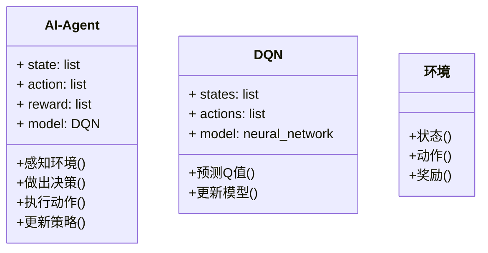
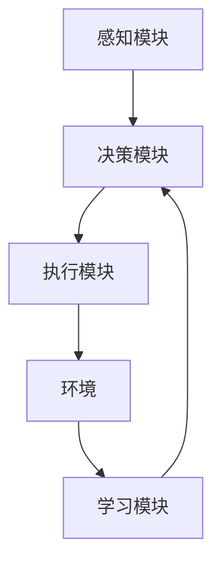
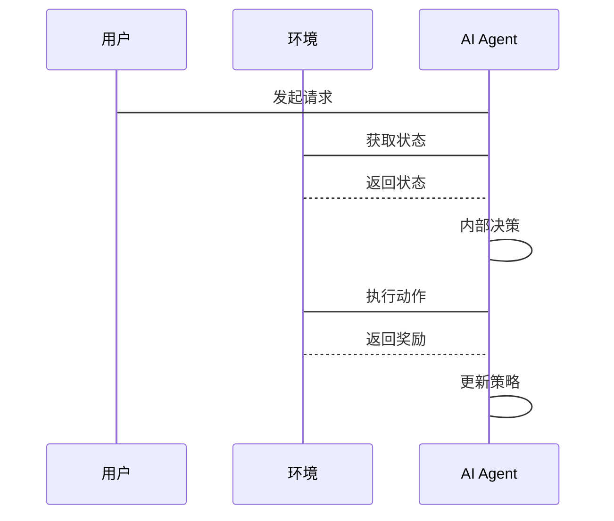

                 


# 构建具有自主探索能力的AI Agent

> 关键词：AI Agent，自主探索，强化学习，深度学习，系统架构，算法实现

> 摘要：本文将详细介绍如何构建具有自主探索能力的AI Agent。通过分析自主探索能力的核心概念、算法原理、系统架构设计以及实际项目实现，我们将逐步构建一个能够自主学习和适应复杂环境的智能体。文章内容涵盖从基础理论到实际应用的各个方面，帮助读者深入理解并掌握AI Agent的构建方法。

---

## 第一部分：自主探索AI Agent的背景与核心概念

### 第1章：自主探索AI Agent的背景与问题背景

#### 1.1 问题背景

随着人工智能技术的快速发展，AI Agent（智能体）在各个领域的应用越来越广泛。然而，传统的AI Agent通常依赖于预设的规则和数据，缺乏自主探索能力。在复杂多变的环境中，AI Agent需要具备自主学习、适应和优化的能力，才能更好地应对未知挑战。

**1.1.1 当前AI Agent的发展现状**  
目前，AI Agent主要分为两类：基于规则的AI Agent和基于学习的AI Agent。前者依赖于人工设计的规则，适用于简单任务；后者通过机器学习技术，能够从数据中学习并做出决策。然而，大多数基于学习的AI Agent仍然需要大量标注数据和人工干预，缺乏真正的自主性。

**1.1.2 自主探索能力的重要性**  
自主探索能力是AI Agent的核心能力之一。它使AI Agent能够主动发现新知识、优化决策策略，并在未知环境中自适应。这种能力在机器人、自动驾驶、智能客服等领域具有重要意义，能够显著提升系统的灵活性和智能性。

**1.1.3 自主探索AI Agent的应用场景**  
自主探索AI Agent可以应用于多个领域，例如：  
- 自动驾驶：在复杂交通环境中自主决策。  
- 机器人：在未知环境中自主导航和任务执行。  
- 智能推荐系统：根据用户行为自主优化推荐策略。  

#### 1.2 问题描述

**1.2.1 AI Agent的核心功能与目标**  
AI Agent的核心功能包括感知环境、做出决策、执行动作以及与环境交互。其目标是通过自主探索能力，优化决策策略，实现复杂任务的高效完成。

**1.2.2 自主探索能力的定义与特征**  
自主探索能力是指AI Agent能够在未知或部分已知的环境中，通过主动探索和学习，发现新知识、优化策略并适应环境变化的能力。其主要特征包括：主动性、自适应性、学习性和目标驱动性。

**1.2.3 与传统AI Agent的主要区别**  
与传统AI Agent相比，自主探索AI Agent具有更强的主动性和自适应性，能够根据环境反馈动态调整行为策略，而不仅仅依赖于预设规则。

#### 1.3 问题解决

**1.3.1 自主探索AI Agent的设计思路**  
自主探索AI Agent的设计通常包括以下步骤：  
1. **环境建模**：构建环境模型，描述状态、动作和奖励的关系。  
2. **算法选择**：选择适合的强化学习算法（如Q-learning、Deep Q-Network等）。  
3. **系统设计**：设计感知、决策和执行模块，实现与环境的交互。  
4. **实验验证**：通过实验验证算法的有效性和系统的稳定性。  

**1.3.2 自主探索能力的实现路径**  
实现自主探索能力的关键在于算法的选择和系统设计。强化学习是一种常用的方法，通过奖励机制引导AI Agent学习最优策略。

**1.3.3 相关技术与工具的概述**  
实现自主探索AI Agent需要结合强化学习、深度学习、自然语言处理等技术，并借助工具如Python、TensorFlow、PyTorch等进行开发。

#### 1.4 边界与外延

**1.4.1 自主探索能力的边界条件**  
自主探索能力的边界主要体现在环境复杂度和任务目标上。在过于复杂的环境中，AI Agent可能需要更强大的算法和计算能力。

**1.4.2 相关概念的对比与区分**  
与自主学习（Autonomous Learning）相比，自主探索更强调与环境的交互和策略优化。而自适应学习（Adaptive Learning）则更关注模型的动态调整。

**1.4.3 自主探索能力的外延与扩展**  
自主探索能力的扩展包括多智能体协作、元学习（Meta-Learning）等高级技术，能够进一步提升AI Agent的智能性和适应性。

#### 1.5 概念结构与核心要素

**1.5.1 自主探索AI Agent的构成要素**  
- **感知模块**：负责获取环境信息。  
- **决策模块**：基于感知信息和历史经验做出决策。  
- **执行模块**：执行决策动作并与环境交互。  
- **学习模块**：通过奖励信号优化策略。  

**1.5.2 各要素之间的关系与依赖**  
感知模块提供输入，决策模块基于输入做出决策，执行模块将决策转化为动作，学习模块根据反馈优化策略。各模块相互依赖，共同实现自主探索能力。

**1.5.3 核心要素的详细描述**  
- **感知模块**：通过传感器或数据接口获取环境信息。  
- **决策模块**：基于强化学习算法生成动作策略。  
- **执行模块**：将决策动作转化为实际操作。  
- **学习模块**：通过奖励机制优化策略参数。  

---

### 第2章：自主探索AI Agent的核心概念与联系

#### 2.1 核心概念原理

**2.1.1 自主探索能力的数学模型**  
自主探索能力可以通过马尔可夫决策过程（MDP）建模，定义状态、动作、奖励和策略之间的关系。  

**2.1.2 相关算法的原理与机制**  
强化学习算法（如Q-learning）通过状态-动作-奖励的循环更新策略，实现最优决策。

**2.1.3 核心概念的实现方式**  
通过强化学习算法和深度学习模型，结合环境反馈优化策略参数，实现自主探索能力。

#### 2.2 核心概念属性特征对比

| 属性 | 自主探索AI Agent | 传统AI Agent |
|------|------------------|--------------|
| 主动性 | 高               | 低           |
| 自适应性 | 强               | 弱           |
| 学习能力 | 强               | 有限         |
| 目标驱动性 | 高               | 中           |

#### 2.3 ER实体关系图

```mermaid
er
actor: 用户
agent: AI Agent
environment: 环境
goal: 目标
action: 行动
reward: 奖励
state: 状态
```

---

## 第三部分：自主探索AI Agent的算法原理

### 第3章：算法原理讲解

#### 3.1 强化学习算法

**3.1.1 Q-learning算法**

Q-learning是一种经典的强化学习算法，适用于离散动作空间。其核心思想是通过经验值更新Q表，选择最优动作。

**3.1.2 Deep Q-Network (DQN) 算法**

DQN通过深度神经网络近似Q值函数，解决高维状态空间的挑战。以下是DQN的实现步骤：

1. **环境初始化**：定义环境状态和动作空间。
2. **网络定义**：构建DQN网络模型。
3. **经验回放**：存储历史经验，随机采样更新策略。
4. **策略更新**：基于当前状态和动作更新Q值。

```python
import numpy as np
import tensorflow as tf

class DQN:
    def __init__(self, state_space, action_space):
        self.state_space = state_space
        self.action_space = action_space
        self.model = self.build_model()

    def build_model(self):
        model = tf.keras.Sequential([
            tf.keras.layers.Dense(64, activation='relu'),
            tf.keras.layers.Dense(32, activation='relu'),
            tf.keras.layers.Dense(self.action_space, activation='linear')
        ])
        model.compile(optimizer='adam', loss='mean_squared_error')
        return model

    def remember(self, state, action, reward, next_state):
        self.memory.append((state, action, reward, next_state))

    def act(self, state):
        state = np.array([state])
        q_values = self.model.predict(state)
        return np.argmax(q_values[0])

    def replay(self, batch_size):
        batch = random.sample(self.memory, batch_size)
        for state, action, reward, next_state in batch:
            target = reward + self.model.predict(next_state)[0]
            target_q = self.model.predict(state)
            target_q[0][action] = target
            self.model.fit(state, target_q, epochs=1, verbose=0)
```

**数学公式**

Q-learning的更新公式为：
$$ Q(s, a) = Q(s, a) + \alpha (r + \gamma \max Q(s', a')) - Q(s, a) $$

其中：  
- \( \alpha \) 是学习率，控制更新步长。  
- \( \gamma \) 是折扣因子，平衡当前奖励和未来奖励的重要性。  

---

## 第四部分：自主探索AI Agent的系统分析与架构设计

### 第4章：系统分析与架构设计

#### 4.1 系统功能设计

**4.1.1 系统功能模块**

- **感知模块**：接收环境输入。
- **决策模块**：基于强化学习算法生成动作。
- **执行模块**：执行决策动作。
- **学习模块**：更新策略参数。

**4.1.2 领域模型类图**



#### 4.2 系统架构设计

**4.2.1 系统架构图**



**4.2.2 系统交互流程**



---

## 第五部分：项目实战

### 第5章：项目实战

#### 5.1 环境安装

```bash
pip install numpy tensorflow-gpu==2.4.0 keras==2.4.0
```

#### 5.2 核心代码实现

```python
import numpy as np
import tensorflow as tf
import gym

class AI_Agent:
    def __init__(self, env):
        self.env = env
        self.state_space = env.observation_space.shape[0]
        self.action_space = env.action_space.n
        self.model = self.build_model()

    def build_model(self):
        model = tf.keras.Sequential([
            tf.keras.layers.Dense(64, activation='relu'),
            tf.keras.layers.Dense(32, activation='relu'),
            tf.keras.layers.Dense(self.action_space, activation='linear')
        ])
        model.compile(optimizer='adam', loss='mean_squared_error')
        return model

    def act(self, state):
        state = np.array([state])
        q_values = self.model.predict(state)
        return np.argmax(q_values[0])

    def remember(self, state, action, reward, next_state):
        self.memory.append((state, action, reward, next_state))

    def replay(self, batch_size):
        if len(self.memory) < batch_size:
            return
        batch = random.sample(self.memory, batch_size)
        for state, action, reward, next_state in batch:
            target = reward + self.gamma * np.max(self.model.predict(next_state)[0])
            target_q = self.model.predict(state)
            target_q[0][action] = target
            self.model.fit(state, target_q, epochs=1, verbose=0)

    def train(self, episodes=1000):
        for episode in range(episodes):
            state = self.env.reset()
            total_reward = 0
            while True:
                action = self.act(state)
                next_state, reward, done, _ = self.env.step(action)
                self.remember(state, action, reward, next_state)
                self.replay(32)
                state = next_state
                total_reward += reward
                if done:
                    break
            print(f"Episode {episode}, Total Reward: {total_reward}")

env = gym.make('CartPole-v1')
agent = AI_Agent(env)
agent.train(episodes=1000)
```

#### 5.3 案例分析与优化

通过在CartPole环境中的训练，AI Agent能够逐步掌握平衡杆的操作策略。训练过程中，奖励信号指导AI Agent优化动作选择，最终实现稳定控制。

---

## 第六部分：高级应用与未来展望

### 第6章：高级主题与未来研究方向

#### 6.1 多智能体协作

在多智能体系统中，自主探索能力使各个智能体能够协同合作，共同完成复杂任务。未来的研究可以探索分布式强化学习和协作策略。

#### 6.2 元学习（Meta-Learning）

元学习是一种能够快速适应新任务的技术，结合自主探索能力，可以显著提升AI Agent的灵活性和适应性。

#### 6.3 持续学习与自适应

持续学习（Lifelong Learning）使AI Agent能够不断积累知识，适应长期任务需求。未来的研究将探索如何结合自主探索和持续学习，实现更强大的智能体。

#### 6.4 案例分析与未来展望

通过分析实际案例，我们发现自主探索AI Agent在复杂环境中的应用潜力巨大。未来的研究方向包括算法优化、多智能体协作和人机协作等。

---

## 结语

构建具有自主探索能力的AI Agent是一项复杂而有趣的技术挑战。通过结合强化学习、深度学习和系统设计，我们可以逐步实现具备自主学习和适应能力的智能体。未来，随着算法的优化和计算能力的提升，自主探索AI Agent将在更多领域展现其强大的能力。

---

## 作者：AI天才研究院/AI Genius Institute & 禅与计算机程序设计艺术 /Zen And The Art of Computer Programming

---

**本文为AI天才研究院（AI Genius Institute）原创，转载请注明出处，并保留完整链接。**

