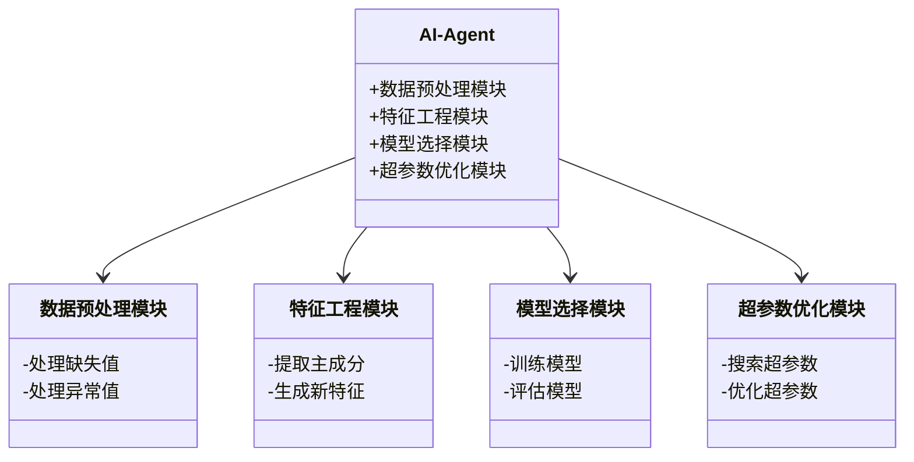
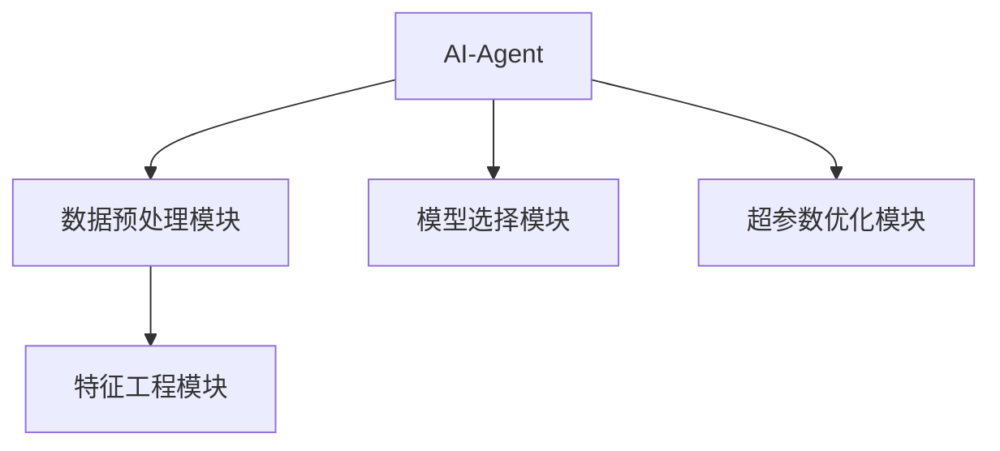

                 


# 构建具有自动机器学习能力的AI Agent

> 关键词：AI Agent, 自动机器学习, 强化学习, 遗传算法, 系统架构设计, 项目实战

> 摘要：本文详细探讨了如何构建一个具有自动机器学习能力的AI Agent。文章首先介绍了AI Agent和自动机器学习的基本概念，分析了它们之间的关系和结合的重要性。接着，深入讲解了自动机器学习的核心技术，包括特征工程、模型选择和超参数优化。然后，从算法原理的角度，详细分析了强化学习和遗传算法在自动机器学习中的应用。最后，通过实际项目案例，展示了如何设计和实现一个具备自动机器学习能力的AI Agent，并总结了相关的最佳实践和未来发展方向。

---

# 第一部分: AI Agent与自动机器学习概述

## 第1章: AI Agent与自动机器学习概述

### 1.1 AI Agent的基本概念

#### 1.1.1 AI Agent的定义与特点
AI Agent（人工智能代理）是指能够感知环境、做出决策并执行动作的智能实体。AI Agent的特点包括自主性、反应性、目标导向和学习能力。AI Agent可以是软件程序，也可以是硬件设备，其核心目标是通过与环境的交互来实现特定任务。

#### 1.1.2 AI Agent的核心功能与应用场景
AI Agent的核心功能包括感知、决策、执行和学习。应用场景广泛，如自动驾驶、智能客服、游戏AI、智能家居等。

#### 1.1.3 自动机器学习的定义与目标
自动机器学习（AutoML）是指通过自动化的方法，减少人工干预，使机器学习模型的构建更加高效和易用。其目标是降低机器学习的门槛，使非专家也能构建高性能的机器学习模型。

---

### 1.2 AI Agent与自动机器学习的关系

#### 1.2.1 AI Agent中的机器学习需求
AI Agent需要通过机器学习技术来提高其感知、决策和学习能力。机器学习为其提供了数据驱动的决策能力，使其能够适应复杂多变的环境。

#### 1.2.2 自动机器学习在AI Agent中的作用
自动机器学习通过自动化特征工程、模型选择和超参数优化，显著提高了AI Agent的学习效率和性能。同时，自动机器学习使得AI Agent能够快速适应新数据和新任务。

#### 1.2.3 自动机器学习与传统机器学习的对比
| 对比维度 | 自动机器学习 | 传统机器学习 |
|----------|--------------|---------------|
| 数据预处理 | 自动化完成 | 手动完成       |
| 模型选择 | 自动完成 | 手动选择       |
| 超参数优化 | 自动优化 | 手动调整       |
| 适用场景 | 复杂场景、非专家用户 | 简单场景、专家用户 |

---

### 1.3 自动机器学习的核心技术

#### 1.3.1 自动特征工程
自动特征工程通过自动化的方法提取和生成特征，例如使用PCA进行降维或使用自动编码器生成新的特征。

#### 1.3.2 自动模型选择
自动模型选择通过比较不同模型在验证集上的表现，选择性能最佳的模型。

#### 1.3.3 自动超参数优化
自动超参数优化通过搜索算法（如随机搜索、网格搜索或贝叶斯优化）找到最佳的超参数组合。

---

## 第2章: 自动机器学习的背景与挑战

### 2.1 自动机器学习的背景

#### 2.1.1 机器学习的发展历程
从监督学习到无监督学习，从深度学习到强化学习，机器学习技术不断进步，但其复杂性也在增加。

#### 2.1.2 自动机器学习的兴起
随着数据量的爆炸式增长和计算能力的提升，自动机器学习逐渐成为研究热点。

#### 2.1.3 自动机器学习的现状与趋势
当前，自动机器学习已经在图像分类、自然语言处理等领域展现出巨大潜力。

---

### 2.2 自动机器学习的主要挑战

#### 2.2.1 数据质量与数量的问题
数据的质量和数量直接影响自动机器学习的效果。如何处理噪声数据和小样本数据是一个重要挑战。

#### 2.2.2 模型解释性与可解释性
自动机器学习模型的黑箱特性使得模型的解释性成为一个难题。

#### 2.2.3 计算资源与效率的限制
复杂的自动机器学习过程需要大量的计算资源，如何在有限的资源下提高效率是一个重要问题。

---

### 2.3 自动机器学习在AI Agent中的应用前景

#### 2.3.1 提高AI Agent的适应性
通过自动学习，AI Agent能够更快地适应新环境和新任务。

#### 2.3.2 降低AI Agent的开发门槛
自动机器学习使得非专家也能开发高效的AI Agent。

#### 2.3.3 提升AI Agent的效率与性能
通过自动化优化，AI Agent的性能和效率可以得到显著提升。

---

## 第3章: 自动机器学习的核心概念与原理

### 3.1 自动特征工程

#### 3.1.1 特征工程的基本概念
特征工程是机器学习中非常重要的一步，特征的好坏直接影响模型的性能。

#### 3.1.2 自动特征工程的方法与技术
常用方法包括PCA、自动编码器和特征组合等。

#### 3.1.3 自动特征工程的实现流程
1. 数据预处理：清洗数据，处理缺失值和异常值。
2. 特征提取：使用PCA等方法提取主成分。
3. 特征组合：通过组合现有特征生成新特征。
4. 特征选择：使用Lasso回归等方法选择重要特征。

---

### 3.2 自动模型选择

#### 3.2.1 模型选择的基本原理
模型选择的目的是找到在验证集上表现最佳的模型。

#### 3.2.2 基于性能的模型选择方法
常用方法包括交叉验证和留出法。

#### 3.2.3 基于集成学习的模型选择技术
集成学习通过组合多个模型的结果来提高性能。

---

### 3.3 自动超参数优化

#### 3.3.1 超参数优化的基本概念
超参数是指在训练过程中不更新的参数，如学习率和正则化系数。

#### 3.3.2 常见的超参数优化算法
常用算法包括随机搜索、网格搜索和贝叶斯优化。

#### 3.3.3 基于贝叶斯优化的超参数调优
贝叶斯优化通过构建概率模型，指导搜索过程，从而高效地找到最优超参数。

---

## 第4章: 自动机器学习的算法原理与实现

### 4.1 强化学习在自动机器学习中的应用

#### 4.1.1 强化学习的基本原理
强化学习通过智能体与环境的交互，学习最优策略。

#### 4.1.2 强化学习在模型选择中的应用
通过强化学习选择最优的模型结构。

#### 4.1.3 强化学习在超参数优化中的应用
通过强化学习优化超参数。

---

### 4.2 遗传算法在自动机器学习中的应用

#### 4.2.1 遗传算法的基本原理
遗传算法通过模拟自然选择的过程，优化目标函数。

#### 4.2.2 遗传算法在特征工程中的应用
通过遗传算法生成和选择最优特征。

#### 4.2.3 遗传算法在模型优化中的应用
通过遗传算法优化模型参数。

---

### 4.3 自动机器学习算法的实现流程

#### 4.3.1 数据预处理与特征提取
1. 数据清洗：处理缺失值和异常值。
2. 特征提取：使用PCA等方法提取主成分。

#### 4.3.2 模型训练与评估
1. 训练模型：使用训练数据训练模型。
2. 评估模型：在验证集上评估模型性能。

#### 4.3.3 超参数优化
1. 确定超参数范围。
2. 使用贝叶斯优化等方法优化超参数。

---

## 第5章: 系统架构设计与实现

### 5.1 项目介绍

#### 5.1.1 项目背景
本项目旨在构建一个具备自动机器学习能力的AI Agent，用于实现特定任务的自动化决策。

#### 5.1.2 项目目标
通过自动特征工程、模型选择和超参数优化，构建一个高效的AI Agent。

---

### 5.2 系统功能设计

#### 5.2.1 领域模型设计
使用Mermaid绘制领域模型类图，展示AI Agent的主要模块及其交互关系。



---

#### 5.2.2 系统架构设计
使用Mermaid绘制系统架构图，展示AI Agent的整体架构。



---

### 5.3 项目实战

#### 5.3.1 环境安装
安装必要的Python库，如scikit-learn、tensorflow、keras等。

#### 5.3.2 核心实现源代码

```python
import numpy as np
from sklearn.decomposition import PCA
from sklearn.linear_model import Lasso
from sklearn.model_selection import GridSearchCV
from sklearn.ensemble import RandomForestClassifier

class AI-Agent:
    def __init__(self, data):
        self.data = data

    def preprocess(self):
        # 处理缺失值和异常值
        pass

    def feature_engineering(self):
        # 提取主成分
        pca = PCA(n_components=2)
        self.data_pca = pca.fit_transform(self.data)

    def model_selection(self):
        # 训练模型
        model = RandomForestClassifier()
        model.fit(self.data_pca, self.targets)

        # 评估模型
        print("Accuracy:", model.score(self.data_pca, self.targets))

    def hyperparameter_tuning(self):
        # 超参数优化
        param_grid = {'n_estimators': [10, 20, 30]}
        grid_search = GridSearchCV(RandomForestClassifier(), param_grid)
        grid_search.fit(self.data_pca, self.targets)
        print("Best Parameters:", grid_search.best_params_)
```

---

#### 5.3.3 代码应用解读与分析
通过代码实现AI Agent的核心功能，包括数据预处理、特征工程、模型选择和超参数优化。

---

## 第6章: 总结与展望

### 6.1 总结
本文详细探讨了如何构建一个具有自动机器学习能力的AI Agent，涵盖了从理论到实践的各个方面。

### 6.2 展望
未来，随着自动机器学习技术的不断进步，AI Agent将在更多领域展现出强大的应用潜力。

---

# 作者：AI天才研究院 & 禅与计算机程序设计艺术

---

以上是《构建具有自动机器学习能力的AI Agent》的技术博客文章的完整目录大纲和内容概要。接下来，我将根据以上大纲，逐步展开每一部分的内容，撰写一篇详细的技术博客文章。

