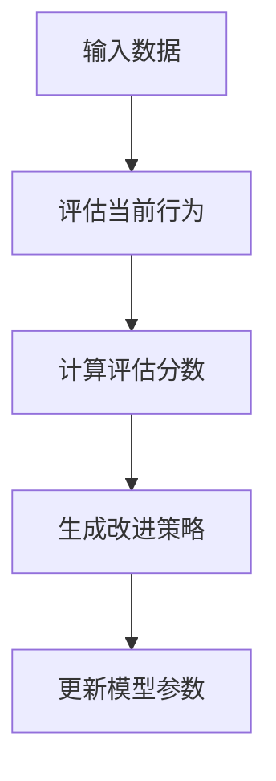
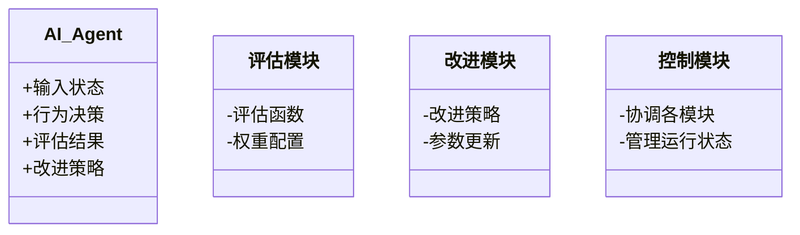
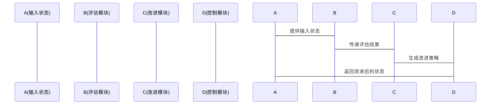

                 


# 构建具有自我评估与改进能力的AI Agent

> 关键词：AI Agent，自我评估，改进能力，算法原理，系统架构设计

> 摘要：本文将详细介绍如何构建一个具有自我评估与改进能力的AI Agent。首先，我们将介绍AI Agent的核心概念和发展背景。接着，深入探讨自我评估与改进机制的数学模型和算法原理。然后，通过系统架构设计，展示如何实现这些机制。最后，通过实际项目案例，验证我们的设计思路，并总结经验和最佳实践。

---

# 第一部分: 背景与核心概念

# 第1章: AI Agent 的背景与定义

## 1.1 AI Agent 的发展背景
### 1.1.1 人工智能与自动化的历史演进
- 从图灵测试到现在的深度学习，AI Agent 的发展经历了多个阶段。
- 自动化系统的普及推动了AI Agent 的需求。

### 1.1.2 AI Agent 的概念与核心特征
- AI Agent 是能够感知环境并采取行动的智能体。
- 具有自主性、反应性、目标导向性和学习能力。

### 1.1.3 自我评估与改进能力的必要性
- 自我评估是AI Agent 提高效率和准确性的关键。
- 改进能力使得AI Agent 能够适应不断变化的环境。

## 1.2 自我评估与改进机制
### 1.2.1 自我评估的核心概念
- 评估指标：准确率、响应时间、资源消耗等。
- 评估方法：基于规则的评估、统计评估、机器学习模型评估。

### 1.2.2 改进机制的实现方式
- 增量学习：逐步优化模型。
- 参数调整：动态调整模型参数以适应新数据。

### 1.2.3 自我评估与改进的边界与外延
- 自我评估的范围：从简单任务到复杂任务。
- 改进能力的边界：如何在不降低性能的前提下进行改进。

## 1.3 本章小结
- 引入AI Agent 的核心概念。
- 说明自我评估与改进能力的重要性。

---

# 第二部分: 核心概念与算法原理

# 第2章: 自我评估与改进的数学模型

## 2.1 自我评估模型
### 2.1.1 评估指标的数学定义
$$评估分数 = \sum_{i=1}^{n} w_i \cdot f_i(input)$$
- $w_i$：评估指标的权重。
- $f_i$：具体评估函数。

### 2.1.2 评估函数的实现方式
- 基于规则的评估：例如，检查输入是否符合特定条件。
- 统计评估：计算准确率、召回率等指标。
- 机器学习模型评估：使用训练好的模型预测结果并评估。

### 2.1.3 评估结果的反馈机制
- 立即反馈：评估结果实时返回给AI Agent。
- 延迟反馈：评估结果在后续步骤中返回。

## 2.2 改进算法的数学模型
### 2.2.1 增量学习的数学表达
$$\theta_{new} = \theta_{old} + \alpha \cdot \Delta \theta$$
- $\theta$：模型参数。
- $\alpha$：学习率。
- $\Delta \theta$：参数更新量。

### 2.2.2 参数更新的优化方法
- 随机梯度下降：$$\theta_{new} = \theta_{old} - \eta \cdot \nabla J(\theta)$$
- 动量优化：引入动量项加速收敛。

### 2.2.3 算法收敛性分析
- 收敛条件：评估函数达到稳定状态。
- 收敛速度：学习率和优化方法的影响。

## 2.3 算法原理的 Mermaid 流程图


## 2.4 本章小结
- 介绍自我评估与改进的数学模型。
- 展示算法流程和优化方法。

---

# 第3章: 自我评估与改进的算法实现

## 3.1 算法实现的核心步骤
### 3.1.1 状态感知与输入处理
- 接收输入数据并解析。
- 转换为适合模型处理的形式。

### 3.1.2 行为评估与反馈机制
- 使用评估模型对行为进行评分。
- 根据评分结果生成改进策略。

### 3.1.3 参数优化与模型更新
- 使用优化算法调整模型参数。
- 验证更新后的模型性能。

## 3.2 改进算法的代码实现
```python
def assess_and_improve(input_state):
    # 评估当前行为
    assessment = evaluate_behavior(input_state)
    # 生成改进策略
    improvement_strategy = generate_improvement(assessment)
    # 更新模型参数
    update_parameters(improvement_strategy)
    return improved_state
```

## 3.3 算法的数学模型与公式
### 3.3.1 评估函数的数学表达
$$评估分数 = \sum_{i=1}^{n} w_i \cdot f_i(input)$$
### 3.3.2 改进策略的优化方法
$$\theta_{new} = \theta + \epsilon \cdot \nabla \theta$$

## 3.4 本章小结
- 详细讲解算法实现的步骤和代码。
- 展示算法优化的具体方法。

---

# 第四部分: 系统架构与设计

# 第4章: 系统架构设计

## 4.1 系统模块划分
### 4.1.1 评估模块
- 负责接收输入并计算评估分数。
- 包含评估函数和权重配置。

### 4.1.2 改进模块
- 根据评估结果生成改进策略。
- 调整模型参数以优化性能。

### 4.1.3 控制模块
- 协调各个模块的工作流程。
- 管理系统的整体运行。

## 4.2 系统架构的 Mermaid 类图


## 4.3 系统交互的 Mermaid 序列图


## 4.4 本章小结
- 展示系统架构设计的类图和交互图。
- 详细说明各模块的功能和协作方式。

---

# 第五部分: 项目实战

# 第5章: 项目实战与案例分析

## 5.1 环境配置
### 5.1.1 安装必要的库
- Python 3.8+
- TensorFlow/PyTorch
- 其他依赖库

### 5.1.2 配置开发环境
- 安装虚拟环境
- 配置IDE

## 5.2 核心代码实现
### 5.2.1 评估模块的实现
```python
def evaluate_behavior(input_state):
    # 具体的评估逻辑
    return assessment_score
```

### 5.2.2 改进模块的实现
```python
def generate_improvement(assessment):
    # 根据评估结果生成改进策略
    return improvement_strategy
```

## 5.3 案例分析与结果展示
### 5.3.1 实验结果
- 准确率提升情况
- 响应时间优化

### 5.3.2 案例总结
- 改进策略的有效性
- 系统架构的合理性

## 5.4 项目总结
- 项目完成情况
- 经验与教训
- 可能的改进方向

## 5.5 本章小结
- 展示项目实战的具体步骤和结果。
- 总结项目经验。

---

# 第六部分: 最佳实践与总结

# 第6章: 最佳实践与总结

## 6.1 最佳实践 tips
### 6.1.1 系统设计
- 模块化设计便于维护和扩展。
- 合理配置权重和参数。

### 6.1.2 算法优化
- 选择合适的优化算法。
- 调整学习率和动量参数。

### 6.1.3 环境配置
- 确保依赖库的版本兼容。
- 优化开发环境性能。

## 6.2 项目小结
- 项目目标的实现情况。
- 系统架构和算法设计的优缺点。

## 6.3 展望与建议
- 未来的改进方向。
- 新功能的扩展建议。

## 6.4 本章小结
- 总结全文的核心内容。
- 展望未来的研究方向。

---

# 作者：AI天才研究院/AI Genius Institute & 禅与计算机程序设计艺术 /Zen And The Art of Computer Programming

