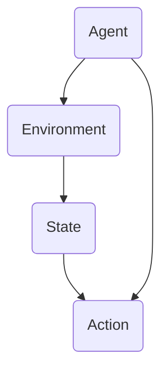
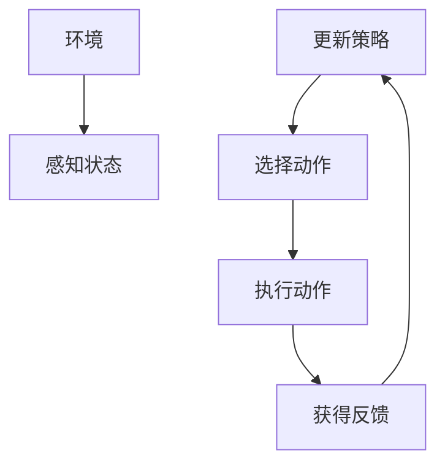
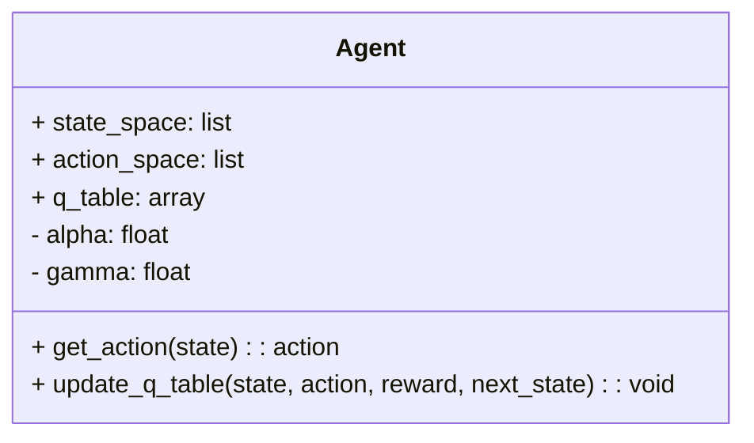
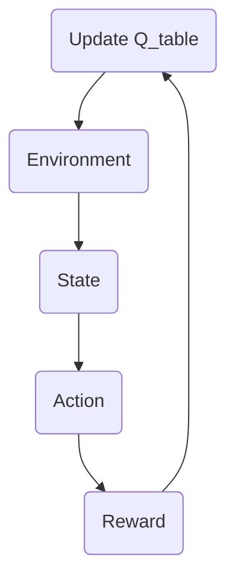
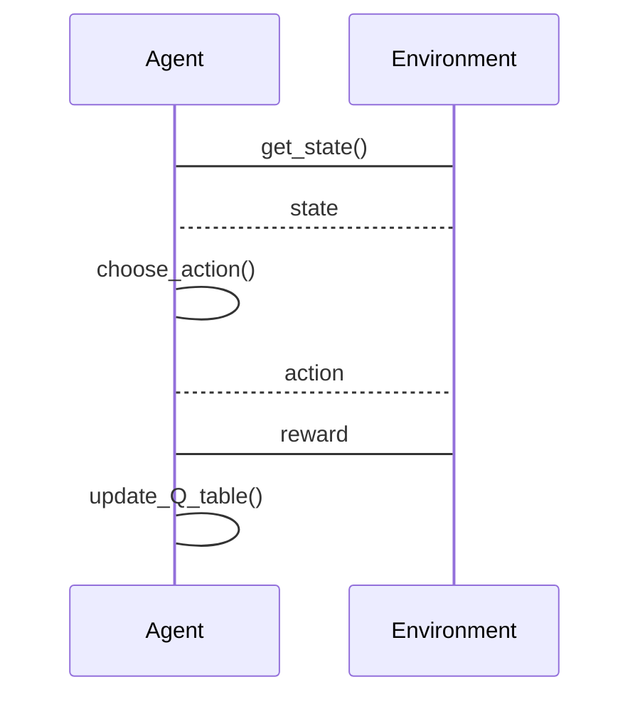

                 


# 构建具有自适应决策能力的AI Agent

> 关键词：自适应决策、AI Agent、强化学习、动态环境、反馈机制

> 摘要：本文将深入探讨如何构建具有自适应决策能力的AI Agent。通过分析自适应决策的核心原理、算法实现、系统架构及实际应用场景，我们将从理论到实践，全面解析AI Agent的设计与实现过程。通过本文，读者将掌握如何利用强化学习、动态环境感知和反馈机制等技术，构建能够自主适应复杂环境的智能体。

---

# 第一部分: 自适应决策AI Agent的背景与核心概念

# 第1章: 自适应决策AI Agent概述

## 1.1 AI Agent的基本概念
### 1.1.1 什么是AI Agent
AI Agent（人工智能代理）是一种能够感知环境、自主决策并执行动作的智能实体。它能够通过与环境的交互，实现特定目标。

### 1.1.2 AI Agent的特点与类型
AI Agent具有以下特点：
- **自主性**：能够在没有外部干预的情况下独立运行。
- **反应性**：能够实时感知环境并做出反应。
- **目标导向性**：所有行为都围绕实现特定目标展开。
- **学习能力**：能够通过经验改进性能。

AI Agent的类型包括：
- **反应式Agent**：基于当前感知做出决策，不依赖历史信息。
- **基于模型的Agent**：利用内部模型和历史信息进行决策。
- **目标驱动的Agent**：以目标为导向，优化决策过程。

### 1.1.3 自适应决策能力的定义
自适应决策能力是指AI Agent能够根据环境的变化动态调整决策策略的能力。这种能力使AI Agent能够在不确定和动态的环境中保持高效和准确的决策。

## 1.2 自适应决策的必要性
### 1.2.1 环境动态变化的挑战
现实世界中的环境通常是动态的、不确定的，AI Agent需要能够快速适应这些变化以实现目标。

### 1.2.2 自适应决策的优势
自适应决策能够使AI Agent在复杂环境中保持高效性，增强其鲁棒性和通用性。

### 1.2.3 自适应决策与传统决策的区别
| 特性 | 自适应决策 | 传统决策 |
|------|------------|----------|
| 环境 | 动态变化    | 静态或已知 |
| 决策 | 动态调整    | 预先规划 |
| 反馈 | 利用反馈优化 | 不依赖反馈 |

## 1.3 自适应决策AI Agent的应用场景
### 1.3.1 智能助手与推荐系统
AI Agent可以根据用户行为和环境变化，实时调整推荐策略，提供更精准的服务。

### 1.3.2 自动交易与金融决策
在金融市场中，AI Agent能够根据市场波动和实时信息，动态调整交易策略，实现收益最大化。

### 1.3.3 智能机器人与自动驾驶
AI Agent可以通过自适应决策能力，使机器人和自动驾驶系统在复杂环境中做出实时、准确的决策。

## 1.4 本章小结
本章介绍了AI Agent的基本概念、类型以及自适应决策能力的定义和必要性。通过对比分析，我们明确了自适应决策在复杂环境中的优势和应用场景。

---

# 第2章: 自适应决策的核心概念与联系

## 2.1 自适应决策的原理与机制
### 2.1.1 感知与理解环境
AI Agent通过传感器或数据输入接口感知环境状态，并利用这些信息进行决策。

### 2.1.2 决策推理过程
AI Agent根据感知到的信息，结合历史经验和当前策略，推理出最优决策。

### 2.1.3 行为执行与反馈
AI Agent执行决策动作，并通过反馈机制优化未来决策。

## 2.2 自适应决策的算法特征对比
### 2.2.1 监督学习、强化学习与无监督学习的对比
| 特性 | 监督学习 | 强化学习 | 无监督学习 |
|------|----------|----------|------------|
| 数据 | 标签数据 | 奖励反馈 | 无标签数据 |
| 目标 | 预测或分类 | 最大化奖励 | 数据分组或发现模式 |
| 适用场景 | 图像分类 | 游戏、机器人控制 | 聚类分析 |

### 2.2.2 离线与在线自适应的对比
| 特性 | 离线自适应 | 在线自适应 |
|------|------------|------------|
| 数据来源 | 离线数据集 | 实时数据流 |
| 决策时间 | 离线训练 | 实时决策 |
| 适用场景 | 预训练模型 | 实时交互系统 |

### 2.2.3 确定性与概率性决策的对比
| 特性 | 确定性决策 | 概率性决策 |
|------|------------|------------|
| 决策方式 | 确定唯一最优解 | 概率分布下选择最优解 |
| 适用场景 | 简单确定性环境 | 复杂不确定性环境 |

## 2.3 系统架构的ER实体关系图


---

# 第3章: 强化学习与自适应决策

## 3.1 强化学习的基本原理
### 3.1.1 状态、动作与奖励的定义
- **状态（State）**：环境当前的状况，例如游戏中的棋盘状态。
- **动作（Action）**：AI Agent采取的行为，例如移动棋子。
- **奖励（Reward）**：环境对AI Agent行为的反馈，例如得分。

### 3.1.2 Q-learning算法的数学模型
$$ Q(s,a) = Q(s,a) + \alpha (r + \gamma \max Q(s',a') - Q(s,a)) $$

其中：
- $Q(s,a)$ 表示在状态 $s$ 下采取动作 $a$ 的价值。
- $\alpha$ 是学习率。
- $\gamma$ 是折扣因子。
- $r$ 是奖励。
- $s'$ 是下一个状态。

## 3.2 自适应决策的强化学习流程


---

## 3.3 自适应决策的数学模型与公式
### 3.3.1 动态环境下的策略优化
在动态环境中，AI Agent的策略需要不断更新以适应环境变化。策略 $\pi$ 的更新公式如下：
$$ \pi_{t+1}(a|s) = \pi_t(a|s) + \Delta \pi_t(a|s) $$

其中，$\Delta \pi_t(a|s)$ 是策略更新的增量。

### 3.3.2 基于Q-learning的自适应决策
在Q-learning中，AI Agent通过不断更新Q值来优化决策：
$$ Q(s,a) = Q(s,a) + \alpha (r + \gamma \max Q(s',a') - Q(s,a)) $$

---

# 第4章: 基于强化学习的自适应决策算法实现

## 4.1 算法实现的核心代码
```python
class AI_Agent:
    def __init__(self, state_space, action_space):
        self.state_space = state_space
        self.action_space = action_space
        self.q_table = np.zeros((state_space, action_space))
        self.alpha = 0.1
        self.gamma = 0.9

    def get_action(self, state):
        if np.random.random() < 0.1:
            return np.random.randint(self.action_space)
        else:
            return np.argmax(self.q_table[state])

    def update_q_table(self, state, action, reward, next_state):
        self.q_table[state][action] = self.q_table[state][action] + \
            self.alpha * (reward + self.gamma * np.max(self.q_table[next_state]) - self.q_table[state][action])
```

## 4.2 算法实现的步骤与流程
### 4.2.1 环境初始化
- 定义环境的状态空间和动作空间。
- 初始化Q表。

### 4.2.2 与环境交互
- AI Agent感知当前状态。
- 根据当前状态选择动作。
- 执行动作，获得奖励和下一个状态。

### 4.2.3 更新Q表
- 根据奖励和下一个状态更新Q表。

---

## 4.3 算法实现的优化与改进
### 4.3.1 增量式Q-learning
通过增量式更新Q表，减少计算量：
$$ \Delta Q(s,a) = r + \gamma \max Q(s',a') - Q(s,a) $$

### 4.3.2 上界截断（Upper Bounds Truncation）
在动作选择中引入上界截断策略，平衡探索与利用。

---

# 第5章: 自适应决策AI Agent的系统架构设计

## 5.1 问题场景介绍
在智能助手的应用中，AI Agent需要根据用户需求和环境变化，动态调整推荐策略。

## 5.2 系统功能设计
### 5.2.1 领域模型


### 5.2.2 系统架构


## 5.3 系统接口设计
### 5.3.1 接口定义
- `get_action(state)`：根据当前状态选择动作。
- `update_q_table(state, action, reward, next_state)`：更新Q表。

### 5.3.2 交互流程


---

# 第6章: 项目实战——构建自适应决策AI Agent

## 6.1 环境安装
- Python 3.8+
- numpy、matplotlib、seaborn

## 6.2 核心代码实现
### 6.2.1 状态感知
```python
def get_state(environment):
    # 返回当前环境状态
    return environment.state
```

### 6.2.2 决策推理
```python
def decide_action(q_table, state):
    # 根据Q表选择动作
    return np.argmax(q_table[state])
```

### 6.2.3 行为执行与反馈
```python
def execute_action(environment, action):
    # 执行动作并获得反馈
    environment.step(action)
    return environment.get_reward(), environment.get_next_state()
```

## 6.3 项目实战的具体案例
### 6.3.1 案例分析
在智能助手场景中，AI Agent需要根据用户搜索记录和实时行为动态调整推荐策略。

### 6.3.2 系统实现
```python
class SmartAssistant:
    def __init__(self):
        self.agent = AI_Agent(state_space, action_space)

    def interact_with_user(self, user_input):
        state = get_state(user_input)
        action = self.agent.get_action(state)
        reward, next_state = execute_action(self.agent, action, user_input)
        self.agent.update_q_table(state, action, reward, next_state)
```

## 6.4 项目实现的总结
通过项目实战，我们验证了自适应决策AI Agent在实际场景中的应用效果，并总结了实现过程中的关键点和注意事项。

---

# 第7章: 自适应决策AI Agent的最佳实践与注意事项

## 7.1 最佳实践 tips
- **数据质量**：确保训练数据的多样性和代表性。
- **模型调优**：根据实际场景调整学习率和折扣因子。
- **安全与伦理**：确保AI Agent的行为符合伦理规范，避免潜在风险。

## 7.2 注意事项
- **环境复杂性**：在复杂环境中，可能需要更复杂的算法。
- **实时性要求**：实时决策场景需要优化算法效率。
- **数据隐私**：处理用户数据时需遵守隐私保护法规。

## 7.3 拓展阅读
- 强化学习经典论文推荐
- 自适应决策的最新研究进展

---

# 结语

通过本文的系统讲解，我们深入探讨了自适应决策AI Agent的核心概念、算法实现和系统架构。从理论到实践，读者可以掌握如何构建具有自适应决策能力的智能体，并在实际应用中不断优化和改进。

---

# 作者：AI天才研究院/AI Genius Institute & 禅与计算机程序设计艺术 /Zen And The Art of Computer Programming

