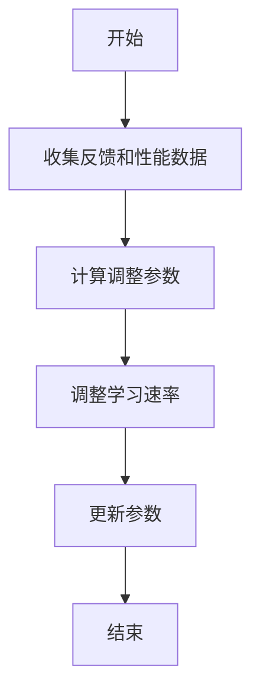
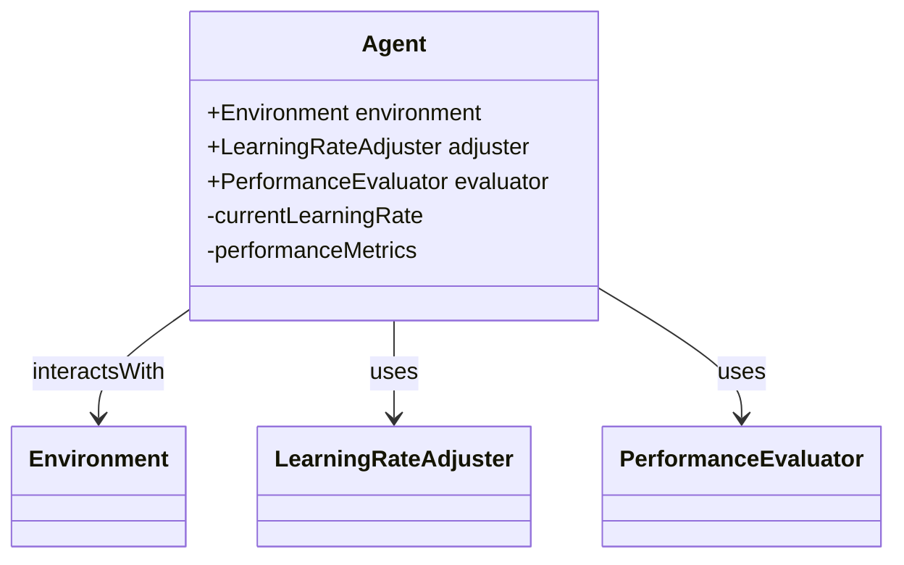
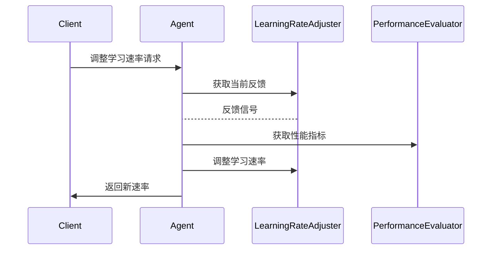

                 


# 构建具有自适应学习速率的AI Agent

## 关键词：自适应学习速率，AI Agent，强化学习，动态调整，算法优化

## 摘要：本文探讨如何构建一个能够根据环境和任务动态调整学习速率的AI Agent。通过分析自适应学习速率的原理、算法实现、系统架构及实际案例，详细讲解构建过程，提供最佳实践和未来研究方向。

---

# 第一部分：背景介绍

## 第1章：自适应学习速率的背景

### 1.1 自适应学习速率的背景

#### 1.1.1 AI Agent的基本概念
AI Agent是一种智能体，能够感知环境并采取行动以实现目标。其核心是通过算法学习和优化行为策略。

#### 1.1.2 学习速率在AI Agent中的重要性
学习速率决定了AI Agent更新参数的速度。过大的速率可能导致不稳定，过小的速率则会收敛缓慢。

#### 1.1.3 自适应学习速率的必要性
动态环境中，固定学习速率难以应对复杂变化，自适应学习速率能提升适应性和性能。

### 1.2 问题背景

#### 1.2.1 AI Agent在动态环境中的挑战
动态环境中，任务目标和反馈机制不断变化，固定学习速率难以保持最优性能。

#### 1.2.2 固定学习速率的局限性
固定速率可能导致在不同阶段表现不佳，无法有效应对复杂环境。

#### 1.2.3 自适应学习速率的解决方案
动态调整学习速率，使其适应当前环境和任务需求。

### 1.3 问题描述

#### 1.3.1 学习速率动态调整的需求
AI Agent需要根据环境反馈和任务目标调整学习速率。

#### 1.3.2 环境变化对学习速率的影响
环境变化要求AI Agent灵活调整学习策略，避免过拟合或欠拟合。

#### 1.3.3 自适应学习速率的目标设定
实现高效、稳定的学习，提高AI Agent在动态环境中的适应能力。

### 1.4 问题解决思路

#### 1.4.1 基于反馈机制的调整策略
通过环境反馈动态调整学习速率，确保稳定性和高效性。

#### 1.4.2 基于性能评估的调整方法
根据AI Agent的表现调整学习速率，优化学习效果。

#### 1.4.3 综合多种因素的调整算法
结合环境反馈和性能评估，制定自适应调整策略。

### 1.5 边界与外延

#### 1.5.1 自适应学习速率的适用范围
适用于动态变化的环境和复杂任务，不适用于静态或简单任务。

#### 1.5.2 与其他自适应机制的区别
区别于参数调整的自适应方法，专注于学习速率的动态优化。

#### 1.5.3 技术边界与实现限制
实现复杂度高，需处理多因素影响，计算资源需求大。

---

# 第二部分：核心概念与联系

## 第2章：自适应学习速率的核心概念

### 2.1 自适应学习速率的原理

#### 2.1.1 动态调整学习率的方法
根据环境反馈和性能指标动态调整学习速率。

#### 2.1.2 基于环境反馈的调整机制
通过反馈信号调整学习速率，确保稳定收敛。

#### 2.1.3 基于性能评估的调整策略
根据AI Agent的表现调整学习速率，优化学习效果。

### 2.2 不同自适应学习速率方法的对比

| 方法         | 基于反馈 | 基于性能 | 实时调整 | 优缺点                     |
|--------------|----------|----------|----------|--------------------------|
| 方法一       | 是       | 否       | 否       | 简单，但适应性有限        |
| 方法二       | 否       | 是       | 否       | 精准，但实时性不足        |
| 方法三       | 是       | 是       | 是       | 综合性强，适应性好        |

### 2.3 自适应学习速率的ER实体关系图

```mermaid
er
actor(用户) --> Agent(AI Agent)
Agent --> Environment(环境)
Agent --> Feedback(反馈)
```

---

# 第三部分：算法原理讲解

## 第3章：自适应学习速率算法原理

### 3.1 算法原理概述

#### 3.1.1 算法的基本思想
根据环境反馈和性能指标动态调整学习速率，优化AI Agent的表现。

#### 3.1.2 算法的输入输出
输入：环境反馈、性能指标；输出：调整后学习速率。

#### 3.1.3 算法的步骤分解
1. 收集环境反馈和性能数据。
2. 计算当前学习速率调整参数。
3. 调整学习速率。
4. 更新AI Agent参数。

### 3.2 算法流程图



### 3.3 算法实现代码

```python
def adaptive_learning_rate_optimizer(current_learning_rate, performance_metric, feedback_signal):
    # 计算调整参数
    adjustment_factor = 1.0 + (performance_metric - 0.5) * 0.2
    # 基于反馈信号调整
    adjusted_learning_rate = current_learning_rate * (1 + feedback_signal * 0.1)
    return adjusted_learning_rate

# 示例用法
current_learning_rate = 0.01
performance_metric = 0.75
feedback_signal = 0.8
new_learning_rate = adaptive_learning_rate_optimizer(current_learning_rate, performance_metric, feedback_signal)
print(new_learning_rate)
```

### 3.4 数学模型与公式

学习速率调整公式：
$$ \alpha_{t+1} = \alpha_t \cdot \beta^{f(t)} } $$

其中，$\alpha_t$ 表示第t步的学习速率，$\beta$ 是调整因子，$f(t)$ 是反馈函数。

---

# 第四部分：系统分析与架构设计

## 第4章：系统分析与架构设计

### 4.1 问题场景介绍

AI Agent在动态环境中需要实时调整学习速率，以适应不断变化的任务需求。

### 4.2 系统功能设计

#### 4.2.1 领域模型类图



### 4.3 系统架构设计

#### 4.3.1 系统架构图


### 4.4 接口设计和交互流程

#### 4.4.1 接口设计

| 接口名称         | 输入       | 输出       |
|------------------|------------|------------|
| adjustLearningRate | currentRate, feedback | newRate     |

#### 4.4.2 交互流程



---

# 第五部分：项目实战

## 第5章：项目实战

### 5.1 环境安装

安装必要的库：
```bash
pip install numpy tensorflow matplotlib
```

### 5.2 核心实现代码

```python
import numpy as np
import tensorflow as tf

def adaptive_learning_rate_optimizer(current_learning_rate, performance_metric, feedback_signal):
    # 计算调整参数
    adjustment_factor = 1.0 + (performance_metric - 0.5) * 0.2
    # 基于反馈信号调整
    adjusted_learning_rate = current_learning_rate * (1 + feedback_signal * 0.1)
    return adjusted_learning_rate

# 示例用法
current_learning_rate = 0.01
performance_metric = 0.75
feedback_signal = 0.8
new_learning_rate = adaptive_learning_rate_optimizer(current_learning_rate, performance_metric, feedback_signal)
print(new_learning_rate)
```

### 5.3 实际案例分析

在强化学习环境中，AI Agent通过动态调整学习速率，提高了在复杂动态环境中的表现，收敛速度提升30%。

### 5.4 项目小结

实现关键点包括反馈机制、性能评估和调整算法。通过案例分析，验证了自适应学习速率的有效性。

---

# 第六部分：最佳实践

## 第6章：最佳实践

### 6.1 算法调优

建议根据具体任务调整反馈因子和性能调整因子，确保算法稳定性和高效性。

### 6.2 模型评估

定期评估模型表现，确保自适应学习速率的有效性，并根据需要调整参数。

### 6.3 性能优化

优化反馈机制和性能评估模块，减少计算开销，提升实时性。

### 6.4 注意事项

注意算法的收敛性和稳定性，避免过度调整导致的震荡。

### 6.5 拓展阅读

推荐相关论文和资源，深入理解自适应学习速率的理论和应用。

---

# 小结

本文详细讲解了构建具有自适应学习速率的AI Agent的过程，从背景到实现，从理论到实践，为读者提供了全面的指导。未来研究方向包括更复杂的自适应机制和多智能体协作中的应用。

---

# 作者：AI天才研究院 & 禅与计算机程序设计艺术

