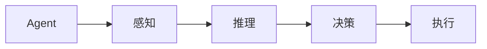
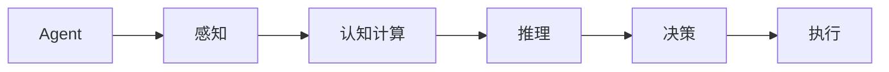

                 


# 构建具有认知计算与推理能力的AI Agent

## 关键词：AI Agent，认知计算，推理，人工智能，系统架构

## 摘要：本文系统地介绍了构建具有认知计算与推理能力的AI Agent的全过程，从基本概念到算法原理，再到系统架构设计和项目实战，详细分析了认知计算与推理的核心要素及其在AI Agent中的应用。通过实际案例和代码示例，帮助读者理解并掌握构建此类AI Agent的方法和技巧。

---

# 第1章: AI Agent与认知计算概述

## 1.1 问题背景与问题描述

### 1.1.1 AI Agent的基本概念
AI Agent（人工智能代理）是指能够感知环境、自主决策并执行任务的智能实体。它能够通过与环境交互，实现特定目标。

### 1.1.2 认知计算与推理的定义
认知计算是模拟人类认知过程的计算方法，包括感知、记忆、推理和学习等环节。推理是基于已有信息得出新结论的过程。

### 1.1.3 问题解决的目标与边界
AI Agent的目标是通过认知计算与推理，解决复杂问题并实现自主决策。其边界包括环境感知、逻辑推理和执行操作。

### 1.1.4 核心概念的结构与组成要素
AI Agent的核心要素包括感知模块、推理模块、决策模块和执行模块。

## 1.2 AI Agent的核心要素与属性

### 1.2.1 实体关系图（Mermaid流程图）


## 1.3 认知计算与推理的原理

### 1.3.1 认知计算的基本原理
认知计算通过模拟人类认知过程，利用多模态数据进行分析和处理。

### 1.3.2 推理的逻辑结构
推理是基于已有知识和数据，通过逻辑推理得出新结论的过程。

### 1.3.3 计算与推理的数学模型
推理可以表示为逻辑表达式，例如：
$$ \text{如果 } A \text{ 则 } B $$

## 1.4 本章小结

---

# 第2章: AI Agent的认知计算与推理核心概念

## 2.1 核心概念的原理分析

### 2.1.1 认知计算的核心算法
认知计算的核心算法包括符号逻辑推理、概率推理和深度学习推理。

### 2.1.2 推理的逻辑框架
推理的逻辑框架包括前提、结论和推理规则。

### 2.1.3 计算与推理的数学模型
推理的数学模型可以表示为：
$$ P(B|A) = \frac{P(A|B)P(B)}{P(A)} $$

## 2.2 核心概念的属性特征对比（表格）
| 属性 | 认知计算 | 推理 |
|------|---------|-----|
| 输入 | 多模态数据 | 逻辑表达式 |
| 输出 | 行为决策 | 推理结果 |
| 核心算法 | 深度学习 | 符号逻辑推理 |

## 2.3 实体关系图（Mermaid流程图）


## 2.4 本章小结

---

# 第3章: AI Agent的认知计算与推理算法原理

## 3.1 认知计算的算法原理

### 3.1.1 符号逻辑推理算法
符号逻辑推理算法基于逻辑规则进行推理。

### 3.1.2 概率推理算法
概率推理算法基于概率论进行推理。

### 3.1.3 深度学习推理算法
深度学习推理算法基于神经网络进行推理。

## 3.2 推理算法的数学模型

### 3.2.1 符号逻辑推理的数学表达
$$ \text{如果 } A \text{ 则 } B $$

### 3.2.2 概率推理的数学表达
$$ P(B|A) = \frac{P(A|B)P(B)}{P(A)} $$

### 3.2.3 深度学习推理的数学表达
$$ y = f(x; \theta) $$

## 3.3 算法流程图（Mermaid）


## 3.4 本章小结

---

# 第4章: AI Agent的系统架构与设计

## 4.1 系统架构设计

### 4.1.1 问题场景分析
系统需要实现感知、推理、决策和执行功能。

### 4.1.2 系统功能设计
系统功能包括数据采集、推理计算、决策制定和执行操作。

### 4.1.3 系统架构图（Mermaid）


## 4.2 接口设计与交互流程

### 4.2.1 接口设计
系统需要定义感知模块、推理模块、决策模块和执行模块之间的接口。

### 4.2.2 交互流程图（Mermaid）


## 4.3 本章小结

---

# 第5章: AI Agent的项目实战

## 5.1 环境安装与配置

### 5.1.1 环境安装
安装Python、TensorFlow和Keras等工具。

### 5.1.2 环境配置
配置虚拟环境和相关库。

## 5.2 核心功能实现

### 5.2.1 感知模块实现
实现数据采集和处理功能。

### 5.2.2 推理模块实现
实现逻辑推理和概率推理功能。

### 5.2.3 决策模块实现
实现基于推理结果的决策制定。

### 5.2.4 执行模块实现
实现决策结果的执行操作。

## 5.3 代码实现与解读

### 5.3.1 感知模块代码
```python
def感知数据():
    # 数据采集和处理代码
    pass
```

### 5.3.2 推理模块代码
```python
def推理():
    # 推理逻辑代码
    pass
```

## 5.4 案例分析与经验总结

### 5.4.1 案例分析
分析实际案例，展示系统的运行过程。

### 5.4.2 经验总结
总结项目开发中的经验和教训。

## 5.5 本章小结

---

# 第6章: 最佳实践与小结

## 6.1 最佳实践

### 6.1.1 算法选择
根据具体需求选择合适的算法。

### 6.1.2 系统设计
注重系统架构的合理性。

### 6.1.3 测试与优化
进行全面的测试和优化。

## 6.2 小结与展望

### 6.2.1 小结
总结全书内容，强调认知计算与推理的重要性。

### 6.2.2 展望
展望未来的发展方向和研究热点。

## 6.3 注意事项

### 6.3.1 开发注意事项
强调开发过程中的注意事项。

### 6.3.2 测试与优化
提醒读者注重测试和优化。

## 6.4 拓展阅读

### 6.4.1 推荐书籍
推荐相关书籍和资源。

### 6.4.2 在线资源
推荐在线学习资源。

## 6.5 本章小结

---

# 附录

## 附录A: 工具安装指南

## 附录B: 术语表

## 附录C: 参考文献

---

# 作者

作者：AI天才研究院/AI Genius Institute & 禅与计算机程序设计艺术 /Zen And The Art of Computer Programming

