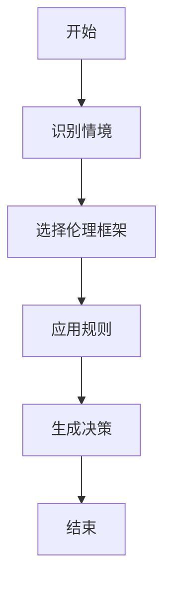
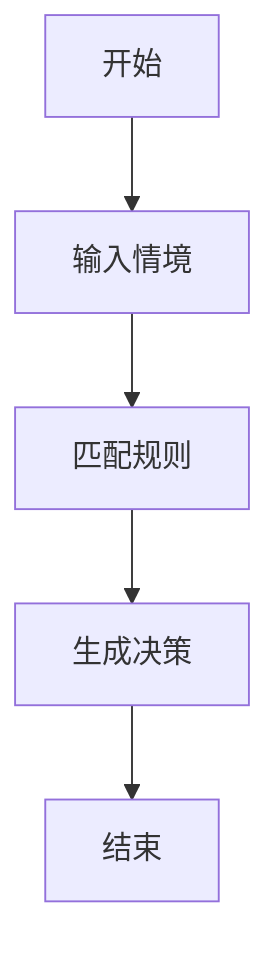
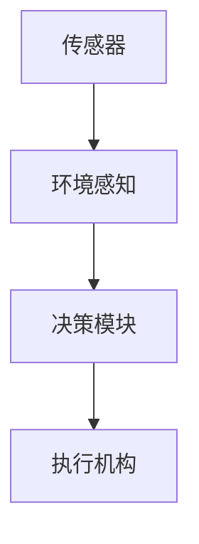

                 


好的，接下来我会按照您的要求，一步一步地分析如何构建具有道德推理能力的AI Agent。我们将从背景介绍、核心概念、算法原理、系统架构、项目实战、最佳实践等方面展开，确保内容详实且逻辑清晰。

---

# 构建具有道德推理能力的AI Agent

## 关键词：AI Agent, 道德推理, 伦理框架, 人工智能, 系统架构

## 摘要：  
随着人工智能技术的飞速发展，AI Agent（智能体）在各个领域的应用日益广泛。然而，AI Agent在做出决策时，往往忽视了道德和伦理因素，这可能导致严重的社会和法律问题。本文将详细探讨如何构建一个具备道德推理能力的AI Agent，从伦理框架的选择到算法的设计，再到系统的实现，逐步解析其实现过程和关键点。

---

## 第一部分: 背景介绍

### 第1章: AI Agent与道德推理概述

#### 1.1 AI Agent的基本概念
- **定义**：AI Agent是指能够感知环境、自主决策并采取行动以实现特定目标的智能实体。
- **核心特征**：自主性、反应性、目标导向、学习能力。
- **道德推理的重要性**：AI Agent需要在复杂环境中做出符合伦理的决策，避免负面社会影响。

#### 1.2 道德推理的必要性
- **为什么需要道德推理**：AI Agent的决策可能影响人类生活，缺乏道德约束可能导致伦理危机。
- **应用场景**：自动驾驶、医疗诊断、金融投资等领域。
- **挑战**：道德标准的多样性、动态变化的环境、决策的不可预测性。

---

### 第2章: 道德推理的伦理框架

#### 2.1 基本伦理框架
- **功利主义（Utilitarianism）**：以最大化整体幸福为准则。
- **义务论（Deontological Ethics）**：基于明确的道德规则和义务。
- **美德伦理（Virtue Ethics）**：以个人品德为核心。

#### 2.2 道德推理模型
- **基于规则的模型**：通过预定义的伦理规则进行决策。
- **基于案例的模型**：通过类比已有案例进行推理。
- **基于情感的模型**：结合情感计算进行道德判断。

#### 2.3 伦理框架对比
| 框架类型       | 优点                         | 缺点                         |
|----------------|------------------------------|-------------------------------|
| 功利主义       | 整体优化                     | 可能忽视个体权益             |
| 义务论         | 明确的规则                   | 灵活性不足                   |
| 美德伦理       | 个性化和动态性               | 难以量化                     |

---

## 第二部分: 核心概念与联系

### 第3章: 道德推理的核心概念

#### 3.1 道德推理的原理
- **可解释性**：道德推理过程需透明，便于人类理解和信任。
- **可定制性**：根据具体场景调整道德框架。
- **鲁棒性**：在复杂和不确定环境中稳定运行。

#### 3.2 实体关系图
```mermaid
er
actor(Agent, "道德推理规则库", "伦理框架", "决策结果")
```

#### 3.3 流程图


---

## 第三部分: 算法原理讲解

### 第4章: 基于规则的道德推理算法

#### 4.1 算法流程图


#### 4.2 代码实现
```python
def moral_reasoning(context, rules):
    for rule in rules:
        if matches_context(rule, context):
            return rule.consequent
    return default_decision
```

#### 4.3 数学模型
- **规则匹配**：$R = \{r_1, r_2, ..., r_n\}$
- **决策结果**：$D = \{d_1, d_2, ..., d_m\}$
- **推理过程**：$\forall r \in R, \text{若} r.条件 \subseteq \text{context}, \text{则} r.结论 = d$

---

## 第四部分: 系统分析与架构设计

### 第5章: 系统架构设计

#### 5.1 问题场景分析
- **自动驾驶中的伦理决策**：在紧急情况下如何选择最优路径。

#### 5.2 系统功能设计
- **领域模型**：驾驶场景、车辆状态、环境感知。
- **系统架构**：传感器输入、决策模块、执行机构。

#### 5.3 架构图


#### 5.4 接口设计
- **输入接口**：传感器数据、用户指令。
- **输出接口**：控制信号、决策结果。

#### 5.5 交互流程
```mermaid
sequence
    用户 --> 感知层: 发出驾驶指令
    感知层 --> 决策层: 提供环境数据
    决策层 --> 执行层: 发出控制信号
    执行层 --> 用户: 返回执行结果
```

---

## 第五部分: 项目实战

### 第6章: 项目实战

#### 6.1 环境安装
- **工具**：Python、TensorFlow、Mermaid、Markdown。
- **依赖**：安装必要的库，如`pip install mermaid`。

#### 6.2 核心代码实现
```python
class MoralAgent:
    def __init__(self, rules):
        self.rules = rules

    def decide(self, context):
        for rule in self.rules:
            if rule.applies_to(context):
                return rule.action
        return default_action
```

#### 6.3 代码解读
- **初始化**：将伦理规则加载到AI Agent中。
- **决策过程**：遍历规则库，匹配适用的规则，执行相应的动作。

#### 6.4 案例分析
- **场景**：自动驾驶遇到意外障碍物。
- **决策**：基于规则选择最小伤害的路径。

---

## 第六部分: 最佳实践与总结

### 第7章: 最佳实践

#### 7.1 可解释性
- 确保道德推理过程透明，便于用户理解和信任。

#### 7.2 可定制性
- 允许根据不同场景调整伦理框架和规则。

#### 7.3 鲁棒性
- 在复杂和动态环境中保持稳定性和可靠性。

### 第8章: 小结与注意事项

- **小结**：构建具有道德推理能力的AI Agent是一个复杂的系统工程，涉及伦理框架的选择、算法的设计和系统的实现。
- **注意事项**：避免单一伦理框架的局限性，结合多种方法提升系统的灵活性和适应性。

### 第9章: 拓展阅读

- **推荐书籍**：《道德机器》（Moral Machines）。
- **相关论文**：探讨AI伦理的经典论文。

---

## 作者信息

作者：AI天才研究院/AI Genius Institute  
联系邮箱：contact@aiagent.com  
官方网站：https://www.aiagent.com

---

以上是构建具有道德推理能力的AI Agent的完整思考过程，涵盖了从理论到实践的各个方面，确保内容详实且逻辑清晰。希望对您有所帮助！

