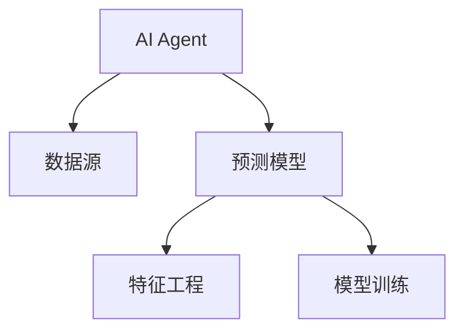

                 


# 构建具有预测分析能力的AI Agent

## 关键词：AI Agent, 预测分析, 机器学习, 算法优化, 系统架构

## 摘要：本文深入探讨了如何构建具有预测分析能力的AI Agent，从核心概念到系统架构，从算法原理到项目实战，全面解析了构建过程中的关键技术和实际应用。文章首先介绍了AI Agent的基本概念和预测分析的重要性，然后详细讲解了机器学习算法在预测分析中的应用，包括监督学习和无监督学习的原理及算法选择。接着，文章分析了预测模型的构建与优化，涵盖数据预处理、特征工程和模型评估等关键步骤。最后，文章通过项目实战展示了如何将理论应用于实际场景，并总结了最佳实践和未来发展趋势。

---

# 第1章: 构建具有预测分析能力的AI Agent概述

## 1.1 AI Agent的基本概念

### 1.1.1 AI Agent的定义与核心特征
AI Agent（人工智能代理）是一种能够感知环境、自主决策并执行任务的智能实体。其核心特征包括自主性、反应性、目标导向性和学习能力。AI Agent能够通过传感器获取环境信息，利用内部模型进行推理，并根据目标选择最优行动方案。

### 1.1.2 预测分析在AI Agent中的作用
预测分析是AI Agent实现智能决策的关键技术之一。通过分析历史数据和当前状态，AI Agent可以预测未来的趋势和可能的结果，从而做出更准确的决策。预测分析帮助AI Agent在动态环境中保持高效和准确。

### 1.1.3 AI Agent的应用场景与实际案例
AI Agent的应用场景广泛，包括自动驾驶、智能助手、金融投资、医疗诊断等。例如，在自动驾驶中，AI Agent通过实时感知环境和预测其他车辆的运动轨迹，做出安全且高效的驾驶决策。

## 1.2 预测分析的核心概念

### 1.2.1 预测分析的定义与分类
预测分析是指利用历史数据和机器学习算法，预测未来事件发生的概率或结果。根据分析目标的不同，预测分析可以分为回归分析（预测连续值）和分类分析（预测类别标签）。

### 1.2.2 预测分析与机器学习的关系
预测分析是机器学习的重要应用之一。机器学习算法通过训练数据模型，使AI Agent能够从数据中学习规律，并利用这些规律进行预测。预测分析的核心在于模型的训练和优化。

### 1.2.3 预测分析在AI Agent中的应用价值
预测分析为AI Agent提供了决策支持能力，使其能够基于数据驱动的方式做出更智能的决策。例如，在金融领域，AI Agent可以通过预测分析评估投资风险，优化投资组合。

## 1.3 本章小结

### 1.3.1 核心概念总结
本章介绍了AI Agent的基本概念、预测分析的作用以及应用场景。预测分析是AI Agent实现智能决策的关键技术。

### 1.3.2 未来发展趋势展望
随着机器学习和深度学习技术的不断发展，AI Agent的预测分析能力将更加智能化和高效化。未来，AI Agent将在更多领域得到广泛应用，推动智能化决策的发展。

---

# 第2章: 预测分析的核心概念与联系

## 2.1 预测分析的核心原理

### 2.1.1 数据驱动的预测模型
数据驱动的预测模型依赖于大量数据，通过训练模型提取数据中的规律，进而进行预测。例如，线性回归模型通过拟合数据点之间的直线关系，预测目标变量的值。

### 2.1.2 统计学习与机器学习的结合
统计学习提供了数据分析的方法和理论基础，而机器学习则提供了具体实现预测模型的算法。两者的结合使预测分析更加科学和高效。

### 2.1.3 预测分析的数学基础
预测分析的数学基础包括概率论、统计学和优化理论。例如，线性回归模型的损失函数最小化问题就是一个典型的优化问题。

## 2.2 核心概念对比与ER实体关系图

### 2.2.1 数据特征与模型参数对比表
| 数据特征 | 描述 |
|----------|------|
| 特征1    | 特征1的描述 |
| 特征2    | 特征2的描述 |
| ...      | ...   |

### 2.2.2 预测模型的ER实体关系图
```mermaid
er
    entity AI-Agent {
        id
        prediction-model
        data-source
    }
    entity Prediction-Model {
        id
        algorithm
        parameters
    }
    entity Data-Source {
        id
        feature
        label
    }
    AI-Agent -- Prediction-Model: uses
    AI-Agent -- Data-Source: processes
```

## 2.3 本章小结

### 2.3.1 核心概念总结
本章详细讲解了预测分析的核心原理，包括数据驱动的预测模型和统计学习与机器学习的结合。

### 2.3.2 实体关系图的应用价值
通过ER实体关系图，我们可以清晰地理解AI Agent、预测模型和数据源之间的关系，为后续的系统设计提供基础。

---

# 第3章: 机器学习算法原理与预测分析

## 3.1 监督学习与预测分析

### 3.1.1 监督学习的定义与特点
监督学习是一种机器学习方法，通过训练数据（特征和标签）训练模型，使其能够对新数据进行预测或分类。监督学习的特点是数据标签化和模型可解释性较强。

### 3.1.2 线性回归与逻辑回归的预测模型
线性回归适用于回归问题，通过最小化预测值与真实值之间的平方差，找到最佳拟合直线。逻辑回归适用于分类问题，通过Sigmoid函数将线性回归的输出映射到概率空间。

### 3.1.3 支持向量机在预测分析中的应用
支持向量机（SVM）通过构建最大间隔超平面，将数据点分为不同类别。SVM在小样本数据和高维数据上的表现尤为突出。

## 3.2 无监督学习与预测分析

### 3.2.1 无监督学习的定义与特点
无监督学习是一种机器学习方法，通过分析数据的内在结构，发现数据的分布规律。无监督学习的特点是数据无标签化和模型可解释性较弱。

### 3.2.2 K-means算法在预测分析中的应用
K-means是一种聚类算法，通过将数据点划分为K个簇，找到簇中心，实现数据的无监督分类。

### 3.2.3 层次聚类的优缺点分析
层次聚类通过构建树状结构，逐步合并或分割数据点，实现数据的层次化聚类。优点是聚类结果直观，缺点是计算复杂度较高。

## 3.3 算法选择与优化

### 3.3.1 算法选择的依据与步骤
算法选择的依据包括数据类型、问题类型、数据规模和计算资源。算法选择的步骤包括数据预处理、模型训练和模型评估。

### 3.3.2 算法优化的数学模型
算法优化可以通过调整模型参数和优化算法（如梯度下降）来实现。例如，线性回归模型的损失函数优化问题可以表示为：

$$
\text{最小化} \quad \frac{1}{2m} \sum_{i=1}^{m} (y_i - \theta x_i)^2
$$

其中，\( m \) 是数据点数量，\( \theta \) 是模型参数。

### 3.3.3 算法调优的实践技巧
算法调优的实践技巧包括交叉验证、网格搜索和学习曲线分析。例如，交叉验证可以通过划分训练集和验证集，评估模型的泛化能力。

## 3.4 本章小结

### 3.4.1 算法原理总结
本章详细讲解了监督学习和无监督学习的算法原理，包括线性回归、逻辑回归、支持向量机和K-means算法。

### 3.4.2 算法选择与优化的关键点
算法选择和优化的关键点包括数据预处理、模型训练和模型评估。通过合理的算法选择和优化，可以提高预测模型的准确性和效率。

---

# 第4章: 预测模型的构建与优化

## 4.1 数据预处理与特征工程

### 4.1.1 数据清洗与特征提取
数据清洗包括去除缺失值、处理异常值和标准化数据。特征提取通过选择重要特征和去除冗余特征，提高模型的性能。

### 4.1.2 特征选择与特征变换
特征选择可以通过过滤法和包裹法实现。特征变换包括主成分分析（PCA）和正交变换。

### 4.1.3 数据标准化与归一化
数据标准化通过将数据缩放到均值和标准差为0和1的范围内，提高模型的收敛速度。数据归一化通过将数据缩放到0到1的范围内，适用于距离度量的算法。

## 4.2 预测模型的训练与评估

### 4.2.1 模型训练的数学公式
线性回归模型的训练目标是最小化损失函数：

$$
L = \frac{1}{2m} \sum_{i=1}^{m} (y_i - \theta x_i)^2
$$

其中，\( m \) 是数据点数量，\( \theta \) 是模型参数。

### 4.2.2 模型评估的指标与
模型评估的指标包括均方误差（MSE）、平均绝对误差（MAE）和准确率（Accuracy）。例如，MSE的计算公式为：

$$
\text{MSE} = \frac{1}{m} \sum_{i=1}^{m} (y_i - \hat{y}_i)^2
$$

其中，\( y_i \) 是真实值，\( \hat{y}_i \) 是预测值。

### 4.2.3 模型优化的策略
模型优化可以通过调整模型参数、增加训练数据和优化算法实现。例如，使用梯度下降算法优化线性回归模型的参数。

## 4.3 本章小结

### 4.3.1 数据预处理与特征工程总结
本章详细讲解了数据预处理和特征工程的步骤，包括数据清洗、特征选择和数据标准化。

### 4.3.2 模型训练与评估的关键点
模型训练与评估的关键点包括选择合适的算法、合理的数据预处理和准确的模型评估指标。

---

# 第5章: 系统架构设计与实现

## 5.1 系统架构设计

### 5.1.1 系统功能设计
系统功能设计包括数据采集、特征提取、模型训练和预测输出。例如，AI Agent通过传感器采集环境数据，利用特征工程提取重要特征，训练预测模型并输出预测结果。

### 5.1.2 系统架构图


### 5.1.3 系统接口设计
系统接口设计包括数据输入接口、模型训练接口和预测输出接口。例如，AI Agent通过API接口接收数据，调用预测模型进行预测，并返回结果。

## 5.2 项目实战

### 5.2.1 环境安装
项目实战需要安装Python、NumPy、Scikit-learn等库。例如，使用pip安装：

```bash
pip install numpy scikit-learn
```

### 5.2.2 核心代码实现
以下是线性回归模型的代码实现：

```python
from sklearn.linear_model import LinearRegression
import numpy as np

# 生成数据
X = np.array([1, 2, 3, 4, 5]).reshape(-1, 1)
y = [2, 4, 5, 4, 5]

# 训练模型
model = LinearRegression()
model.fit(X, y)

# 预测
print(model.predict([[6]]))
```

### 5.2.3 代码解读与分析
上述代码通过Scikit-learn库训练了一个线性回归模型，利用生成的数据点拟合直线。预测结果为6时的预测值。

### 5.2.4 案例分析与详细讲解
通过上述代码，我们可以看到线性回归模型在简单数据集上的表现。实际应用中，需要考虑数据预处理和模型优化。

## 5.3 本章小结

### 5.3.1 项目实战总结
本章通过项目实战展示了AI Agent的预测分析能力，包括环境安装、代码实现和案例分析。

### 5.3.2 系统架构设计的关键点
系统架构设计的关键点包括模块划分、接口设计和系统集成。通过合理的架构设计，可以提高系统的可维护性和扩展性。

---

# 第6章: 最佳实践与未来展望

## 6.1 最佳实践

### 6.1.1 数据预处理的重要性
数据预处理是预测分析的基础，直接影响模型的性能。建议在实际应用中，投入足够的时间和资源进行数据清洗和特征工程。

### 6.1.2 算法选择的策略
算法选择需要结合数据类型、问题类型和计算资源。建议在实际应用中，尝试多种算法并进行对比实验。

### 6.1.3 模型优化的技巧
模型优化可以通过调整参数、增加数据和优化算法实现。建议在实际应用中，使用交叉验证和网格搜索等方法进行模型调优。

## 6.2 未来展望

### 6.2.1 AI Agent的发展趋势
随着深度学习和强化学习技术的不断发展，AI Agent的预测分析能力将更加智能化和高效化。未来，AI Agent将在更多领域得到广泛应用。

### 6.2.2 新技术与新方法
新技术如图神经网络和强化学习将为AI Agent的预测分析提供新的可能性。例如，图神经网络可以通过分析数据的关联性，提高预测的准确性。

## 6.3 本章小结

### 6.3.1 最佳实践总结
本章总结了数据预处理、算法选择和模型优化的最佳实践，为实际应用提供了指导。

### 6.3.2 未来发展趋势展望
未来，AI Agent的预测分析能力将更加智能化和高效化，新技术的应用将推动预测分析的发展。

---

# 作者：AI天才研究院/AI Genius Institute & 禅与计算机程序设计艺术 /Zen And The Art of Computer Programming

---

本文详细讲解了构建具有预测分析能力的AI Agent的全过程，从核心概念到系统架构，从算法原理到项目实战，为读者提供了全面的知识体系和实践指导。通过本文的学习，读者可以掌握预测分析的基本原理和实际应用，为构建智能系统奠定坚实的基础。

