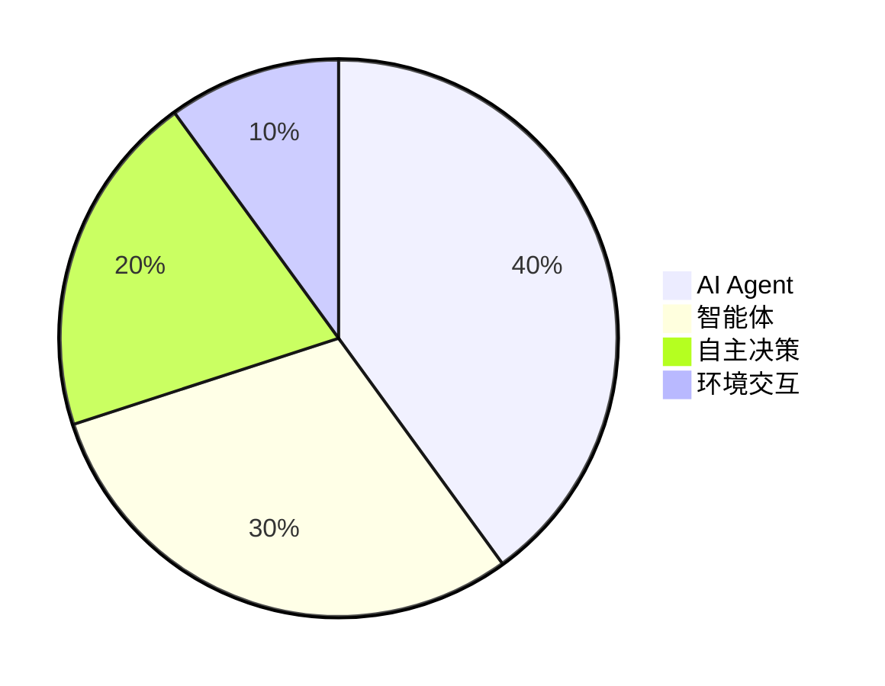
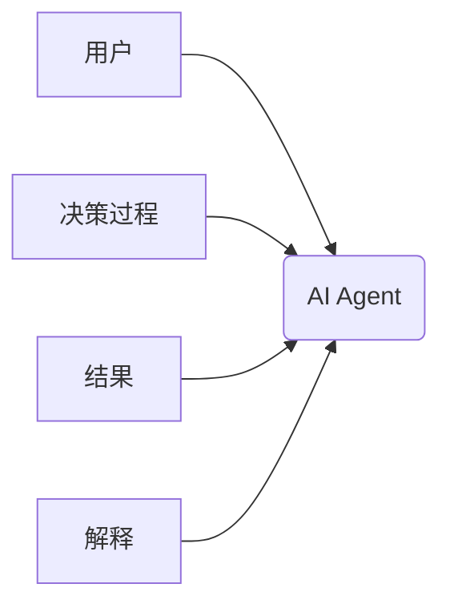
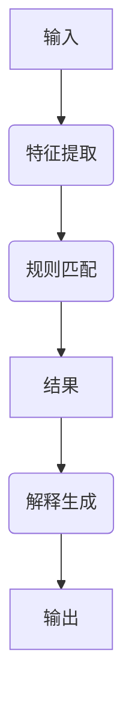
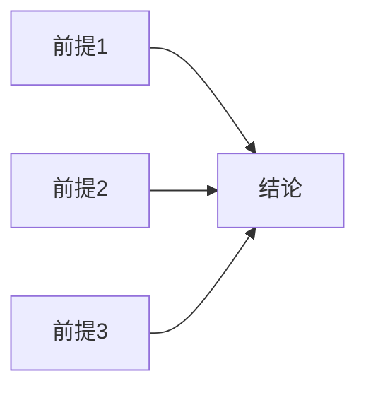
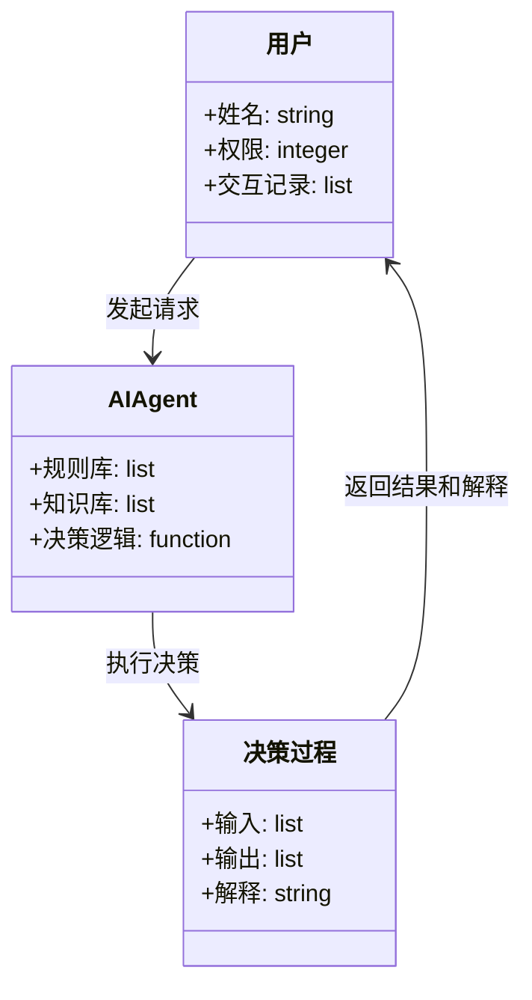
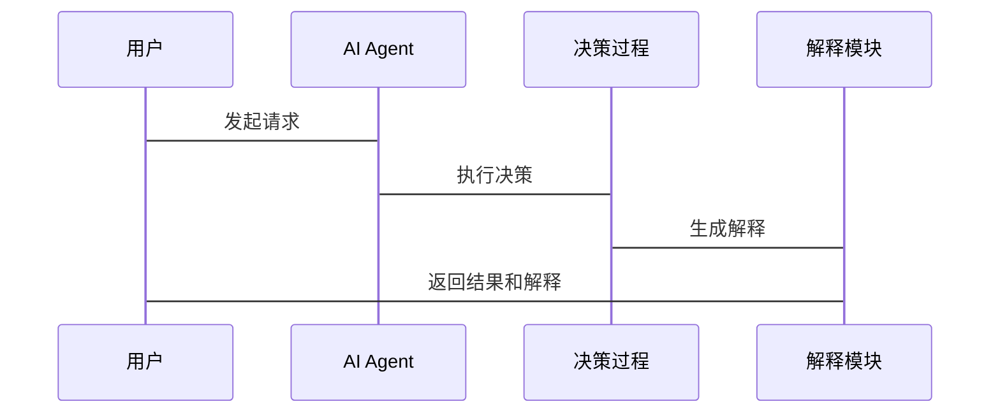

                 


# 构建可解释的AI Agent：透明度和可信度

> 关键词：可解释性AI Agent，透明度，可信度，算法原理，系统架构，用户交互

> 摘要：随着人工智能技术的快速发展，AI Agent在各个领域的应用越来越广泛。然而，AI Agent的决策过程往往缺乏透明度和可信度，导致用户难以理解和信任。本文从可解释性AI Agent的核心概念出发，详细探讨了透明度和可信度的实现方法，分析了可解释性AI Agent的算法原理和系统架构，最后通过实际案例展示了如何构建一个透明且可信的AI Agent。

---

# 第一部分: 引言

## 第1章: 可解释性AI Agent的背景与重要性

### 1.1 人工智能与AI Agent的发展历程

人工智能（AI）技术的发展可以追溯到20世纪50年代，但真正的大规模应用是在近年来随着计算能力的提升和大数据技术的普及。AI Agent作为人工智能的重要组成部分，是一种能够感知环境、自主决策并执行任务的智能体。随着AI Agent在医疗、金融、教育、交通等领域的广泛应用，其决策过程的透明度和可信度问题逐渐成为关注的焦点。

**图1-1 AI Agent的基本概念与分类**



AI Agent的核心能力包括感知、推理、规划和执行。根据应用场景的不同，AI Agent可以分为任务型和交互型两类。任务型AI Agent主要用于特定任务的执行，如自动调度系统；交互型AI Agent则需要与用户进行实时交互，如智能客服。

### 1.2 可解释性在AI系统中的重要性

随着AI系统的广泛应用，其决策过程的透明度和可信度变得尤为重要。用户需要了解AI系统是如何做出决策的，这样才能对系统的结果有信心。可解释性AI Agent的核心目标就是通过提高透明度和可信度，增强用户对系统的信任。

**表1-1 可解释性AI Agent的核心属性对比**

| 属性 | 描述 |
|------|------|
| 透明度 | 系统决策过程的可观察性和可理解性 |
| 可信度 | 用户对系统决策的信任程度 |
| 可解释性 | 系统决策的可理解性和可验证性 |
| 可控性 | 用户对系统行为的控制能力 |

### 1.3 透明度与可信度的内涵

透明度是指系统决策过程的可观察性和可理解性。一个具有高透明度的AI Agent能够清晰地展示其决策过程，使用户能够理解系统是如何得出结果的。可信度是指用户对系统决策的信任程度。一个具有高可信度的AI Agent不仅能够提供可解释的结果，还能够通过验证和校验证明其决策的正确性。

### 1.4 本章小结

本章介绍了可解释性AI Agent的背景与发展历程，探讨了可解释性在AI系统中的重要性，并详细阐述了透明度与可信度的内涵。这些内容为后续章节的深入分析奠定了基础。

---

# 第二部分: 可解释性AI Agent的核心概念

## 第2章: 可解释性AI Agent的核心要素

### 2.1 可解释性AI Agent的定义与属性

可解释性AI Agent是一种能够提供决策过程和结果的解释，从而增强用户对系统信任的智能体。其核心属性包括透明度、可信度、可解释性和可控性。

**图2-1 可解释性AI Agent的实体关系图**



### 2.2 可解释性AI Agent的实现要素

可解释性AI Agent的实现需要考虑以下几个方面：
1. **决策过程的透明化**：通过可视化和日志记录，展示系统决策的每一步。
2. **结果的可解释性**：提供简洁明了的解释，帮助用户理解决策结果。
3. **用户交互的可理解性**：设计友好的用户界面，方便用户与系统进行交互。

### 2.3 本章小结

本章详细探讨了可解释性AI Agent的核心要素，包括其定义、属性和实现要素。这些内容为后续章节的算法设计和系统实现提供了理论基础。

---

# 第三部分: 可解释性AI Agent的算法原理

## 第3章: 可解释性AI Agent的模型与方法

### 3.1 基于规则的可解释性模型

基于规则的可解释性模型是一种通过预定义规则来实现决策的模型。其优点是解释性强，缺点是规则的维护成本较高。

**图3-1 基于规则的可解释性模型的算法流程图**



### 3.2 基于概率的可解释性模型

基于概率的可解释性模型通过计算事件发生的概率来做出决策。其优点是能够处理不确定性问题，缺点是解释性较弱。

**公式3-1 概率模型的计算公式**

$$ P(A|B) = \frac{P(B|A)P(A)}{P(B)} $$

### 3.3 基于符号逻辑的可解释性模型

基于符号逻辑的可解释性模型通过符号化表示和逻辑推理来实现决策。其优点是解释性强，缺点是推理过程较为复杂。

**图3-2 基于符号逻辑的可解释性模型的逻辑推理图**



### 3.4 本章小结

本章详细探讨了可解释性AI Agent的三种主要模型：基于规则、概率和符号逻辑的模型，并分析了它们的优缺点。这些内容为后续章节的系统实现提供了算法基础。

---

# 第四部分: 可解释性AI Agent的系统架构

## 第4章: 可解释性AI Agent的系统设计

### 4.1 系统功能需求分析

可解释性AI Agent的系统功能需求包括：
1. **决策过程的透明化**：展示系统决策的每一步。
2. **结果的可解释性**：提供简洁明了的解释。
3. **用户交互的可理解性**：设计友好的用户界面。

**图4-1 系统功能需求分析的领域模型**



### 4.2 系统架构设计

可解释性AI Agent的系统架构设计包括以下几个部分：
1. **用户界面**：提供友好的交互界面。
2. **AI Agent核心**：负责决策和推理。
3. **解释模块**：生成决策的解释。

**图4-2 系统架构设计的架构图**

```mermaid
archi
[用户界面] -- (接口1) --> [AI Agent核心]
[AI Agent核心] -- (接口2) --> [解释模块]
[解释模块] -- (接口3) --> [用户界面]
```

### 4.3 系统接口设计

系统接口设计包括用户与AI Agent之间的交互接口、AI Agent与解释模块之间的接口。

**表4-1 系统接口设计**

| 接口 | 描述 |
|------|------|
| 用户与AI Agent交互 | 用户发起请求，AI Agent返回结果和解释 |
| AI Agent与解释模块交互 | AI Agent提供决策过程，解释模块生成解释 |

### 4.4 系统交互设计

系统交互设计通过序列图展示用户与AI Agent之间的交互过程。

**图4-3 系统交互设计的序列图**



### 4.5 本章小结

本章详细探讨了可解释性AI Agent的系统设计，包括功能需求分析、架构设计、接口设计和交互设计。这些内容为后续章节的项目实现提供了系统架构支持。

---

# 第五部分: 项目实战

## 第5章: 可解释性AI Agent的实现与案例分析

### 5.1 环境配置

项目实现需要以下环境配置：
- 操作系统：Linux或Windows
- 编程语言：Python 3.8+
- 开发工具：PyCharm或Jupyter Notebook
- 依赖库：numpy、pandas、scikit-learn

### 5.2 核心代码实现

以下是可解释性AI Agent的核心代码实现：

```python
class AI-Agent:
    def __init__(self):
        self.rules = []  # 规则库
        self.knowledge_base = {}  # 知识库
        self.explainability_module = ExplainabilityModule()  # 解释模块

    def make_decision(self, input_data):
        # 执行决策
        decision = self._apply_rules(input_data)
        return decision

    def _apply_rules(self, input_data):
        # 应用规则库中的规则
        for rule in self.rules:
            if rule.applies_to(input_data):
                return rule.execute(input_data)
        return None

    def generate_explanation(self, decision):
        # 生成解释
        explanation = self.explainability_module.explain(decision)
        return explanation
```

### 5.3 代码应用解读与分析

核心代码实现包括AI Agent的初始化、决策过程和解释生成。AI Agent通过规则库和知识库进行决策，并通过解释模块生成解释。解释模块的实现可以基于规则、概率或符号逻辑模型。

### 5.4 案例分析

以下是一个具体的案例分析：

**案例：医疗诊断AI Agent**

假设用户输入的症状是“咳嗽、发热”，AI Agent根据规则库和知识库进行推理，得出可能的诊断结果为“流感”。解释模块生成解释：“根据症状‘咳嗽’和‘发热’，结合流行病学数据，诊断结果为流感。”

### 5.5 本章小结

本章通过具体案例展示了可解释性AI Agent的实现过程，包括环境配置、核心代码实现和案例分析。这些内容帮助读者理解如何将理论应用于实际项目。

---

# 第六部分: 总结与展望

## 第6章: 可解释性AI Agent的总结与展望

### 6.1 最佳实践

在构建可解释性AI Agent时，需要注意以下几点：
1. **选择合适的模型**：根据应用场景选择合适的可解释性模型。
2. **设计友好的用户界面**：确保用户能够轻松理解系统的解释。
3. **持续优化**：定期更新规则库和知识库，提升系统的准确性和可信度。

### 6.2 未来展望

随着人工智能技术的不断发展，可解释性AI Agent的研究将更加深入。未来的研究方向包括：
1. **多模态解释**：通过多种方式（文本、图像等）提供解释。
2. **自适应解释**：根据用户需求动态调整解释内容。
3. **群体智能**：结合群体智能提升系统的透明度和可信度。

### 6.3 本章小结

本章总结了构建可解释性AI Agent的最佳实践，并展望了未来的研究方向。这些内容为读者提供了进一步学习和研究的方向。

---

# 作者：AI天才研究院/AI Genius Institute & 禅与计算机程序设计艺术 /Zen And The Art of Computer Programming

---

通过以上内容，我们详细探讨了可解释性AI Agent的构建过程，包括背景、核心概念、算法原理、系统架构、项目实战和总结。希望读者能够通过本文，深入了解可解释性AI Agent的实现方法，并能够将其应用于实际项目中。

