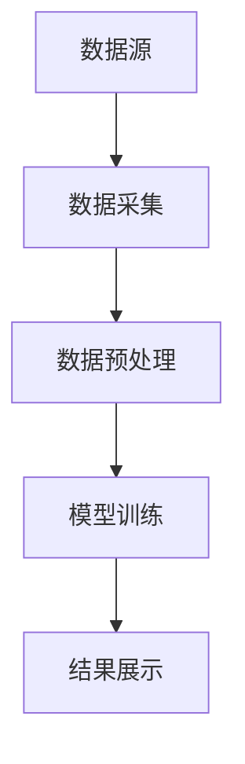
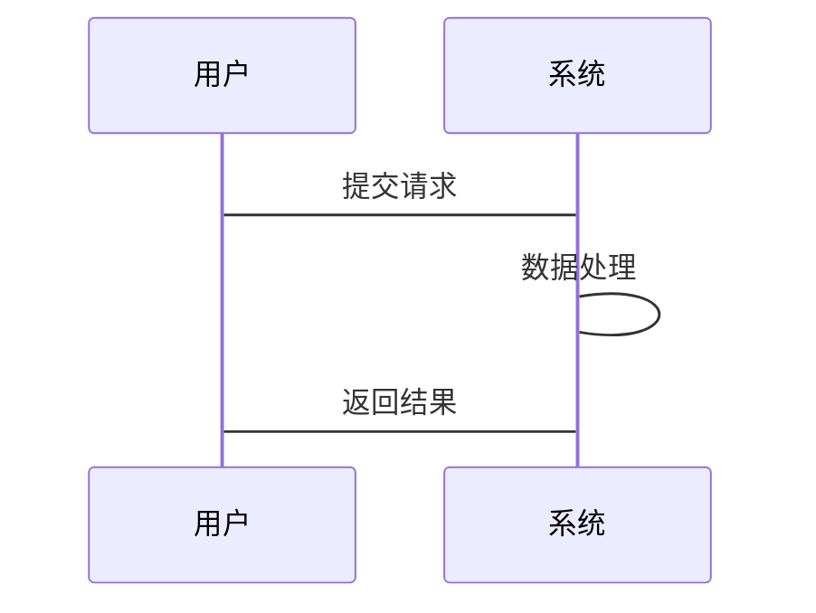

                 


# 构建客户洞察AI：深度分析与个性化服务实现

## 关键词：客户洞察AI, 个性化服务, 机器学习, 数据分析, 系统架构, 人工智能

## 摘要：  
随着人工智能技术的快速发展，客户洞察AI已经成为企业提升客户体验和业务效率的重要工具。本文将从客户洞察AI的核心概念、算法原理、系统架构到项目实战，全面解析如何通过深度分析实现个性化的客户服务。通过详细的技术分析和实际案例，本文旨在帮助读者掌握构建客户洞察AI系统的关键步骤和最佳实践。

---

## 第1章: 客户洞察AI的定义与背景

### 1.1 什么是客户洞察AI
客户洞察AI是一种利用人工智能技术对客户数据进行深度分析，提取有价值的信息，并基于这些信息提供个性化服务的技术。它通过整合结构化和非结构化数据，结合机器学习、自然语言处理和计算机视觉等技术，帮助企业更好地理解客户需求、行为和偏好。

### 1.2 客户洞察AI的背景与现状
随着大数据时代的到来，企业积累了大量的客户数据，但如何从海量数据中提取有用的信息成为一大挑战。客户洞察AI通过自动化分析和预测，帮助企业从数据中获取洞察，提升客户满意度和忠诚度。

### 1.3 客户洞察AI的价值与挑战
客户洞察AI的价值体现在提高客户满意度、优化营销策略、降低客户流失率等方面。然而，实施客户洞察AI也面临数据隐私、模型解释性、技术复杂性等挑战。

---

## 第2章: 客户数据的深度分析

### 2.1 客户数据的分类与特征
客户数据可以分为结构化数据（如年龄、性别）和非结构化数据（如文本、图像）。特征提取是数据分析的关键步骤，需要根据业务需求选择合适的特征。

### 2.2 客户行为分析与预测
通过分析客户的购买记录、浏览行为等数据，可以预测客户的下一步行为。常用算法包括决策树、随机森林和时间序列分析。

### 2.3 客户分群与画像
基于聚类算法将客户分为不同群体，并构建客户画像。画像可以帮助企业更好地理解客户群体的需求和偏好。

### 2.4 客户情感分析与反馈挖掘
情感分析可以帮助企业了解客户对产品或服务的满意度。基于深度学习的情感分析模型具有更高的准确性和鲁棒性。

---

## 第3章: 客户洞察AI的核心算法

### 3.1 监督学习算法
监督学习适用于分类和回归问题。例如，决策树和随机森林常用于客户分群，线性回归用于预测客户生命周期价值。

### 3.2 无监督学习算法
无监督学习适用于聚类和降维。K-means和DBSCAN常用于客户分群，主成分分析（PCA）用于数据降维。

### 3.3 深度学习算法
深度学习在自然语言处理和图像识别方面表现优异。例如，使用卷积神经网络（CNN）进行图像分析，使用循环神经网络（RNN）进行文本分析。

---

## 第4章: 客户洞察AI的系统架构设计

### 4.1 系统功能设计
客户洞察AI系统包括数据采集、数据预处理、模型训练、结果展示等功能模块。

### 4.2 系统架构图


### 4.3 接口设计
系统通过API接口与企业现有系统集成，例如与CRM系统对接，实现客户数据的实时更新和分析。

### 4.4 交互流程图


---

## 第5章: 项目实战

### 5.1 环境安装
需要安装Python、TensorFlow、Scikit-learn等工具。

### 5.2 核心代码实现
```python
# 数据预处理
import pandas as pd
df = pd.read_csv('data.csv')
df.dropna(inplace=True)

# 模型训练
from sklearn.model import DecisionTreeClassifier
model = DecisionTreeClassifier()
model.fit(X_train, y_train)

# 模型评估
from sklearn.metrics import accuracy_score
print(accuracy_score(y_test, model.predict(X_test)))
```

### 5.3 案例分析
以电商为例，通过分析客户的购买记录和浏览行为，预测客户的购买倾向，并提供个性化推荐。

---

## 第6章: 最佳实践与小结

### 6.1 小结
本文详细介绍了客户洞察AI的核心概念、算法原理和系统架构，并通过实际案例展示了如何将理论应用于实践。

### 6.2 注意事项
在实施客户洞察AI时，需要注意数据隐私、模型解释性和技术可行性。

### 6.3 拓展阅读
推荐阅读《机器学习实战》和《深度学习》等书籍，深入理解相关技术。

---

## 作者：AI天才研究院/AI Genius Institute & 禅与计算机程序设计艺术 /Zen And The Art of Computer Programming

---

**本文是基于“构建客户洞察AI：深度分析与个性化服务实现”的主题，系统地介绍了从理论到实践的全过程。通过详细的技术分析和实际案例，帮助读者掌握构建客户洞察AI系统的关键步骤和最佳实践。**

