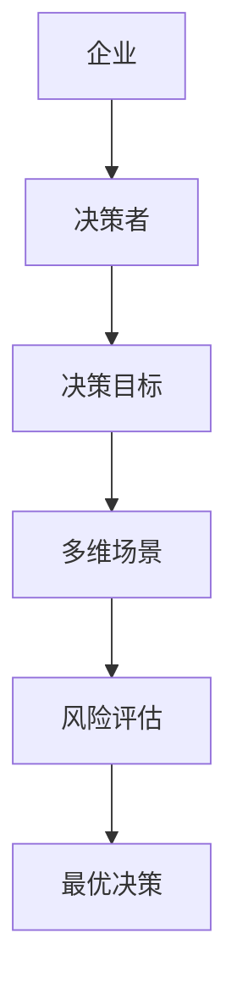
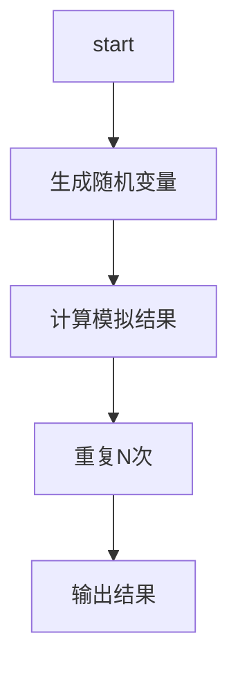
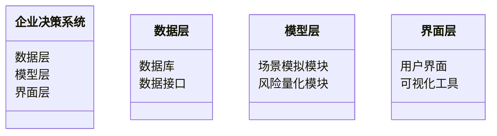
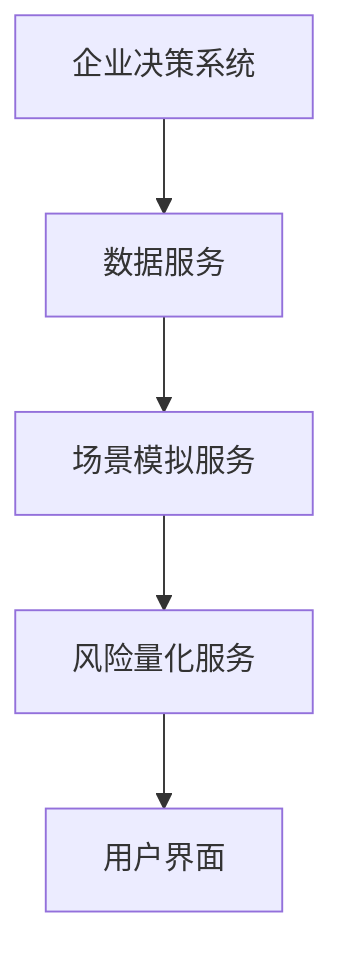
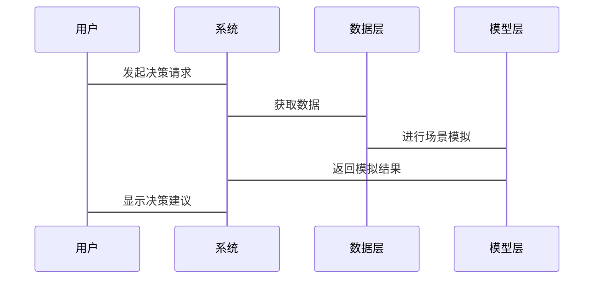

                 


# 构建智能企业决策支持系统：多维场景模拟与风险量化

## 关键词：智能决策支持系统、多维场景模拟、风险量化、算法原理、系统架构、项目实战

## 摘要：  
本文详细探讨了构建智能企业决策支持系统的多维场景模拟与风险量化方法。通过分析企业决策的核心问题，结合现代数据科学与人工智能技术，提出了基于多维场景模拟和风险量化模型的解决方案。文章内容涵盖了从理论基础到实际应用的完整流程，包括算法原理、系统架构设计、项目实战案例以及最佳实践建议，为读者提供了全面的技术指导和实践参考。

---

# 第1章：问题背景与描述

## 1.1 问题背景

### 1.1.1 传统企业决策的挑战
企业在面对复杂决策时，往往依赖经验判断和简单的数据分析，这种方式存在以下问题：
- **信息不完整**：难以覆盖所有可能的变量和场景。
- **决策低效**：人工分析耗时长，难以快速响应动态变化。
- **风险评估不足**：缺乏系统化的风险量化方法。

### 1.1.2 数据驱动决策的兴起
随着大数据技术的普及，企业开始利用数据进行决策支持，但仍然存在以下痛点：
- **数据孤岛**：各部门数据分散，难以整合。
- **分析深度不足**：缺乏对多维场景的模拟和预测。
- **风险量化不准确**：传统方法难以量化复杂场景下的风险。

### 1.1.3 智能决策支持系统的必要性
智能决策支持系统通过整合人工智能、大数据和数学建模技术，能够解决传统决策的痛点，为企业提供高效、精准的决策支持。

## 1.2 问题描述

### 1.2.1 企业决策支持的核心问题
企业在决策过程中需要解决以下核心问题：
1. 如何构建多维场景模拟模型，覆盖所有可能的业务场景？
2. 如何量化不同场景下的风险，并制定最优决策？

### 1.2.2 多维场景模拟的需求
多维场景模拟需要考虑以下因素：
- **变量多样性**：包括市场、成本、政策等多方面的变量。
- **场景复杂性**：需要模拟多种变量组合下的业务场景。
- **实时更新**：能够根据最新数据动态调整模拟结果。

### 1.2.3 风险量化的重要性
风险量化是企业决策的关键环节，主要包括：
- **风险识别**：识别潜在风险因素。
- **风险评估**：量化风险对决策目标的影响程度。
- **风险控制**：制定应对策略，降低风险影响。

## 1.3 问题解决

### 1.3.1 多维场景模拟的解决方案
通过构建多维场景模拟模型，利用蒙特卡洛模拟等方法，生成多种可能的业务场景，并分析其对决策结果的影响。

### 1.3.2 风险量化的方法
采用统计学方法和机器学习算法，对模拟结果进行风险评估和量化，如VaR（在险价值）和CVaR（预期短缺风险）。

### 1.3.3 智能决策支持系统的构建
整合多维场景模拟和风险量化技术，构建一个智能化的决策支持系统，为企业提供实时、动态的决策建议。

## 1.4 边界与外延

### 1.4.1 系统的边界
智能决策支持系统仅关注核心业务决策问题，不涉及企业的日常运营和管理。

### 1.4.2 相关领域的外延
- **数据科学**：数据收集、清洗和建模。
- **人工智能**：算法优化和自动化决策。
- **业务分析**：行业知识和业务规则的整合。

### 1.4.3 系统的适用范围与限制
- **适用范围**：适用于需要复杂决策的企业，如金融、制造和零售行业。
- **限制**：依赖高质量的数据和模型准确性，难以处理高度非线性问题。

## 1.5 核心要素组成

### 1.5.1 数据来源与处理
数据来源包括内部数据库、外部API和实时数据流，需要进行清洗、预处理和特征工程。

### 1.5.2 模型构建与优化
使用机器学习算法构建预测模型，并通过交叉验证和超参数优化提升模型性能。

### 1.5.3 可视化与人机交互
通过可视化工具展示模拟结果和风险评估，提供直观的决策支持界面。

---

# 第2章：核心概念与联系

## 2.1 核心概念原理

### 2.1.1 多维场景模拟的原理
多维场景模拟通过生成多个业务场景，分析每个场景下的决策结果，从而为企业提供全面的决策参考。

### 2.1.2 风险量化的核心方法
风险量化通过对模拟结果的统计分析，评估不同场景下的风险程度，并制定相应的风险控制策略。

### 2.1.3 智能决策支持系统的整合
智能决策支持系统将多维场景模拟和风险量化技术整合，形成一个完整的决策支持平台。

## 2.2 核心概念属性对比

| 对比维度 | 多维场景模拟 | 风险量化 |
|----------|--------------|----------|
| 目标     | 生成多种场景 | 评估风险 |
| 方法     | 蒙特卡洛模拟 | VaR、CVaR |
| 输出     | 模拟结果     | 风险值   |

## 2.3 ER实体关系图


---

# 第3章：算法原理

## 3.1 多维场景模拟算法

### 3.1.1 蒙特卡洛模拟
蒙特卡洛模拟是一种随机采样方法，用于生成多个可能的业务场景。

#### 算法流程


#### Python代码示例
```python
import numpy as np

def monte_carlo_simulation(n_runs, variables):
    results = []
    for _ in range(n_runs):
        # 生成随机变量
        random_vars = {var: np.random.rand() for var in variables}
        # 计算模拟结果
        result = calculate_result(random_vars)
        results.append(result)
    return results

def calculate_result(variables):
    # 示例计算逻辑
    return sum(variables.values())
```

## 3.2 风险量化模型

### 3.2.1 VaR模型
VaR（在险价值）是衡量投资组合在特定置信水平下的潜在损失。

#### 数学公式
$$ VaR(\alpha) = \min\{L_i | \sum_{i=1}^n I(L_i \leq L_{(i)}) = \alpha \} $$

### 3.2.2 CVaR模型
CVaR（条件在险价值）是VaR的补充，衡量在VaR水平下的平均损失。

#### 数学公式
$$ CVaR(\alpha) = \frac{1}{N} \sum_{i=1}^N L_i \cdot I(L_i \geq VaR(\alpha)) $$

---

# 第4章：数学模型

## 4.1 多维场景模拟的数学模型

### 4.1.1 场景生成模型
$$ S = \{s_1, s_2, ..., s_n\} $$

### 4.1.2 模拟结果计算
$$ R_i = f(s_i) $$

## 4.2 风险量化模型

### 4.2.1 VaR计算
$$ VaR(\alpha) = \text{quantile}(R, \alpha) $$

### 4.2.2 CVaR计算
$$ CVaR(\alpha) = \frac{1}{n} \sum_{i=1}^n R_i \cdot I(R_i \geq VaR(\alpha)) $$

---

# 第5章：系统架构设计

## 5.1 问题场景介绍
企业需要一个实时、动态的决策支持系统，能够处理多维场景模拟和风险量化。

## 5.2 系统功能设计

### 5.2.1 领域模型


## 5.3 系统架构设计

### 5.3.1 微服务架构


## 5.4 系统接口设计
- 数据接口：REST API，用于数据交互。
- 模拟接口：API Gateway，用于场景模拟请求。

## 5.5 系统交互流程

### 5.5.1 用户发起请求


---

# 第6章：项目实战

## 6.1 环境安装

### 6.1.1 安装Python和依赖库
```bash
pip install numpy matplotlib pandas scikit-learn
```

## 6.2 核心代码实现

### 6.2.1 场景模拟模块
```python
import numpy as np
import pandas as pd
from sklearn.ensemble import RandomForestRegressor

def generate_scenarios(n, variables):
    # 生成随机变量
    random_vars = pd.DataFrame(np.random.rand(n, len(variables)), columns=variables)
    # 计算模拟结果
    model = RandomForestRegressor()
    model.fit(random_vars, target_variable)
    results = model.predict(random_vars)
    return random_vars, results
```

### 6.2.2 风险量化模块
```python
def calculate VaR(sim_results, alpha=0.95):
    sorted_results = sorted(sim_results)
    VaR_value = sorted_results[int(alpha * len(sim_results))]
    return VaR_value
```

## 6.3 案例分析
### 6.3.1 案例背景
某金融企业需要评估不同市场波动下的投资组合风险。

### 6.3.2 数据分析与建模
使用历史数据训练随机森林模型，生成多维场景模拟结果。

### 6.3.3 结果展示与决策建议
通过VaR和CVaR分析，为企业提供风险控制建议。

## 6.4 项目小结
通过实战案例，验证了多维场景模拟和风险量化方法的有效性。

---

# 第7章：总结与扩展

## 7.1 最佳实践 tips
- 数据质量是关键，确保数据清洗和特征工程。
- 模型选择要根据实际问题，避免过度复杂。
- 结合业务知识，优化决策支持系统的实用性。

## 7.2 小结
本文详细介绍了构建智能企业决策支持系统的多维场景模拟与风险量化方法，通过理论分析和实战案例，为企业提供了一套完整的解决方案。

## 7.3 注意事项
- 数据隐私和安全问题需要重视。
- 系统性能优化是未来研究方向。
- 需要结合行业特点，定制化解决方案。

## 7.4 拓展阅读
建议读者深入学习以下内容：
- 蒙特卡洛模拟的高级方法。
- 风险量化中的其他模型（如Copula方法）。
- 机器学习在决策支持中的应用。

---

# 作者：AI天才研究院 & 禅与计算机程序设计艺术

