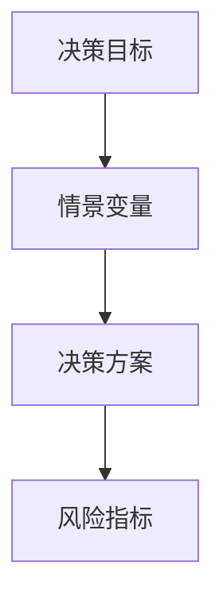
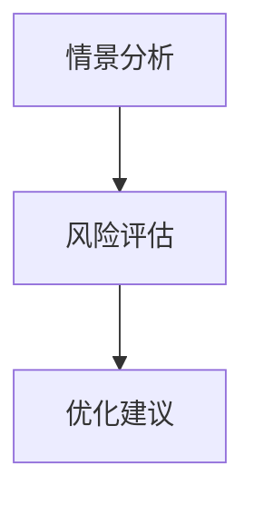

                 


# 构建智能企业决策模拟系统：多维度情景分析与风险评估

> 关键词：智能决策模拟系统，情景分析，风险评估，系统架构，算法原理

> 摘要：本文详细探讨了构建智能企业决策模拟系统的核心要素，包括多维度情景分析与风险评估的理论基础、算法实现、系统架构设计及实际应用案例。通过分析系统的功能模块、算法原理和架构设计，结合实际项目实战，为读者提供一套完整的构建方法论。

---

## 第一部分：智能企业决策模拟系统概述

### 第1章：问题背景与核心概念

#### 1.1 问题背景

在企业经营中，决策的复杂性日益增加。传统的决策方式依赖于经验判断和单维度分析，难以应对复杂多变的市场环境。智能企业决策模拟系统的出现，为企业的决策提供了更科学、更全面的支持。通过多维度的情景分析与风险评估，企业能够更准确地预测决策结果，并优化决策方案。

#### 1.2 核心概念

##### 1.2.1 智能企业决策模拟系统的定义
智能企业决策模拟系统是一种基于人工智能、大数据分析和模拟技术的企业决策支持系统。它通过构建数学模型，模拟不同决策方案在各种情景下的表现，帮助企业优化决策过程。

##### 1.2.2 多维度情景分析的内涵
多维度情景分析是指从多个维度（如市场、财务、运营等）对决策方案进行模拟，分析其在不同情景下的表现。这种分析方法能够帮助企业在复杂环境中找到最优解。

##### 1.2.3 风险评估的数学模型
风险评估是智能决策模拟系统的核心功能之一。通过数学模型，系统能够量化不同情景下的风险，并为企业提供风险规避建议。

#### 1.3 核心要素与系统架构

##### 1.3.1 系统核心要素对比表
| 核心要素 | 描述 | 示例 |
|----------|------|------|
| 决策目标 | 企业希望通过决策达到的目标 | 提高利润率 |
| 情景变量 | 影响决策结果的因素 | 市场需求、成本 |
| 决策方案 | 可选的决策方案 | 方案A、方案B |
| 风险指标 | 衡量风险的指标 | 概率、损失值 |

##### 1.3.2 ER实体关系图


---

### 第2章：核心概念与联系

#### 2.1 核心概念原理

##### 2.1.1 多维度情景分析的流程
1. 确定决策目标
2. 识别影响决策的情景变量
3. 枚举所有可能的决策方案
4. 对每个方案进行情景模拟
5. 分析结果并选择最优方案

##### 2.1.2 风险评估的数学模型
风险评估的核心是计算每个情景下决策方案的期望损失。公式如下：
$$
E[L] = \sum_{i=1}^{n} p_i \cdot L_i
$$
其中，$p_i$ 是情景$i$发生的概率，$L_i$ 是情景$i$下的损失。

##### 2.1.3 系统架构的模块化设计
智能决策模拟系统的架构通常包括以下几个模块：
- 数据采集模块：收集企业内外部数据
- 情景生成模块：生成多种决策情景
- 决策模拟模块：对每个情景下的决策方案进行模拟
- 风险评估模块：评估每个情景下的风险
- 优化建议模块：根据模拟结果提出优化建议

#### 2.2 情景分析与风险评估的联系

##### 2.2.1 情景分析的步骤
1. 确定情景变量
2. 枚举所有可能的情景
3. 对每个情景进行分析
4. 综合所有情景的结果

##### 2.2.2 风险评估的指标
- 概率：情景发生的可能性
- 影响度：情景对企业的影响程度
- 综合风险值：概率 × 影响度

##### 2.2.3 系统架构的实体关系图


---

### 第3章：算法原理与数学模型

#### 3.1 算法原理

##### 3.1.1 蒙特卡洛模拟算法
蒙特卡洛模拟是一种通过随机采样来估计系统行为的方法。它适用于复杂系统的模拟，特别是当系统的行为难以用解析方法描述时。

##### 3.1.2 决策树算法
决策树是一种用于决策分析的树状图，通过概率和收益的计算来选择最优决策路径。

##### 3.1.3 风险评估的数学模型
$$
R = \sum_{i=1}^{n} p_i \cdot L_i
$$
其中，$R$ 是风险值，$p_i$ 是情景$i$发生的概率，$L_i$ 是情景$i$下的损失。

#### 3.2 算法实现

##### 3.2.1 蒙特卡洛模拟的Python代码
```python
import random

def monte_carlo_simulation(n):
    count = 0
    for _ in range(n):
        if random.random() < 0.5:
            count += 1
    return count / n

print(monte_carlo_simulation(1000))
```

---

### 第4章：系统分析与架构设计

#### 4.1 问题场景介绍

##### 4.1.1 企业决策的复杂性
企业在决策时需要考虑的因素包括市场需求、成本、竞争环境等。

##### 4.1.2 系统功能设计
系统需要实现以下功能：
- 数据采集与预处理
- 情景生成
- 决策模拟
- 风险评估
- 优化建议

##### 4.1.3 系统架构设计
系统架构通常包括以下几个部分：
- 数据层：存储企业数据
- 业务逻辑层：实现情景生成和决策模拟
- 用户界面层：展示模拟结果和优化建议

---

## 第五部分：项目实战

### 第5章：环境安装与系统实现

#### 5.1 环境安装
- 安装Python和相关库（如numpy、pandas、matplotlib）

#### 5.2 系统核心实现
```python
import numpy as np
import pandas as pd
import matplotlib.pyplot as plt

def simulate_scenario(data):
    # 数据处理
    # 情景模拟
    pass

def main():
    data = pd.read_csv('input.csv')
    result = simulate_scenario(data)
    plt.plot(result)
    plt.show()

if __name__ == '__main__':
    main()
```

---

## 第六部分：最佳实践

### 第6章：小结与注意事项

#### 6.1 小结
通过本文的介绍，读者可以了解智能企业决策模拟系统的核心要素和实现方法。从情景分析到风险评估，再到系统架构设计，每个环节都需要仔细考虑。

#### 6.2 注意事项
- 数据的准确性和完整性是系统的核心
- 算法的选择需要根据具体问题而定
- 系统的可扩展性和可维护性需要在设计阶段考虑

#### 6.3 拓展阅读
- 《决策理论与分析》
- 《人工智能与机器学习实战》
- 《系统架构设计的艺术》

---

作者：AI天才研究院/AI Genius Institute & 禅与计算机程序设计艺术 /Zen And The Art of Computer Programming

