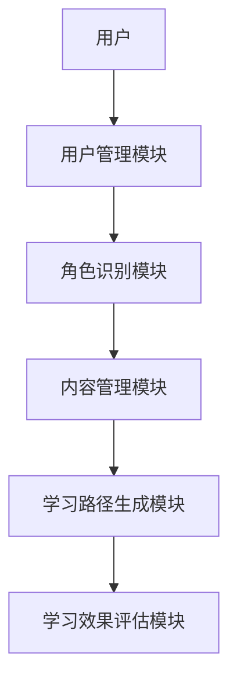

                 


# 构建智能企业合规培训系统：基于角色的个性化学习内容生成

## 关键词：企业合规培训、人工智能、个性化学习、推荐算法、系统架构

## 摘要：  
随着企业合规培训需求的不断增长，传统的培训方式逐渐暴露出效率低下、内容单一等问题。本文提出了一种基于角色的个性化学习内容生成系统，结合人工智能技术，能够根据不同角色的员工需求定制专属的学习内容，从而提升培训效果和员工满意度。文章详细分析了系统的构建过程，包括背景分析、核心算法、系统架构设计以及实际应用案例，为企业的智能化培训提供了一种全新的解决方案。

---

# 第一部分: 背景介绍与问题分析

## 第1章: 企业合规培训的现状与挑战

### 1.1 企业合规培训的现状
#### 1.1.1 传统企业合规培训的模式与特点
传统的企业合规培训通常采用统一的课程内容，适用于所有员工，但这种方式存在以下问题：
- **内容单一**：同一课程可能无法满足不同岗位员工的需求。
- **效率低下**：员工对不相关的内容缺乏兴趣，学习效率低下。
- **缺乏互动**：传统培训方式多为单向传授，缺乏互动性和个性化指导。

#### 1.1.2 当前企业合规培训的主要问题
- **员工参与度低**：由于内容与实际工作需求不符，员工对培训的积极性不高。
- **培训成本高**：需要大量的人力和时间来设计和执行培训计划。
- **难以量化效果**：难以准确评估员工的学习效果和知识掌握程度。

#### 1.1.3 企业合规培训的痛点与需求
随着企业对合规性要求的不断提高，员工需要快速掌握与自身岗位相关的知识。因此，企业需要一种能够根据员工角色定制学习内容的智能系统。

---

## 第2章: 智能化企业合规培训的必要性

### 2.1 人工智能技术在企业培训中的应用趋势
人工智能技术（如机器学习、自然语言处理）为企业合规培训提供了新的可能性，包括：
- **自动化内容生成**：通过算法自动生成适合不同角色的学习内容。
- **个性化推荐**：基于员工的学习行为和需求，推荐相关课程。
- **实时反馈**：通过数据分析，实时评估员工的学习效果并提供反馈。

### 2.2 基于角色的个性化学习的重要性
- **角色识别**：通过分析员工的岗位职责，确定其角色。
- **个性化内容生成**：根据角色特点生成定制化学习内容。
- **动态调整**：根据员工的学习进度和反馈，动态调整学习计划。

### 2.3 智能企业合规培训系统的建设目标
- **提高培训效率**：通过智能化推荐减少无效学习。
- **提升员工满意度**：提供个性化学习体验，增强员工参与度。
- **量化学习效果**：通过数据采集和分析，准确评估员工的学习成果。

---

# 第二部分: 核心概念与理论基础

## 第3章: 智能企业合规培训系统的定义与特点

### 3.1 智能企业合规培训系统的定义
智能企业合规培训系统是一种基于人工智能技术的培训管理平台，能够根据员工的角色和需求，自动生成和推荐个性化学习内容。

### 3.2 系统的主要功能模块
- **用户管理**：包括员工信息录入和角色识别。
- **内容管理**：存储和管理合规培训相关内容。
- **学习路径生成**：根据员工角色生成个性化学习计划。
- **学习效果评估**：通过测试和反馈评估员工的学习成果。

### 3.3 系统的特点
- **智能化**：利用机器学习算法实现内容推荐和效果评估。
- **个性化**：根据不同角色生成专属学习内容。
- **动态调整**：根据反馈实时优化学习计划。

---

## 第4章: 基于角色的个性化学习模型

### 4.1 角色识别与分类
- **角色识别**：通过分析员工的岗位职责和工作内容，确定其角色。
- **角色分类**：将员工分为不同的角色类别（如管理层、技术岗位等）。

### 4.2 个性化学习内容生成的原理
- **内容特征提取**：提取合规培训内容的关键知识点。
- **角色特征匹配**：根据角色特点匹配相关内容。
- **内容推荐算法**：基于角色特征和内容特征，生成个性化推荐列表。

---

# 第三部分: 算法原理与数学模型

## 第5章: 基于角色的推荐算法

### 5.1 推荐算法的核心原理
推荐算法是个性化学习内容生成的核心技术之一，常用的推荐算法包括：
- **协同过滤**：基于用户行为相似性推荐内容。
- **基于内容的推荐**：基于内容特征相似性推荐内容。
- **深度学习推荐**：利用神经网络模型推荐内容。

### 5.2 基于角色的推荐模型构建
- **角色特征表示**：将角色特征转化为向量形式。
- **内容特征表示**：将内容特征转化为向量形式。
- **推荐评分计算**：通过向量点积计算推荐评分。

---

## 第6章: 算法实现与优化

### 6.1 算法实现流程
1. **数据预处理**：清洗和标注数据。
2. **模型训练**：训练推荐算法模型。
3. **内容推荐**：基于模型生成个性化推荐列表。

### 6.2 算法优化
- **特征选择**：选择对推荐效果影响最大的特征。
- **模型调优**：通过参数调整提高推荐准确率。

---

# 第四部分: 系统分析与架构设计

## 第7章: 系统功能设计

### 7.1 功能模块划分
- **用户管理模块**：负责用户信息的录入和管理。
- **内容管理模块**：负责合规培训内容的存储和管理。
- **学习路径生成模块**：根据用户角色生成个性化学习计划。
- **学习效果评估模块**：评估用户的学习成果。

### 7.2 功能模块交互流程
1. 用户登录系统。
2. 系统根据用户角色生成个性化学习计划。
3. 用户完成学习任务。
4. 系统评估学习效果并提供反馈。

---

## 第8章: 系统架构设计

### 8.1 系统架构图


### 8.2 系统模块交互设计
- **用户管理模块**：负责用户信息的录入和管理。
- **角色识别模块**：根据用户信息确定其角色。
- **内容管理模块**：存储和管理合规培训内容。
- **学习路径生成模块**：根据角色生成个性化学习计划。
- **学习效果评估模块**：评估用户的学习成果并提供反馈。

---

# 第五部分: 项目实战

## 第9章: 项目实施与代码实现

### 9.1 项目环境搭建
- **Python版本**：Python 3.8+
- **依赖库安装**：`numpy`, `scikit-learn`, `pandas`

### 9.2 核心代码实现
```python
import numpy as np
from sklearn.metrics.pairwise import cosine_similarity

# 示例：基于内容的推荐算法
def content_based_recommendation(user_role, content_features):
    user_vector = content_features[user_role]
    similarity_matrix = cosine_similarity(content_features)
   推荐结果 = similarity_matrix.dot(user_vector)
    return 推荐结果.argsort()[::-1]
```

### 9.3 代码解读与分析
- **用户角色匹配**：根据用户角色匹配相关内容特征。
- **相似度计算**：通过余弦相似度计算内容与用户角色的匹配度。
- **推荐结果生成**：根据相似度排序生成推荐列表。

---

## 第10章: 实际案例分析

### 10.1 案例背景
某企业希望为管理层和基层员工提供不同的合规培训内容。

### 10.2 案例分析
- **管理层**：推荐企业战略、合规政策等内容。
- **基层员工**：推荐操作规范、合规流程等内容。

### 10.3 案例结果
- **管理层**：学习内容与实际工作高度相关，员工满意度提高。
- **基层员工**：学习效率提升，合规意识增强。

---

# 第六部分: 最佳实践与总结

## 第11章: 最佳实践与注意事项

### 11.1 项目实施中的注意事项
- **数据质量**：确保数据的准确性和完整性。
- **模型调优**：根据实际效果不断优化推荐算法。
- **系统安全性**：确保用户数据的安全性和隐私保护。

### 11.2 小结
本文详细介绍了智能企业合规培训系统的构建过程，包括背景分析、算法原理、系统架构设计以及实际应用案例。通过基于角色的个性化学习内容生成，企业能够显著提升培训效率和员工满意度。

---

## 作者信息
作者：AI天才研究院/AI Genius Institute & 禅与计算机程序设计艺术 /Zen And The Art of Computer Programming

