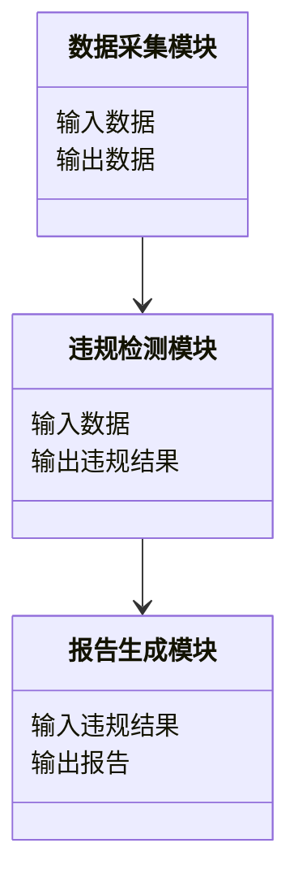
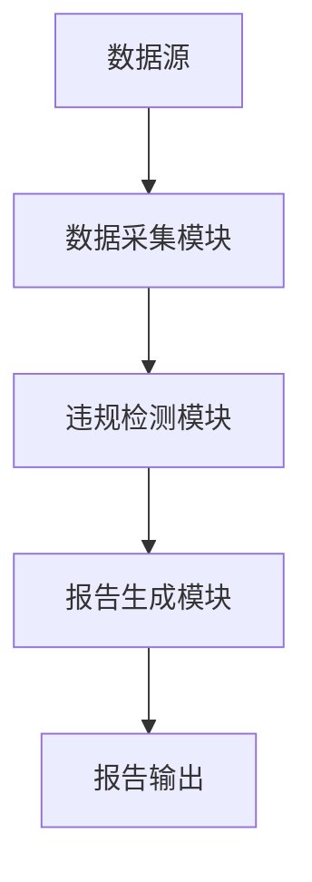

                 


# 构建智能企业合规监控系统：实时违规检测与自动报告生成

> **关键词**：企业合规监控、实时违规检测、自动报告生成、AI技术应用、系统架构设计、NLP技术  
> 
> **摘要**：随着企业数字化转型的深入，合规监控变得越来越复杂和重要。本文详细探讨了如何利用人工智能技术构建智能企业合规监控系统，实现实时违规检测与自动报告生成。文章从系统背景、核心概念、算法原理、系统架构到项目实战，全面阐述了构建智能合规监控系统的关键步骤和方法。通过实际案例分析和代码实现，为读者提供了一套完整的解决方案。

---

## 第1章: 合规监控的背景与挑战

### 1.1 企业合规监控的重要性

#### 1.1.1 合规监控的定义与范围

合规监控是指通过技术手段对企业行为、数据或操作进行实时监督，确保其符合相关法律法规、行业标准或企业内部政策。其范围涵盖数据安全、反欺诈、反腐败、知识产权保护等多个领域。

#### 1.1.2 企业合规监控的核心目标

- **数据完整性**：确保数据的真实性和准确性。
- **行为合规性**：识别和阻止违规行为。
- **风险控制**：及时发现潜在风险，降低企业损失。

#### 1.1.3 数字化合规监控的必要性

随着企业数字化转型的深入，数据量急剧增加，传统的人工监控方式已无法满足实时性和高效性的要求。数字化合规监控通过AI技术实现自动化、智能化监控，大幅提高了监控效率和准确性。

---

### 1.2 实时违规检测的背景

#### 1.2.1 违规行为对企业的影响

违规行为可能导致企业面临法律处罚、声誉损失和经济损失。例如，数据泄露可能导致用户信息泄露，企业可能面临巨额罚款和用户信任的丧失。

#### 1.2.2 传统合规监控的局限性

- **效率低下**：人工监控需要大量时间，且容易出错。
- **覆盖面有限**：传统方法难以覆盖所有可能的违规场景。
- **响应延迟**：无法实现实时监控，导致违规行为可能扩大。

#### 1.2.3 AI技术在合规监控中的应用潜力

AI技术可以通过机器学习、自然语言处理（NLP）和时间序列分析等方法，实现对海量数据的实时分析和违规行为的精准识别。

---

### 1.3 自动报告生成的需求

#### 1.3.1 手动报告的低效性

手动报告需要大量人工劳动，且容易出现遗漏和错误。同时，不同报告格式和内容的不一致可能导致解读困难。

#### 1.3.2 自动化报告的优势

自动化报告可以快速生成标准化的报告内容，减少人工干预，提高报告的准确性和一致性。

#### 1.3.3 报告生成的标准化要求

报告内容需要符合行业标准和企业内部规范，确保报告的可读性和可操作性。

---

## 第2章: 智能合规监控系统的核心概念

### 2.1 智能合规监控系统的定义

#### 2.1.1 系统的核心目标

智能合规监控系统的目的是通过AI技术实现对企业行为的实时监控和违规行为的自动检测，并生成标准化的报告。

#### 2.1.2 系统的主要功能模块

- **数据采集模块**：从企业系统中采集相关数据。
- **违规检测模块**：利用AI算法检测违规行为。
- **报告生成模块**：根据检测结果生成标准化报告。
- **反馈模块**：将报告反馈给相关部门，进行后续处理。

#### 2.1.3 系统的适用场景

智能合规监控系统适用于多个领域，包括金融、医疗、政府、教育等，特别适用于需要实时监控的场景，如交易监控、数据安全监控等。

---

### 2.2 实时违规检测的原理

#### 2.2.1 数据采集与预处理

数据采集是合规监控的第一步，需要从企业系统中获取相关数据，如交易记录、日志数据等。预处理包括数据清洗、标准化等步骤。

#### 2.2.2 违规行为的特征提取

通过特征提取，将数据转化为可以用于模型训练的特征向量。例如，从交易记录中提取金额、时间、交易地点等特征。

#### 2.2.3 违规检测算法的选择与优化

选择合适的算法是实现高效违规检测的关键。常见的算法包括基于规则的检测、基于统计的检测和基于机器学习的检测。

---

### 2.3 自动报告生成的流程

#### 2.3.1 报告内容的结构化设计

报告内容需要结构化，例如分为概述、违规行为描述、建议措施等部分。

#### 2.3.2 报告生成的模板化管理

通过模板化管理，可以快速生成标准化的报告内容，减少人工干预。

#### 2.3.3 报告输出的格式与渠道

报告可以以PDF、Excel、邮件等多种形式输出，确保相关人员能够及时获取信息。

---

## 第3章: 实时违规检测算法

### 3.1 基于序列标注的违规检测

#### 3.1.1 序列标注模型的原理

序列标注模型（如CRF、LSTM）通过分析时间序列数据中的模式，识别异常行为。

#### 3.1.2 常用算法（如CRF、LSTM等）的优缺点

- **CRF**：适用于短文本分析，效果稳定。
- **LSTM**：适用于长文本分析，能够捕捉长距离依赖关系。

#### 3.1.3 实际案例中的算法选择

在金融交易监控中，LSTM模型更适合分析时间序列数据中的异常行为。

---

### 3.2 自然语言处理在违规检测中的应用

#### 3.2.1 NLP技术在文本分析中的作用

NLP技术可以帮助分析文本数据，识别潜在的违规信息。

#### 3.2.2 基于BERT的文本表示方法

BERT通过预训练模型生成高质量的文本表示，能够有效捕捉上下文信息。

#### 3.2.3 实例分析：合同文本中的违规条款检测

通过NLP技术，可以自动识别合同中的违规条款，如霸王条款、不公平条款等。

---

### 3.3 时间序列分析在行为监控中的应用

#### 3.3.1 时间序列分析的基本原理

时间序列分析通过分析数据的时间特性，识别异常点。

#### 3.3.2 基于ARIMA的异常检测

ARIMA模型适用于平稳时间序列数据的预测和异常检测。

#### 3.3.3 基于LSTM的时间序列预测

LSTM模型在处理非平稳时间序列数据时表现更优。

---

## 第4章: 自动报告生成的算法

### 4.1 基于模板的报告生成

#### 4.1.1 模板化报告生成的原理

通过模板化管理，将报告内容分为多个部分，每个部分对应不同的模板。

#### 4.1.2 模板化报告生成的优势

- **高效性**：快速生成标准化报告。
- **一致性**：确保报告格式和内容的一致性。

#### 4.1.3 模板化报告生成的实现步骤

1. 设计报告模板。
2. 将模板与检测结果结合，生成报告内容。
3. 输出报告。

---

## 第5章: 数学模型与算法实现

### 5.1 基于序列标注的违规检测模型

#### 5.1.1 模型的数学表达

序列标注模型的损失函数可以表示为：

$$ L = \sum_{i=1}^{n} \sum_{j=1}^{m} w_{i,j} y_{i,j} $$

其中，$w_{i,j}$ 是权重矩阵，$y_{i,j}$ 是标签。

#### 5.1.2 模型的优化过程

通过反向传播算法（如CRF）优化模型参数，降低损失函数值。

---

## 第6章: 系统分析与架构设计

### 6.1 系统功能设计

#### 6.1.1 领域模型图



---

### 6.2 系统架构设计

#### 6.2.1 系统架构图



---

## 第7章: 项目实战

### 7.1 环境搭建

#### 7.1.1 Python环境安装

安装Python和相关库（如TensorFlow、Keras、NLTK）。

#### 7.1.2 数据采集模块实现

编写代码从数据库中采集数据。

```python
import pandas as pd

# 数据采集模块
def fetch_data():
    data = pd.read_sql("SELECT * FROM transactions", conn)
    return data
```

---

### 7.2 核心代码实现

#### 7.2.1 违规检测模块实现

使用机器学习模型实现违规检测。

```python
from sklearn import linear_model

# 示例违规检测代码
def detect_fraud(transactions):
    model = linear_model.LogisticRegression()
    model.fit(transactions[['amount', 'time']], transactions['is_fraud'])
    return model.predict(transactions[['amount', 'time']])
```

---

## 第8章: 总结与展望

### 8.1 总结

本文详细探讨了构建智能企业合规监控系统的关键技术，包括实时违规检测和自动报告生成的实现方法。通过AI技术的应用，企业可以显著提高合规监控的效率和准确性。

### 8.2 展望

未来，随着AI技术的不断发展，合规监控系统将更加智能化和自动化。例如，结合区块链技术可以实现更加安全和透明的合规监控。

---

**作者：AI天才研究院/AI Genius Institute & 禅与计算机程序设计艺术 /Zen And The Art of Computer Programming**

