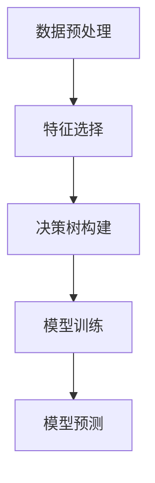
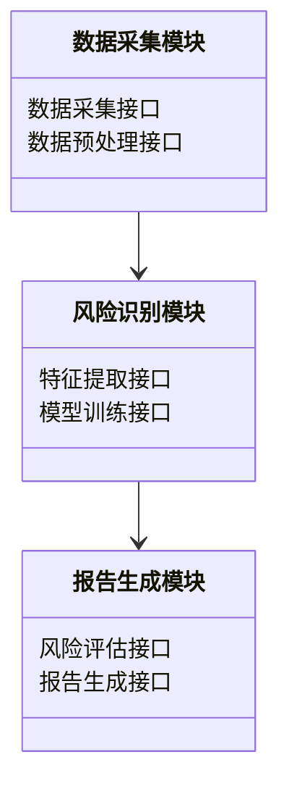
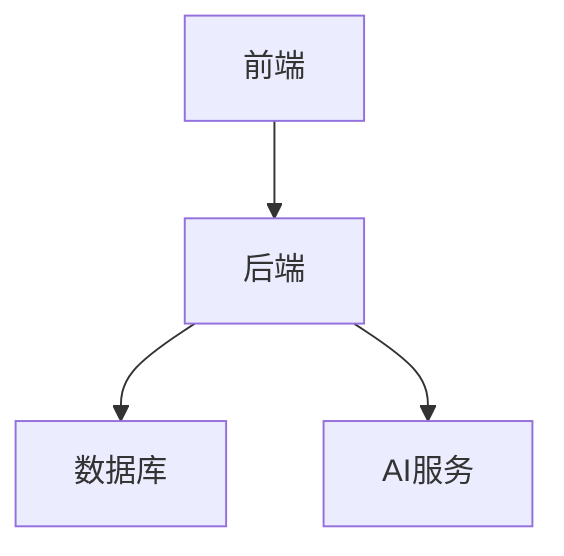
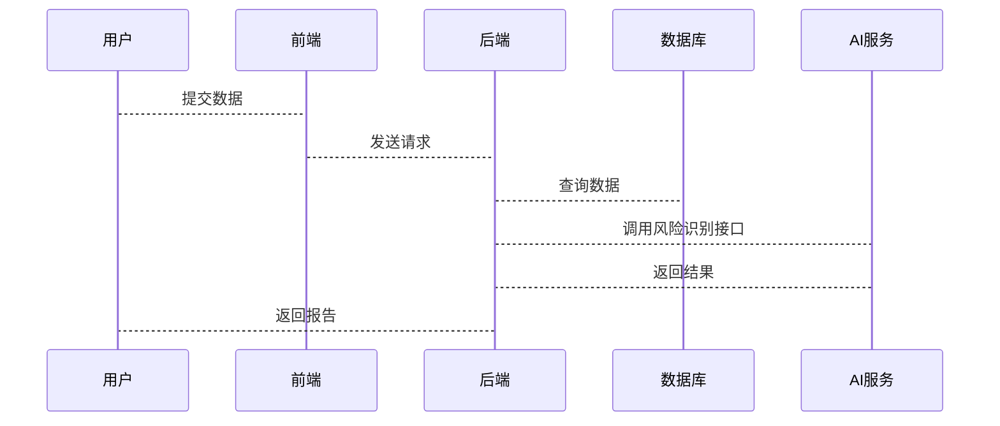

                 


# 构建智能企业合规管理平台：AI辅助风险识别

## 关键词：企业合规管理，AI辅助，风险识别，智能平台，系统架构

## 摘要：  
随着企业规模的不断扩大和业务的复杂化，合规管理变得日益重要。传统的合规管理方式依赖人工审核和经验判断，效率低下且容易出错。本文将探讨如何利用人工智能技术构建智能企业合规管理平台，通过AI辅助风险识别，提高合规管理的效率和准确性。本文将从背景、核心概念、算法原理、系统架构、项目实战到最佳实践，全面解析智能企业合规管理平台的构建过程。

---

# 第1章: 企业合规管理与AI辅助风险识别的背景

## 1.1 企业合规管理的基本概念  
### 1.1.1 合规管理的定义与范围  
合规管理是指企业在经营活动中遵守相关法律法规、行业标准和企业内部规章制度的管理活动。其范围包括但不限于财务合规、税务合规、数据合规、反腐败合规等。  

### 1.1.2 企业合规管理的重要性  
合规管理是企业合法经营的基础，直接关系到企业的生存和发展。合规管理可以帮助企业避免法律风险、提升企业形象、降低运营成本。  

### 1.1.3 企业合规管理的挑战与痛点  
- 数据量大，人工审核效率低  
- 合规规则复杂，难以快速适应变化  
- 风险识别不精准，容易遗漏关键问题  

## 1.2 AI技术在企业合规管理中的应用  
### 1.2.1 AI技术的基本概念与特点  
人工智能（AI）是指模拟人类智能的计算机系统，具有学习、推理、识别和决策的能力。  

### 1.2.2 AI在风险识别中的优势  
- 高效性：AI能够快速处理大量数据，识别潜在风险  
- 准确性：AI通过机器学习算法，能够发现复杂模式和关联性  
- 实时性：AI可以实时监控数据，及时发出风险预警  

### 1.2.3 AI辅助合规管理的潜力与前景  
通过AI技术，企业可以实现合规管理的自动化、智能化，显著提升合规管理的效率和效果。  

## 1.3 智能企业合规管理平台的构建意义  
### 1.3.1 提高合规管理效率  
通过AI技术，企业可以快速完成合规检查，减少人工干预。  

### 1.3.2 降低合规风险  
AI能够精准识别潜在风险，帮助企业提前采取措施，避免合规失败。  

### 1.3.3 企业数字化转型的必然趋势  
随着数字化转型的推进，企业需要更加智能化的工具来应对复杂的合规要求。  

## 1.4 本章小结  
本章介绍了企业合规管理的基本概念、挑战以及AI技术在其中的应用优势，为后续章节的展开奠定了基础。  

---

# 第2章: 智能企业合规管理平台的核心概念与技术原理

## 2.1 企业合规管理平台的功能模块  
### 2.1.1 数据采集与处理模块  
平台需要从企业内外部数据源采集数据，包括财务数据、业务数据、法律法规数据等，并进行清洗和预处理。  

### 2.1.2 风险识别与评估模块  
通过AI算法，对采集的数据进行分析，识别潜在风险，并评估风险的严重性。  

### 2.1.3 合规规则与策略模块  
平台需要根据企业内部和外部的合规要求，制定合规规则和策略，并动态调整。  

### 2.1.4 报告生成与分析模块  
平台可以自动生成合规报告，包括风险清单、问题分析和改进建议。  

## 2.2 AI辅助风险识别的原理  
### 2.2.1 数据预处理与特征提取  
在AI辅助风险识别之前，需要对数据进行清洗、归一化和特征提取。  

### 2.2.2 风险识别算法的选择与应用  
常用的算法包括决策树、随机森林、支持向量机（SVM）等。  

### 2.2.3 结果解释与反馈优化  
通过模型解释技术（如SHAP值），帮助用户理解AI的决策过程，并根据反馈优化模型。  

## 2.3 平台架构的核心要素  
### 2.3.1 前端架构设计  
前端需要提供友好的用户界面，方便用户操作和查看结果。  

### 2.3.2 后端架构设计  
后端负责接收前端请求，处理数据并返回结果，通常采用微服务架构。  

### 2.3.3 数据存储与管理  
数据需要存储在数据库中，支持高效的查询和分析。  

## 2.4 核心概念对比分析  
### 2.4.1 合规管理与风险管理的对比  
| 项目 | 合规管理 | 风险管理 |  
|------|----------|----------|  
| 目标 | 符合法规 | 减少损失 |  
| 方法 | 文本审核 | 数据分析 |  

### 2.4.2 AI辅助与传统合规管理的对比  
| 项目 | 传统合规管理 | AI辅助合规管理 |  
|------|---------------|---------------|  
| 效率 | 低效 | 高效 |  
| 准确性 | 易错 | 高 |  

### 2.4.3 平台功能与传统工具的对比  
| 项目 | 传统工具 | 平台工具 |  
|------|------------|------------|  
| 功能 | 单一功能 | 多功能集成 |  
| 灵活性 | 低 | 高 |  

## 2.5 本章小结  
本章详细介绍了智能企业合规管理平台的功能模块、AI辅助风险识别的原理以及平台架构的核心要素，并通过对比分析突出了AI技术的优势。  

---

# 第3章: AI辅助风险识别的算法原理与实现

## 3.1 常见的AI算法及其特点  
### 3.1.1 机器学习算法  
- **监督学习**：如决策树、随机森林、SVM等，适用于分类和回归问题。  
- **无监督学习**：如聚类、主题模型，适用于数据挖掘和模式识别。  

### 3.1.2 深度学习算法  
- **神经网络**：如卷积神经网络（CNN）、循环神经网络（RNN），适用于复杂模式识别。  

### 3.1.3 自然语言处理算法  
- **词嵌入**：如Word2Vec、GloVe，适用于文本数据的特征提取。  

## 3.2 风险识别的分类算法  
### 3.2.1 监督学习分类算法  
- **决策树**：通过特征分裂构建树状结构，实现分类。  
- **随机森林**：通过集成多个决策树，提高准确性和鲁棒性。  

### 3.2.2 非监督学习分类算法  
- **聚类分析**：将数据分成若干类别，适用于无标签数据。  

### 3.2.3 半监督学习分类算法  
- **半监督学习**：结合少量标签数据和大量无标签数据，适用于数据标注成本高的场景。  

## 3.3 基于决策树的分类算法实现  
### 3.3.1 决策树算法流程  


### 3.3.2 决策树算法的Python实现  
```python
from sklearn.tree import DecisionTreeClassifier
from sklearn.model_selection import train_test_split
from sklearn.metrics import accuracy_score

# 数据预处理
X = ...  # 特征矩阵
y = ...  # 标签向量

# 划分训练集和测试集
X_train, X_test, y_train, y_test = train_test_split(X, y, test_size=0.2)

# 模型训练
clf = DecisionTreeClassifier()
clf.fit(X_train, y_train)

# 模型预测
y_pred = clf.predict(X_test)

# 准确率计算
print("Accuracy:", accuracy_score(y_test, y_pred))
```

### 3.3.3 决策树算法的数学模型  
决策树的分割依据通常是信息增益或信息熵。信息增益的计算公式为：  
$$ \text{信息增益} = \text{熵}(S) - \text{期望熵}(S, a) $$  

### 3.3.4 优缺点分析  
- **优点**：易于解释，适合小规模数据。  
- **缺点**：对噪声数据敏感，容易过拟合。  

## 3.4 本章小结  
本章通过具体实现和案例分析，详细讲解了AI辅助风险识别的算法原理，尤其是决策树算法的应用。  

---

# 第4章: 智能企业合规管理平台的系统架构与设计

## 4.1 系统功能设计  
### 4.1.1 领域模型设计  


### 4.1.2 系统功能模块  
- **数据采集模块**：负责从企业内外部数据源采集数据。  
- **风险识别模块**：对数据进行特征提取和模型训练，识别潜在风险。  
- **报告生成模块**：根据识别结果生成合规报告。  

## 4.2 系统架构设计  
### 4.2.1 整体架构设计  


### 4.2.2 接口设计  
- **前端接口**：提供用户交互界面，接收用户请求。  
- **后端接口**：处理前端请求，调用AI服务进行分析。  
- **AI服务接口**：提供风险识别服务，返回结果。  

## 4.3 系统交互设计  


## 4.4 本章小结  
本章详细设计了智能企业合规管理平台的系统架构，包括功能模块、整体架构、接口设计和系统交互流程。  

---

# 第5章: 智能企业合规管理平台的项目实战

## 5.1 项目环境安装  
### 5.1.1 安装Python和相关库  
```bash
pip install numpy pandas scikit-learn
```

### 5.1.2 安装Jupyter Notebook  
```bash
pip install jupyter
```

## 5.2 核心代码实现  
### 5.2.1 数据采集与预处理  
```python
import pandas as pd

# 数据加载
data = pd.read_csv('data.csv')

# 数据清洗
data.dropna(inplace=True)
data = pd.get_dummies(data)
```

### 5.2.2 风险识别模型训练  
```python
from sklearn.ensemble import RandomForestClassifier

# 模型训练
model = RandomForestClassifier()
model.fit(X_train, y_train)
```

### 5.2.3 模型评估  
```python
from sklearn.metrics import classification_report

# 模型预测
y_pred = model.predict(X_test)

# 模型评估
print(classification_report(y_test, y_pred))
```

## 5.3 项目实战案例分析  
### 5.3.1 案例背景  
假设某企业需要检测其财务数据中的异常交易，可能存在虚开发票的风险。  

### 5.3.2 数据分析与结果解读  
通过AI模型识别出异常交易，并生成风险报告，帮助企业及时采取措施。  

### 5.3.3 案例总结  
通过AI辅助，企业能够快速、准确地识别合规风险，显著提升合规管理效率。  

## 5.4 本章小结  
本章通过实际项目案例，详细展示了智能企业合规管理平台的核心代码实现和应用效果。  

---

# 第6章: 智能企业合规管理平台的最佳实践与优化

## 6.1 最佳实践  
### 6.1.1 数据质量管理  
确保数据的完整性、准确性和一致性。  

### 6.1.2 模型优化  
通过参数调优和模型集成，提高AI模型的准确性和鲁棒性。  

### 6.1.3 系统安全与合规  
确保平台本身符合相关法律法规，保障数据安全。  

## 6.2 小结  
构建智能企业合规管理平台需要结合AI技术，通过合理的系统设计和优化，才能真正实现合规管理的智能化和高效化。  

## 6.3 注意事项  
- 数据隐私保护是重中之重，必须符合相关法律法规。  
- 模型的可解释性是用户信任的基础，需要重点关注。  

## 6.4 拓展阅读  
- 《机器学习实战》  
- 《深度学习》  
- 《企业合规管理指南》  

---

# 作者：AI天才研究院 & 禅与计算机程序设计艺术

---

通过以上目录和内容设计，本文系统地介绍了智能企业合规管理平台的构建过程，从背景到技术实现，再到实际应用，为读者提供了全面的指导和参考。

