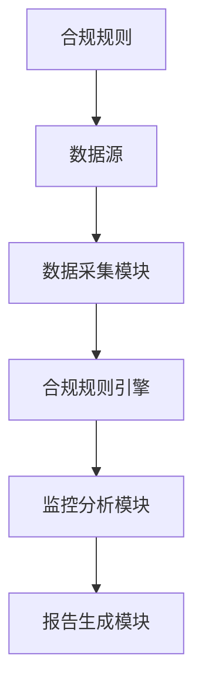
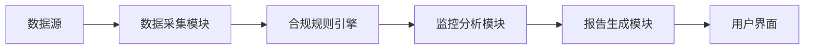

                 


# 构建智能企业合规管理平台：自动化监控与报告

## 关键词：企业合规管理、自动化监控、合规报告、智能平台、系统架构

## 摘要：本文详细介绍了如何构建智能企业合规管理平台，涵盖背景、核心概念、算法原理、系统架构、项目实战和最佳实践。通过一步步的分析与推理，帮助读者全面理解并掌握构建智能企业合规管理平台的方法与技巧。

---

## 第一部分: 企业合规管理平台背景与核心概念

### 第1章: 企业合规管理平台的背景与问题背景

#### 1.1 企业合规管理的现状与挑战
##### 1.1.1 合规管理的核心概念与定义
合规管理是指企业为了遵守相关法律法规、行业标准和内部政策，对自身的业务活动进行监督、检查和控制的过程。其核心目标是确保企业在经营活动中不违反法律、法规和行业规范。

##### 1.1.2 传统合规管理的痛点与不足
传统的合规管理方式通常依赖人工操作，存在以下痛点：
1. **效率低下**：人工审核和检查耗时长，难以应对海量数据。
2. **准确性不足**：人为因素可能导致遗漏或误判。
3. **灵活性差**：难以快速适应法律法规和企业政策的变化。
4. **成本高昂**：需要大量人力资源投入。

##### 1.1.3 数字化转型对企业合规管理的新要求
随着数字化转型的推进，企业合规管理也面临新的挑战和机遇：
1. **数据量剧增**：企业每天产生的数据量庞大，人工管理已不现实。
2. **实时性要求高**：合规管理需要实时监控，及时发现和处理问题。
3. **智能化需求**：利用AI和大数据技术提升合规管理的效率和准确性。

#### 1.2 问题背景与问题描述
##### 1.2.1 合规管理的复杂性与多样性
合规管理涉及多个领域，包括法律、财务、税务、隐私保护等，且不同行业、不同地区的法规差异较大，增加了管理的复杂性。

##### 1.2.2 企业合规管理的边界与外延
合规管理的边界包括企业的内部政策、行业标准和法律法规。其外延则涉及企业内部的各个部门，如法务、财务、IT等。

##### 1.2.3 合规管理与企业业务的深度融合
合规管理不仅仅是法务部门的工作，而是需要与企业业务深度融合，确保业务活动的合法性和合规性。

#### 1.3 问题解决与核心目标
##### 1.3.1 自动化监控与报告的核心目标
通过自动化技术实现合规管理的实时监控和智能报告，提高效率和准确性。

##### 1.3.2 问题解决的路径与方法
利用AI、大数据和区块链等技术，构建智能化的合规管理平台，实现数据采集、规则匹配、风险预警和智能报告。

##### 1.3.3 核心要素与组成结构
合规管理平台的核心要素包括：
1. 数据采集模块
2. 合规规则引擎
3. 监控与分析模块
4. 报告生成模块

---

### 第2章: 合规管理平台的核心概念与联系

#### 2.1 合规管理平台的核心概念
##### 2.1.1 合规规则引擎
合规规则引擎是平台的核心模块，负责根据预设的规则对数据进行匹配和判断。

##### 2.1.2 数据采集与处理模块
数据采集模块负责从企业系统中获取数据，并进行清洗和转换，以便后续分析。

##### 2.1.3 监控与分析模块
监控与分析模块利用大数据技术对数据进行实时监控，并通过机器学习模型识别潜在风险。

#### 2.2 核心概念的属性特征对比
| 概念 | 属性 | 特征 |
|------|------|------|
| 合规规则引擎 | 输入 | 数据流、规则库 |
| 数据采集模块 | 输出 | 结构化数据 |
| 监控与分析模块 | 功能 | 实时监控、风险预警 |

#### 2.3 ER实体关系图架构


---

## 第二部分: 合规管理平台的算法原理

### 第3章: 合规管理平台的算法原理

#### 3.1 算法选择与原理
##### 3.1.1 基于规则的监控算法
基于规则的算法通过预设的规则对数据进行匹配，适用于明确的合规要求。

##### 3.1.2 基于机器学习的监控算法
机器学习算法能够从历史数据中学习规律，识别潜在的违规行为。

#### 3.2 算法实现步骤
##### 3.2.1 基于规则的监控算法流程
1. 数据采集
2. 规则匹配
3. 风险预警

##### 3.2.2 机器学习算法流程
1. 数据清洗
2. 特征提取
3. 模型训练
4. 风险预测

#### 3.3 算法实现代码示例
```python
def rule_based_monitoring(data, rules):
    for rule in rules:
        if rule.match(data):
            return rule.get_violation(data)
    return None

class MachineLearningModel:
    def __init__(self):
        self.model = self.train_model()

    def train_model(self):
        # 训练机器学习模型
        pass

    def predict(self, data):
        # 预测风险
        pass
```

#### 3.4 数学模型与公式
##### 3.4.1 基于条件概率的模型
$$ P(A|B) = \frac{P(B|A)P(A)}{P(B)} $$

##### 3.4.2 贝叶斯定理的应用
$$ P(B|A) = \frac{P(A|B)P(B)}{P(A)} $$

---

### 第4章: 合规管理平台的系统架构设计

#### 4.1 系统分析与设计
##### 4.1.1 问题场景介绍
企业需要实时监控合同履行情况，确保合规性。

##### 4.1.2 系统功能设计
1. 数据采集
2. 规则引擎
3. 监控分析
4. 报告生成

##### 4.1.3 系统架构图


---

## 第三部分: 项目实战与最佳实践

### 第5章: 项目实战

#### 5.1 环境安装与配置
1. 安装Python和相关库
2. 配置数据库和API接口

#### 5.2 核心代码实现
```python
import requests
from datetime import datetime

def fetch_data(api_url):
    response = requests.get(api_url)
    return response.json()

def generate_report(data):
    report = {
        "timestamp": datetime.now().isoformat(),
        "summary": "Compliance Check Report",
        "details": data
    }
    return report
```

#### 5.3 案例分析与解读
通过实际案例分析，展示如何利用平台发现和解决合规问题。

#### 5.4 项目小结
总结项目实施的经验和教训，提出改进建议。

### 第6章: 最佳实践与注意事项

#### 6.1 小结
构建智能企业合规管理平台需要结合先进的技术手段，确保系统的高效性和准确性。

#### 6.2 注意事项
1. 数据安全与隐私保护
2. 系统的可扩展性
3. 规则的动态调整能力

#### 6.3 拓展阅读
推荐相关书籍和论文，供读者深入学习。

---

## 作者：AI天才研究院 & 禅与计算机程序设计艺术

---

通过本文的详细讲解，读者可以系统地了解如何构建智能企业合规管理平台，从理论到实践，逐步掌握核心技术和方法。希望本文能为企业合规管理的自动化监控与报告提供有价值的参考和指导。

