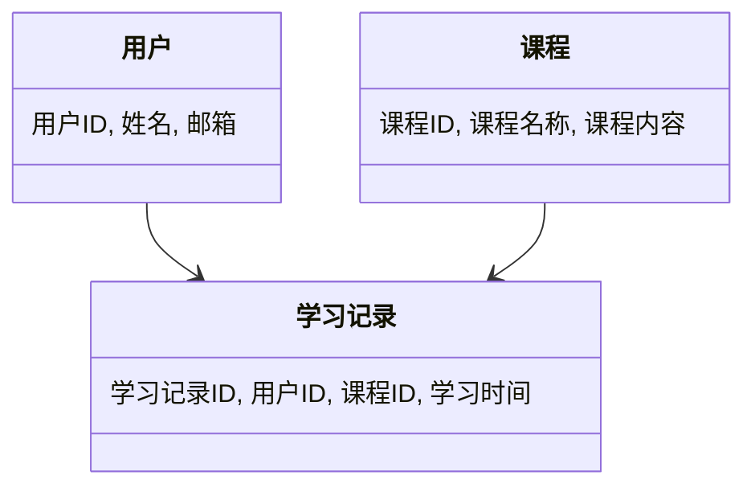
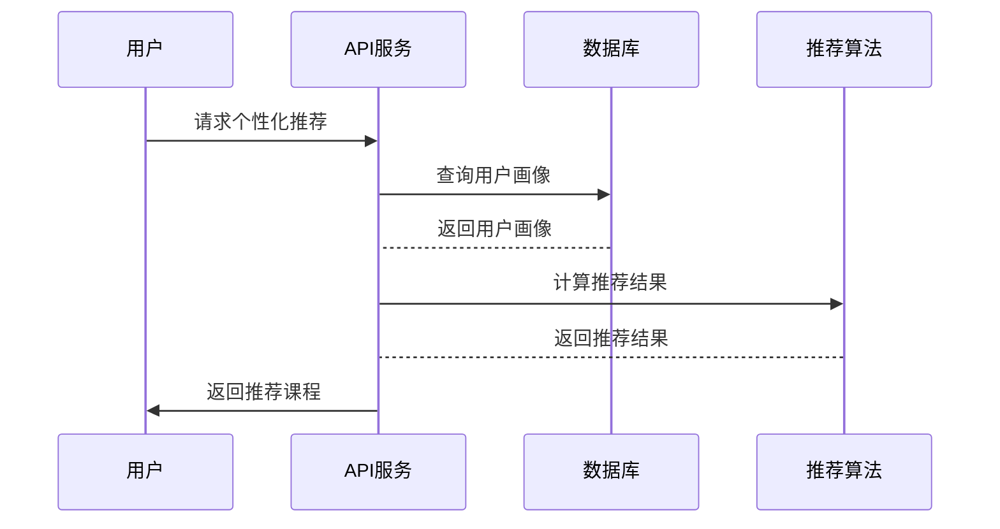

                 


# 《构建智能企业培训系统：AI个性化学习路径》

> 关键词：智能企业培训系统，AI个性化学习路径，协同过滤算法，深度学习模型，推荐系统

> 摘要：本文系统地探讨了如何利用人工智能技术构建智能企业培训系统，特别是如何通过AI实现个性化学习路径的设计与优化。文章从背景、核心概念、算法原理、系统设计到项目实战，全面解析了构建智能企业培训系统的关键步骤与方法。通过详细的技术分析和实践案例，展示了如何利用协同过滤算法和深度学习模型来实现个性化推荐，从而提升企业培训的效率和效果。

---

# 《构建智能企业培训系统：AI个性化学习路径》

---

## 引言

### 1.1 问题背景与目标

#### 1.1.1 传统企业培训的痛点
传统的企业培训系统存在以下问题：
- **缺乏个性化**：大多数企业培训系统采用统一的课程安排，忽视了员工的个性化需求。
- **效率低下**：难以根据员工的能力和兴趣推荐合适的课程。
- **数据孤岛**：缺乏对员工学习行为和效果的实时跟踪与反馈。

#### 1.1.2 AI技术在企业培训中的应用潜力
人工智能技术的快速发展为企业培训系统带来了新的可能性：
- **智能化推荐**：通过AI算法，可以实时分析员工的学习需求，推荐个性化课程。
- **动态调整**：根据员工的学习效果和反馈，动态调整学习路径。
- **数据驱动决策**：通过分析学习数据，优化培训策略。

#### 1.1.3 个性化学习路径的核心价值
个性化学习路径能够显著提升企业培训的效果，具体体现在：
- **提升学习效率**：根据员工的特点推荐合适的课程，缩短学习周期。
- **提高学习效果**：通过个性化的学习内容，增强员工的知识吸收能力。
- **增强学习体验**：满足员工个性化需求，提升学习积极性。

#### 1.1.4 本书的目标与读者群体
本书旨在通过理论与实践相结合的方式，系统地介绍如何利用AI技术构建智能企业培训系统，特别是个性化学习路径的设计与实现。本书适合以下读者：
- 企业IT架构师
- 培训系统开发人员
- 对AI技术感兴趣的企业培训管理者

---

## 第二章: AI个性化学习路径的核心概念与原理

### 2.1 智能企业培训系统的基本概念

#### 2.1.1 什么是智能企业培训系统
智能企业培训系统是一种基于AI技术的企业培训平台，能够根据员工的学习需求和能力水平，动态推荐个性化学习内容和路径。

#### 2.1.2 个性化学习路径的定义与特征
个性化学习路径是指根据员工的学习目标、能力和兴趣，定制的一条独特的学习路线。

- **定制化**：根据员工的特点量身定制。
- **动态调整**：根据学习效果实时优化。
- **数据驱动**：基于学习数据和反馈进行调整。

#### 2.1.3 AI在企业培训中的应用模式
AI在企业培训中的主要应用模式包括：
- **智能推荐**：基于员工的学习数据推荐课程。
- **学习效果预测**：通过AI模型预测员工的学习效果。
- **学习路径优化**：动态优化学习路径。

### 2.2 用户画像与学习需求分析

#### 2.2.1 用户画像的构建与分析
用户画像是通过收集和分析用户数据，构建的用户信息模型。

- **数据收集**：包括用户的基本信息、学习记录、考试成绩等。
- **数据处理**：通过数据清洗、特征提取等步骤，构建用户画像。
- **用户分群**：根据用户画像将用户分为不同的群体，进行个性化推荐。

#### 2.2.2 学习需求的识别与分类
学习需求的识别与分类是构建个性化学习路径的基础。

- **需求识别**：通过问卷调查、学习记录分析等方式识别学习需求。
- **需求分类**：将学习需求分为技能提升、知识补充等类别。

#### 2.2.3 用户行为数据的采集与处理
用户行为数据的采集与处理是构建用户画像的重要步骤。

- **数据采集**：通过日志记录用户的学习行为数据。
- **数据预处理**：清洗数据，提取有用的特征。
- **数据分析**：通过数据分析工具（如Python、R）分析用户行为数据。

### 2.3 AI算法在个性化推荐中的应用

#### 2.3.1 协同过滤算法原理
协同过滤是一种基于用户行为数据的推荐算法，主要思想是“用户的行为相似，推荐的物品也相似”。

- **基于用户的协同过滤**：根据用户之间的相似性推荐物品。
- **基于物品的协同过滤**：根据物品之间的相似性推荐物品。
- **混合协同过滤**：结合用户和物品的特征进行推荐。

#### 2.3.2 基于内容的推荐算法
基于内容的推荐算法是基于物品本身的特征进行推荐。

- **文本挖掘**：通过文本挖掘技术提取课程内容的关键词。
- **特征匹配**：根据用户兴趣匹配课程内容的特征。
- **相似度计算**：计算课程内容之间的相似度，推荐相似的课程。

#### 2.3.3 混合推荐算法的优势与挑战
混合推荐算法结合了协同过滤和基于内容的推荐算法的优势。

- **优势**：能够同时考虑用户行为和课程内容的特征。
- **挑战**：算法复杂度高，实现难度大。

### 2.4 个性化学习路径的构建与优化

#### 2.4.1 学习路径的设计原则
个性化学习路径的设计需要遵循以下原则：
- **目标导向**：根据学习目标设计学习路径。
- **动态调整**：根据学习效果实时调整路径。
- **个性化适配**：根据用户特点推荐课程。

#### 2.4.2 基于AI的路径优化方法
基于AI的路径优化方法包括：
- **强化学习**：通过强化学习优化学习路径。
- **遗传算法**：通过遗传算法优化学习路径。
- **深度学习**：通过深度学习模型预测最优路径。

#### 2.4.3 动态调整与反馈机制
动态调整与反馈机制是个性化学习路径优化的重要环节。

- **反馈机制**：通过用户反馈实时调整学习路径。
- **效果评估**：通过评估学习效果优化学习路径。
- **动态调整**：根据反馈和评估结果动态调整路径。

---

## 第三章: AI个性化学习路径的算法原理与实现

### 3.1 协同过滤算法的数学模型

#### 3.1.1 用户-物品矩阵的构建
用户-物品矩阵是协同过滤算法的核心数据结构。

- **数据结构**：矩阵的行表示用户，列表示物品。
- **数据填充**：通过数据收集填充矩阵中的值。
- **数据处理**：对矩阵进行数据清洗和特征提取。

#### 3.1.2 相似度计算公式
协同过滤算法中，相似度计算是关键步骤。

$$ \text{相似度} = \frac{\sum (x_i - \bar{x})(y_i - \bar{y})}{\sqrt{\sum (x_i - \bar{x})^2} \cdot \sqrt{\sum (y_i - \bar{y})^2}} $$

- **公式解释**：分子是协方差，分母是标准差的乘积，表示用户之间的相似度。

#### 3.1.3 基于矩阵分解的推荐算法
基于矩阵分解的推荐算法是协同过滤的一种高级形式。

- **矩阵分解**：将用户-物品矩阵分解为用户特征矩阵和物品特征矩阵。
- **特征匹配**：通过特征匹配推荐物品。

### 3.2 深度学习模型在推荐系统中的应用

#### 3.2.1 基于神经网络的推荐模型
基于神经网络的推荐模型是深度学习在推荐系统中的典型应用。

- **模型结构**：包括输入层、隐藏层和输出层。
- **训练方法**：通过反向传播算法训练模型。

#### 3.2.2 注意力机制在推荐中的应用
注意力机制是一种基于神经网络的注意力机制。

- **注意力计算**：通过注意力机制计算每个特征的重要性。
- **特征加权**：根据注意力权重加权特征，生成最终的推荐结果。

#### 3.2.3 深度强化学习的探索与实践
深度强化学习是一种结合深度学习和强化学习的技术。

- **强化学习**：通过奖励机制优化学习路径。
- **深度学习**：通过深度神经网络进行特征提取和预测。

---

## 第四章: 系统分析与架构设计方案

### 4.1 问题场景介绍

#### 4.1.1 企业培训系统的问题场景
企业培训系统中存在的主要问题包括：
- **数据孤岛**：不同部门之间的数据无法共享。
- **缺乏个性化**：无法根据员工特点推荐课程。
- **学习效果难以评估**：无法量化学习效果。

### 4.2 系统功能设计

#### 4.2.1 领域模型类图
领域模型类图展示了系统中的核心实体及其关系。



#### 4.2.2 系统架构设计

```mermaid
server {
    service 智能企业培训系统 {
        server HTTP {
            route /api/* {
                server API {
                    route GET /* {
                        service 数据库 --> 接口1
                    }
                    route POST /* {
                        service 数据库 --> 接口2
                    }
                }
            }
        }
    }
}
```

#### 4.2.3 接口设计与交互图



---

## 第五章: 项目实战

### 5.1 环境安装与配置

#### 5.1.1 安装Python与相关库
安装Python和必要的库：

```bash
pip install numpy
pip install scikit-learn
pip install pandas
pip install jupyter
```

#### 5.1.2 安装Jupyter Notebook
通过以下命令安装Jupyter Notebook：

```bash
pip install jupyter
jupyter notebook
```

### 5.2 系统核心实现源代码

#### 5.2.1 协同过滤算法实现

```python
import numpy as np
from sklearn.metrics.pairwise import cosine_similarity

# 示例用户-物品矩阵
user_item_matrix = np.array([[4, 3, 0],
                               [3, 0, 2],
                               [0, 2, 5]])

# 计算相似度矩阵
similarity_matrix = cosine_similarity(user_item_matrix)

# 推荐结果
def recommend_items(similarity_matrix, user_index, top_n=3):
    similar_users = np.argsort(-similarity_matrix[user_index])
    recommended_items = []
    for user in similar_users:
        if user == user_index:
            continue
        recommended_items.extend([item for item in range(len(similarity_matrix[user])) if user_item_matrix[user][item] > 0])
    recommended_items = list(set(recommended_items))
    return recommended_items[:top_n]

# 示例推荐
user_index = 0
print(recommend_items(similarity_matrix, user_index))
```

#### 5.2.2 基于深度学习的推荐系统实现

```python
import tensorflow as tf
from tensorflow.keras import layers

model = tf.keras.Sequential()
model.add(layers.Dense(64, activation='relu'))
model.add(layers.Dense(1, activation='sigmoid'))

model.compile(optimizer='adam', loss='binary_crossentropy', metrics=['accuracy'])

# 示例训练
model.fit(x_train, y_train, epochs=10, batch_size=32)
```

### 5.3 实际案例分析

#### 5.3.1 案例背景
某企业希望通过个性化学习路径提升员工的技能水平。

#### 5.3.2 数据收集与处理
收集员工的学习数据，包括学习记录、考试成绩等。

#### 5.3.3 算法选择与实现
选择协同过滤算法进行推荐。

#### 5.3.4 系统部署与测试
部署系统并进行测试，根据反馈优化算法。

---

## 第六章: 总结与展望

### 6.1 小结
通过本文的介绍，我们系统地探讨了如何利用AI技术构建智能企业培训系统，特别是个性化学习路径的设计与实现。

### 6.2 注意事项
在实际应用中，需要注意以下几点：
- **数据隐私**：保护员工数据隐私。
- **算法优化**：不断优化推荐算法，提升推荐效果。
- **系统维护**：定期维护系统，确保其正常运行。

### 6.3 拓展阅读
推荐以下拓展阅读资料：
- 《机器学习实战》
- 《深度学习入门：基于Python》
- 《推荐系统实战》

---

## 作者

作者：AI天才研究院/AI Genius Institute & 禅与计算机程序设计艺术 /Zen And The Art of Computer Programming

---

以上是《构建智能企业培训系统：AI个性化学习路径》的完整目录和内容概览。通过系统地介绍AI在企业培训中的应用，结合理论与实践，帮助读者构建高效的智能企业培训系统。

