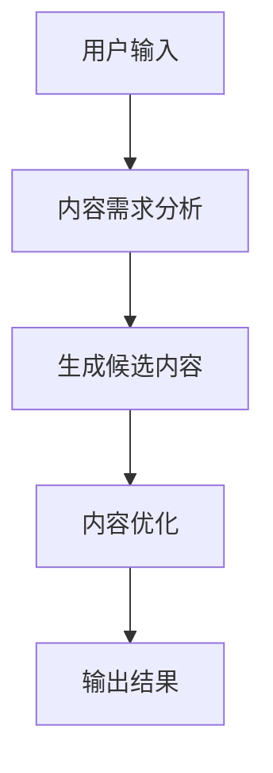
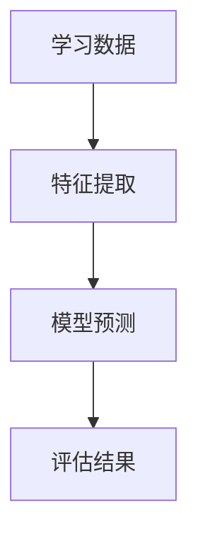
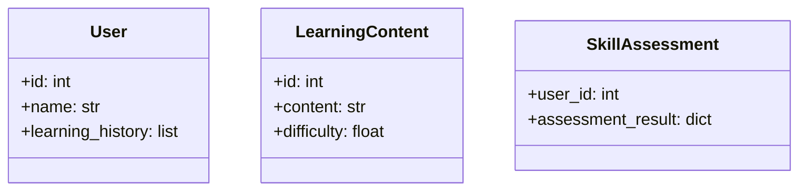
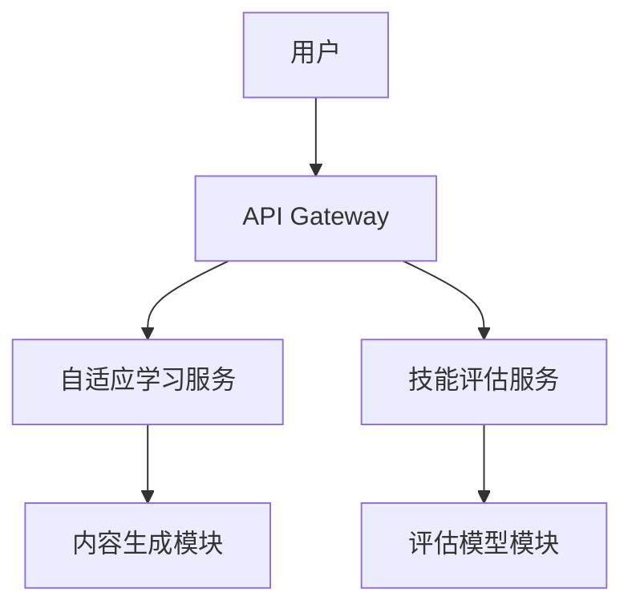

                 


# 构建智能企业培训系统：自适应学习内容生成与技能评估

**关键词**：智能企业培训系统、自适应学习、技能评估、AI算法、系统架构、项目实战

**摘要**：本文详细探讨了构建智能企业培训系统的各个方面，包括自适应学习内容生成和技能评估的核心算法、系统架构设计以及实际项目实现。文章从背景问题出发，分析了传统培训的痛点，提出了基于AI的解决方案，并详细介绍了算法原理、系统架构和项目实战，最后给出了最佳实践和拓展建议。

---

# 第1章 背景介绍

## 1.1 问题背景

企业培训是提升员工技能和企业竞争力的重要手段，但传统培训系统存在以下痛点：

- **学习内容一刀切**：传统培训内容固定，难以满足不同员工的学习需求。
- **技能评估不准确**：评估方式单一，难以全面反映员工的真实能力。
- **学习效果差**：员工学习积极性低，缺乏个性化的学习路径。

## 1.2 问题描述

- **学习内容与需求不匹配**：传统培训内容无法根据员工的具体需求进行调整。
- **评估缺乏实时性**：技能评估通常滞后，无法及时反馈学习效果。
- **系统扩展性差**：传统系统难以适应企业快速变化的需求。

## 1.3 问题解决

- **自适应学习内容生成**：利用AI算法，根据员工需求动态生成个性化学习内容。
- **技能评估创新方法**：引入多维度评估指标和实时反馈机制。
- **系统技术路线**：采用AI、大数据和微服务架构，构建灵活可扩展的系统。

## 1.4 系统边界与外延

- **功能边界**：系统主要负责学习内容生成和技能评估，不涉及课程管理。
- **适用范围**：适用于企业内部员工培训，支持多种学习场景。
- **扩展性**：系统架构支持模块化扩展，可集成更多功能。

## 1.5 核心概念与组成

- **自适应学习**：基于AI算法，动态调整学习内容。
- **技能评估**：多维度评估员工能力，提供实时反馈。
- **系统架构**：模块化设计，支持高可用性和扩展性。

---

# 第2章 核心概念与联系

## 2.1 自适应学习内容生成的原理

- **基于AI的自适应模型**：利用自然语言处理（NLP）和推荐算法生成个性化内容。
- **生成流程**：需求分析 → 内容生成 → 优化调整。
- **个性化特征**：动态调整内容难度、风格和主题。

## 2.2 技能评估的核心原理

- **评估指标体系**：知识掌握度、实践能力、学习速度。
- **AI评估方法**：利用深度学习模型分析学习数据，实时反馈评估结果。
- **实时性与准确性**：通过实时数据采集和分析，提高评估的准确性和及时性。

## 2.3 核心概念的联系与对比

| 对比维度 | 自适应学习 | 技能评估 |
|----------|------------|-----------|
| **核心目标** | 提供个性化学习内容 | 评估学习效果 |
| **技术基础** | NLP、推荐算法 | 深度学习、数据挖掘 |
| **输出结果** | 学习内容 | 评估报告 |

---

# 第3章 算法原理讲解

## 3.1 自适应学习内容生成算法

### 3.1.1 算法流程图（Mermaid）



### 3.1.2 算法实现代码

```python
def adaptive_learning_algorithm(user_input):
    # 内容需求分析
    content_analysis = analyze(user_input)
    # 生成候选内容
    candidates = generate(content_analysis)
    # 内容优化
    optimized_content = optimize(candidates)
    return optimized_content
```

### 3.1.3 数学模型

自适应学习生成模型基于概率论，通过以下公式计算内容的相关性：

$$ P(content | input) = \frac{P(input | content) \cdot P(content)}{P(input)} $$

---

## 3.2 技能评估算法

### 3.2.1 算法流程图（Mermaid）



### 3.2.2 算法实现代码

```python
def skill_assessment_algorithm(learning_data):
    # 特征提取
    features = extract_features(learning_data)
    # 模型预测
    prediction = model.predict(features)
    # 评估结果
    result = assess(prediction)
    return result
```

### 3.2.3 数学模型

评估模型使用回归分析，公式如下：

$$ y = \beta_0 + \beta_1 x_1 + \beta_2 x_2 + \ldots + \beta_n x_n + \epsilon $$

其中，$y$ 是预测的技能水平，$x_i$ 是特征变量，$\beta_i$ 是系数，$\epsilon$ 是误差项。

---

# 第4章 系统分析与架构设计

## 4.1 系统分析

- **问题场景**：企业员工学习需求多样化，传统系统无法满足个性化需求。
- **系统目标**：构建一个灵活、高效的智能培训系统。

## 4.2 系统功能设计

### 4.2.1 领域模型（Mermaid类图）



## 4.3 系统架构设计

### 4.3.1 系统架构图（Mermaid）



### 4.3.2 接口设计

- **API接口**：
  - `/generate-content`：生成学习内容。
  - `/evaluate-skill`：评估技能。

### 4.3.3 交互设计（Mermaid序列图）

```mermaid
sequenceDiagram
用户 ->> API Gateway: 请求生成内容
API Gateway ->> 自适应学习服务: 调用生成内容接口
自适应学习服务 ->> 内容生成模块: 生成内容
返回结果
```

---

# 第5章 项目实战

## 5.1 环境安装

- **工具安装**：
  - Python 3.8+
  - TensorFlow 2.0+
  - Flask 2.0+
  - Jupyter Notebook

## 5.2 核心代码实现

### 5.2.1 自适应学习模块

```python
def analyze(user_input):
    # 使用NLP模型分析输入内容
    return analysis_result

def generate(content_analysis):
    # 生成候选内容
    return candidate_contents

def optimize(candidates):
    # 根据反馈优化内容
    return optimized_content
```

### 5.2.2 技能评估模块

```python
def extract_features(learning_data):
    # 提取特征
    return features

def model_predict(features):
    # 模型预测
    return predictions

def assess(pred):
    # 生成评估结果
    return assessment
```

## 5.3 案例分析

- **案例**：某企业员工学习情况分析。
  - **输入**：员工的学习历史和需求。
  - **输出**：个性化学习内容和实时评估结果。

---

# 第6章 最佳实践

## 6.1 小结

- **系统优势**：
  - 高效性：快速生成个性化内容。
  - 准确性：精准评估技能水平。
  - 灵活性：支持多种学习场景。

## 6.2 注意事项

- **数据隐私**：确保学习数据的安全性。
- **模型优化**：定期更新模型以提高准确性。
- **系统维护**：及时修复bug，提升用户体验。

## 6.3 拓展阅读

- **推荐书籍**：
  - 《深度学习》—— Ian Goodfellow
  - 《机器学习实战》—— 周志华

---

**作者：AI天才研究院/AI Genius Institute & 禅与计算机程序设计艺术 /Zen And The Art of Computer Programming**

