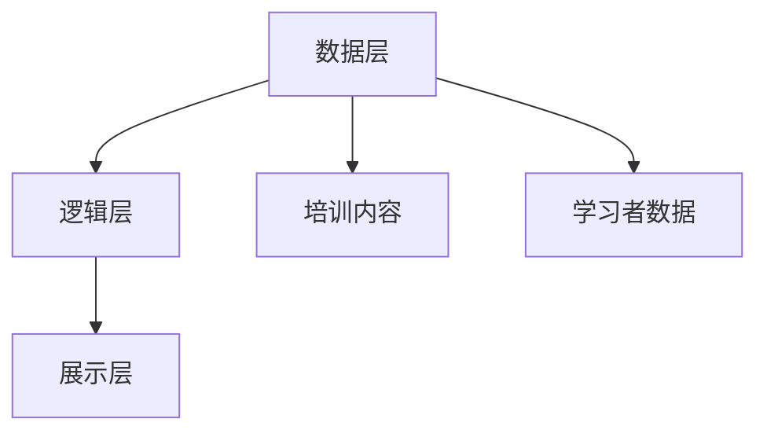

                 


# 构建智能企业培训系统：自适应学习路径与内容动态生成

## 关键词：智能企业培训系统, 自适应学习路径, 内容动态生成, 机器学习, 知识图谱, 系统架构

## 摘要：
本文深入探讨智能企业培训系统的核心构建方法，重点分析自适应学习路径和内容动态生成的关键技术。通过结合机器学习、自然语言处理和知识图谱，提出了一种智能化的企业培训解决方案，旨在为企业提供个性化的学习体验和高效的培训管理。文章从问题背景、核心概念、算法原理、系统架构到项目实战，全面阐述了系统的构建过程，最后通过实际案例验证了系统的有效性和可扩展性。

---

# 第一部分：智能企业培训系统背景与概述

## 第1章：问题背景与挑战

### 1.1 问题背景
随着企业对员工技能提升的需求日益增长，传统的培训方式逐渐暴露出诸多痛点：
- **学习者需求多样化**：员工的学习目标、知识水平和学习风格各不相同，传统的一-size-fits-all方式难以满足个性化需求。
- **培训资源繁杂**：企业积累的培训内容庞杂，缺乏有效的组织和推荐机制，导致学习者难以快速找到适合的资源。
- **缺乏实时反馈与个性化推荐**：传统培训系统通常在课程结束后才进行评估，难以实时调整学习路径，也无法根据学习者的表现动态优化学习计划。
- **技术局限性**：现有的培训系统大多基于规则引擎或简单的关键词匹配，难以应对复杂的学习场景和动态变化的学习需求。

### 1.2 系统目标与边界
智能企业培训系统的建设目标是实现**自适应学习路径**和**内容动态生成**，从而提供个性化的学习体验和高效的培训管理。系统的主要边界包括：
- 学习者：员工或外部培训参与者。
- 培训内容：包括课程、视频、文档、测验等多种形式。
- 系统功能：包括学习者画像、能力评估、路径规划、内容生成和实时反馈。

---

## 第2章：核心概念与体系结构

### 2.1 自适应学习路径
自适应学习路径是指根据学习者的能力水平、学习目标和学习风格，动态调整学习内容和进度的路径。其实现依赖于以下关键步骤：
1. **学习者画像**：通过机器学习模型分析学习者的历史数据，构建其能力模型和学习风格特征。
2. **能力评估**：基于知识图谱和学习者的表现数据，评估其当前的知识水平和技能缺口。
3. **路径优化**：通过算法推荐最优的学习顺序和内容组合，确保学习者在最短时间内达到目标。

### 2.2 内容动态生成
内容动态生成是指根据学习者的需求和系统反馈，实时生成适合的学习内容。其实现依赖于以下关键步骤：
1. **知识图谱构建**：将企业培训内容组织成知识图谱，便于内容的关联和推理。
2. **内容生成规则**：基于学习者的需求和知识图谱，制定内容生成规则。
3. **自然语言生成**：利用自然语言处理技术，动态生成符合需求的文本内容。

---

## 第3章：系统核心算法与数学模型

### 3.1 自适应学习路径算法
#### 3.1.1 算法流程
1. 数据收集：收集学习者的历史行为数据和表现数据。
2. 能力评估：基于机器学习模型评估学习者的能力水平。
3. 路径推荐：根据评估结果推荐最优的学习路径。

#### 3.1.2 数学模型
路径推荐算法可以基于协同过滤或深度学习模型。以下是一个简单的协同过滤模型：
$$
sim(i,j) = \frac{\sum_{k} w_{ik} w_{jk}}{\sqrt{\sum_{k} w_{ik}^2} \cdot \sqrt{\sum_{k} w_{jk}^2}}
$$
其中，$sim(i,j)$ 表示学习者 i 和 j 的相似度，$w_{ik}$ 和 $w_{jk}$ 表示他们在不同维度上的权重。

### 3.2 内容动态生成算法
#### 3.2.1 算法流程
1. 需求分析：分析学习者的学习目标和知识缺口。
2. 内容生成：基于知识图谱生成相关的内容。
3. 反馈优化：根据学习者的反馈优化生成内容。

#### 3.2.2 数学模型
内容生成可以基于语言模型的概率分布：
$$
P(w_i | w_{i-1}, w_{i-2}) = \frac{\exp(s)}{\sum \exp(s)}
$$
其中，$s$ 是语言模型的得分，表示生成当前词的概率。

---

## 第4章：系统架构与接口设计

### 4.1 系统架构设计
系统采用分层架构，主要包括以下模块：
1. **数据层**：存储学习者数据和培训内容。
2. **逻辑层**：实现路径推荐和内容生成的核心算法。
3. **展示层**：提供用户友好的界面，展示学习路径和生成内容。

#### 4.1.1 系统架构图（mermaid）


### 4.2 接口设计
系统需要提供以下接口：
1. **学习者画像接口**：根据学习者ID返回其能力模型。
2. **内容生成接口**：根据需求参数生成适合的内容。
3. **反馈接口**：接收学习者反馈并更新系统。

---

## 第5章：项目实战与案例分析

### 5.1 环境安装与配置
#### 5.1.1 环境要求
- Python 3.8+
- Python库：numpy, scikit-learn, spacy, transformers

### 5.2 核心代码实现
#### 5.2.1 学习者画像生成代码
```python
def get_learning_profile(user_id):
    # 获取学习者数据
    data = fetch_user_data(user_id)
    # 构建能力模型
    model = load_model('learning_model')
    profile = model.predict(data)
    return profile
```

#### 5.2.2 内容生成代码
```python
def generate_content(topic, audience):
    # 获取知识图谱
    knowledge = get_knowledge_graph()
    # 生成内容
    content = generate_text(knowledge, topic, audience)
    return content
```

### 5.3 案例分析
假设学习者A需要提升数据分析能力，系统会：
1. 生成学习者画像：发现其擅长SQL但不擅长数据可视化。
2. 推荐学习路径：优先推荐数据可视化的课程。
3. 动态生成内容：根据学习者的风格生成适合的学习材料。

---

## 第6章：系统优化与扩展

### 6.1 性能优化
- 使用缓存技术减少重复计算。
- 并行化处理提高系统响应速度。

### 6.2 功能扩展
- 支持多语言学习。
- 集成虚拟现实技术进行沉浸式培训。

---

## 第7章：总结与展望

### 7.1 小结
智能企业培训系统通过自适应学习路径和内容动态生成，显著提升了培训的效率和效果。系统的构建依赖于机器学习、自然语言处理和知识图谱等技术，为企业提供了个性化的培训解决方案。

### 7.2 注意事项
- 数据隐私保护是系统设计中的重要考虑因素。
- 系统的可扩展性和灵活性需要在设计阶段充分考虑。

### 7.3 拓展阅读
- 《深度学习入门：基于Python的理论与实现》
- 《自然语言处理实战：基于Python的自然语言处理快速入门》

---

## 作者信息
作者：AI天才研究院 & 禅与计算机程序设计艺术

---

通过以上步骤，我们详细探讨了智能企业培训系统的核心构建方法，从理论到实践，为企业提供了一套完整的解决方案。

