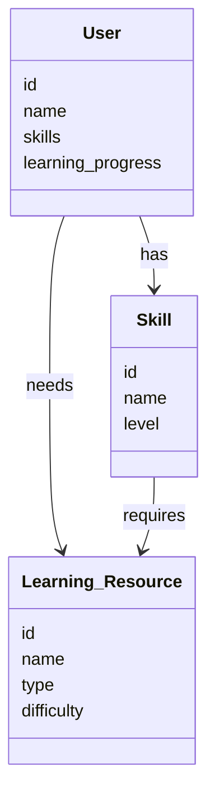

                 


# 构建智能企业培训系统：自适应学习路径与技能评估

**关键词**：智能企业培训系统、自适应学习路径、技能评估、知识图谱、深度学习、推荐算法、系统架构

**摘要**：  
随着企业对员工技能要求的不断提高，传统的培训模式逐渐暴露出诸多问题。如何利用人工智能技术构建智能企业培训系统，实现个性化、自适应的学习路径规划与精准的技能评估，成为当前企业培训领域的重要研究方向。本文从背景、核心概念、技术实现、系统架构到项目实战，全面探讨构建智能企业培训系统的关键技术与实践方法。通过知识图谱、推荐算法和深度学习等技术，系统将实现对员工技能的精准评估，并根据评估结果动态调整学习路径，从而最大化员工的学习效果和企业的培训效率。

---

# 第1章: 企业培训系统背景与挑战

## 1.1 企业培训系统的发展历程

### 1.1.1 传统企业培训模式的局限性
传统的企业培训模式通常以固定课程为核心，缺乏个性化和灵活性。员工参与培训的主动性较低，且培训效果难以量化。此外，传统模式难以满足企业对快速技能提升的需求。

### 1.1.2 现代企业对培训系统的需求
现代企业对培训系统的需求更加多元化，包括：
- **个性化学习路径**：根据员工的技能水平和职业目标，制定个性化的学习计划。
- **动态调整能力**：能够根据员工的学习进展和反馈，实时调整学习内容和节奏。
- **精准评估能力**：通过数据驱动的方法，实现对员工技能的精准评估。

### 1.1.3 智能化培训系统的兴起
人工智能技术的发展为企业培训系统的智能化提供了可能。通过自然语言处理、机器学习和知识图谱等技术，系统能够实现对员工技能的精准分析和个性化推荐。

## 1.2 问题背景与需求分析

### 1.2.1 企业培训中的主要问题
- **学习资源分散**：企业通常拥有大量的学习资源，但难以系统化地组织和推荐。
- **学习效果难量化**：传统的培训模式难以准确评估员工的学习效果和技能提升情况。
- **个性化需求未满足**：不同员工的技能水平和学习需求差异较大，传统模式难以满足个性化需求。

### 1.2.2 学习者与企业的双重需求
- **学习者**：希望获得个性化的学习路径和精准的学习资源推荐。
- **企业**：希望通过培训系统快速提升员工技能，降低培训成本，提高培训效果。

### 1.2.3 自适应学习路径的核心价值
自适应学习路径的核心价值在于通过动态调整学习内容和节奏，最大化员工的学习效果和效率。它能够根据员工的学习进展和反馈，实时优化学习路径，确保学习者在最短时间内掌握所需技能。

## 1.3 系统目标与核心功能

### 1.3.1 系统建设目标
- 提供个性化的学习路径规划。
- 实现对员工技能的精准评估。
- 提供动态调整的学习资源推荐。

### 1.3.2 核心功能模块概述
- **用户管理**：管理员工信息和学习记录。
- **技能评估**：通过测试和数据分析，评估员工技能水平。
- **学习路径推荐**：根据评估结果，推荐个性化学习路径。
- **学习资源管理**：组织和管理企业学习资源。
- **学习效果跟踪**：跟踪员工学习进展和效果。

### 1.3.3 系统边界与外延
智能企业培训系统的边界包括员工、企业培训管理者和学习资源。外延则延伸至企业内部的知识管理系统和外部的学习平台。

## 1.4 本章小结
本章主要介绍了企业培训系统的发展历程、当前面临的挑战以及智能化培训系统的核心价值。通过分析传统培训模式的局限性，提出了智能化培训系统的目标和功能模块。

---

# 第2章: 自适应学习路径的理论基础

## 2.1 自适应学习的基本原理

### 2.1.1 自适应学习的定义与特点
自适应学习是一种基于数据驱动的个性化学习方法，能够根据学习者的需求和能力动态调整学习内容和节奏。

### 2.1.2 数据驱动的个性化学习
通过收集和分析学习者的行为数据、学习效果数据等，系统能够为每个学习者制定个性化的学习计划。

### 2.1.3 自适应学习算法的分类
自适应学习算法主要包括基于规则的算法和基于模型的算法。基于规则的算法通过预设规则进行推荐，而基于模型的算法则利用机器学习模型进行预测和推荐。

## 2.2 技能评估与学习路径的关系

### 2.2.1 技能评估的多维度分析
技能评估需要从知识、能力和态度等多个维度进行分析，以全面了解员工的技能水平。

### 2.2.2 学习路径的动态调整机制
根据技能评估结果，系统能够动态调整学习路径，确保学习者在最短时间内掌握所需技能。

### 2.2.3 评估结果对学习路径的影响
评估结果直接决定学习路径的推荐策略和学习资源的选择。

## 2.3 知识图谱与学习路径构建

### 2.3.1 知识图谱的基本概念
知识图谱是一种以图结构表示知识的技术，能够将学习资源和知识点之间的关系清晰地表示出来。

### 2.3.2 基于知识图谱的学习路径构建
通过分析知识图谱中的节点和边，系统能够为学习者推荐最优的学习路径。

### 2.3.3 知识图谱的动态更新
知识图谱需要根据新的学习资源和反馈动态更新，以保持其准确性和相关性。

## 2.4 本章小结
本章主要介绍了自适应学习的基本原理、技能评估与学习路径的关系以及知识图谱在学习路径构建中的应用。通过知识图谱和机器学习技术，系统能够实现对学习路径的动态调整和优化。

---

# 第3章: 技术实现与算法原理

## 3.1 基于协同过滤的推荐算法

### 3.1.1 协同过滤的基本原理
协同过滤是一种基于用户行为数据的推荐算法，主要包括基于用户的协同过滤和基于物品的协同过滤。

### 3.1.2 基于用户的协同过滤
通过分析用户的行为数据，找到与当前用户相似的其他用户，并推荐这些用户喜欢的内容。

### 3.1.3 基于物品的协同过滤
通过分析物品之间的相似性，推荐与当前用户已选择物品相似的其他物品。

## 3.2 基于深度学习的推荐模型

### 3.2.1 神经网络在推荐系统中的应用
神经网络在推荐系统中的应用主要包括卷积神经网络和循环神经网络。

### 3.2.2 基于深度学习的推荐模型
深度学习推荐模型通过学习用户行为数据的特征，实现对用户偏好的精准预测。

### 3.2.3 深度学习模型的优缺点
深度学习模型具有较高的准确性和灵活性，但需要大量的数据和计算资源支持。

## 3.3 技能评估与学习路径推荐的结合

### 3.3.1 技能评估数据的特征提取
通过分析员工的学习记录和测试结果，提取其技能水平和学习需求的特征。

### 3.3.2 基于评估数据的路径推荐
根据提取的特征，利用推荐算法为员工推荐个性化的学习路径。

### 3.3.3 深度学习模型的训练与优化
通过不断训练和优化深度学习模型，提高推荐算法的准确性和效率。

## 3.4 算法实现与优化

### 3.4.1 算法实现的步骤与流程
1. 数据收集与预处理
2. 模型训练
3. 推荐结果生成
4. 系统优化

### 3.4.2 算法优化的关键点
- 数据质量
- 模型选择
- 计算资源

### 3.4.3 实验与结果分析
通过实验验证推荐算法的准确性和效率，并根据实验结果进行模型优化。

---

# 第4章: 系统架构与实现

## 4.1 系统功能设计

### 4.1.1 领域模型类图


### 4.1.2 系统架构设计
```mermaid
client
    ...
server
    contains Database, Recommender_System, Skill_Assessment
```

### 4.1.3 接口设计
- 用户接口：API用于用户登录、注册、学习记录查询。
- 管理接口：API用于管理员管理用户、技能和学习资源。

## 4.2 系统实现

### 4.2.1 环境安装
- 安装Python和相关库（如Scikit-learn、TensorFlow）。
- 数据库选型：MySQL或MongoDB。

### 4.2.2 核心代码实现
```python
# 推荐算法实现
from sklearn.neighbors import NearestNeighbors
from numpy import array

def recommend_learning_resources(user_id, user_skills, resources):
    # 数据预处理
    features = array(user_skills)
    # 模型训练
    model = NearestNeighbors(n_neighbors=5).fit(features)
    # 推荐资源
    distances, indices = model.kneighbors(features)
    recommended_resources = [resources[i] for i in indices]
    return recommended_resources
```

### 4.2.3 实验与结果分析
通过实验验证系统的推荐准确性和效率，分析系统的性能瓶颈并进行优化。

---

# 第5章: 项目实战与案例分析

## 5.1 项目背景与目标

### 5.1.1 项目背景
某企业希望通过智能化培训系统提升员工技能，降低培训成本。

### 5.1.2 项目目标
构建一个智能化企业培训系统，实现个性化学习路径推荐和精准技能评估。

## 5.2 实践步骤

### 5.2.1 环境安装
安装Python、Scikit-learn、TensorFlow等工具。

### 5.2.2 系统核心代码实现
```python
# 技能评估模块
def assess_skill(user_skills, required_skills):
    skill_level = {}
    for skill in required_skills:
        skill_level[skill] = user_skills[skill]
    return skill_level
```

### 5.2.3 系统部署与测试
部署系统并进行功能测试，收集用户反馈并优化系统。

## 5.3 实际案例分析

### 5.3.1 案例背景
某员工需要提升数据分析能力。

### 5.3.2 系统推荐学习路径
系统根据员工技能水平推荐相关课程和资源。

### 5.3.3 学习效果跟踪
通过系统跟踪学习进展，评估技能提升效果。

## 5.4 本章小结
本章通过实际案例分析，展示了智能化企业培训系统在实际应用中的价值和效果。

---

# 第6章: 最佳实践与总结

## 6.1 最佳实践 tips

### 6.1.1 系统设计
- 确保系统的可扩展性和可维护性。
- 数据驱动的设计能够提高系统的灵活性和准确性。

### 6.1.2 算法选择
- 根据实际需求选择合适的推荐算法。
- 深度学习模型需要大量的数据和计算资源支持。

### 6.1.3 系统优化
- 定期更新知识图谱和模型。
- 根据用户反馈不断优化系统。

## 6.2 小结
本文从背景、核心概念、技术实现到项目实战，全面探讨了构建智能企业培训系统的关键技术与实践方法。通过知识图谱、推荐算法和深度学习等技术，系统能够实现对员工技能的精准评估，并根据评估结果动态调整学习路径。

## 6.3 注意事项
- 确保数据隐私和安全。
- 定期收集用户反馈，优化系统功能。

## 6.4 拓展阅读
建议进一步研究的知识图谱构建、强化学习在推荐系统中的应用等。

---

# 作者：AI天才研究院 & 禅与计算机程序设计艺术

