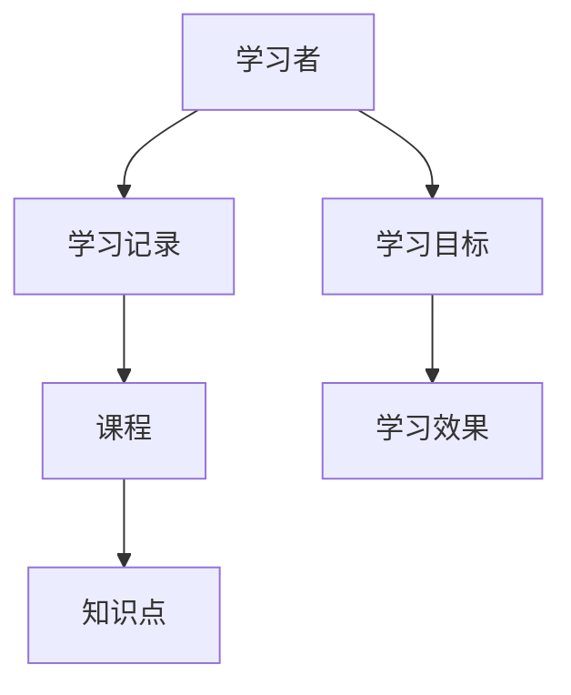
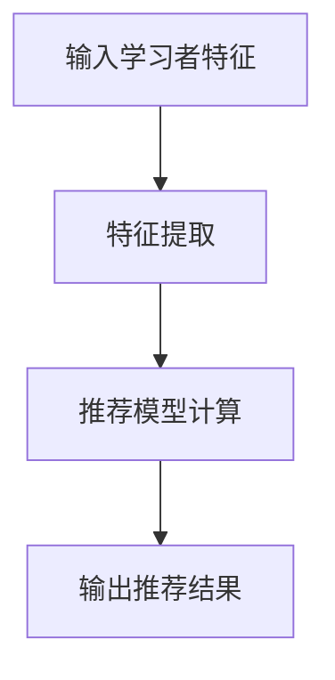
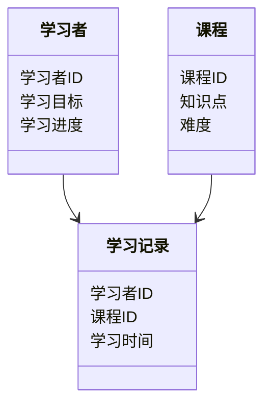
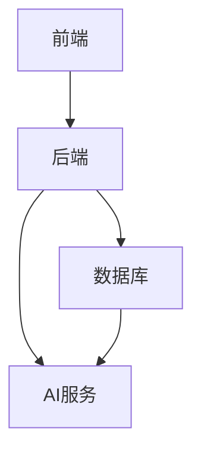

                 


# 构建智能企业学习管理系统：个性化技能发展

---

## 关键词：
- 智能企业学习管理系统
- 个性化技能发展
- 机器学习
- 知识图谱
- 系统架构设计

---

## 摘要：
本文旨在探讨如何构建一个基于人工智能技术的智能企业学习管理系统，以实现个性化技能发展目标。通过分析学习者的行为数据和学习需求，结合知识图谱和推荐算法，为学习者提供个性化的学习路径和推荐内容。本文从系统背景、核心概念、算法原理、系统架构设计、项目实战以及最佳实践等多个方面展开，详细阐述了构建智能企业学习管理系统的全过程。

---

# 第一部分: 背景介绍

## 第1章: 问题背景与挑战

### 1.1 问题背景
- 传统企业学习管理系统存在的问题：一刀切的教学方式、缺乏个性化推荐、学习效果难以评估。
- 现代企业对个性化学习的需求：员工技能提升需求多样化、学习资源丰富但匹配效率低。

### 1.2 系统目标
- 提供个性化学习路径规划。
- 实现精准的课程推荐。
- 提供实时的学习效果评估。

### 1.3 系统边界与外延
- 系统边界：仅关注学习过程中的个性化技能发展，不涉及课程内容的生成。
- 外延：可扩展至学习效果的长期跟踪和学习者的社交网络构建。

---

# 第二部分: 核心概念与联系

## 第2章: 智能企业学习管理系统的概念模型

### 2.1 学习者模型
- 学习者画像：包括学习者的知识水平、学习风格和兴趣偏好。
- 学习目标设定：基于学习者的职业发展需求和知识缺口。
- 学习进度跟踪：通过学习记录和评估结果动态调整学习计划。

### 2.2 课程内容模型
- 课程知识点分解：将课程内容细分为最小的知识点。
- 课程难度分级：根据知识点的难度进行分级。
- 课程内容关联性分析：分析知识点之间的关联性，构建知识图谱。

### 2.3 学习效果评估模型
- 多维度评估指标：包括知识掌握程度、学习参与度和学习成果。
- 评估结果反馈机制：实时反馈学习效果，调整学习计划。
- 个性化学习建议生成：基于评估结果生成个性化学习建议。

### 2.4 核心概念对比表
| 概念       | 属性特征               |
|------------|------------------------|
| 学习者模型  | 知识水平、学习风格     |
| 课程内容模型| 知识点、难度、关联性   |
| 评估模型    | 多维度指标、反馈机制   |

### 2.5 ER实体关系图


---

# 第三部分: 算法原理讲解

## 第3章: 个性化推荐算法

### 3.1 协同过滤推荐算法
- 基于用户的协同过滤：通过相似用户的偏好进行推荐。
- 基于物品的协同过滤：通过相似课程的内容进行推荐。
- 混合推荐算法：结合用户和物品的特征进行推荐。

### 3.2 基于深度学习的推荐算法
- 神经网络结构：使用多层感知机或注意力机制进行特征提取。
- 推荐结果生成：通过神经网络模型生成推荐列表。

### 3.3 算法流程图


### 3.4 算法实现代码
```python
def collaborative_filtering(user_id, user_features, course_features):
    # 特征匹配
    user_vector = user_features[user_id]
    course_vectors = course_features
    # 计算相似度
    similarities = cosine_similarity(user_vector, course_vectors)
    # 返回推荐结果
    top_courses = np.argsort(similarities)[-5:]
    return top_courses
```

### 3.5 数学模型
- 矩阵分解模型：$$ R = U \times V^T $$
  - $R$：用户-课程评分矩阵。
  - $U$：用户隐向量矩阵。
  - $V$：课程隐向量矩阵。

---

# 第四部分: 系统分析与架构设计

## 第4章: 系统功能设计

### 4.1 需求分析
- 学习者需求：个性化学习路径、精准推荐。
- 系统功能：学习者画像、课程推荐、学习效果评估。

### 4.2 领域模型


### 4.3 系统架构设计
- 前端：用户界面，展示学习路径和推荐课程。
- 后端：处理学习者数据和推荐算法。
- 数据库：存储学习者信息、课程信息和学习记录。
- AI服务：提供推荐算法和学习效果评估。

### 4.4 系统架构图


### 4.5 系统接口设计
- 登录接口：验证学习者身份。
- 课程推荐接口：根据学习者特征返回推荐课程。

---

# 第五部分: 项目实战

## 第5章: 个性化推荐系统实现

### 5.1 环境安装
- Python 3.8+
- Scikit-learn、TensorFlow

### 5.2 核心代码实现
```python
import numpy as np
from sklearn.metrics.pairwise import cosine_similarity

def collaborative_filtering(user_features, course_features):
    # 特征匹配
    user_vector = user_features
    course_vectors = course_features
    # 计算相似度
    similarities = cosine_similarity(user_vector, course_vectors)
    # 返回推荐结果
    top_courses = np.argsort(similarities)[-5:]
    return top_courses
```

### 5.3 代码解读
- 输入：学习者特征和课程特征。
- 输出：推荐的课程列表。
- 实现步骤：特征匹配、相似度计算、结果排序。

### 5.4 实际案例分析
- 数据准备：学习者特征和课程特征数据。
- 算法实现：基于协同过滤的推荐算法。
- 结果分析：推荐课程的准确性和相关性。

---

# 第六部分: 最佳实践

## 第6章: 总结与展望

### 6.1 总结
- 系统构建的关键点：学习者模型、课程内容模型和学习效果评估模型。
- 核心算法：协同过滤和深度学习推荐算法。
- 系统架构：前后端分离和AI服务集成。

### 6.2 小结
- 个性化学习是未来发展的趋势。
- 系统需要不断优化和扩展。

### 6.3 注意事项
- 数据隐私保护。
- 算法的可解释性。
- 系统的可扩展性。

### 6.4 拓展阅读
- 推荐系统相关书籍：《推荐系统实战》。
- 深度学习相关书籍：《深度学习入门》。

---

作者：AI天才研究院

