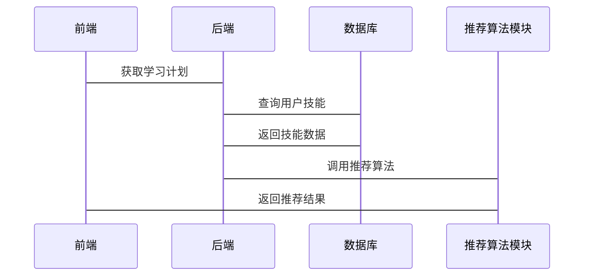

                 


# 构建智能企业学习管理系统：个性化技能发展路径规划

## 关键词：智能学习管理系统、个性化技能发展、路径规划、人工智能、协同过滤、知识图谱、系统架构

## 摘要：  
随着企业对员工技能发展的需求不断增加，传统的学习管理系统已无法满足个性化、高效化的需求。本文从背景、核心概念、算法原理、系统架构、项目实战等多方面，详细阐述如何利用人工智能技术构建智能企业学习管理系统，实现个性化技能发展路径规划。通过协同过滤推荐算法和基于知识图谱的路径规划算法，结合系统架构设计，提出了一种高效、个性化的学习管理解决方案。

---

## 第1章: 引言

### 1.1 问题背景
企业在数字化转型中，对员工技能的要求日益提高。传统学习管理系统存在以下痛点：
- **个性化不足**：无法根据员工特点推荐学习内容。
- **路径不清晰**：缺乏对技能发展的系统规划。
- **效率低下**：学习资源利用效率低，难以满足员工需求。

### 1.2 问题描述
个性化技能发展路径规划的核心问题是：
- 如何根据员工现有技能、职业目标和企业需求，推荐合适的学习资源和路径。
- 如何利用人工智能技术实现智能化推荐和动态调整。

### 1.3 问题解决
- **智能化学习管理系统**：利用机器学习和知识图谱技术，实现个性化推荐。
- **动态路径规划**：通过实时数据分析，动态调整学习路径，确保员工技能与企业需求匹配。

### 1.4 边界与外延
- **系统边界**：仅关注员工技能发展，不涉及其他管理系统。
- **外延领域**：包括知识图谱构建、推荐算法优化、数据隐私保护。

### 1.5 概念结构与核心要素组成
- **核心要素**：学习者、课程、技能、学习计划。
- **关系分析**：学习者通过课程提升技能，技能通过课程关联，学习计划个性化推荐。

---

## 第2章: 核心概念与联系

### 2.1 核心概念原理
- **智能学习管理系统**：利用AI技术，动态调整学习资源和路径。
- **个性化技能发展**：基于员工特点和需求，制定个性化学习计划。

### 2.2 概念属性特征对比
| 概念 | 属性 | 特征 |
|------|------|------|
| 传统学习管理系统 | 静态推荐 | 基于固定规则 |
| 智能学习管理系统 | 动态调整 | 基于实时数据和AI算法 |

### 2.3 ER实体关系图架构
```mermaid
erDiagram
    class 学习者 {
        id
        姓名
        技能列表
    }
    class 课程 {
        id
        课程名称
        技能要求
    }
    class 技能 {
        id
        技能名称
        技能等级
    }
    学习者 -> 技能 : 拥有
    技能 -> 课程 : 需要
```

---

## 第3章: 推荐算法原理

### 3.1 协同过滤推荐算法
协同过滤是一种基于用户相似性推荐算法，分为基于用户和基于物品的协同过滤。

#### 3.1.1 基于用户的协同过滤
- 计算用户相似度：使用余弦相似度或欧氏距离。
- 推荐相似用户的高评分内容。

#### 3.1.2 基于物品的协同过滤
- 计算物品相似度：基于用户评分数据。
- 推荐与当前用户已评分物品相似的内容。

#### 3.1.3 混合推荐算法
结合用户和物品协同过滤，提升推荐准确性和多样性。

### 3.2 基于知识图谱的推荐算法
- **知识图谱构建**：提取课程和技能的关系。
- **推荐流程**：基于知识图谱进行路径推理，推荐相关课程。

### 3.3 算法实现的数学模型
- 协同过滤的数学公式：
  $$ \text{相似度} = \frac{\sum_{i=1}^{n}(u_i - \bar{u})(v_i - \bar{v})}{\sqrt{\sum_{i=1}^{n}(u_i - \bar{u})^2} \cdot \sqrt{\sum_{i=1}^{n}(v_i - \bar{v})^2}} $$
- 路径规划的数学公式：
  $$ \text{路径概率} = \frac{\text{节点权重}}{\text{边权重}} $$

---

## 第4章: 系统架构设计

### 4.1 系统功能设计
- **领域模型**：学习者、课程、技能、学习计划。
- **功能模块**：用户管理、课程管理、技能管理、学习计划管理。

### 4.2 系统架构设计


### 4.3 接口设计
- **API接口**：RESTful API，用于前端与后端交互。

### 4.4 交互设计


---

## 第5章: 项目实战

### 5.1 环境安装
- **Python**：安装必要的库，如`numpy`, `pandas`, `scikit-learn`, `networkx`。

### 5.2 核心代码实现
```python
import numpy as np
from sklearn.metrics.pairwise import cosine_similarity

def collaborative_filtering(users, items, ratings):
    # 用户-用户协同过滤
    user_similarity = cosine_similarity(ratings.T)
    user_similarity[np.diagind

