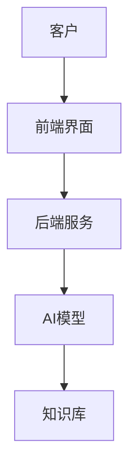
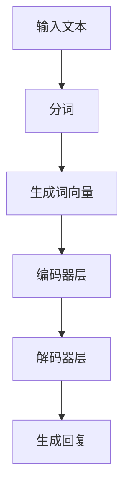
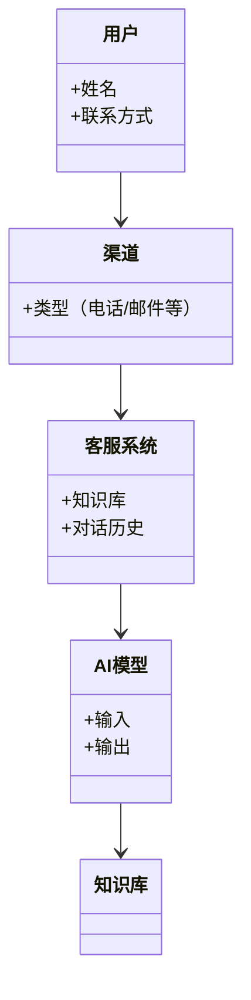
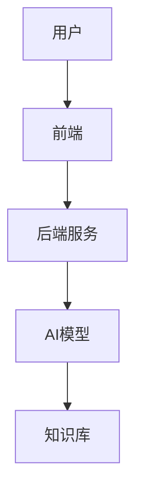

                 


# 构建智能企业客户服务系统：AI全渠道支持

## 关键词：智能客服系统，人工智能，全渠道支持，自然语言处理，意图识别，系统架构

## 摘要：  
本文探讨了如何利用人工智能技术构建智能企业客户服务系统，并实现全渠道支持。通过分析传统客户服务系统的局限性，提出基于AI的解决方案，涵盖从算法原理到系统架构设计的全过程。文章详细讲解了自然语言处理、意图识别等关键技术，并通过实际案例展示如何实现智能化客户服务系统。

---

# 正文

## 第1章：背景介绍

### 1.1 问题背景

随着企业业务的扩展，客户通过多种渠道（如电话、邮件、在线聊天、社交媒体等）与企业互动的需求日益增加。传统的客户服务系统依赖人工操作，效率低、成本高，难以满足复杂多变的客户需求。AI技术的引入，特别是自然语言处理（NLP）和机器学习，为企业提供了更高效的解决方案。

#### 1.1.1 传统客户服务系统的局限性
- **效率低下**：人工客服响应速度慢，难以处理大量客户咨询。
- **一致性不足**：不同客服人员的知识掌握程度不一，导致服务质量参差不齐。
- **渠道孤立**：客户在不同渠道咨询时，信息无法有效整合，导致重复劳动。

#### 1.1.2 AI技术对企业客户服务的推动作用
- **自动化处理**：AI能够快速响应客户问题，减少人工干预。
- **一致性与准确性**：基于预训练模型的回答一致且准确。
- **全渠道支持**：AI能够统一处理多种渠道的客户需求。

#### 1.1.3 全渠道客户服务的需求与挑战
- **需求**：客户希望在任何时间、任何渠道都能获得高效、一致的服务。
- **挑战**：不同渠道的数据格式和交互方式差异大，如何实现统一处理是关键。

---

### 1.2 问题描述

智能企业客户服务系统的目标是通过AI技术实现全渠道支持，提升客户满意度和企业效率。系统需要具备以下核心功能：
1. **多渠道接入**：支持电话、邮件、在线聊天等多种渠道。
2. **智能对话**：通过NLP技术理解客户意图并生成回答。
3. **知识库管理**：整合企业产品、服务等信息，支持智能检索。
4. **数据统计与分析**：记录客户咨询历史，分析常见问题，优化服务流程。

#### 1.2.1 系统边界与外延
- **边界**：系统仅处理客户咨询，不涉及企业的生产系统。
- **外延**：可能延伸至客户行为分析、个性化推荐等领域。

---

## 第2章：核心概念与联系

### 2.1 AI大模型在客户服务中的原理

AI大模型（如BERT、GPT）通过预训练掌握大量语言数据，能够理解上下文并生成自然的回复。在客户服务中，模型通常分为以下步骤：
1. **输入处理**：接收客户的文本或语音输入。
2. **意图识别**：分析输入内容，确定客户意图（如查询产品信息、投诉等）。
3. **知识检索**：根据意图从知识库中提取相关信息。
4. **生成回复**：基于检索结果生成自然语言回复。

#### 2.1.1 模型原理
- **编码器-解码器结构**：编码器将输入文本转换为向量表示，解码器根据向量生成回复。
- **注意力机制**：模型关注输入中的关键部分，提升理解和生成能力。

#### 2.1.2 NLP技术的应用
- **分词**：将输入文本分割为词语或短语。
- **词向量表示**：将词语映射为向量，便于计算相似性。
- **序列建模**：通过RNN或Transformer模型处理序列数据。

---

### 2.2 系统功能模块的实体关系



### 2.3 核心概念对比分析

| 技术 | 优点 | 缺点 |
|------|------|------|
| 基于规则的系统 | 实现简单，易于维护 | 需手动编写规则，难以应对复杂场景 |
| 基于机器学习的系统 | 自适应能力强，能处理复杂问题 | 需大量数据训练，可能面临数据偏差问题 |
| 基于大模型的系统 | 表现优异，能处理多种语言和场景 | 计算资源需求高，训练成本大 |

---

## 第3章：算法原理讲解

### 3.1 基于BERT的意图识别算法

#### 3.1.1 BERT模型的工作流程



#### 3.1.2 意图识别的数学模型

意图识别通常使用分类模型，其核心是计算输入文本属于某个类别的概率。假设我们有K个类别，概率分布可以表示为：

$$ P(y_1, y_2, ..., y_K) = \prod_{i=1}^{K} P(y_i) $$

其中，$y_i$表示第i个类别的概率。

---

## 第4章：系统分析与架构设计

### 4.1 系统功能设计



### 4.2 系统架构设计



### 4.3 系统接口设计

- **输入接口**：接收用户的咨询请求。
- **输出接口**：返回AI生成的回复。
- **知识库接口**：提供信息检索服务。

---

## 第5章：项目实战

### 5.1 环境安装

- **Python 3.8+**
- **TensorFlow/PyTorch**
- **分词工具（如jieba）**

### 5.2 核心代码实现

```python
import torch
from transformers import BertTokenizer, BertModel

# 加载预训练模型
tokenizer = BertTokenizer.from_pretrained('bert-base-chinese')
model = BertModel.from_pretrained('bert-base-chinese')

# 定义意图识别函数
def get_intent(text):
    inputs = tokenizer(text, return_tensors='pt')
    outputs = model(**inputs)
    # 使用最后一层的隐藏层输出作为特征
    features = outputs.last_hidden_state[:, 0, :]
    # 使用全连接层进行分类
    return features
```

---

## 第6章：最佳实践与小结

### 6.1 最佳实践

- **数据质量**：确保训练数据多样化，覆盖各种场景。
- **模型迭代**：定期更新模型，提升准确率。
- **用户体验**：提供清晰的交互界面，确保客户理解系统的能力。

### 6.2 小结

通过AI技术构建智能企业客户服务系统，能够显著提升客户满意度和企业效率。系统的关键在于算法选型、数据管理和架构设计。

### 6.3 注意事项

- 避免过度依赖AI，保留人工客服作为备用。
- 定期监控系统性能，及时优化。

---

## 作者

作者：AI天才研究院 & 禅与计算机程序设计艺术

