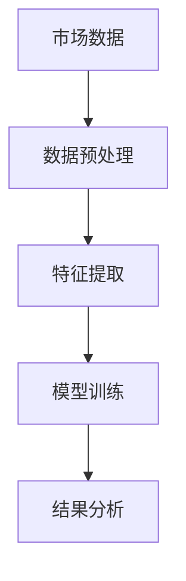
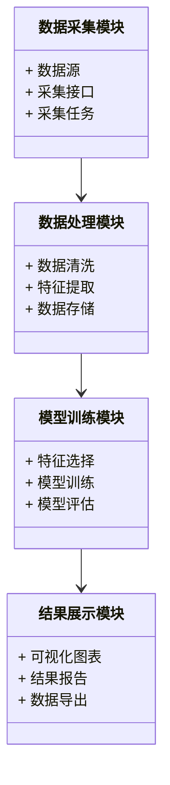
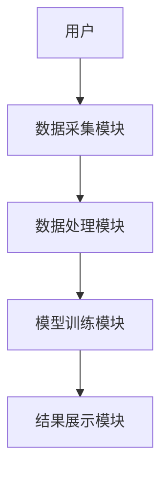
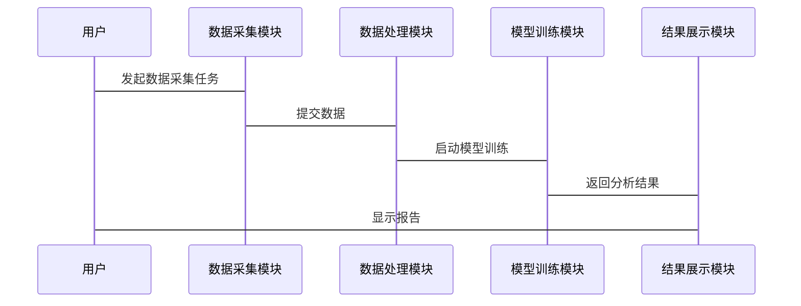

                 


# 构建智能企业市场调研系统：AI辅助数据分析

## 关键词：智能企业市场调研系统、AI辅助数据分析、机器学习、自然语言处理、数据可视化

## 摘要：本文详细探讨了如何利用人工智能技术构建智能企业市场调研系统，重点分析了AI辅助数据分析的核心原理、算法模型及系统架构设计。文章从问题背景出发，结合实际案例，深入剖析了系统构建的全过程，为企业实现高效市场调研提供了技术指导和实践参考。

---

# 第一部分: 智能企业市场调研系统概述

## 第1章: 智能企业市场调研系统概述

### 1.1 问题背景与描述

#### 1.1.1 传统市场调研的痛点
传统的市场调研方式依赖人工数据收集和分析，效率低、成本高且容易受主观因素影响。企业需要面对海量数据，如何快速提取有价值的信息成为关键问题。

#### 1.1.2 数据爆炸时代的挑战
随着互联网的普及，数据量呈指数级增长。企业每天需要处理大量的文本、图像和结构化数据，传统方法难以高效应对。

#### 1.1.3 企业市场调研的核心需求
企业需要快速、准确地获取市场动态，识别竞争对手优势，洞察消费者需求，从而制定精准的市场策略。

### 1.2 智能市场调研系统的核心概念

#### 1.2.1 AI辅助数据分析的定义
AI辅助数据分析是指利用人工智能技术（如机器学习和自然语言处理）对市场数据进行自动化处理、分析和可视化，以支持企业决策。

#### 1.2.2 智能市场调研系统的边界与外延
智能市场调研系统不仅包括数据收集和分析，还涵盖数据可视化、预测建模和决策支持等功能。

#### 1.2.3 核心要素与组成结构
智能市场调研系统的核心要素包括：数据采集模块、数据预处理模块、模型训练模块、结果分析模块和可视化展示模块。

### 1.3 系统目标与价值

#### 1.3.1 系统建设目标
- 实现市场数据的自动化采集和处理。
- 提供精准的市场洞察和预测。
- 支持企业快速制定市场策略。

#### 1.3.2 企业级市场的应用价值
- 提高市场调研效率，降低人工成本。
- 提供数据驱动的决策支持。
- 帮助企业在竞争中占据优势。

#### 1.3.3 对企业决策的支持作用
通过AI辅助数据分析，企业可以快速识别市场趋势，优化资源配置，提升市场反应速度。

### 1.4 本章小结
本章介绍了智能企业市场调研系统的核心概念和价值，为后续章节的分析奠定了基础。

---

# 第二部分: AI辅助数据分析的核心原理

## 第2章: 核心概念与原理

### 2.1 AI在市场调研中的应用原理

#### 2.1.1 数据预处理与特征提取
数据预处理包括清洗、去重和格式统一，特征提取则通过TF-IDF、Word2Vec等方法提取文本特征。

#### 2.1.2 自然语言处理（NLP）在文本分析中的应用
NLP技术用于情感分析、关键词提取和主题建模，帮助企业理解消费者反馈和市场趋势。

#### 2.1.3 机器学习模型的训练与优化
通过监督学习和无监督学习训练分类模型，优化模型性能以提高预测准确性。

### 2.2 核心算法原理对比

#### 2.2.1 常见算法对比表格
| 算法名称 | 描述 | 优缺点 |
|----------|------|--------|
| TF-IDF   | 基于频率的文本特征提取方法 | 简单高效，但无法捕捉语义信息 |
| Word2Vec | 通过上下文预测词向量 | 能够捕捉语义信息，但需要大量数据 |
| BERT     | 基于Transformer的预训练模型 | 高精度，但计算资源需求高 |

### 2.3 实体关系图


### 2.4 本章小结
本章详细介绍了AI在市场调研中的核心算法和原理，为后续章节的系统设计提供了理论支持。

---

# 第三部分: 算法原理与数学模型

## 第3章: 算法原理与数学模型

### 3.1 数据预处理算法

#### 3.1.1 清洗数据的数学模型
- 数据清洗公式：
$$ \text{清洗后数据} = \text{原始数据} \setminus \{\text{重复数据,异常值}\} $$

#### 3.1.2 数据标准化与归一化的公式
- 标准化公式：
$$ z = \frac{x - \mu}{\sigma} $$
- 归一化公式：
$$ x' = \frac{x - \min(x)}{\max(x) - \min(x)} $$

### 3.2 文本特征提取算法

#### 3.2.1 TF-IDF特征提取
- TF-IDF计算公式：
$$ \text{TF-IDF}(t, d) = \text{TF}(t, d) \times \text{IDF}(t) $$
- 其中，$\text{TF}(t, d)$是词$ t$在文档$d$中的词频，$\text{IDF}(t)$是词$t$的逆文档频率。

#### 3.2.2 Word2Vec特征提取
- Word2Vec通过训练词嵌入模型，将词映射到低维向量空间。
- 训练公式：
$$ \log P(w_i|w_{i-2}, w_{i-1}, w_i, w_{i+1}, w_{i+2}) \propto \text{similarity}(w_i, w_j) $$

### 3.3 机器学习模型训练

#### 3.3.1 分类模型训练
- 使用逻辑回归或支持向量机（SVM）进行分类任务。
- 模型训练公式：
$$ P(y|x) = \frac{\exp(w \cdot x + b)}{1 + \exp(w \cdot x + b)} $$

#### 3.3.2 模型评估与优化
- 使用准确率、召回率和F1分数评估模型性能。
- 调参公式：
$$ w = (X^T X)^{-1} X^T y $$

### 3.4 本章小结
本章详细讲解了AI辅助数据分析的核心算法和数学模型，为系统实现提供了理论依据。

---

# 第四部分: 系统分析与架构设计

## 第4章: 系统分析与架构设计

### 4.1 项目背景介绍

#### 4.1.1 项目目标
构建一个基于AI的市场调研系统，实现数据自动化采集、分析和可视化。

#### 4.1.2 项目范围
涵盖市场数据采集、数据处理、模型训练和结果展示四个模块。

### 4.2 系统功能设计

#### 4.2.1 领域模型类图


### 4.3 系统架构设计

#### 4.3.1 系统架构图


#### 4.3.2 关键接口设计
- 数据采集接口：接收市场数据。
- 模型调用接口：提供API供其他模块调用。
- 结果展示接口：返回分析结果和可视化图表。

#### 4.3.3 系统交互流程图


### 4.4 本章小结
本章详细介绍了系统的架构设计和功能模块，为后续的系统实现奠定了基础。

---

# 第五部分: 项目实战

## 第5章: 项目实战

### 5.1 环境安装与配置

#### 5.1.1 安装Python和相关库
```bash
pip install numpy pandas scikit-learn transformers
```

### 5.2 核心代码实现

#### 5.2.1 数据采集模块
```python
import requests

def fetch_data(url):
    response = requests.get(url)
    return response.text
```

#### 5.2.2 数据处理模块
```python
from sklearn.feature_extraction.text import TfidfVectorizer

vectorizer = TfidfVectorizer()
X = vectorizer.fit_transform(corpus)
```

#### 5.2.3 模型训练模块
```python
from sklearn.linear_model import LogisticRegression

model = LogisticRegression()
model.fit(X, y)
```

#### 5.2.4 结果展示模块
```python
import matplotlib.pyplot as plt

plt.bar(x, y)
plt.show()
```

### 5.3 代码解读与分析

#### 5.3.1 数据采集模块解读
- 使用requests库从指定URL获取数据。
- 支持多种数据格式的采集。

#### 5.3.2 数据处理模块解读
- 使用TfidfVectorizer提取文本特征。
- 支持批量处理和单样本处理。

#### 5.3.3 模型训练模块解读
- 使用逻辑回归模型进行分类训练。
- 支持模型保存和加载功能。

### 5.4 案例分析

#### 5.4.1 案例背景
某企业需要分析竞争对手的产品评论，以优化自身产品设计。

#### 5.4.2 数据采集与处理
- 从社交媒体和电商平台采集产品评论。
- 使用TF-IDF提取关键词，识别用户关注的热点问题。

#### 5.4.3 模型训练与结果分析
- 训练情感分析模型，识别用户反馈的正负向。
- 提供可视化报告，展示产品优劣势和改进方向。

### 5.5 本章小结
本章通过实际案例展示了系统的实现过程，验证了系统设计的有效性。

---

# 第六部分: 总结与展望

## 第6章: 总结与展望

### 6.1 本章总结

#### 6.1.1 核心要点回顾
- AI辅助数据分析的核心算法和模型。
- 智能市场调研系统的架构设计。
- 系统实现的关键技术和代码示例。

#### 6.1.2 系统优势总结
- 提高市场调研效率。
- 降低人工成本。
- 提供精准的市场洞察。

### 6.2 未来展望

#### 6.2.1 技术进步
- 更先进的NLP模型（如GPT-3、PaLM）的应用。
- 多模态数据（文本、图像、视频）的分析能力。

#### 6.2.2 应用场景拓展
- 更多行业和领域的应用。
- 更加智能化和个性化的市场调研工具。

### 6.3 小结
AI辅助数据分析技术正在不断进步，未来将为企业市场调研带来更大的价值。

---

# 作者：AI天才研究院/AI Genius Institute & 禅与计算机程序设计艺术 /Zen And The Art of Computer Programming

---

本文详细探讨了如何利用人工智能技术构建智能企业市场调研系统，从理论到实践，全面剖析了AI辅助数据分析的核心原理和系统设计。通过实际案例分析，展示了系统的实现过程和应用价值。未来，随着AI技术的不断发展，智能市场调研系统将为企业决策提供更加强有力的支持。

