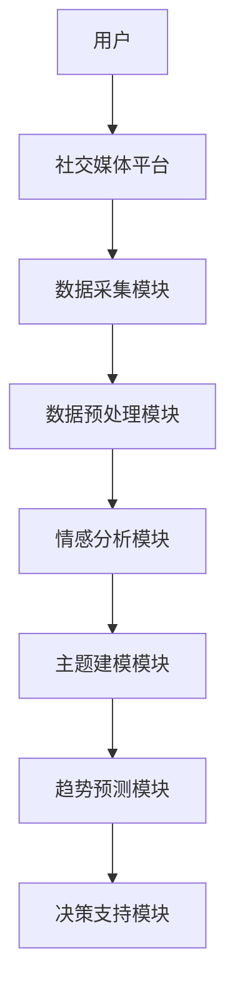
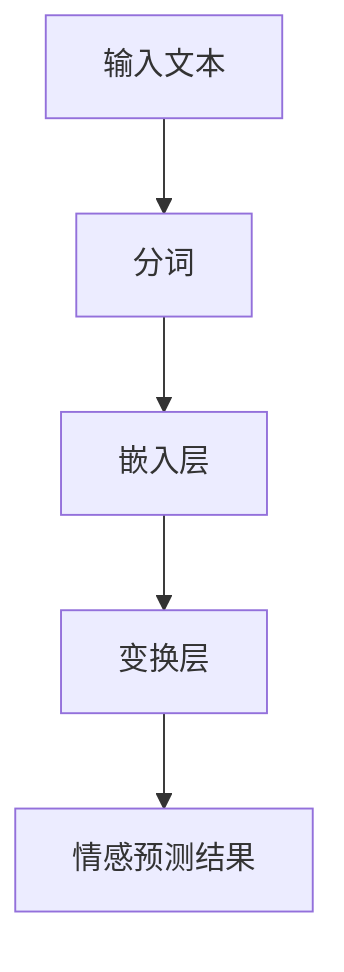

                 

# 《构建智能企业市场调研系统：社交媒体聆听与趋势预测的AI驱动》

> 关键词：企业市场调研、社交媒体聆听、趋势预测、AI驱动、数据挖掘、自然语言处理、机器学习

> 摘要：本文详细探讨了如何构建一个基于社交媒体数据的智能企业市场调研系统，重点介绍了利用AI技术进行数据挖掘和趋势预测的核心方法。通过分析社交媒体数据，结合自然语言处理和机器学习算法，帮助企业从海量数据中提取有价值的信息，预测市场趋势，优化决策流程。文章从背景与核心概念出发，深入探讨了算法原理与数学模型，并通过系统架构设计与项目实战，展示了如何将理论应用于实际场景。最后，文章总结了实践经验，并展望了未来的发展方向。

---

## # 第一部分: 背景与核心概念

### # 第1章: 智能企业市场调研系统概述

#### 1.1 企业市场调研的重要性
现代企业的竞争日益激烈，市场调研是企业制定战略决策的重要基础。传统市场调研方法依赖于问卷调查、面对面访谈等方式，耗时长、成本高且难以捕捉实时市场动态。社交媒体的兴起为企业提供了海量的用户反馈数据，这些数据不仅真实、丰富，还具有实时性和交互性。通过分析社交媒体上的用户评论、点赞、转发等行为，企业可以更快速、更准确地了解市场需求变化。

#### 1.2 社交媒体聆听与趋势预测的背景
随着社交媒体的普及，用户在平台上分享的产品评论、情感反馈、话题讨论等信息，为企业提供了丰富的数据来源。然而，这些数据通常是非结构化的文本数据，需要通过自然语言处理（NLP）技术进行解析。趋势预测则是基于历史数据，利用机器学习算法预测未来的市场走向。AI技术的应用使得企业能够从海量数据中提取有价值的信息，快速响应市场变化。

#### 1.3 问题背景与目标
在企业市场调研中，传统方法存在以下问题：
- 数据收集成本高、耗时长。
- 数据来源单一，难以覆盖全网信息。
- 数据分析依赖人工判断，主观性强且效率低。

通过构建智能市场调研系统，企业可以实现以下目标：
- 实时采集社交媒体上的用户反馈数据。
- 利用NLP技术自动分析用户情感、提取关键词。
- 基于机器学习模型预测市场趋势。

#### 1.4 核心概念与联系
- **社交媒体聆听**：指通过技术手段实时监测社交媒体上的用户行为和评论，提取有用的信息。
- **趋势预测**：基于历史数据和机器学习模型，预测未来的市场动态。
- **数据处理**：对采集到的社交媒体数据进行清洗、转换和标注，以便后续分析。

---

### # 第2章: 核心概念与联系

#### 2.1 核心概念原理
- **社交媒体数据采集**：通过API接口或爬虫技术，从Twitter、Facebook、Instagram等平台获取用户评论、点赞、转发等数据。
- **数据预处理**：对文本数据进行清洗（去除噪音、停用词）、分词、去重等操作，提取有用的信息。
- **情感分析**：利用NLP技术判断用户评论的情感倾向（正面、中性、负面）。
- **主题建模**：通过主题模型（如LDA）提取文本中的主要主题。

#### 2.2 核心概念对比分析
以下是几种常见的情感分析方法对比：

| 方法       | 优点                           | 缺点                             |
|------------|--------------------------------|----------------------------------|
| 基于词典的方法 | 实现简单，速度快               | 易受上下文影响，不够灵活         |
| 机器学习方法 | 性能高，能够捕捉复杂模式       | 需要大量标注数据                 |
| 深度学习方法 | 能够捕捉语义信息，效果最好     | 计算资源消耗大，实现复杂         |

---

#### 2.3 实体关系图

---

## # 第二部分: 算法原理与数学模型

### # 第3章: 算法原理

#### 3.1 自然语言处理与情感分析
情感分析是社交媒体聆听的核心任务之一。常用的情感分析算法包括基于词典的方法（如AFINN、VADER）和机器学习方法（如SVM、随机森林）。深度学习方法（如LSTM、BERT）则能够更准确地捕捉语义信息。

以下是基于BERT的情感分析模型示意图：

#### 3.2 主题建模与关键词提取
主题建模（如LDA）用于从文本中提取主要主题。关键词提取则通过TF-IDF方法实现，计算每个关键词在文本中的重要性。

#### 3.3 时间序列预测
趋势预测通常基于时间序列分析。常用的模型包括ARIMA、LSTM等。

---

### # 第4章: 数学模型与公式

#### 4.1 TF-IDF公式
$$ TF-IDF(t, d) = TF(t, d) \times ID

