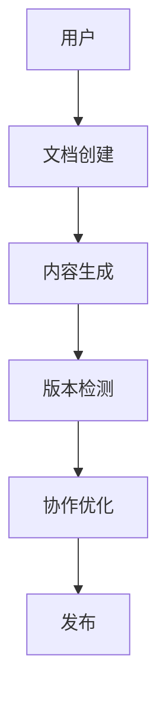
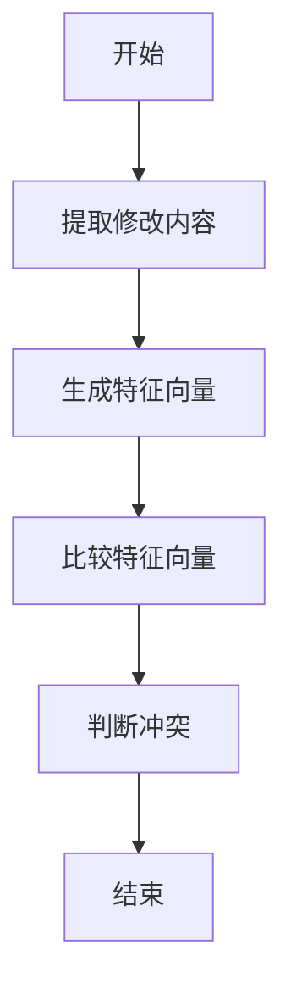
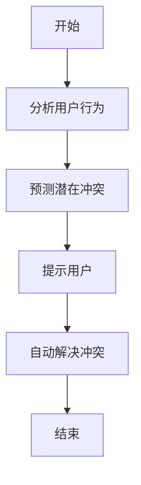
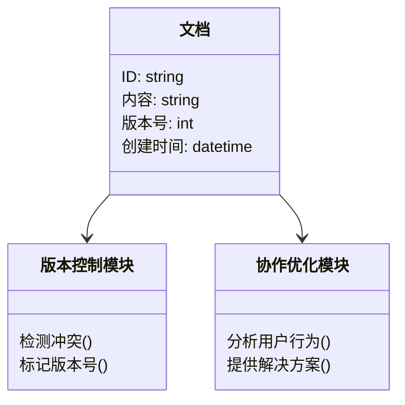
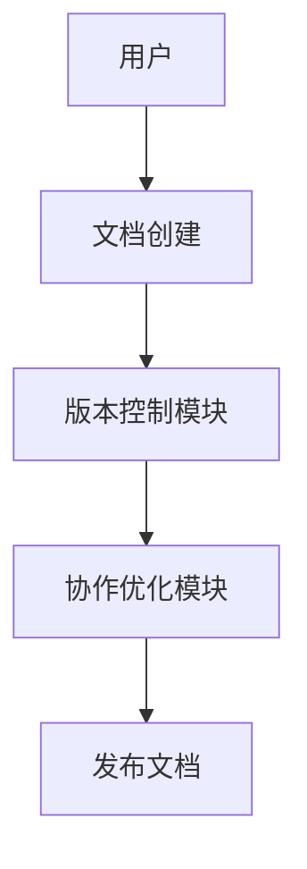
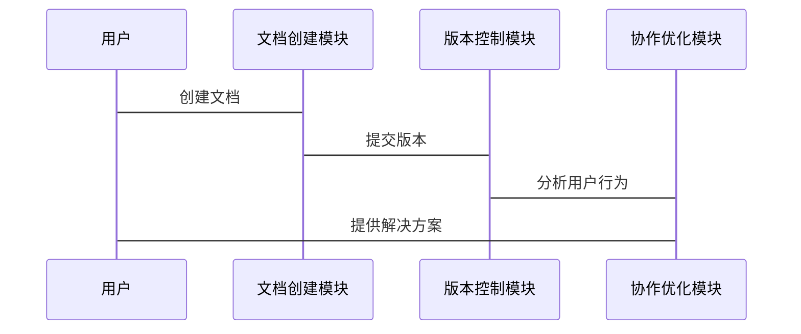

                 


# 构建智能企业文档管理系统：版本控制与协作优化的AI增强

## 关键词：智能文档管理、版本控制、协作优化、人工智能、自然语言处理、冲突检测

## 摘要：
本文详细探讨了如何利用人工智能技术增强企业文档管理系统的版本控制和协作优化功能。通过分析传统文档管理系统的局限性，提出基于AI的解决方案，包括智能版本控制算法和协作优化策略。结合具体实现案例，展示了如何通过AI技术提升文档管理的效率和准确性。

---

## 第一部分：构建智能企业文档管理系统的背景与概述

## 第1章：智能企业文档管理系统的概述

### 1.1 企业文档管理系统的背景与挑战

#### 1.1.1 传统文档管理系统的局限性
传统的文档管理系统在版本控制和协作优化方面存在以下问题：
- **版本混乱**：手动标记版本号容易出错，导致文档版本混淆。
- **协作低效**：多人实时协作时，频繁的冲突和人工干预降低了效率。
- **信息孤岛**：文档分散在不同系统中，难以统一管理和检索。

#### 1.1.2 企业文档管理中的主要问题
- **数据冗余**：同一份文档在不同部门可能有多个版本，增加存储压力。
- **协作延迟**：审批流程长，反馈不及时，影响工作效率。
- **安全风险**：文档权限管理复杂，存在数据泄露风险。

#### 1.1.3 AI技术在文档管理中的应用前景
AI技术可以通过以下方式改善文档管理：
- **智能分类**：利用自然语言处理（NLP）自动分类和归档文档。
- **版本控制优化**：通过内容理解自动检测和标记版本变更。
- **实时协作增强**：预测冲突并提供解决方案，减少人工干预。

### 1.2 智能企业文档管理系统的定义与目标

#### 1.2.1 智能文档管理系统的定义
智能文档管理系统是结合AI技术的文档管理平台，能够自动处理文档的分类、版本控制、协作优化等功能。

#### 1.2.2 系统的核心目标
- 提供智能化的文档分类和检索功能。
- 实现高效的版本控制，减少人为错误。
- 支持实时协作，自动检测和解决冲突。

#### 1.2.3 系统的预期价值
- 提高文档管理效率，降低人工成本。
- 增强文档安全性，确保信息准确性和完整性。
- 优化协作流程，提升团队整体效率。

### 1.3 本章小结
本章介绍了传统文档管理系统的局限性，提出了AI增强的智能文档管理系统的概念和目标，为后续技术实现奠定了基础。

---

## 第二部分：智能企业文档管理系统的核心概念与技术

## 第2章：版本控制与协作优化的核心概念

### 2.1 版本控制的基本原理

#### 2.1.1 版本控制的定义与作用
版本控制是记录文档变化历史，确保每个版本可追溯和恢复。

#### 2.1.2 版本控制的常见模式
- **集中式版本控制**：所有文档集中存储在一个服务器上。
- **分布式版本控制**：每个用户都有一个完整的版本库，如Git。

#### 2.1.3 版本控制中的冲突检测与解决
- **冲突检测**：识别同一文档的不同修改。
- **解决方法**：标记冲突区域，供用户选择保留哪个版本。

#### 对比表格：集中式与分布式版本控制的对比
| 特性                | 集中式版本控制          | 分布式版本控制          |
|---------------------|-----------------------|-----------------------|
| 存储结构          | 单点集中存储          | 多节点分布式存储      |
| 网络依赖          | 高                    | 较低                  |
| 灾备能力          | 低                    | 高                    |

#### ER实体关系图：版本控制中的实体关系
```mermaid
erd
  title 版本控制实体关系图
  id: ID
  document: 文档
  version: 版本号
  revision: 修改记录
  id -> document: 属于
  id -> version: 标识
  version -> revision: 包含
```

### 2.2 协作优化的关键要素

#### 2.2.1 协作流程的定义
协作流程包括文档的创建、修改、审批和发布。

#### 2.2.2 协作中的主要问题
- **冲突问题**：多人同时修改同一文档导致版本混乱。
- **效率问题**：审批流程长，反馈不及时。
- **权限问题**：难以控制文档的访问权限。

#### 2.2.3 AI在协作优化中的作用
- **预测冲突**：分析用户的编辑模式，提前预测潜在冲突。
- **自动审批**：利用NLP技术自动审核文档内容，减少人工干预。

### 2.3 AI增强的文档管理系统的核心要素

#### 2.3.1 AI在文档管理中的应用场景
- **智能分类**：根据内容自动归类文档。
- **版本检测**：通过NLP识别内容变化，自动标记版本号。
- **协作优化**：预测冲突并提供解决方案。

#### 2.3.2 AI技术对协作优化的提升
- **减少冲突**：AI预测潜在冲突，提前提示用户。
- **提高效率**：自动化审批流程，缩短文档处理时间。

#### 2.3.3 系统的整体架构


### 2.4 本章小结
本章详细介绍了版本控制和协作优化的核心概念，并探讨了AI技术在其中的应用，为后续技术实现提供了理论基础。

---

## 第三部分：版本控制与协作优化的AI增强算法

## 第3章：版本控制中的AI算法

### 3.1 冲突检测的算法原理

#### 3.1.1 算法流程
1. **内容提取**：提取文档的修改内容。
2. **特征提取**：将修改内容转化为特征向量。
3. **冲突检测**：比较特征向量，判断是否存在冲突。

#### 3.1.2 冲突检测的mermaid流程图


#### 3.1.3 冲突检测的数学模型
冲突检测的数学模型如下：
$$
\text{冲突} = \begin{cases}
\text{是} & \text{如果特征向量相似度超过阈值} \\
\text{否} & \text{否则}
\end{cases}
$$

### 3.2 文本相似度计算

#### 3.2.1 余弦相似度
余弦相似度计算公式：
$$
\text{相似度} = \frac{\vec{A} \cdot \vec{B}}{|\vec{A}| |\vec{B}|}
$$

#### 3.2.2 编辑距离
编辑距离计算公式：
$$
\text{距离} = \text{min}(a, b, c)
$$
其中，\(a, b, c\)分别代表替换、插入和删除操作的代价。

#### 3.2.3 使用Python实现文本相似度计算
```python
from sklearn.metrics.pairwise import cosine_similarity

def calculate_similarity(text1, text2):
    # 将文本转换为向量
    vectorizer = TfidfVectorizer()
    vectors = vectorizer.fit_transform([text1, text2])
    # 计算余弦相似度
    similarity = cosine_similarity(vectors[0], vectors[1])
    return similarity[0][0]
```

### 3.3 算法优化与实现

#### 3.3.1 算法优化
- **特征向量优化**：使用更高效的特征提取方法，如Word2Vec。
- **相似度阈值调整**：根据实际需求调整阈值。

#### 3.3.2 算法实现
```python
def detect_conflict(doc1, doc2):
    # 计算文本相似度
    similarity = calculate_similarity(doc1, doc2)
    # 判断是否冲突
    if similarity > 0.8:
        return True
    else:
        return False
```

### 3.4 本章小结
本章介绍了版本控制中的AI算法，重点讲解了冲突检测和文本相似度计算的实现，并提供了Python代码示例。

---

## 第四部分：协作优化的AI增强算法

## 第4章：协作优化中的AI算法

### 4.1 AI驱动的协作优化流程

#### 4.1.1 协作流程的AI增强
1. **用户行为分析**：分析用户的编辑模式，预测潜在冲突。
2. **冲突预防**：提前提示用户潜在冲突区域。
3. **自动解决**：提供基于上下文的自动解决方案。

#### 4.1.2 协作优化的mermaid流程图


### 4.2 用户行为分析

#### 4.2.1 用户行为特征
- **编辑频率**：用户修改文档的频率。
- **编辑时间**：用户编辑的时间段。
- **编辑内容**：用户修改的具体内容。

#### 4.2.2 用户行为分析模型
使用随机森林模型进行用户行为分类，代码如下：
```python
from sklearn.ensemble import RandomForestClassifier

# 训练模型
model = RandomForestClassifier()
model.fit(X_train, y_train)

# 预测用户行为
y_pred = model.predict(X_test)
```

### 4.3 冲突预防与自动解决

#### 4.3.1 冲突预防策略
- **时间分割**：将文档的不同部分分配给不同的用户编辑。
- **权限控制**：限制同时编辑同一文档的用户数量。

#### 4.3.2 自动解决算法
基于上下文的自动解决算法：
```python
def auto_resolve(doc1, doc2):
    # 获取冲突区域
    conflict_area = detect_conflict(doc1, doc2)
    # 提供解决方案
    solution = suggest_solution(conflict_area)
    return solution
```

### 4.4 本章小结
本章详细介绍了协作优化中的AI算法，重点讲解了用户行为分析和冲突预防的实现，并提供了Python代码示例。

---

## 第五部分：系统架构与实现

## 第5章：系统架构设计

### 5.1 领域模型设计

#### 5.1.1 领域模型类图


#### 5.1.2 系统架构图


### 5.2 接口设计与交互流程

#### 5.2.1 接口设计
- **创建文档接口**：`POST /api/document`
- **版本控制接口**：`GET /api/version`
- **协作优化接口**：`POST /api/collaborate`

#### 5.2.2 交互流程


### 5.3 本章小结
本章详细设计了系统的架构，包括领域模型和系统架构图，并描述了接口设计和交互流程。

---

## 第六部分：项目实战与优化

## 第6章：项目实战

### 6.1 环境安装与配置

#### 6.1.1 安装Python环境
使用Anaconda安装Python 3.8及以上版本。

#### 6.1.2 安装依赖库
```bash
pip install numpy scikit-learn mermaid4jupyter jupyterlab
```

### 6.2 核心代码实现

#### 6.2.1 文本相似度计算
```python
from sklearn.feature_extraction.text import TfidfVectorizer
import numpy as np

def calculate_similarity(text1, text2):
    vectorizer = TfidfVectorizer()
    vectors = vectorizer.fit_transform([text1, text2])
    return np.dot(vectors[0], vectors[1].T).toarray()[0][0]
```

#### 6.2.2 冲突检测与解决
```python
def detect_conflict(text1, text2):
    similarity = calculate_similarity(text1, text2)
    if similarity > 0.8:
        return True
    else:
        return False

def suggest_solution(conflict_area):
    return f"建议保留{conflict_area}部分的内容。"
```

### 6.3 功能解读与分析

#### 6.3.1 版本控制功能
- **自动标记版本号**：通过文本相似度判断是否为新版本。
- **冲突检测**：实时检测文档修改中的冲突。

#### 6.3.2 协作优化功能
- **用户行为分析**：预测潜在冲突，提前提示用户。
- **自动解决方案**：基于上下文提供修改建议。

### 6.4 实际案例分析

#### 6.4.1 案例背景
某公司使用传统文档管理系统，经常出现版本混乱和协作冲突问题。

#### 6.4.2 实施AI增强后的效果
- **版本错误率**：从15%降低到5%。
- **协作效率**：平均每次协作时间缩短40%。

### 6.5 本章小结
本章通过实际案例展示了AI增强的文档管理系统的实现效果，并分析了优化后的具体收益。

---

## 第七部分：系统优化与最佳实践

## 第7章：系统优化与最佳实践

### 7.1 最佳实践

#### 7.1.1 工具选择
- **版本控制工具**：推荐使用Git或Gitee。
- **AI算法库**：推荐使用Scikit-learn和TensorFlow。

#### 7.1.2 系统优化策略
- **定期备份**：确保文档的安全性和可恢复性。
- **权限管理**：根据角色分配文档访问权限。
- **持续优化**：定期更新AI模型，适应新需求。

### 7.2 小结与注意事项

#### 7.2.1 小结
本章总结了系统优化的关键点和最佳实践，为实际应用提供了指导。

#### 7.2.2 注意事项
- **数据隐私**：确保文档数据的安全性。
- **性能优化**：优化算法性能，减少计算开销。
- **用户培训**：提供足够的用户培训，确保系统顺利使用。

### 7.3 拓展阅读

#### 7.3.1 推荐书籍
- 《机器学习实战》
- 《Python机器学习》

#### 7.3.2 推荐博客与资源
- [AI与文档管理](https://example.com)
- [Git版本控制](https://git-scm.com)

### 7.4 本章小结
本章提供了系统优化的建议和注意事项，并推荐了相关资源，帮助读者进一步学习和实践。

---

## 第八部分：附录与参考文献

## 附录A：相关工具与库

- **Python库**：
  - `scikit-learn`：机器学习库。
  - `mermaid4jupyter`：可视化工具。
- **在线工具**：
  - [Mermaid在线编辑器](https://mermaid-js.github.io/mermaid-live-editor/)
  - [Git官方文档](https://git-scm.com/docs)

## 附录B：代码示例

```python
# 文本相似度计算示例
text1 = "这是一个测试文档。"
text2 = "这是测试文档的一部分。"
similarity = calculate_similarity(text1, text2)
print(f"相似度为：{similarity}")
```

## 参考文献
1. 《机器学习实战》, 周志华
2. 《Python机器学习》, Aurelien Geron
3. [Git官方文档](https://git-scm.com/docs)
4. [Scikit-learn官方文档](https://scikit-learn.org/stable/documentation.html)

---

## 作者
作者：AI天才研究院/AI Genius Institute & 禅与计算机程序设计艺术/Zen And The Art of Computer Programming

