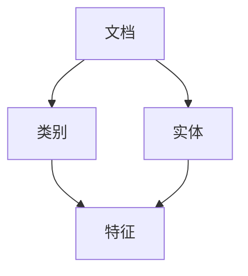
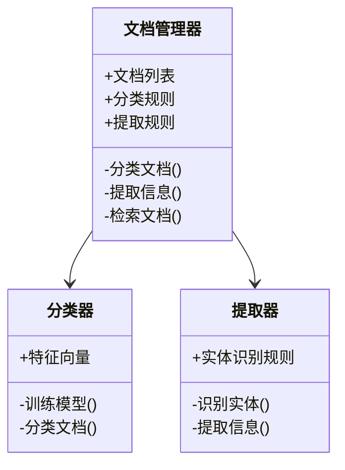
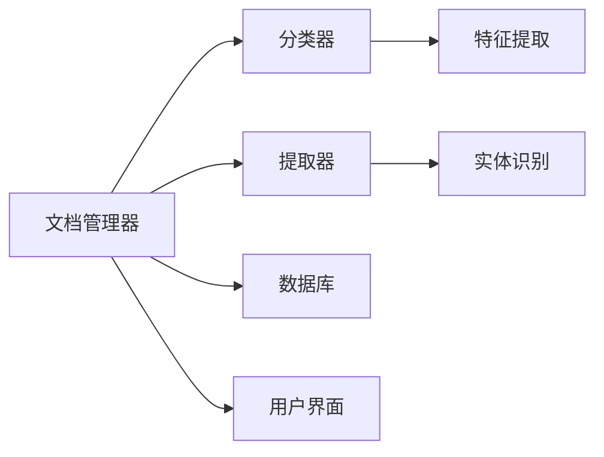
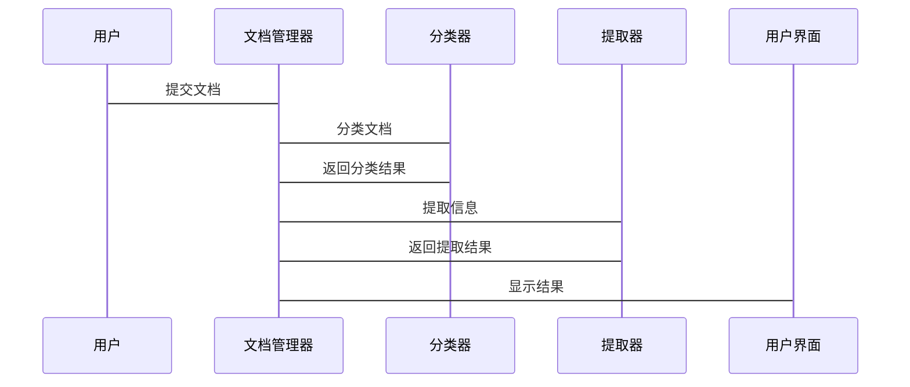

                 


# 构建智能企业文档管理系统：自动分类与信息提取

## 关键词：
- 智能文档管理
- 自动分类
- 信息提取
- 机器学习
- 自然语言处理
- 系统架构设计

## 摘要：
随着企业文档管理需求的日益增长，传统的文档管理方式已经难以满足现代企业的智能化需求。本文将详细探讨如何构建一个智能企业文档管理系统，重点介绍基于机器学习和自然语言处理技术的文档自动分类与信息提取方法。我们将从问题背景、核心概念、算法原理、系统架构设计、项目实战到最佳实践进行全面分析，帮助读者理解并掌握构建智能文档管理系统的完整流程。

---

# 第一部分：背景介绍与核心概念

## 第1章：问题背景与描述

### 1.1 问题背景
#### 1.1.1 传统文档管理的痛点
- 文档存储分散，难以统一管理
- 手工分类效率低，容易出错
- 信息提取依赖人工，耗时且成本高
- 文档检索效率低下，难以满足快速查询需求

#### 1.1.2 智能化文档管理的需求
- 自动化分类，提升管理效率
- 智能信息提取，释放数据价值
- 高效检索，支持业务决策
- 实时监控，确保数据安全

#### 1.1.3 企业文档管理的现状与挑战
- 数据量爆炸式增长
- 业务需求多样化
- 技术实现复杂性高
- 安全性与隐私保护要求高

### 1.2 问题描述
#### 1.2.1 文档分类与信息提取的目标
- 文档分类：基于内容特征，自动将文档归类到预定义的类别中
- 信息提取：从文档中提取关键信息（如实体、事件、关系等）

#### 1.2.2 企业文档管理的核心需求
- 高效性：快速分类和提取信息
- 准确性：分类和提取结果的高精度
- 可扩展性：支持多种文档类型和业务需求
- �易用性：用户友好，便于操作

#### 1.2.3 自动分类与信息提取的关键问题
- 如何选择合适的特征提取方法
- 如何设计高效的分类算法
- 如何实现高精度的信息提取
- 如何处理文档中的噪声和不确定性

## 第2章：核心概念与联系

### 2.1 核心概念原理
#### 2.1.1 文本分类的原理
- 基于特征提取和分类器的组合，对文本进行分类
- 常见分类器：朴素贝叶斯、支持向量机（SVM）、随机森林等

#### 2.1.2 信息提取的原理
- 从文本中提取特定实体（如人名、地点、时间等）
- 基于模式匹配或语义理解的技术

#### 2.1.3 自动分类与信息提取的关系
- 文档分类是信息提取的基础
- 信息提取可以为分类提供更细粒度的特征

### 2.2 核心概念对比
#### 2.2.1 文本分类与信息提取的属性特征对比
| 属性 | 文本分类 | 信息提取 |
|------|----------|----------|
| 目标 | 将文档归类到预定义类别 | 提取文档中的特定信息 |
| 输入 | 文本内容 | 文本内容 |
| 输出 | 类别标签 | 实体或事件 |

#### 2.2.2 两种技术的优缺点对比
- 文本分类的优点：高效、易于实现
- 信息提取的优点：精准、可扩展
- 文本分类的缺点：依赖特征工程
- 信息提取的缺点：需要大量训练数据

#### 2.2.3 核心概念的ER实体关系图



---

# 第二部分：算法原理与数学模型

## 第3章：文本分类算法原理

### 3.1 基于TF-IDF的文本分类
#### 3.1.1 TF-IDF原理与实现
- TF（Term Frequency）：词项在文档中的频率
- IDF（Inverse Document Frequency）：词项在所有文档中的倒数频率
- TF-IDF = TF * IDF

#### 3.1.2 基于TF-IDF的分类流程
1. 文本预处理（分词、去停用词）
2. 计算TF-IDF特征向量
3. 选择分类器（如朴素贝叶斯）
4. 训练模型并进行分类

#### 3.1.3 算法实现的数学模型
$$ \text{TF-IDF}(t, d) = \text{TF}(t, d) \times \text{IDF}(t) $$
$$ \text{IDF}(t) = \log\left(\frac{N}{\text{DF}(t)}\right) $$
其中，$N$是文档总数，$\text{DF}(t)$是包含词项$t$的文档数。

### 3.2 朴素贝叶斯分类器
#### 3.2.1 朴素贝叶斯原理
- 基于条件概率公式 $P(c|x) = \frac{P(x|c)P(c)}{P(x)}$
- 假设特征之间相互独立

#### 3.2.2 贝叶斯定理的数学公式
$$ P(c|x) = \frac{P(x|c)P(c)}{P(x)} $$
其中，$c$是类别，$x$是特征向量。

#### 3.2.3 分类器实现与优化
1. 文本预处理与特征提取
2. 训练贝叶斯模型
3. 模型评估与优化（如交叉验证）

---

## 第4章：信息提取算法原理

### 4.1 命名实体识别
#### 4.1.1 基于CRF的NER模型
- CRF（Conditional Random Fields）：条件随机场
- 通过上下文特征进行实体识别

#### 4.1.2 实体识别的数学模型
$$ P(y_i|x_i) = \frac{\exp(f(y_i, x_i))}{\sum_{c} \exp(f(c, x_i))} $$
其中，$f(y_i, x_i)$是特征函数。

#### 4.1.3 实例分析与代码实现
- 使用spaCy或NLTK等工具实现NER
- 代码示例：

```python
import spacy
nlp = spacy.load("en_core_web_sm")
doc = nlp("John works at Google in California.")
for ent in doc.ents:
    print(ent.text, ent.label_)
```

### 4.2 句法分析与信息抽取
#### 4.2.1 句法分析的原理
- 基于依存句法分析，识别句子结构
- 通过句法树提取信息

#### 4.2.2 基于依存句法的信息抽取
- 通过句法树提取主语、谓语等关键成分
- 示例：从句子中提取时间、地点等信息

#### 4.2.3 算法实现与优化
1. 选择句法分析工具（如NLTK、spaCy）
2. 设计规则或模式匹配
3. 模型训练与优化

---

# 第三部分：系统分析与架构设计

## 第5章：系统分析与设计

### 5.1 项目背景与目标
#### 5.1.1 项目背景
- 企业文档管理需求日益增长
- 传统方法效率低下，难以满足业务需求

#### 5.1.2 项目目标
- 实现文档的自动分类与信息提取
- 提供高效的文档管理与检索功能

### 5.2 系统功能设计
#### 5.2.1 领域模型类图



### 5.3 系统架构设计
#### 5.3.1 系统架构图



#### 5.3.2 系统交互序列图



### 5.4 系统接口设计
#### 5.4.1 输入接口
- 文档上传接口
- 分类规则配置接口

#### 5.4.2 输出接口
- 分类结果接口
- 提取结果接口

---

# 第四部分：项目实战

## 第6章：项目实战

### 6.1 环境安装
#### 6.1.1 安装Python和相关库
- 安装Python 3.x
- 安装NLTK、spaCy、scikit-learn等库

```bash
pip install numpy
pip install scikit-learn
pip install spacy
python -m spacy download en_core_web_sm
```

#### 6.1.2 安装Jieba（中文分词工具）
```bash
pip install jieba
```

### 6.2 系统核心实现

#### 6.2.1 文本预处理与特征提取
```python
from sklearn.feature_extraction.text import TfidfVectorizer
import jieba

# 示例文本
texts = ["这是一个测试文档。", "这是另一个测试文档。"]
# 分词
texts_segmented = [" ".join(jieba.cut(text)) for text in texts]
# TF-IDF特征提取
tfidf = TfidfVectorizer()
tfidf.fit(texts_segmented)
feature_names = tfidf.get_feature_names_out()
```

#### 6.2.2 分类器实现
```python
from sklearn.naive_bayes import MultinomialNB
from sklearn.metrics import accuracy_score

# 训练数据
X = [[1, 0, 0], [0, 1, 0], [0, 0, 1]]
y = [0, 1, 2]
# 训练模型
model = MultinomialNB()
model.fit(X, y)
# 预测
test_X = [[0, 1, 0]]
print(model.predict(test_X))
```

#### 6.2.3 实体识别实现
```python
import spacy

nlp = spacy.load("en_core_web_sm")
doc = nlp("John works at Google in California.")
for ent in doc.ents:
    print(ent.text, ent.label_)
```

### 6.3 案例分析与代码解读
- 案例：企业合同分类与信息提取
- 代码实现：从合同文本中提取公司名称、日期等信息

### 6.4 项目小结
- 项目实现的关键点
- 经验与教训
- 性能优化建议

---

# 第五部分：最佳实践与总结

## 第7章：最佳实践

### 7.1 小结
- 文本分类与信息提取的核心技术
- 系统架构设计的关键点
- 项目实施的注意事项

### 7.2 注意事项
- 数据预处理的重要性
- 特征选择的策略
- 模型调优与优化

### 7.3 拓展阅读
- 推荐书籍和论文
- 开源工具和技术社区

---

作者：AI天才研究院 & 禅与计算机程序设计艺术

