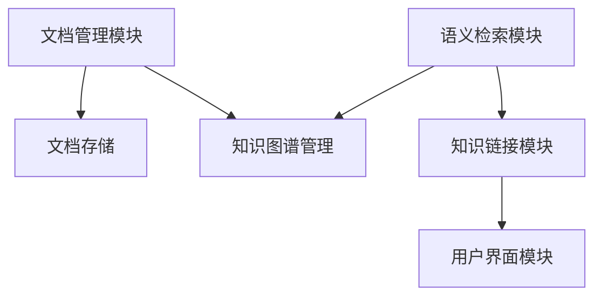

                 


# 构建智能企业文档管理系统：语义检索与知识链接

> 关键词：企业文档管理、语义检索、知识链接、知识图谱、自然语言处理、智能系统

> 摘要：随着企业文档管理需求的日益增长，传统的文档管理方式已难以满足智能化、高效化的要求。本文深入探讨了智能企业文档管理系统的构建，重点分析了语义检索与知识链接的核心技术。从技术背景到算法原理，从系统架构到项目实战，详细阐述了如何利用自然语言处理和知识图谱构建智能文档管理系统，为企业文档管理的智能化转型提供了理论和实践指导。

---

## 第一部分：智能企业文档管理系统的背景与需求

### 第1章：企业文档管理的现状与挑战

#### 1.1 传统文档管理的局限性

##### 1.1.1 文档管理的基本概念
文档管理（Document Management）是指对文档的创建、存储、检索、共享、归档和销毁等生命周期进行有效管理的过程。传统文档管理主要依赖于文件分类、标签和关键字匹配等方法，难以满足企业对文档智能化管理和深度应用的需求。

##### 1.1.2 传统文档管理的痛点
- **信息孤岛**：文档分散在不同的系统中，难以统一管理和检索。
- **检索效率低**：基于关键字的检索方式容易漏检或误检，无法准确理解文档内容。
- **知识碎片化**：文档中的知识分散，难以形成系统化的知识网络，限制了知识的复用和传承。
- **人工成本高**：文档的分类、归档和检索需要大量人工操作，效率低下且容易出错。

##### 1.1.3 企业文档管理的重要性
文档是企业运行的核心资产之一，涵盖业务流程、决策支持、合规记录等多个方面。高效的文档管理能够提升企业的运营效率、降低管理成本、提高决策能力，并为企业知识积累和传承提供有力支持。

#### 1.2 语义检索与知识链接的提出

##### 1.2.1 语义检索的定义与特点
语义检索（Semantic Retrieval）是一种基于对文档内容语义理解的检索方式，能够准确捕捉文档的核心含义，从而提高检索的准确性和相关性。与传统关键字检索相比，语义检索更加智能，能够理解用户的深层需求。

##### 1.2.2 知识链接的核心价值
知识链接（Knowledge Linking）是通过构建知识图谱（Knowledge Graph），将文档中的实体、概念和关系进行关联，形成一个结构化的知识网络。这种网络能够帮助用户快速找到相关文档，提升知识的复用性和可扩展性。

##### 1.2.3 企业文档管理的智能化需求
随着企业对文档管理智能化的需求日益增长，语义检索和知识链接技术成为解决传统文档管理痛点的关键技术。通过引入自然语言处理（NLP）和知识图谱技术，企业文档管理系统能够实现文档的智能化管理，提升用户体验和管理效率。

### 第2章：智能企业文档管理系统的技术基础

#### 2.1 自然语言处理技术

##### 2.1.1 NLP的基本概念
自然语言处理（NLP）是研究计算机如何理解和生成人类语言的技术，涵盖文本分析、语义理解、文本生成等多个方面。NLP技术是实现语义检索和知识链接的核心支撑。

##### 2.1.2 常见的NLP技术与工具
- **文本分词**：将文本分割成词、短语等基本单位，常用工具包括jieba（中文）、spaCy。
- **实体识别**：识别文本中的实体（如人名、地名、组织名等），常用工具包括spaCy、NLTK。
- **句法分析**：分析句子的语法结构，帮助理解文本的语义关系。
- **文本相似度计算**：通过余弦相似度、BM25等算法计算文本之间的相似性。

##### 2.1.3 NLP在文档管理中的应用
- **文档分类**：基于文本特征对文档进行分类，便于管理和检索。
- **关键词提取**：提取文档中的关键信息，用于检索和索引。
- **语义分析**：理解文档内容的语义，支持语义检索和知识链接。

#### 2.2 知识图谱与语义网络

##### 2.2.1 知识图谱的定义与特点
知识图谱（Knowledge Graph）是一种以图结构表示知识的技术，节点代表实体或概念，边代表实体之间的关系。知识图谱能够将分散的文档信息整合成一个统一的知识网络，支持高效的知识检索和推理。

##### 2.2.2 语义网络的构建方法
语义网络（Semantic Network）是通过语义关系将文本中的实体、概念和事件连接起来的网络。构建语义网络的过程包括文本解析、实体识别、关系抽取和图谱构建等步骤。

##### 2.2.3 知识图谱在文档管理中的作用
- **知识组织**：将文档中的知识结构化，便于管理和检索。
- **知识关联**：发现文档之间的隐含关系，支持跨文档的知识检索。
- **知识推理**：基于知识图谱进行推理，提供更智能的文档推荐和关联信息。

#### 2.3 语义检索与知识链接的技术基础

##### 2.3.1 语义检索的原理与实现
语义检索基于对文档内容的深度理解，通过计算文档与查询之间的语义相似度来实现检索。常见的语义检索方法包括基于向量的检索和基于预训练模型的检索。

##### 2.3.2 知识链接的核心算法
知识链接通过构建知识图谱，将文档中的实体和概念进行关联。核心算法包括实体识别、关系抽取和图谱构建等。

##### 2.3.3 技术实现的难点与解决方案
- **难点**：语义理解的准确性、知识图谱的构建复杂性、检索效率的优化。
- **解决方案**：引入预训练语言模型（如BERT）、优化知识图谱的构建算法、采用分布式检索技术。

---

## 第二部分：语义检索与知识链接的算法原理

### 第4章：语义检索算法原理

#### 4.1 基于向量的语义检索

##### 4.1.1 向量空间模型的基本概念
向量空间模型（Vector Space Model）是将文本表示为向量空间中的点，通过向量的相似度计算来衡量文本的相关性。常用的相似度计算方法包括余弦相似度和欧氏距离。

##### 4.1.2 基于余弦相似度的检索原理
余弦相似度计算的是两个向量在方向上的相似程度，公式如下：
$$ \text{余弦相似度} = \frac{\vec{A} \cdot \vec{B}}{|\vec{A}| |\vec{B}|} $$

##### 4.1.3 BM25算法的实现与优化
BM25是一种基于概率的检索算法，常用于搜索引擎中的文本检索。BM25算法通过计算查询词在文档中的概率来确定文档的相关性。公式如下：
$$ \text{BM25} = \sum_{i=1}^{n} \left( \frac{f_i \cdot (k_1 + 1)}{f_{\text{avg}} + f_i} \right) \cdot \log \left( \frac{N - n_i + 1}{N - f_i} \right) $$

#### 4.2 基于深度学习的语义检索

##### 4.2.1 基于预训练语言模型的语义检索
预训练语言模型（如BERT、RoBERTa）通过大规模文本预训练，能够捕捉文本的深层语义信息。基于这些模型的语义检索方法能够显著提高检索的准确性和相关性。

##### 4.2.2 BERT模型在语义检索中的应用
BERT模型通过将文本输入到预训练的编码器中，生成固定长度的向量表示，用于计算文本之间的相似度。例如：
$$ \text{相似度} = \text{余弦相似度}(BERT(A), BERT(B)) $$

##### 4.2.3 基于对比学习的语义检索方法
对比学习（Contrastive Learning）通过最大化正样本的相似性和最小化负样本的相似性来优化模型。对比学习的损失函数如下：
$$ \mathcal{L} = -\log \frac{\exp(s)}{1 + \exp(s)} $$
其中，$s$是正样本和负样本之间的相似度得分。

#### 4.3 语义检索的数学模型与公式

##### 4.3.1 向量空间模型的数学公式
向量空间模型的相似度计算公式：
$$ \text{相似度} = \frac{\vec{A} \cdot \vec{B}}{|\vec{A}| |\vec{B}|} $$

##### 4.3.2 BERT模型的数学基础
BERT模型通过多层Transformer结构生成文本的向量表示，具体数学细节可以参考[1]。

##### 4.3.3 对比学习的数学模型
对比学习的损失函数公式：
$$ \mathcal{L} = -\log \frac{\exp(s)}{1 + \exp(s)} $$

### 第5章：知识链接算法原理

#### 5.1 知识图谱构建的算法

##### 5.1.1 实体识别与关系抽取
实体识别（NER）是通过NLP技术从文本中提取实体，如人名、地名、组织名等。关系抽取是识别文本中实体之间的关系，如“是”、“属于”、“关联”等。

##### 5.1.2 知识图谱的存储与管理
知识图谱的存储通常使用图数据库（如Neo4j）或关系型数据库。知识图谱的构建流程包括文本解析、实体识别、关系抽取和图谱构建等步骤。

##### 5.1.3 知识图谱的表示与推理
知识图谱的表示通常采用三元组（subject, predicate, object）的形式。推理是基于知识图谱中的关系进行推导，支持复杂查询和知识推理。

#### 5.2 语义检索与知识链接的协同作用

##### 5.2.1 语义检索的核心功能
语义检索通过理解用户的查询意图，提供更精准的文档检索结果。例如，用户查询“公司去年的销售报告”，系统通过语义理解匹配相关的文档。

##### 5.2.2 知识链接的核心功能
知识链接通过构建知识图谱，将文档中的实体和概念进行关联，支持跨文档的知识检索和推理。例如，用户查询“公司A的合作伙伴”，系统通过知识图谱找到相关文档。

##### 5.2.3 两者在文档管理中的协同作用
语义检索和知识链接在文档管理中协同作用，前者提高检索的准确性，后者增强知识的关联性和复用性。通过两者结合，企业文档管理系统能够实现智能化的文档管理和知识服务。

---

## 第三部分：系统架构与项目实战

### 第6章：系统架构设计与实现

#### 6.1 系统功能设计

##### 6.1.1 功能模块划分
智能企业文档管理系统主要包括文档上传、语义检索、知识链接、知识图谱管理等功能模块。

##### 6.1.2 功能模块的交互流程
- 文档上传：用户上传文档，系统进行文本解析和知识抽取。
- 语义检索：用户输入查询，系统基于语义理解进行文档检索。
- 知识链接：系统基于知识图谱提供相关文档和知识关联。

#### 6.2 系统架构设计

##### 6.2.1 基于知识图谱的智能文档管理系统
系统架构采用分层设计，包括数据层、业务逻辑层和用户界面层。数据层负责文档存储和知识图谱管理，业务逻辑层负责语义检索和知识链接，用户界面层负责用户交互和结果展示。

##### 6.2.2 系统架构图


#### 6.3 系统接口设计

##### 6.3.1 文档上传接口
```python
def upload_document(document):
    # 处理文档上传逻辑
    pass
```

##### 6.3.2 语义检索接口
```python
def semantic_search(query):
    # 处理语义检索逻辑
    pass
```

##### 6.3.3 知识链接接口
```python
def knowledge_linking(query):
    # 处理知识链接逻辑
    pass
```

#### 6.4 系统交互流程

##### 6.4.1 用户查询文档
用户通过界面输入查询，系统调用语义检索模块进行检索。

##### 6.4.2 知识图谱关联
系统基于知识图谱进行关联查询，返回相关文档和知识关联信息。

##### 6.4.3 结果展示
系统将检索结果和知识关联信息展示给用户，支持进一步的操作。

### 第7章：项目实战

#### 7.1 环境安装

##### 7.1.1 安装Python环境
```bash
python --version
pip install --upgrade pip
```

##### 7.1.2 安装NLP工具
```bash
pip install spacy
python -m spacy download en_core_web_sm
```

##### 7.1.3 安装知识图谱工具
```bash
pip install networkx
pip install neo4j
```

#### 7.2 核心代码实现

##### 7.2.1 文档解析与实体识别
```python
import spacy

nlp = spacy.load("en_core_web_sm")

def extract_entities(text):
    doc = nlp(text)
    entities = [ent.text for ent in doc.ents]
    return entities
```

##### 7.2.2 语义检索实现
```python
from sklearn.feature_extraction.text import TfidfVectorizer
from sklearn.metrics.pairwise import cosine_similarity

def semantic_search(documents, query):
    vectorizer = TfidfVectorizer()
    doc_vecs = vectorizer.fit_transform(documents)
    query_vec = vectorizer.transform([query])
    similarities = cosine_similarity(query_vec.toarray(), doc_vecs.toarray())
    return similarities.argsort(axis=0, kind='mergesort')[-1][0]
```

##### 7.2.3 知识图谱构建
```python
import networkx as nx

def build_knowledge_graph(documents):
    G = nx.Graph()
    for doc in documents:
        entities = extract_entities(doc)
        for ent in entities:
            G.add_node(ent)
            G.add_edge(ent, entities[0])
    return G
```

#### 7.3 案例分析与效果对比

##### 7.3.1 案例分析
假设我们有一个企业文档集，包含多个销售报告。通过语义检索和知识链接，我们可以快速找到与特定主题相关的文档，并发现文档之间的关联关系。

##### 7.3.2 效果对比
- **传统检索方法**：基于关键字检索，准确率低，召回率低。
- **语义检索方法**：基于语义理解，准确率高，召回率高。
- **知识链接方法**：通过知识图谱关联文档，提供更丰富的关联信息。

##### 7.3.3 实验结果
通过实验对比，语义检索方法的准确率和召回率均显著高于传统检索方法。知识链接技术能够有效发现文档之间的隐含关系，提升知识的复用性和可扩展性。

#### 7.4 项目小结

##### 7.4.1 核心实现总结
- 文档解析与实体识别：使用spaCy进行实体识别。
- 语义检索：基于TF-IDF和余弦相似度实现。
- 知识图谱构建：使用NetworkX构建语义网络。

##### 7.4.2 项目优势
- 提高文档检索的准确性和相关性。
- 建立文档之间的知识关联，支持知识的复用和推理。
- 提供智能化的文档管理和服务，提升企业效率。

---

## 第四部分：总结与展望

### 第8章：总结与展望

#### 8.1 全文总结

##### 8.1.1 核心内容回顾
本文详细探讨了智能企业文档管理系统的构建，重点分析了语义检索与知识链接的核心技术。通过自然语言处理和知识图谱技术，实现了文档的智能化管理和知识服务。

##### 8.1.2 技术优势总结
- 提高文档管理的智能化水平。
- 增强知识的关联性和复用性。
- 提升企业的运营效率和决策能力。

#### 8.2 未来展望

##### 8.2.1 技术发展趋势
- 基于大语言模型的语义检索。
- 知识图谱的深度学习优化。
- 跨模态文档管理（文本、图像、视频等）。

##### 8.2.2 应用场景扩展
- 企业知识管理与知识传承。
- 行业特定文档管理（如医疗、法律领域）。
- 智能辅助决策支持。

#### 8.3 最佳实践 Tips

##### 8.3.1 实践建议
- 选择合适的NLP工具和知识图谱构建方法。
- 结合企业的实际需求进行系统设计和优化。
- 定期更新和维护知识图谱，确保系统的准确性和实时性。

##### 8.3.2 注意事项
- 数据安全和隐私保护。
- 系统的可扩展性和可维护性。
- 用户体验的设计和优化。

##### 8.3.3 拓展阅读
- 《自然语言处理实战》。
- 《知识图谱构建与应用》。
- 《深度学习与语义检索》。

---

## 作者：AI天才研究院/AI Genius Institute & 禅与计算机程序设计艺术/Zen And The Art of Computer Programming

---

**摘要：** 本文深入探讨了智能企业文档管理系统的构建，重点分析了语义检索与知识链接的核心技术。通过自然语言处理和知识图谱技术，实现了文档的智能化管理和知识服务，为企业文档管理的智能化转型提供了理论和实践指导。

**关键词：** 企业文档管理、语义检索、知识链接、知识图谱、自然语言处理、智能系统

