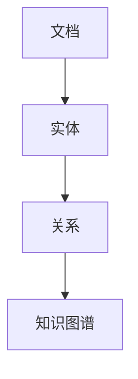
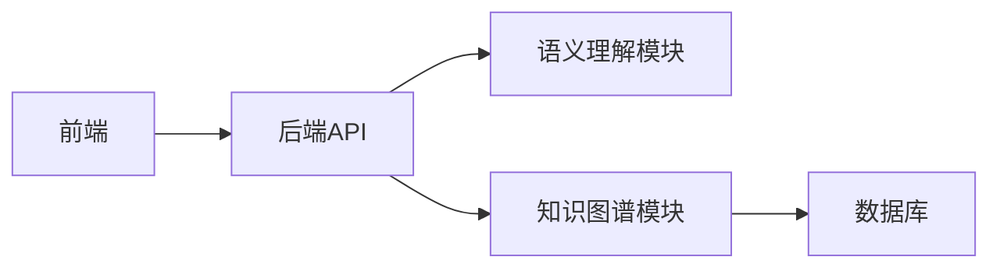

                 


# 构建智能企业文档管理系统：语义理解与知识链接

> **关键词**：企业文档管理，语义理解，知识图谱，知识链接，深度学习，自然语言处理，智能系统

> **摘要**：本文详细探讨了构建智能企业文档管理系统的关键技术和方法，重点分析了语义理解与知识链接的核心作用，结合实际案例，系统性地介绍了从理论到实践的完整过程，为构建高效、智能的企业文档管理系统提供参考。

---

## 第一章：背景介绍

### 1.1 问题背景与描述

随着企业数字化转型的深入推进，文档管理系统的智能化需求日益迫切。传统文档管理系统主要依赖关键词匹配和基于规则的分类，难以理解文档的语义信息，导致效率低下、信息利用不足等问题。企业文档管理系统需要从简单的存储、检索功能，向智能化的语义理解、知识关联方向发展。

#### 1.1.1 传统文档管理系统的局限性

传统文档管理系统存在以下问题：

1. **语义理解能力弱**：无法理解文档内容的深层含义，仅能基于关键词匹配。
2. **知识关联性差**：文档间缺乏有效的知识关联，难以支持跨文档的知识检索和推理。
3. **用户体验不足**：用户难以快速找到所需信息，尤其是在处理大量文档时效率低下。

#### 1.1.2 智能文档管理的需求驱动

随着人工智能技术的发展，智能文档管理系统应运而生，其需求主要来源于以下几个方面：

1. **企业知识管理**：企业需要将分散在各类文档中的知识进行整合和关联，以便快速检索和利用。
2. **高效信息检索**：通过语义理解，提升信息检索的准确性和效率。
3. **智能化决策支持**：基于文档中的语义信息和知识关联，支持企业决策。

#### 1.1.3 语义理解与知识链接的重要性

语义理解是智能文档管理的核心技术，它能够从文档中提取出深层次的信息，如实体识别、关系抽取、情感分析等。知识链接则是将这些语义信息进行关联，构建知识图谱，从而实现跨文档的知识检索和推理。

### 1.2 问题解决与边界

#### 1.2.1 语义理解在文档管理中的应用

语义理解技术在文档管理中的应用主要体现在以下几个方面：

1. **实体识别**：从文档中提取出人名、地名、组织名等实体信息。
2. **关系抽取**：识别文档中实体之间的关系，如“公司A与公司B签订合同”。
3. **语义检索**：基于语义理解进行文档检索，而不是简单的关键词匹配。

#### 1.2.2 知识链接的核心作用

知识链接是将文档中的语义信息进行关联，构建知识图谱，其核心作用包括：

1. **知识关联**：将分散在不同文档中的信息关联起来，形成知识网络。
2. **知识推理**：基于知识图谱进行推理，支持复杂查询和决策。
3. **知识扩展**：通过知识图谱的关联，扩展文档中的隐含知识。

#### 1.2.3 系统的边界与外延

智能企业文档管理系统的边界主要限定在文档的语义理解与知识链接功能，不包括文档的存储与基本检索功能。系统的外延则包括与知识图谱相关的数据处理、知识推理和可视化展示。

### 1.3 核心概念组成

智能企业文档管理系统的核心概念包括：

1. **文档管理**：文档的存储、分类、检索等基本功能。
2. **语义理解**：通过自然语言处理技术，提取文档中的语义信息。
3. **知识链接**：将语义信息进行关联，构建知识图谱。

---

## 第二章：核心概念与联系

### 2.1 语义理解的原理

语义理解是智能文档管理的核心技术，其原理主要包括以下几个方面：

#### 2.1.1 语义理解的基本概念

语义理解是指通过自然语言处理技术，理解文本的深层含义，包括实体识别、关系抽取、情感分析等任务。

#### 2.1.2 预训练语言模型的作用

预训练语言模型（如BERT、GPT）在语义理解中起到关键作用，能够通过大规模的无监督学习，掌握语言的语义信息。

#### 2.1.3 语义表示的方法

语义表示方法包括词嵌入（Word2Vec）、句嵌入（Sentence-BERT）等，用于将文本转化为向量形式，便于计算语义相似度。

### 2.2 知识图谱与知识链接

知识图谱是一种结构化的知识表示形式，通过实体和关系构建语义网络。知识链接则是将分散的文档信息关联到知识图谱中。

#### 2.2.1 知识图谱的构建

知识图谱的构建过程包括数据抽取、实体识别、关系抽取和知识融合等步骤。

#### 2.2.2 知识链接的实现机制

知识链接通过将文档中的实体和关系映射到知识图谱中，实现知识的关联和共享。

#### 2.2.3 知识图谱的存储与查询

知识图谱通常存储在图数据库中，查询时可以通过SPARQL等查询语言进行复杂关联查询。

### 2.3 核心概念对比表

以下是核心概念的对比表：

| 概念 | 属性 | 特征 |
|------|------|------|
| 语义理解 | 输入 | 文本内容 |
| 语义理解 | 输出 | 实体、关系、语义向量 |
| 知识链接 | 输入 | 实体、关系 |
| 知识链接 | 输出 | 知识图谱 |

### 2.4 ER实体关系图

以下是ER实体关系图的Mermaid表示：



---

## 第三章：算法原理讲解

### 3.1 预训练语言模型

预训练语言模型是语义理解的核心技术，以下是其算法原理：

#### 3.1.1 模型结构

预训练语言模型通常采用Transformer架构，包括编码器和解码器。

#### 3.1.2 训练目标

预训练目标包括掩码语言模型任务和Next Sentence Prediction任务。

#### 3.1.3 前向传播

前向传播过程如下：

1. 输入文本经过嵌入层转化为向量。
2. 经过多层Transformer编码器进行处理。
3. 最后一层输出结果用于后续任务。

#### 3.1.4 损失函数

预训练模型常用的损失函数是交叉熵损失函数：

$$ L = -\sum_{i=1}^{n} \log p(y_i|x_i) $$

### 3.2 注意力机制

注意力机制是Transformer模型的核心组件，用于计算输入序列中每个位置的关注程度。

#### 3.2.1 注意力计算

注意力计算公式如下：

$$ \alpha_i = \frac{\exp(e_i)}{\sum_{j} \exp(e_j)} $$

其中，$e_i$ 是查询与第i个键的相似度。

---

## 第四章：系统分析与架构设计

### 4.1 问题场景介绍

企业文档管理系统需要处理大量的文档数据，包括文档的上传、存储、语义分析和知识关联。

### 4.2 系统功能设计

系统功能包括文档上传、语义分析、知识关联和知识图谱查询。

### 4.3 系统架构设计

以下是系统架构的Mermaid表示：



---

## 第五章：项目实战

### 5.1 环境安装

需要安装Python、TensorFlow、Flask等工具。

### 5.2 核心代码实现

以下是核心代码示例：

```python
import tensorflow as tf
from tensorflow.keras.layers import Input, Dense

# 定义模型
input_layer = Input(shape=(100,))
dense_layer = Dense(50, activation='relu')(input_layer)
output_layer = Dense(1, activation='sigmoid')(dense_layer)

model = tf.keras.Model(inputs=input_layer, outputs=output_layer)
model.compile(optimizer='adam', loss='binary_crossentropy', metrics=['accuracy'])
```

### 5.3 代码解读与分析

上述代码定义了一个简单的神经网络模型，用于文本分类任务。

### 5.4 实际案例分析

通过实际案例分析，展示系统的应用和效果。

---

## 第六章：最佳实践

### 6.1 小结

本文详细介绍了智能企业文档管理系统的构建过程，包括语义理解与知识链接的核心技术。

### 6.2 注意事项

在实际应用中，需要注意模型的训练数据质量和知识图谱的构建效率。

### 6.3 拓展阅读

推荐读者进一步学习知识图谱构建和自然语言处理的相关知识。

---

## 作者

**作者：AI天才研究院/AI Genius Institute & 禅与计算机程序设计艺术 /Zen And The Art of Computer Programming**

---

通过以上结构和内容，我们能够系统性地构建一个智能企业文档管理系统，实现语义理解与知识链接的核心功能，为企业提供高效、智能的文档管理解决方案。

