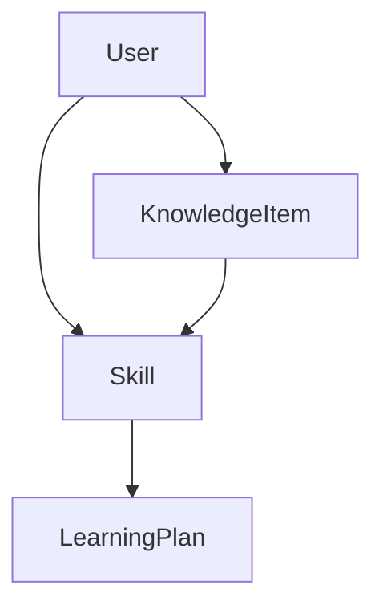
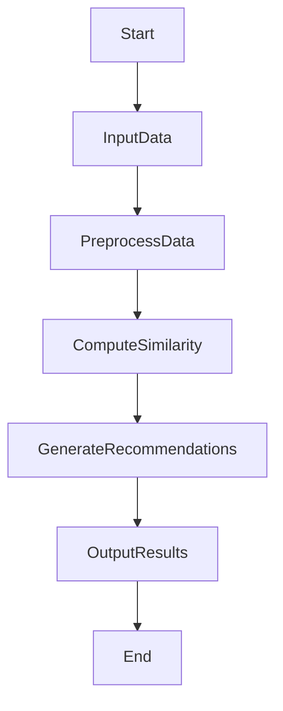
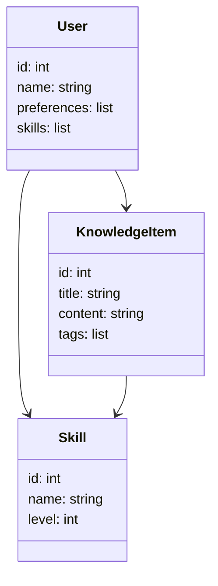
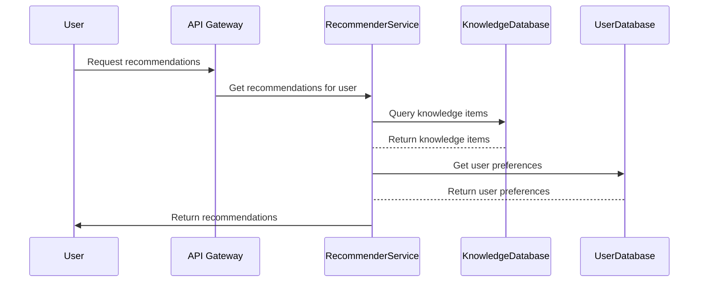

                 


# 构建智能企业知识推荐系统：个性化学习与技能提升

**关键词**：智能企业知识推荐系统、个性化学习、技能提升、推荐算法、知识管理

**摘要**：  
本文将详细探讨如何构建一个智能企业知识推荐系统，以实现个性化学习与技能提升的目标。通过分析企业知识管理的现状与挑战，阐述知识推荐系统的核心概念与算法原理，并结合实际案例，展示系统的设计与实现过程。最终，本文将总结系统的最佳实践，为企业提供有效的解决方案。

---

# 第一部分: 背景介绍

# 第1章: 问题背景与需求分析

## 1.1 问题背景

### 1.1.1 企业知识管理的现状与挑战
企业在知识管理方面面临以下挑战：
1. 知识分散：员工的知识分布零散，难以高效共享。
2. 更新滞后：知识更新速度跟不上企业发展需求。
3. 个性化不足：传统知识管理缺乏针对个人需求的推荐机制。

### 1.1.2 个性化学习与技能提升的需求
1. 员工成长需求：员工希望获得适合自己的学习资源。
2. 企业目标：企业需要通过员工技能提升来提高竞争力。
3. 知识推荐的必要性：通过推荐系统实现知识的精准分发。

### 1.1.3 知识推荐系统的核心价值
1. 提高学习效率：为员工推荐相关知识，减少无效学习时间。
2. 促进知识共享：通过推荐系统推动企业内部知识的流动。
3. 支持决策：基于知识推荐，帮助企业做出更明智的决策。

## 1.2 问题描述

### 1.2.1 传统知识管理的局限性
1. 知识孤岛：各部门之间的知识难以整合。
2. 需求匹配度低：传统推荐系统无法精准匹配员工需求。
3. 维护成本高：知识更新和维护需要大量人工投入。

### 1.2.2 个性化学习的痛点
1. 学习资源繁多：员工难以找到适合自己的学习资料。
2. 时间限制：员工需要快速获取所需知识。
3. 激励不足：缺乏个性化推荐导致员工学习积极性不高。

### 1.2.3 知识推荐系统的目标与边界
目标：
- 构建一个智能化的知识推荐系统，实现个性化学习与技能提升。
边界：
- 仅关注企业内部知识的推荐，不涉及外部资源。

## 1.3 问题解决

### 1.3.1 知识推荐系统的解决方案
1. 引入推荐算法，实现精准的知识推荐。
2. 建立知识库，整合企业内部资源。
3. 提供个性化学习路径，帮助员工提升技能。

### 1.3.2 个性化学习与技能提升的实现路径
1. 数据采集：收集员工的学习偏好和行为数据。
2. 知识建模：将知识进行结构化处理，便于推荐。
3. 推荐算法：基于算法为员工推荐相关知识。
4. 反馈优化：根据员工反馈不断优化推荐结果。

### 1.3.3 系统的边界与外延
- 边界：仅关注企业内部知识的推荐。
- 外延：未来可以扩展到外部知识资源。

## 1.4 本章小结
本章分析了企业知识管理的现状与挑战，提出了个性化学习与技能提升的需求，并探讨了知识推荐系统的核心价值和目标。为后续章节的深入分析奠定了基础。

---

# 第2章: 核心概念解析

## 2.1 知识推荐系统的定义与特点

### 2.1.1 知识推荐系统的定义
知识推荐系统是一种基于人工智能技术，通过分析用户行为和知识内容，为用户提供个性化知识推荐的服务系统。

### 2.1.2 系统的核心特点
1. 个性化：根据用户需求推荐相关内容。
2. 智能化：利用机器学习算法实现自动推荐。
3. 实时性：能够快速响应用户需求。

## 2.2 个性化学习与技能提升的原理

### 2.2.1 个性化学习的定义
个性化学习是指根据学习者的个性特征、学习目标和学习风格，提供定制化的学习方案。

### 2.2.2 技能提升的核心要素
1. 学习目标：明确的学习方向。
2. 学习资源：相关的学习资料。
3. 学习路径：系统的学习顺序。

### 2.2.3 个性化学习与知识推荐的关联
知识推荐系统为个性化学习提供支持，通过推荐相关知识，帮助员工实现技能提升。

## 2.3 知识推荐系统的实体关系图



---

# 第3章: 知识推荐算法原理

## 3.1 知识推荐的核心算法

### 3.1.1 协同过滤算法
1. 基于用户的协同过滤：根据用户行为相似性推荐知识。
2. 基于物品的协同过滤：根据知识内容相似性推荐知识。

### 3.1.2 基于内容的推荐算法
1. 通过分析知识内容的特征，推荐相关知识。

### 3.1.3 混合推荐算法
结合协同过滤和基于内容的推荐算法，提高推荐精度。

## 3.2 算法实现流程

### 协同过滤算法实现流程



### Python代码示例

```python
def collaborative_filtering(user_id, user_matrix):
    # 计算用户相似度
    similarities = compute_similarities(user_matrix)
    # 获取相似用户的推荐
    recommendations = get_recommendations(similarities, user_id)
    return recommendations
```

### 数学模型与公式

$$ sim(u, v) = \frac{\sum_{i}(r_{u,i} - \mu_u)(r_{v,i} - \mu_v)}{\sqrt{\sum_{i}(r_{u,i} - \mu_u)^2} \sqrt{\sum_{i}(r_{v,i} - \mu_v)^2}} $$

---

# 第4章: 系统分析与架构设计

## 4.1 问题场景介绍

### 项目介绍
构建一个智能企业知识推荐系统，实现个性化学习与技能提升。

## 4.2 系统功能设计

### 领域模型类图



## 4.3 系统架构设计

### 系统架构图

```mermaid
graph LR
    Client --> API Gateway
    API Gateway --> RecommenderService
    RecommenderService --> KnowledgeDatabase
    KnowledgeDatabase --> UserDatabase
```

## 4.4 系统接口设计

### 接口设计
1. `/api/v1/recommend/knowledge?id=123`
2. `/api/v1/user/preferences`

## 4.5 系统交互流程图



---

# 第5章: 项目实战

## 5.1 环境安装

### 安装Python
```bash
python --version
pip install --upgrade pip
```

### 安装TensorFlow
```bash
pip install tensorflow
```

## 5.2 系统核心实现

### 推荐算法实现
```python
def compute_similarities(user_matrix):
    # 计算余弦相似度
    similarities = np.zeros((n_users, n_users))
    for i in range(n_users):
        for j in range(n_users):
            similarities[i,j] = cosine_similarity(user_matrix[i], user_matrix[j])
    return similarities
```

### 知识库构建
```python
knowledge_base = {
    'knowledge_item_1': {
        'title': '机器学习基础',
        'content': '介绍机器学习的基本概念...',
        'tags': ['机器学习', '人工智能']
    },
    'knowledge_item_2': {
        'title': '深度学习进阶',
        'content': '深度学习的高级技巧...',
        'tags': ['深度学习', '神经网络']
    }
}
```

## 5.3 案例分析与解读

### 案例分析
假设一个员工需要提升“机器学习”技能，系统会推荐以下知识：
1. 机器学习基础（必修）
2. 深度学习进阶（选修）
3. 相关技能：人工智能、数据处理。

## 5.4 项目小结
通过实际案例分析，展示了知识推荐系统的实现过程和实际应用。

---

# 第6章: 最佳实践与总结

## 6.1 最佳实践 tips

### 系统优化建议
1. 定期更新知识库，保持内容的准确性。
2. 优化推荐算法，提高推荐精度。

### 技术建议
1. 引入机器学习框架（如TensorFlow）提升推荐效率。
2. 使用分布式系统，提高系统的可扩展性。

## 6.2 小结
本文详细探讨了智能企业知识推荐系统的构建过程，从理论到实践，为企业的个性化学习与技能提升提供了有效的解决方案。

## 6.3 注意事项
1. 数据隐私保护：确保用户数据的安全性。
2. 系统维护：定期更新和优化系统。

## 6.4 拓展阅读
1. 《推荐系统实战：基于Python的推荐算法实现》
2. 《机器学习在企业知识管理中的应用》

---

# 作者：AI天才研究院/AI Genius Institute & 禅与计算机程序设计艺术 /Zen And The Art of Computer Programming

---

以上是文章的详细目录大纲和部分示例内容，您可以根据实际需求扩展每一部分的内容。如果需要进一步的修改和完善，请随时告诉我！

