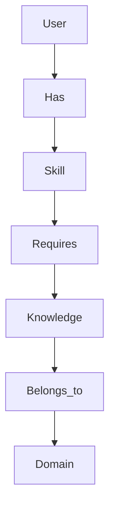
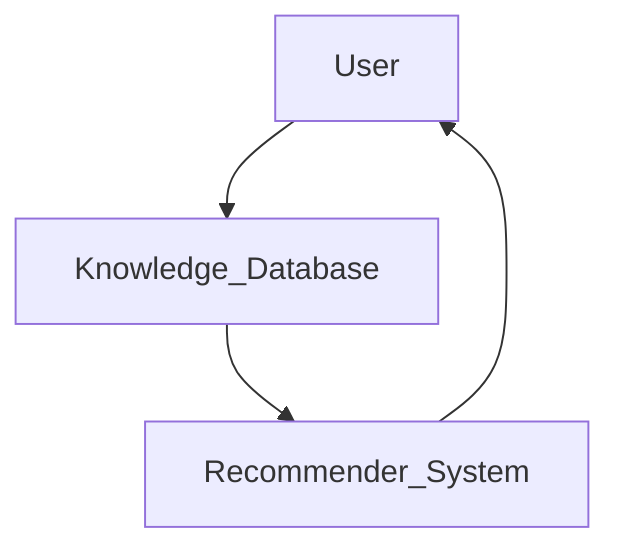
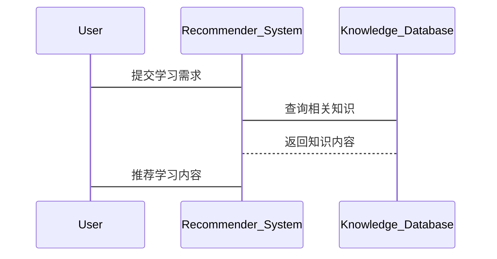

                 

# 构建智能企业知识推荐系统：个性化学习与技能提升路径规划

> 关键词：知识推荐系统, 个性化学习, 技能提升, 知识图谱, 推荐算法

> 摘要：  
> 本文深入探讨了构建智能企业知识推荐系统的核心原理与实践方法，结合个性化学习与技能提升路径规划的场景，系统地分析了知识推荐系统的背景、核心概念、算法原理、系统架构及项目实施。通过实际案例和最佳实践，详细讲解了如何利用知识图谱、推荐算法和个性化模型构建高效的知识推荐系统，助力企业实现员工学习与技能提升的精准化和智能化。

---

# 第1章: 问题背景与需求分析

## 1.1 问题背景

### 1.1.1 企业知识管理的现状与挑战
在现代企业中，知识管理的重要性日益凸显。企业拥有海量的知识资源，包括文档、培训材料、技能要求等，但这些资源往往分散在不同的系统中，难以被员工有效利用。传统的知识管理方式依赖人工检索和筛选，效率低下，且难以满足个性化学习的需求。

### 1.1.2 个性化学习与技能提升的重要性
员工的技能提升路径因人而异，不同岗位、不同发展阶段的员工需要不同的学习资源。个性化学习能够根据员工的当前技能水平、职业目标和学习偏好，推荐适合的学习内容，从而提高学习效率和效果。

### 1.1.3 知识推荐系统在企业中的应用价值
知识推荐系统通过智能化的算法和知识图谱，能够将分散的知识资源进行整合，并根据员工的需求进行精准推荐。这不仅提高了知识的利用率，还为企业节省了培训成本，同时提升了员工的学习体验和技能提升效率。

## 1.2 知识推荐系统的定义与特点

### 1.2.1 知识推荐系统的定义
知识推荐系统是一种基于知识图谱和推荐算法，结合个性化学习需求，为企业员工推荐相关知识资源的系统。

### 1.2.2 知识推荐系统的核心特点
1. **知识整合**：整合企业内外部的知识资源，构建知识图谱。
2. **个性化推荐**：根据员工的学习需求和技能水平，推荐个性化学习内容。
3. **动态更新**：根据员工的学习反馈和行为数据，动态优化推荐结果。
4. **实时性**：能够实时响应员工的知识需求，提供即时推荐。

### 1.2.3 与传统推荐系统的区别
传统推荐系统主要基于用户的行为数据，推荐商品或内容，而知识推荐系统更注重知识的结构化表示和领域特定性，结合专业知识图谱进行推荐。

## 1.3 企业知识推荐系统的应用场景

### 1.3.1 企业培训与学习
通过知识推荐系统，员工可以快速找到适合自己的培训课程和学习材料，提升工作效率和技能水平。

### 1.3.2 技能提升路径规划
系统可以根据员工的当前技能水平和职业目标，推荐适合的技能提升路径，帮助员工制定个性化的职业发展计划。

### 1.3.3 知识共享与协作
知识推荐系统可以促进企业内部的知识共享与协作，帮助员工更好地利用团队的集体智慧，解决工作中的实际问题。

## 1.4 本章小结
本章从企业知识管理的现状出发，分析了个性化学习与技能提升的重要性，提出了知识推荐系统的定义和特点，并探讨了其在企业中的应用场景。

---

# 第2章: 核心概念与联系

## 2.1 知识推荐系统的核心概念

### 2.1.1 知识图谱
知识图谱是一种结构化的知识表示形式，由实体和关系组成。例如，"技能"是实体，"属于"是关系，表示技能属于某个领域。

### 2.1.2 推荐算法
推荐算法是知识推荐系统的核心，包括协同过滤、基于深度学习的推荐算法等。

### 2.1.3 个性化模型
个性化模型用于根据用户的需求和行为数据，生成个性化的推荐结果。

## 2.2 核心概念的联系与对比

### 2.2.1 知识图谱与推荐算法的对比
知识图谱提供了结构化的知识表示，而推荐算法基于用户行为数据，两者结合可以提升推荐的准确性和个性化。

### 2.2.2 个性化模型与知识图谱的结合
个性化模型可以利用知识图谱中的结构化知识，生成更精准的推荐结果。

### 2.2.3 知识推荐系统的整体架构
知识推荐系统的整体架构包括知识图谱构建、推荐算法设计、个性化模型优化和结果展示。

## 2.3 知识推荐系统的ER实体关系图

---

# 第3章: 知识推荐系统的算法原理

## 3.1 协同过滤算法

### 3.1.1 基于用户的协同过滤
基于用户的协同过滤算法通过寻找与当前用户相似的用户群体，推荐相似用户喜欢的物品。例如，如果用户A和用户B的兴趣相似，用户B喜欢课程X，那么系统会推荐课程X给用户A。

### 3.1.2 基于物品的协同过滤
基于物品的协同过滤算法通过分析物品之间的相似性，推荐与当前用户已选择的物品相似的其他物品。例如，如果用户A选择了课程X，系统会推荐与课程X相似的课程Y。

### 3.1.3 混合协同过滤
混合协同过滤结合了基于用户和基于物品的协同过滤，通过综合考虑用户和物品的特征，生成更准确的推荐结果。

## 3.2 基于深度学习的推荐算法

### 3.2.1 基于神经网络的推荐模型
基于神经网络的推荐模型通过深度学习技术，自动提取数据中的特征，生成推荐结果。例如，使用神经网络模型对用户的行为数据进行建模，生成推荐结果。

### 3.2.2 基于注意力机制的推荐
基于注意力机制的推荐算法通过关注用户行为中的重要部分，生成推荐结果。例如，在用户行为序列中，某些行为可能比其他行为更重要，注意力机制可以突出这些重要行为。

### 3.2.3 基于序列的推荐模型
基于序列的推荐模型通过分析用户行为的序列模式，生成推荐结果。例如，分析用户购买商品的序列，预测用户下一步可能购买的商品。

## 3.3 混合推荐算法

### 3.3.1 协同过滤与深度学习的结合
混合推荐算法结合了协同过滤和深度学习的优点，通过协同过滤找到相似的用户或物品，再通过深度学习提取更复杂的特征，生成推荐结果。

### 3.3.2 混合推荐算法的优势
混合推荐算法通过结合不同算法的优点，能够处理不同类型的数据，生成更准确的推荐结果。

## 3.4 本章小结
本章详细介绍了知识推荐系统的算法原理，包括协同过滤、深度学习和混合推荐算法，并分析了它们的优缺点及应用场景。

---

# 第4章: 知识推荐系统的系统架构

## 4.1 问题场景介绍
企业知识推荐系统的应用场景包括员工培训、技能提升路径规划和知识共享与协作等。

## 4.2 系统功能设计

### 4.2.1 知识图谱构建
知识图谱构建包括实体识别、关系抽取和知识融合等步骤。例如，从企业的知识库中提取技能和领域的关系，构建知识图谱。

### 4.2.2 推荐算法实现
推荐算法实现包括协同过滤、深度学习和混合推荐算法的实现。例如，使用协同过滤算法推荐相关的学习内容。

### 4.2.3 个性化模型设计
个性化模型设计包括用户画像、学习偏好和技能水平分析等步骤。例如，根据用户的兴趣和技能水平，生成个性化的推荐结果。

## 4.3 系统架构设计

## 4.4 系统接口设计
系统接口设计包括用户输入、数据处理和结果输出等步骤。例如，用户输入学习需求，系统处理后输出推荐结果。

## 4.5 系统交互设计

## 4.6 本章小结
本章详细介绍了知识推荐系统的系统架构，包括知识图谱构建、推荐算法实现和个性化模型设计，并通过图表展示了系统的整体架构。

---

# 第5章: 项目实战

## 5.1 环境配置
项目实战需要配置开发环境，包括安装必要的库和工具。例如，使用Python和TensorFlow进行深度学习推荐算法的实现。

## 5.2 数据准备
数据准备包括收集和处理知识数据。例如，从企业的知识库中提取技能和领域数据，构建知识图谱。

## 5.3 模型训练
模型训练包括训练推荐算法和个性化模型。例如，使用协同过滤算法训练推荐模型。

## 5.4 结果分析
结果分析包括评估推荐系统的性能，例如准确率、召回率和F1分数等。

## 5.5 系统部署
系统部署包括将推荐系统部署到企业内部网络，供员工使用。

## 5.6 本章小结
本章通过实际案例，详细讲解了知识推荐系统的实施过程，包括环境配置、数据准备、模型训练、结果分析和系统部署。

---

# 第6章: 最佳实践与优化策略

## 6.1 提升推荐系统性能的优化策略
提升推荐系统性能的优化策略包括优化算法、增加数据量和提升模型复杂度等。

## 6.2 提升用户体验的优化策略
提升用户体验的优化策略包括优化推荐结果的展示方式、增加用户反馈机制和提升推荐系统的响应速度等。

## 6.3 注意事项
在实施知识推荐系统时，需要注意数据隐私保护、模型的可解释性和系统的可扩展性等问题。

## 6.4 小结
本章总结了提升知识推荐系统性能和用户体验的优化策略，并提出了实施过程中需要注意的事项。

---

# 第7章: 扩展与展望

## 7.1 知识推荐系统的未来发展趋势
知识推荐系统的未来发展趋势包括结合大模型、实时推荐和多模态推荐等。

## 7.2 当前研究热点
当前研究热点包括深度学习在推荐系统中的应用、知识图谱的构建与优化等。

## 7.3 本章小结
本章展望了知识推荐系统的发展前景，并提出了未来的研究方向。

---

# 作者：AI天才研究院/AI Genius Institute & 禅与计算机程序设计艺术 /Zen And The Art of Computer Programming

