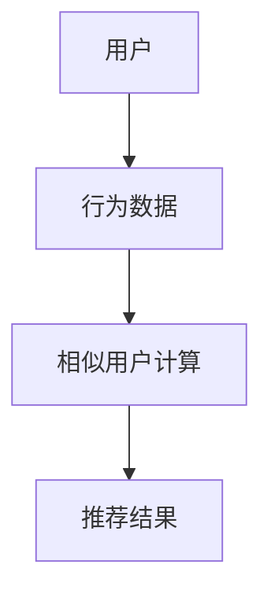
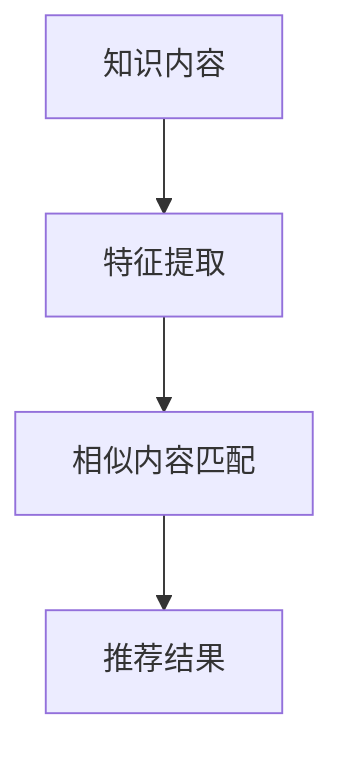
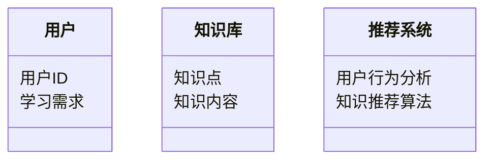
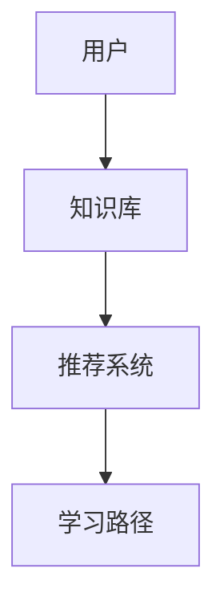
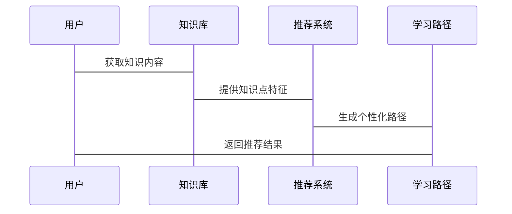

                 


# 《构建智能企业知识推荐系统：个性化学习路径与资源推荐》

## 关键词：智能推荐系统、个性化学习路径、知识管理、机器学习、知识图谱、协同过滤

## 摘要：本文将详细介绍如何构建一个智能企业知识推荐系统，帮助员工找到适合的学习路径和资源。通过分析推荐算法的原理、系统架构的设计、项目实战的实现，以及优化与扩展的策略，为读者提供一个全面的技术指南。

---

### 第一部分：智能企业知识推荐系统背景与概念

#### 第1章：智能企业知识推荐系统概述

##### 1.1 知识推荐系统的背景与问题背景
- 1.1.1 知识经济时代的企业知识管理需求
  - 企业内部知识的分散性与员工学习需求的多样性
  - 知识管理对企业竞争力的重要性
- 1.1.2 传统知识管理的局限性
  - 知识孤岛问题
  - 资源推荐的随机性与盲目性
- 1.1.3 智能推荐系统在知识管理中的作用
  - 提高知识利用率
  - 个性化学习路径的实现

##### 1.2 个性化学习路径与资源推荐的必要性
- 1.2.1 个性化学习需求的兴起
  - 不同员工的学习需求差异
  - 个性化学习路径对企业发展的价值
- 1.2.2 资源推荐在企业培训中的价值
  - 节省时间成本
  - 提高学习效率
- 1.2.3 知识推荐系统对企业效率的提升
  - 员工能力与企业需求的精准匹配
  - 知识资源的有效分配

##### 1.3 本章小结

---

### 第2章：智能企业知识推荐系统的核心概念与联系

#### 2.1 核心概念原理
- 2.1.1 知识推荐系统的定义与目标
  - 系统定义：基于机器学习算法，根据用户需求推荐知识资源和学习路径
  - 系统目标：实现个性化、精准的知识推荐
- 2.1.2 个性化推荐的算法基础
  - 基于用户的推荐
  - 基于内容的推荐
  - 混合推荐
- 2.1.3 知识图谱与推荐系统的结合
  - 知识图谱的构建与应用
  - 推荐系统与知识图谱的协同作用

#### 2.2 核心概念属性对比表格
| 对比维度         | 传统推荐系统             | 智能知识推荐系统           |
|------------------|--------------------------|---------------------------|
| 推荐依据         | 用户行为数据             | 用户行为数据 + 知识图谱     |
| 推荐目标         | 提高用户满意度           | 提高知识利用率和学习效率    |
| 个性化程度       | 基于用户历史行为         | 基于用户需求与知识关联性   |

#### 2.3 ER实体关系图架构
```mermaid
er
actor: 用户
knowledge_base: 知识库
recommendation_system: 推荐系统
learning_path: 学习路径
```

#### 2.4 本章小结

---

### 第3章：知识推荐系统的算法原理

#### 3.1 推荐算法概述
- 3.1.1 协同过滤算法
  - 基于用户的协同过滤
  - 基于物品的协同过滤
- 3.1.2 基于内容的推荐算法
  - 文本挖掘与特征提取
  - 基于内容相似度的推荐
- 3.1.3 混合推荐算法
  - 协同过滤与内容推荐的结合

#### 3.2 基于协同过滤的推荐算法
- 3.2.1 算法流程图


#### 3.3 基于内容的推荐算法
- 3.3.1 算法流程图


#### 3.4 算法实现代码示例
```python
def collaborative_filter(user_id):
    # 获取用户历史行为数据
    user_behavior = get_user_behavior(user_id)
    # 计算相似用户
    similar_users = calculate_similarity(user_behavior)
    # 获取推荐内容
    recommendations = get_recommendations(similar_users)
    return recommendations
```

#### 3.5 数学公式
- 余弦相似度公式：
  $$ \text{similarity}(u_1, u_2) = \frac{\sum_{i} u_1(i) \times u_2(i)}{\sqrt{\sum_{i} u_1(i)^2} \times \sqrt{\sum_{i} u_2(i)^2}} $$

---

### 第4章：系统架构与设计

#### 4.1 问题场景介绍
- 企业内部知识管理的现状
- 知识推荐系统的需求分析

#### 4.2 系统功能设计
- 4.2.1 领域模型设计


- 4.2.2 系统架构设计


- 4.2.3 接口设计
  - 用户接口：API 请求与响应
  - 知识库接口：数据存储与检索
- 4.2.4 交互流程


---

### 第5章：项目实战与实现

#### 5.1 环境搭建
- 开发工具：Python、Jupyter Notebook
- 数据库：MySQL、MongoDB
- 依赖库：scikit-learn、networkx

#### 5.2 核心代码实现
- 数据预处理
```python
import pandas as pd
from sklearn.metrics.pairwise import cosine_similarity

# 加载数据
data = pd.read_csv('knowledge.csv')
# 特征提取
features = data[['知识点', '知识点描述']]
# 计算相似度
similarity_matrix = cosine_similarity(features)
```

- 推荐算法实现
```python
def get_recommendations(user_id, similarity_matrix):
    # 获取用户相似度排名
    user_index = user_id
    sorted_indices = similarity_matrix[user_index].argsort()[::-1]
    recommendations = []
    for i in sorted_indices:
        if i != user_index:
            recommendations.append(i)
            if len(recommendations) == 5:
                break
    return recommendations
```

#### 5.3 实际案例分析与解读
- 案例背景：某企业员工学习需求分析
- 数据分析与处理
- 推荐结果展示与优化

#### 5.4 项目小结

---

### 第6章：优化与扩展

#### 6.1 模型优化
- 算法调优
- 数据预处理优化

#### 6.2 系统扩展
- 知识库的扩展与更新
- 推荐算法的多样性提升

#### 6.3 系统安全性与稳定性
- 数据加密与访问控制
- 系统容错与冗余设计

#### 6.4 用户体验优化
- 推荐结果的可视化展示
- 个性化反馈机制

---

### 第7章：最佳实践与小结

#### 7.1 实践 tips
- 数据质量的重要性
- 算法选择的灵活性
- 系统设计的可扩展性

#### 7.2 本章小结

---

### 附录

#### A. 工具安装指南
- Python 环境搭建
- 依赖库安装

#### B. 参考文献
- 推荐系统相关论文
- 机器学习算法书籍

#### C. 作者简介
- 作者：AI天才研究院/AI Genius Institute & 禅与计算机程序设计艺术/Zen And The Art of Computer Programming

---

作者：AI天才研究院/AI Genius Institute & 禅与计算机程序设计艺术/Zen And The Art of Computer Programming

