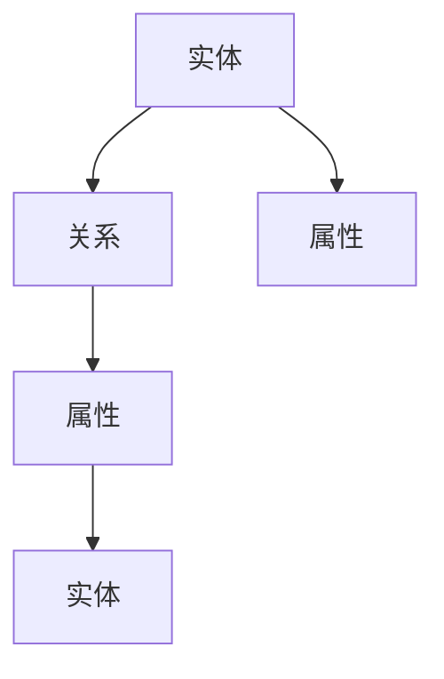
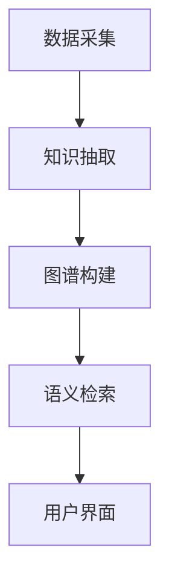

                 


# 《构建智能企业知识管理平台：动态知识图谱与语义检索》

## 关键词：知识管理，动态知识图谱，语义检索，企业信息化，智能系统

## 摘要：本文详细探讨了构建智能企业知识管理平台的核心技术，重点分析了动态知识图谱与语义检索的原理和实现方法，结合实际案例，展示了如何通过这些技术提升企业知识管理的效率和智能化水平。

---

### 第1章：智能企业知识管理平台概述

#### 1.1 问题背景与挑战

- **1.1.1 传统知识管理的局限性**
  - 传统知识管理系统通常依赖关键字检索，难以理解上下文和语义。
  - 知识分散在不同部门和系统中，缺乏统一的管理与关联。
  - 数据更新缓慢，难以应对快速变化的业务需求。

- **1.1.2 企业知识孤岛现象**
  - 各部门使用不同的系统，数据无法共享，形成信息孤岛。
  - 知识难以被有效利用，导致资源浪费和效率低下。

- **1.1.3 知识管理的业务价值**
  - 提高知识的利用率，加速决策过程。
  - 促进跨部门协作，提升企业整体效率。
  - 支持数据驱动的创新，推动企业智能化转型。

#### 1.2 动态知识图谱与语义检索的概念

- **1.2.1 知识图谱的定义与特点**
  - 知识图谱是一种以图结构形式表示知识的数据库，节点表示实体，边表示关系。
  - 具有语义丰富、结构清晰、可扩展性强的特点。

- **1.2.2 动态知识图谱的特性**
  - 动态性：能够实时更新，反映最新的知识和信息。
  - 关联性：能够发现实体之间的隐含关系，提供深度语义理解。

- **1.2.3 语义检索的核心思想**
  - 通过理解查询的语义，匹配最相关的知识实体。
  - 超越传统关键字检索，提供更智能的搜索体验。

#### 1.3 问题解决与边界

- **1.3.1 动态知识图谱的应用场景**
  - 企业内部知识的实时更新与管理。
  - 复杂业务场景下的知识关联与推理。

- **1.3.2 语义检索的实现边界**
  - 确定检索的范围和精度，避免信息过载。
  - 设定检索的性能指标，如响应时间、准确率等。

- **1.3.3 知识管理平台的系统架构**
  - 分层架构：数据层、知识层、应用层。
  - 模块化设计：数据采集、知识抽取、图谱构建、语义检索。

---

### 第2章：动态知识图谱与语义检索的核心原理

#### 2.1 知识图谱的构建原理

- **2.1.1 实体与关系的定义**
  - 实体：企业中的具体事物，如“员工”、“项目”、“客户”。
  - 关系：实体之间的关联，如“参与”、“管理”、“属于”。

- **2.1.2 知识抽取与关联规则**
  - 使用NLP技术从文本中提取实体和关系。
  - 建立规则库，定义关联的强度和优先级。

- **2.1.3 知识融合与冲突处理**
  - 多数据源的知识融合，消除冲突，确保一致性。

#### 2.2 语义检索的实现机制

- **2.2.1 基于向量的语义表示**
  - 使用词向量（如Word2Vec）或句子向量（如BERT）进行语义编码。
  - 通过向量相似度计算，匹配最相关的知识实体。

- **2.2.2 检索算法的选择与优化**
  - 基于图的检索算法：如广度优先搜索、深度优先搜索。
  - 基于向量的检索算法：如余弦相似度、欧氏距离。

- **2.2.3 结果排序与语义增强**
  - 根据检索结果的相关性、权威性进行排序。
  - 结合上下文信息，增强语义理解，提升检索质量。

#### 2.3 核心概念对比与ER图分析

| 概念         | 属性         | 描述                                         |
|--------------|--------------|--------------------------------------------|
| 知识图谱     | 结构化数据    | 以图结构表示实体及其关系                     |
| 语义检索     | 智能搜索      | 基于语义理解进行知识匹配                     |
| 动态更新     | 实时性        | 知识图谱能够动态更新，反映最新信息           |



---

### 第3章：算法原理与实现

#### 3.1 动态知识图谱的构建算法

- **3.1.1 图嵌入算法**
  - 使用DeepWalk或Node2Vec算法生成节点向量表示。
  - 通过训练模型，捕捉节点之间的语义关系。

- **3.1.2 知识融合算法**
  - 使用冲突检测算法，消除数据源之间的冲突。
  - 建立权重机制，优先保留高可信度的知识。

#### 3.2 语义检索的实现算法

- **3.2.1 基于向量的检索算法**
  - 训练语义模型，生成向量表示。
  - 使用余弦相似度计算，匹配最相关的知识实体。

- **3.2.2 基于图的检索算法**
  - 从查询节点出发，进行图遍历，找到相关实体。
  - 使用pagerank算法，评估节点的重要性。

---

### 第4章：系统分析与架构设计

#### 4.1 系统功能设计

- **4.1.1 数据采集模块**
  - 支持多种数据源，如数据库、文档、邮件等。
  - 提供数据预处理功能，清洗和转换数据。

- **4.1.2 知识抽取模块**
  - 使用NLP技术，从文本中提取实体和关系。
  - 支持规则和模型双重模式，提高准确性。

- **4.1.3 图谱构建模块**
  - 生成知识图谱的存储结构，如RDF或Neo4j。
  - 实现动态更新机制，支持实时知识添加和删除。

- **4.1.4 语义检索模块**
  - 提供自然语言查询接口，支持复杂语义理解。
  - 返回结构化结果，便于后续应用。

#### 4.2 系统架构设计



- **4.2.1 接口设计**
  - 提供RESTful API，供其他系统调用。
  - 支持JSON格式的数据传输，确保兼容性。

- **4.2.2 交互设计**
  - 用户友好的界面设计，支持自然语言输入。
  - 结果展示直观，支持可视化浏览和导出。

---

### 第5章：项目实战

#### 5.1 环境安装

- 安装必要的开发工具，如Python、Jupyter、Neo4j。
- 安装相关库，如networkx、gensim、spacy。

#### 5.2 核心代码实现

```python
# 知识抽取代码示例
from spacy.lang.zh import Chinese
import spacy

nlp = Chinese()
doc = nlp("员工小张参与了项目A的开发。")
entities = [ent.text for ent in doc.ents]
print(entities)
```

#### 5.3 案例分析与总结

- **5.3.1 案例分析**
  - 实际项目中的应用，如企业内部知识库的构建与检索。
  - 使用动态知识图谱解决跨部门协作问题。

- **5.3.2 项目小结**
  - 系统的关键技术点总结。
  - 实施中的常见问题及解决方案。

---

### 第6章：最佳实践与扩展

#### 6.1 小结与注意事项

- 保持知识图谱的动态更新，确保数据的实时性。
- 在语义检索中，平衡准确率和召回率，避免过度优化。

#### 6.2 注意事项

- 数据隐私和安全问题，确保敏感信息不被泄露。
- 系统性能优化，提升检索速度和响应时间。

#### 6.3 拓展阅读

- 关注知识图谱的最新研究，如可解释的人工智能。
- 探索语义检索的新技术，如图神经网络的应用。

---

### 作者：AI天才研究院 & 禅与计算机程序设计艺术

本文由AI天才研究院与禅与计算机程序设计艺术团队共同撰写，旨在为企业知识管理的智能化转型提供理论支持和实践指导。如需进一步交流，请访问我们的官方网站或联系相关研究人员。

