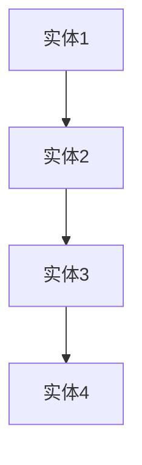
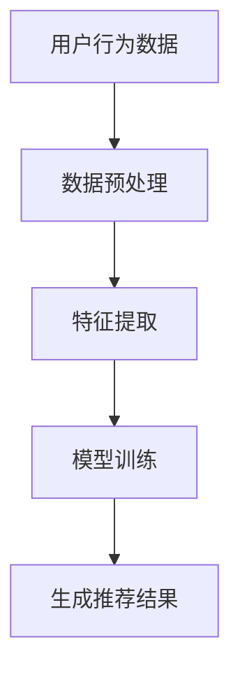
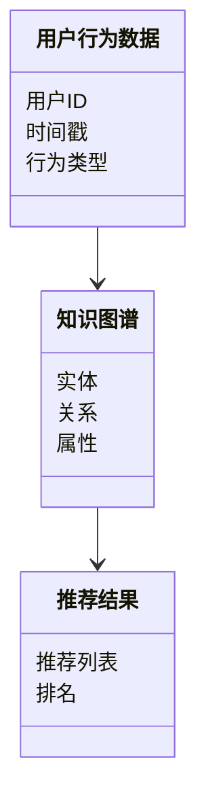
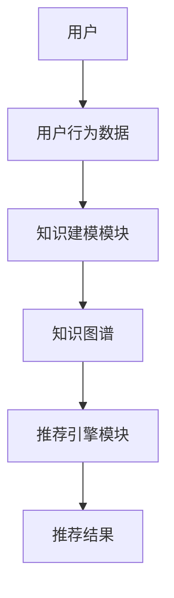

                 


# 构建智能企业知识管理系统：个性化推荐与知识图谱集成

> **关键词**：智能企业知识管理系统，个性化推荐，知识图谱，推荐算法，系统架构，知识管理

> **摘要**：  
> 本文探讨了如何构建一个智能企业知识管理系统，重点介绍了个性化推荐与知识图谱的集成方法。通过分析知识图谱的构建与应用、个性化推荐系统的原理与算法，以及两者的协同工作原理，本文为读者提供了一个全面的技术框架。文章还详细讲解了系统架构设计、项目实战案例以及最佳实践，帮助读者理解如何在实际场景中构建高效的知识管理系统。

---

# 第一部分: 智能企业知识管理系统的背景与核心概念

---

# 第1章: 企业知识管理系统的现状与挑战

## 1.1 知识管理的定义与重要性

### 1.1.1 知识管理的定义  
知识管理（Knowledge Management）是指通过系统化的手段，对企业内外部知识进行采集、整理、存储、共享和应用的过程。其核心目标是提高知识的利用效率，为企业创造更大的价值。

### 1.1.2 知识管理在企业中的作用  
- **提升决策效率**：通过快速检索和分析知识，帮助企业做出更明智的决策。  
- **促进知识共享**：打破部门间的信息孤岛，实现知识的高效流动。  
- **增强创新能力**：通过知识的复用和组合，激发新的想法和解决方案。  

### 1.1.3 当前知识管理的痛点与挑战  
- 数据孤岛问题：企业内部数据分散在不同系统中，难以统一管理和利用。  
- 知识更新滞后：知识的更新速度无法跟上业务发展的需求。  
- 知识利用效率低：员工难以快速找到所需的知识，导致工作效率低下。  

## 1.2 个性化推荐与知识图谱的概念

### 1.2.1 个性化推荐的定义与特点  
个性化推荐是一种基于用户行为、偏好和需求，通过算法生成推荐内容的技术。其特点包括：  
- **动态性**：推荐结果会根据用户行为和数据变化而实时更新。  
- **精准性**：通过算法分析用户特征，提供高度个性化的推荐。  
- **多样性**：推荐结果覆盖多个领域，避免单一化。  

### 1.2.2 知识图谱的定义与构建原理  
知识图谱是一种以图结构表示知识的技术，由节点（实体）和边（关系）组成。其构建过程包括：  
1. **数据采集**：从企业文档、数据库、互联网等来源获取数据。  
2. **实体识别**：通过自然语言处理技术提取实体信息。  
3. **关系抽取**：识别实体之间的关系，并建立关联。  
4. **知识存储**：将提取的知识存储到图数据库中。  

### 1.2.3 个性化推荐与知识图谱的结合方式  
- **基于知识图谱的推荐**：利用知识图谱中的实体关系，生成更精准的推荐结果。  
- **协同推荐**：结合用户行为数据和知识图谱，提供个性化推荐。  

## 1.3 智能企业知识管理系统的必要性

### 1.3.1 提高知识利用效率的需求  
通过智能化技术，企业可以快速检索和利用知识，提升工作效率。  

### 1.3.2 企业数字化转型的趋势  
随着数字化转型的推进，企业需要更高效的知识管理方式来支持业务发展。  

### 1.3.3 知识图谱与个性化推荐的协同优势  
- **提升推荐准确性**：知识图谱提供了丰富的上下文信息，帮助推荐系统更准确地理解用户需求。  
- **增强知识共享**：通过个性化推荐，用户可以发现更多相关知识，促进知识的共享与复用。  

## 1.4 本章小结  
本章介绍了知识管理的重要性、个性化推荐与知识图谱的基本概念，以及两者结合的优势。下一章将详细讲解知识图谱的构建与应用。

---

# 第二部分: 知识图谱与个性化推荐的核心概念

---

# 第2章: 知识图谱的构建与应用

## 2.1 知识图谱的构建原理

### 2.1.1 数据采集与预处理  
- **数据来源**：企业文档、数据库、互联网等。  
- **预处理步骤**：清洗数据、去除噪声、标准化处理。  

### 2.1.2 实体识别与关系抽取  
- **实体识别**：通过NLP技术从文本中提取实体信息。  
- **关系抽取**：识别实体之间的关系，并建立关系边。  

### 2.1.3 知识图谱的存储与管理  
- **存储方式**：使用图数据库（如Neo4j）存储实体和关系。  
- **管理方法**：定期更新知识图谱，确保数据的准确性和完整性。  

## 2.2 知识图谱的属性与特征对比

### 2.2.1 实体属性对比表  
| 实体 | 属性 | 示例值 |  
|------|------|--------|  
| 产品 | 名称 | iPhone |  
| 产品 | 类型 | 智能手机 |  

### 2.2.2 关系特征对比表  
| 关系 | 类型 | 示例值 |  
|------|------|--------|  
| 产品 | 属于 | 科技产品 |  

### 2.2.3 知识图谱的层次结构  
- **节点层次**：实体节点、关系节点。  
- **关系层次**：一对一关系、一对多关系、多对多关系。  

## 2.3 知识图谱的ER实体关系图



---

# 第3章: 个性化推荐系统的原理与算法

## 3.1 个性化推荐的核心原理

### 3.1.1 基于用户的协同过滤  
- **基本思想**：通过用户的行为相似性，推荐相似用户的兴趣内容。  
- **算法公式**：  
  $$similarity(u, v) = \frac{\sum_{i} (r_{u,i} - \bar{r}_u)(r_{v,i} - \bar{r}_v)}{\sqrt{\sum_{i} (r_{u,i} - \bar{r}_u)^2} \cdot \sqrt{\sum_{i} (r_{v,i} - \bar{r}_v)^2}}$$  

### 3.1.2 基于物品的内容推荐  
- **基本思想**：根据物品的特征相似性，推荐与当前物品相似的其他物品。  
- **算法公式**：  
  $$similarity(i, j) = \frac{\sum_{k} w_{i,k} \cdot w_{j,k}}{\sqrt{\sum_{k} w_{i,k}^2} \cdot \sqrt{\sum_{k} w_{j,k}^2}}$$  

### 3.1.3 混合推荐模型  
- **基本思想**：结合基于用户的协同过滤和基于物品的内容推荐，通过加权融合两种方法的结果。  
- **算法公式**：  
  $$f(user, item) = \alpha \cdot CF(user, item) + (1-\alpha) \cdot CB(user, item)$$  

## 3.2 推荐算法的数学模型

### 3.2.1 协同过滤的矩阵分解公式  
$$X = U \cdot V^T$$  
其中，$X$是用户-物品评分矩阵，$U$和$V$是低维隐向量矩阵。  

### 3.2.2 基于深度学习的推荐模型  
$$y = f(x; \theta)$$  
其中，$f$是深度学习模型，$\theta$是模型参数。  

## 3.3 推荐算法的流程图



---

# 第4章: 知识图谱与个性化推荐的协同工作原理

## 4.1 知识图谱在推荐中的应用

### 4.1.1 基于知识图谱的上下文推理  
- **基本思想**：利用知识图谱中的实体关系，推理用户的潜在需求。  

### 4.1.2 知识图谱的特征表示  
- **向量表示**：通过Word2Vec等技术，将实体和关系表示为向量。  

## 4.2 个性化推荐在知识图谱中的优化

### 4.2.1 基于知识图谱的推荐增强  
- **知识增强的推荐模型**：结合知识图谱中的语义信息，提升推荐的准确性和多样性。  

### 4.2.2 知识图谱的动态更新  
- **实时更新**：根据用户行为和反馈，动态更新知识图谱。  

---

# 第三部分: 智能企业知识管理系统的架构与实现

---

# 第5章: 系统分析与架构设计

## 5.1 系统功能设计

### 5.1.1 知识建模模块  
- **功能**：将企业知识转化为知识图谱的形式。  
- **流程**：数据采集 → 实体识别 → 关系抽取 → 知识存储。  

### 5.1.2 推荐引擎模块  
- **功能**：基于用户行为和知识图谱，生成个性化推荐。  
- **流程**：数据采集 → 特征提取 → 模型训练 → 推荐生成。  

## 5.2 系统架构设计

### 5.2.1 领域模型设计  


### 5.2.2 系统架构图  


---

# 第6章: 项目实战与实现

## 6.1 项目背景与需求分析

### 6.1.1 项目背景  
- **目标**：构建一个智能企业知识管理系统，实现个性化推荐与知识图谱的集成。  

### 6.1.2 需求分析  
- **功能需求**：知识建模、推荐生成、知识查询。  
- **性能需求**：推荐响应时间≤1秒，支持大规模数据处理。  

## 6.2 系统核心实现

### 6.2.1 知识建模实现  
- **工具**：使用Python的NLP库（如spaCy）进行实体识别和关系抽取。  
- **代码示例**：  
  ```python
  import spacy

  nlp = spacy.load("en_core_web_sm")
  doc = nlp("Apple is a tech company.")
  for ent in doc.ents:
      print(ent.text, ent.label_)
  ```

### 6.2.2 推荐算法实现  
- **算法选择**：基于协同过滤的矩阵分解模型。  
- **代码示例**：  
  ```python
  import numpy as np

  def matrix_factorization(R, P, Q, iterations=5, alpha=0.1):
      for _ in range(iterations):
          for i in range(len(R)):
              for j in range(len(R[0])):
                  if R[i][j] > 0:
                      P[i] += alpha * (R[i][j] - np.dot(P[i], Q.T)[j])
                      Q[j] += alpha * (R[i][j] - np.dot(P[i], Q.T)[j])
      return P, Q
  ```

## 6.3 项目小结  
通过本项目，我们成功实现了个性化推荐与知识图谱的集成，验证了技术方案的可行性和有效性。

