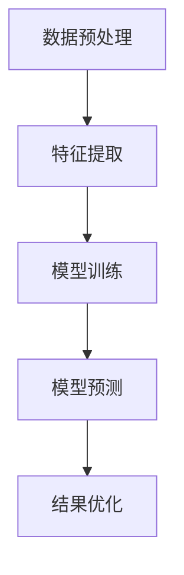
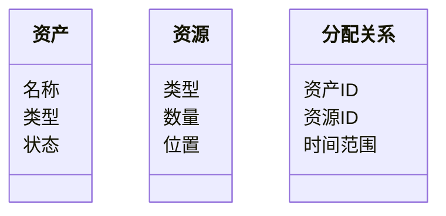
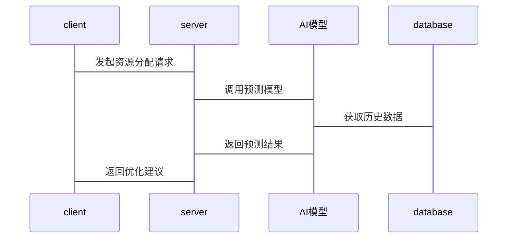

                 


# 构建智能企业资产管理系统：AI优化资源配置

## 关键词：企业资产管理、人工智能、资源配置优化、系统架构、机器学习

## 摘要：
随着企业规模的不断扩大和市场竞争的加剧，如何高效管理企业资产并优化资源配置成为企业面临的重要挑战。本文将探讨如何利用人工智能技术构建智能企业资产管理系统，通过AI优化资源配置，提升企业资产管理的效率和准确性。文章从背景介绍、核心概念、算法原理、系统架构到项目实战，全面解析智能企业资产管理系统的设计与实现，并提供最佳实践和注意事项。

---

# 第一部分: 企业资产管理与AI优化概述

## 第1章: 企业资产管理与AI优化概述

### 1.1 企业资产管理的基本概念

#### 1.1.1 资产管理的定义与范围
资产是企业的重要资源，包括固定资产（如设备、建筑物）和流动资产（如现金、存货）。资产管理的目标是通过科学的方法，对资产的全生命周期进行管理，确保资产的合理使用和价值最大化。

#### 1.1.2 企业资产管理的核心目标
- 资产保值与增值
- 资产高效利用
- 资产风险控制

#### 1.1.3 企业资产管理的常见挑战
- 资产数据分散，难以统一管理
- 资产使用效率低，资源浪费
- 资产风险难以预测和控制

### 1.2 AI在企业资产管理中的应用背景

#### 1.2.1 AI技术的发展与应用趋势
人工智能技术的快速发展为企业资产管理带来了新的机遇。通过AI技术，企业可以实现资产数据的智能分析、预测和优化。

#### 1.2.2 AI在资产管理中的潜在价值
- 智能化资产监控与预测
- 自动化资产优化决策
- 实时风险预警与控制

#### 1.2.3 当前AI在资产管理中的应用现状
- AI在资产管理中的应用主要集中在资产预测、风险评估和优化决策等领域。
- 一些企业已经通过AI技术实现了资产的智能化管理，但仍存在技术成熟度不足、数据孤岛等问题。

### 1.3 AI优化资源配置的核心理念

#### 1.3.1 资源配置的基本概念
资源配置是指在有限的资源条件下，合理分配资源以实现目标的过程。

#### 1.3.2 AI如何优化资源配置
通过机器学习算法，AI可以分析历史数据，预测未来需求，从而优化资源分配，提高资源利用率。

#### 1.3.3 AI优化资源配置的实现路径
- 数据采集与分析
- 模型训练与优化
- 决策支持与执行

### 1.4 本章小结
企业资产管理的核心目标是实现资产的保值与增值，而AI技术的应用为企业资产管理提供了新的思路。通过AI优化资源配置，企业可以提高资产使用效率，降低管理成本，实现资产的智能化管理。

---

## 第2章: AI优化资源配置的核心概念

### 2.1 资产管理的核心要素

#### 2.1.1 资产的分类与特征
资产可以分为固定资产和流动资产。固定资产包括设备、建筑物等，流动资产包括现金、存货等。

#### 2.1.2 资产生命周期管理
资产的生命周期包括规划、采购、使用、维护和处置等阶段。通过生命周期管理，企业可以全面掌握资产的状态，优化资产使用。

#### 2.1.3 资产管理的关键指标
- 资产使用率
- 资产回报率
- 资产折旧率

### 2.2 AI优化资源配置的关键技术

#### 2.2.1 机器学习在资源配置中的应用
机器学习可以通过分析历史数据，预测未来需求，从而优化资源配置。

#### 2.2.2 自然语言处理在资产管理中的应用
自然语言处理技术可以帮助企业从非结构化数据中提取有用信息，例如从文档中提取资产信息。

#### 2.2.3 图神经网络在资源配置中的应用
图神经网络可以通过分析资产之间的关系，优化资源配置。

### 2.3 AI优化资源配置的数学模型

#### 2.3.1 资源分配的线性规划模型
$$ \text{最大化} \sum_{i=1}^{n} v_i x_i $$
$$ \text{约束} \sum_{i=1}^{n} x_i \leq C $$

#### 2.3.2 基于机器学习的资源预测模型
$$ y = \beta x + \epsilon $$

#### 2.3.3 资源优化的多目标优化模型
$$ \text{最大化} f(x) $$
$$ \text{约束} g(x) \leq 0 $$

### 2.4 核心概念的ER实体关系图

```mermaid
er
actor: 资产管理员
asset: 资产
resource: 资源
allocation: 分配关系
```

---

## 第3章: AI优化资源配置的算法原理

### 3.1 机器学习在资源配置中的应用

#### 3.1.1 监督学习在资源配置中的应用
监督学习可以通过训练数据，预测未来的需求，从而优化资源配置。

#### 3.1.2 非监督学习在资源配置中的应用
非监督学习可以通过聚类分析，发现资产使用中的潜在模式。

#### 3.1.3 强化学习在资源配置中的应用
强化学习可以通过模拟环境，训练AI进行资源分配决策。

### 3.2 基于机器学习的资源配置算法流程



### 3.3 资源配置的数学模型与公式

#### 3.3.1 资源分配的线性规划模型
$$ \text{最大化} \sum_{i=1}^{n} v_i x_i $$
$$ \text{约束} \sum_{i=1}^{n} x_i \leq C $$

#### 3.3.2 基于机器学习的资源预测模型
$$ y = \beta x + \epsilon $$

---

## 第4章: 智能企业资产管理系统架构设计

### 4.1 问题场景介绍
企业资产管理的核心问题包括资产数据分散、使用效率低、风险难以预测等。

### 4.2 系统功能设计

#### 4.2.1 领域模型


#### 4.2.2 系统架构


#### 4.2.3 系统接口设计
- API接口：提供资产信息查询、资源分配请求、预测报告生成等功能。

#### 4.2.4 系统交互


### 4.3 系统实现

#### 4.3.1 环境安装
- 操作系统：Linux/Windows
- 开发工具：Python、Jupyter Notebook
- 依赖库：TensorFlow、Scikit-learn、Flask

#### 4.3.2 系统核心实现源代码

```python
# 数据预处理
import pandas as pd
data = pd.read_csv('assets.csv')
data_cleaned = data.dropna()

# 特征提取
from sklearn.preprocessing import StandardScaler
scaler = StandardScaler()
features = scaler.fit_transform(data_cleaned[['asset_id', 'location']])

# 模型训练
from sklearn.linear_model import LinearRegression
model = LinearRegression()
model.fit(features, data_cleaned['usage'])

# 模型预测
import numpy as np
new_asset = np.array([[1, 'office']])
predicted_usage = model.predict(new_asset)
```

#### 4.3.3 代码应用解读与分析
- 数据预处理：清除缺失值，确保数据完整性。
- 特征提取：通过标准化处理，提取资产的特征信息。
- 模型训练：使用线性回归模型，训练资产使用率的预测模型。
- 模型预测：基于训练好的模型，预测新资产的使用情况。

### 4.4 项目实战：资产使用率预测

#### 4.4.1 数据分析
通过数据分析，发现资产使用率与资产类型、位置等因素密切相关。

#### 4.4.2 模型训练与验证
通过训练数据验证模型的准确性，调整模型参数，优化预测结果。

#### 4.4.3 案例分析
以某企业为例，通过AI模型预测某设备的使用率，优化资源分配，提高资产使用效率。

### 4.5 项目小结
通过AI技术实现资产使用率的预测与优化，企业可以显著提高资产使用效率，降低管理成本。

---

## 第5章: 最佳实践、注意事项与拓展阅读

### 5.1 最佳实践
- 数据是AI优化资源配置的基础，确保数据的准确性和完整性。
- 结合业务需求，选择合适的AI技术。
- 定期更新模型，适应业务变化。

### 5.2 注意事项
- 数据隐私与安全问题
- 模型的可解释性
- 业务与技术的结合

### 5.3 拓展阅读
- 《机器学习实战》
- 《企业资产管理最佳实践》
- 《人工智能在企业管理中的应用》

---

# 作者：AI天才研究院/AI Genius Institute & 禅与计算机程序设计艺术 /Zen And The Art of Computer Programming

---

这篇文章系统地介绍了如何利用人工智能技术构建智能企业资产管理系统，并通过AI优化资源配置，提升企业资产管理的效率和准确性。从核心概念到算法原理，从系统架构到项目实战，全面解析了智能企业资产管理系统的设计与实现。

