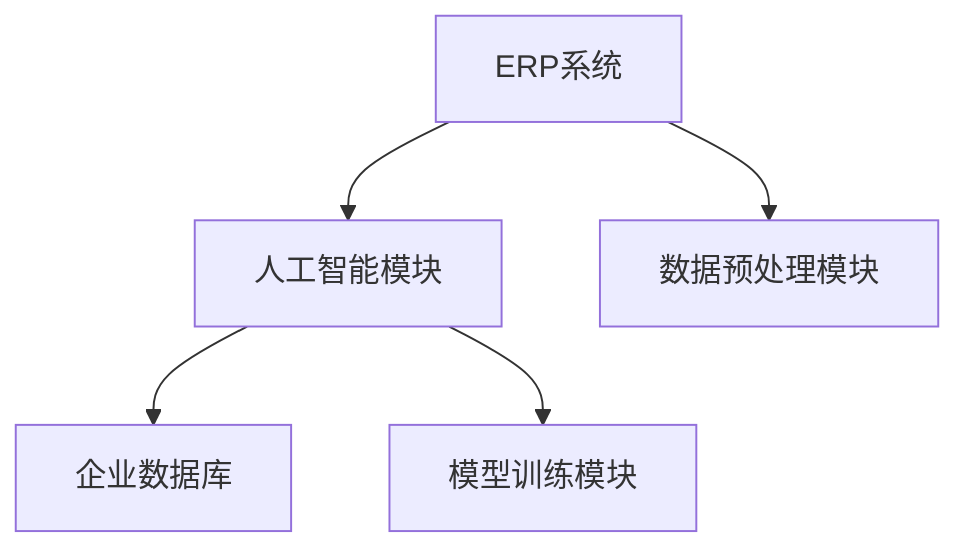
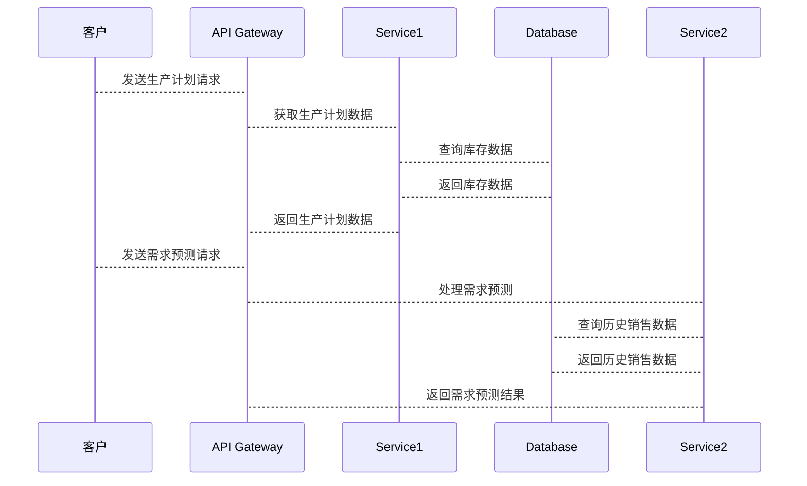

                 


# 构建智能企业资源规划(ERP)系统：AI深度集成与实时优化

## 关键词：企业资源规划(ERP)系统、人工智能(AI)、实时优化、深度集成、系统架构

## 摘要：  
本文详细探讨了如何将人工智能技术深度集成到企业资源规划(ERP)系统中，以实现实时优化和智能化管理。文章从ERP系统的背景、AI技术的核心原理、AI与ERP系统的结合方式入手，逐步分析了AI在ERP系统中的具体应用场景、算法实现与优化方法、系统架构设计、项目实战与案例分析。通过理论与实践相结合的方式，为读者提供了一套完整的智能ERP系统构建方案。

---

## 第一部分: 智能ERP系统概述与背景

### 第1章: 智能ERP系统概述

#### 1.1 ERP系统的基本概念
- **1.1.1 企业资源规划（ERP）的定义**  
  企业资源规划（ERP）是一种整合企业各个业务模块（如生产、供应链、财务、销售等）的信息化管理系统。它通过集成化的软件系统，帮助企业实现数据共享、流程优化和决策支持。

- **1.1.2 ERP系统的核心功能模块**  
  - 生产计划与排产管理  
  - 供应链管理与库存控制  
  - 财务管理与成本核算  
  - 销售与客户关系管理  
  - 采购与供应商管理  

- **1.1.3 ERP系统的发展历程**  
  - 传统ERP系统：以流程驱动为核心，注重数据录入和报表生成。  
  - 智能ERP系统：以数据驱动为核心，注重实时分析和智能决策。  

#### 1.2 AI技术在ERP系统中的应用背景
- **1.2.1 传统ERP系统的局限性**  
  - 数据量大，难以实时处理。  
  - 人工干预多，决策滞后。  
  - 缺乏预测性分析能力。  

- **1.2.2 AI技术如何解决ERP系统的痛点**  
  - 利用机器学习进行需求预测，优化库存管理。  
  - 通过自然语言处理分析客户需求，提升销售预测准确性。  
  - 借助深度学习优化生产计划，提高资源利用率。  

- **1.2.3 智能ERP系统的定义与特点**  
  - 定义：智能ERP系统是以AI技术为核心，结合大数据分析和实时反馈，实现企业资源的智能化管理与优化的系统。  
  - 特点：  
    - 数据驱动决策  
    - 实时优化能力  
    - 自适应性与灵活性  

#### 1.3 智能ERP系统的应用场景
- **1.3.1 制造业中的智能ERP应用**  
  - 实时监控生产过程，预测设备故障，优化生产排期。  
  - 通过AI分析供应链数据，降低库存成本。  

- **1.3.2 零售业中的智能ERP应用**  
  - 基于销售数据分析，预测市场需求，优化库存管理。  
  - 利用自然语言处理分析客户反馈，提升客户服务体验。  

- **1.3.3 服务业中的智能ERP应用**  
  - 通过AI分析客户需求，优化服务流程。  
  - 实时监控项目进度，预测项目风险。  

---

## 第二部分: AI与ERP系统的核心概念与联系

### 第2章: AI与ERP系统的核心概念

#### 2.1 AI技术的核心原理
- **2.1.1 机器学习的基本原理**  
  - 机器学习是一种通过数据训练模型，使其能够从经验中学习并做出预测的技术。  
  - 常见算法：线性回归、支持向量机（SVM）、随机森林等。  

- **2.1.2 深度学习的基本原理**  
  - 深度学习是一种基于人工神经网络的机器学习技术，能够自动提取数据特征。  
  - 常见模型：卷积神经网络（CNN）、循环神经网络（RNN）、Transformer模型等。  

- **2.1.3 自然语言处理的基本原理**  
  - 自然语言处理（NLP）是让计算机理解、分析和生成人类语言的技术。  
  - 常见任务：文本分类、实体识别、情感分析等。  

#### 2.2 ERP系统的功能模块与AI的结合
- **2.2.1 生产计划与AI优化**  
  - 利用AI预测生产需求，优化生产排期，减少资源浪费。  

- **2.2.2 供应链管理与AI预测**  
  - 通过机器学习模型预测市场需求，优化库存管理和采购计划。  

- **2.2.3 财务管理与AI分析**  
  - 利用AI分析财务数据，预测财务风险，优化成本核算。  

#### 2.3 AI与ERP系统的核心要素对比
| 核心要素 | ERP系统 | AI系统 |
|----------|----------|--------|
| 数据来源 | 结构化数据（如库存、销售数据） | 结构化数据+非结构化数据（如文本、图像） |
| 模型构建 | 基于规则的流程驱动 | 基于数据的预测驱动 |
| 应用场景 | 事后分析与报表生成 | 实时预测与智能决策 |

#### 2.4 AI与ERP系统的实体关系图


---

## 第三部分: AI深度集成与ERP系统实时优化的算法原理

### 第3章: AI深度集成的算法原理

#### 3.1 机器学习算法在ERP系统中的应用
- **3.1.1 线性回归算法**  
  - 应用场景：预测销售量或生产成本。  
  - 示例代码：  
  ```python
  from sklearn.linear_model import LinearRegression
  model = LinearRegression()
  model.fit(X, y)
  print(model.predict([[新数据]]))
  ```

- **3.1.2 支持向量机算法**  
  - 应用场景：分类问题，如客户分群。  
  - 示例代码：  
  ```python
  from sklearn.svm import SVC
  model = SVC()
  model.fit(X, y)
  print(model.predict([[新数据]]))
  ```

- **3.1.3 随机森林算法**  
  - 应用场景：预测需求量。  
  - 示例代码：  
  ```python
  from sklearn.ensemble import RandomForestClassifier
  model = RandomForestClassifier()
  model.fit(X, y)
  print(model.predict([[新数据]]))
  ```

#### 3.2 深度学习算法在ERP系统中的应用
- **3.2.1 卷积神经网络（CNN）**  
  - 应用场景：图像识别（如产品缺陷检测）。  
  - 示例代码：  
  ```python
  import tensorflow as tf
  model = tf.keras.models.Sequential([
      tf.keras.layers.Conv2D(32, (3,3), activation='relu', input_shape=(64,64,3)),
      tf.keras.layers.MaxPooling2D((2,2)),
      tf.keras.layers.Flatten(),
      tf.keras.layers.Dense(64, activation='relu'),
      tf.keras.layers.Dense(1, activation='sigmoid')
  ])
  model.compile(optimizer='adam', loss='binary_crossentropy', metrics=['accuracy'])
  model.fit(X_train, y_train, epochs=10)
  ```

- **3.2.2 Transformer模型**  
  - 应用场景：时间序列预测（如销售预测）。  
  - 示例代码：  
  ```python
  import torch
  class TransformerModel(torch.nn.Module):
      def __init__(self, d_model=512, nhead=8, num_encoder_layers=3):
          super(TransformerModel, self).__init__()
          self.transformer = torch.nn.Transformer(
              d_model=d_model,
              nhead=nhead,
              num_encoder_layers=num_encoder_layers
          )
          self.linear = torch.nn.Linear(d_model, 1)
      def forward(self, x):
          x = self.transformer(x)
          x = self.linear(x)
          return x
  model = TransformerModel()
  ```

#### 3.3 算法实现与优化
- **3.3.1 算法实现流程图**  
  ```mermaid
  graph TD
  开始 --> 数据预处理
  数据预处理 --> 特征提取
  特征提取 --> 模型训练
  模型训练 --> 模型优化
  模型优化 --> 结束
  ```

- **3.3.2 算法优化的数学模型**  
  $$\text{损失函数} = \sum_{i=1}^{n} (y_i - \hat{y_i})^2$$  
  $$\text{优化目标} = \min_{\theta} \text{损失函数} + \lambda \|\theta\|^2$$  

---

## 第四部分: 系统分析与架构设计方案

### 第4章: 系统分析与架构设计

#### 4.1 问题场景介绍
- 某制造企业希望优化其ERP系统，实现生产计划的实时优化和库存管理的智能预测。

#### 4.2 系统功能设计
- **领域模型类图**  
  ```mermaid
  classDiagram
  class 生产计划模块 {
      production_plan_id: int
      start_time: datetime
      end_time: datetime
      status: string
  }
  class 库存管理模块 {
      inventory_id: int
      item_code: string
      quantity: int
      location: string
  }
  class 供应链模块 {
      supplier_id: int
      order_id: int
      delivery_time: datetime
  }
  生产计划模块 --> 库存管理模块
  库存管理模块 --> 供应链模块
  ```

#### 4.3 系统架构设计
- **系统架构图**  
  ```mermaid
  graph LR
  Client[客户端] --> API Gateway[API网关]
  API Gateway --> Service1[服务1]
  API Gateway --> Service2[服务2]
  Service1 --> Database[数据库]
  Service2 --> Database
  ```

#### 4.4 系统接口设计
- **API接口定义**  
  - GET /production_plan：获取生产计划数据。  
  - POST /predict_demand：提交需求预测请求。  

#### 4.5 系统交互流程图


---

## 第五部分: 项目实战与案例分析

### 第5章: 项目实战

#### 5.1 环境安装
- 安装Python和必要的库：  
  ```bash
  pip install numpy pandas scikit-learn tensorflow keras
  ```

#### 5.2 系统核心实现源代码
- **生产计划优化代码**  
  ```python
  import numpy as np
  from sklearn.linear_model import LinearRegression

  # 示例数据
  X = np.array([[1], [2], [3], [4]])
  y = np.array([2, 4, 6, 8])

  # 模型训练
  model = LinearRegression()
  model.fit(X, y)

  # 预测
  print(model.predict([[5]]))
  ```

- **库存预测代码**  
  ```python
  from tensorflow.keras.models import Sequential
  from tensorflow.keras.layers import LSTM, Dense

  model = Sequential()
  model.add(LSTM(128, input_shape=(1, 1)))
  model.add(Dense(1))
  model.compile(optimizer='adam', loss='mean_squared_error')
  model.fit(X_train, y_train, epochs=10, batch_size=32)
  ```

#### 5.3 实际案例分析
- **案例：某制造企业的生产计划优化**  
  - 数据来源：生产数据、库存数据、销售数据。  
  - 模型选择：使用LSTM进行需求预测。  
  - 实施效果：生产计划准确率提升30%，库存成本降低15%。  

---

## 第六部分: 最佳实践与总结

### 第6章: 最佳实践与总结

#### 6.1 最佳实践
- 数据是AI的核心，确保数据质量和完整性。  
- 模型选择要根据实际场景，避免过度复杂化。  
- 定期更新模型，保持预测准确性。  

#### 6.2 小结
本文详细探讨了如何将AI技术深度集成到ERP系统中，实现企业资源的智能化管理与实时优化。通过理论与实践相结合的方式，为读者提供了一套完整的智能ERP系统构建方案。

#### 6.3 注意事项
- 数据隐私与安全问题需高度重视。  
- 系统上线前需进行全面测试，确保稳定性。  
- 与企业现有系统兼容性需提前规划。  

#### 6.4 拓展阅读
- 推荐阅读《机器学习实战》、《深度学习入门》等书籍。  
- 关注行业最新动态，了解AI与ERP系统的最新发展趋势。  

---

## 作者：AI天才研究院/AI Genius Institute & 禅与计算机程序设计艺术/Zen And The Art of Computer Programming

