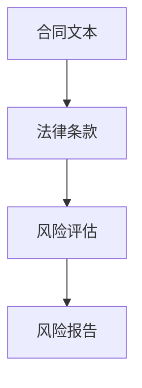
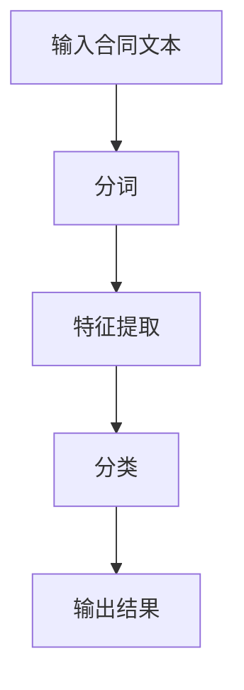
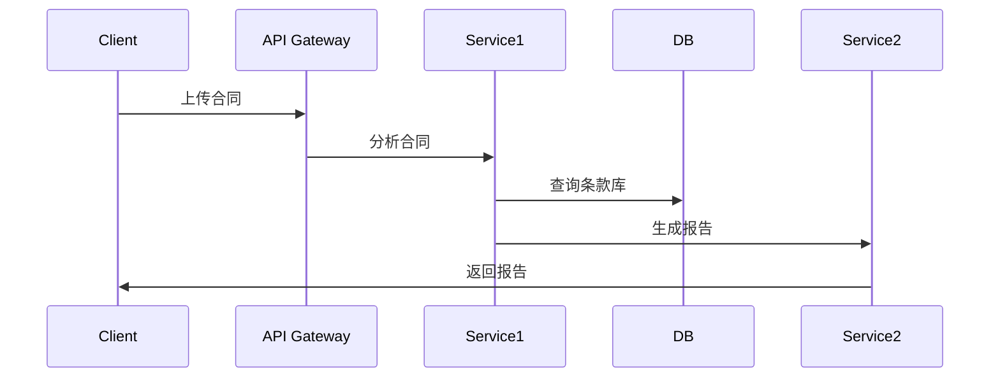

                 


# 构建智能合同分析系统：AI辅助法律风险管理

## 关键词
智能合同分析系统，AI辅助，法律风险管理，自然语言处理，机器学习，合同条款识别，法律文本处理

## 摘要
智能合同分析系统利用人工智能技术，特别是自然语言处理和机器学习，辅助法律风险管理。本文详细讲解系统构建的背景、核心概念、算法原理、系统架构，提供项目实战和最佳实践，帮助读者掌握智能合同分析系统的构建与应用。

---

## 第1章：智能合同分析系统的背景与目标

### 1.1 问题背景
#### 1.1.1 合同管理的重要性
合同是商业活动的核心，涉及法律、财务和业务条款，需准确解读以规避风险。

#### 1.1.2 传统合同管理的痛点
- 手工审核耗时低效
- 人为疏漏风险高
- 复杂条款难以快速识别

#### 1.1.3 AI技术的应用潜力
AI技术可自动识别关键条款，降低人为错误，提升效率。

### 1.2 问题描述
#### 1.2.1 合同条款复杂性
条款繁多，法律术语专业，普通人难以理解。

#### 1.2.2 人工审核的低效性
依赖人工逐字审查，耗时长且成本高。

#### 1.2.3 风险管理的滞后性
无法实时识别潜在风险，可能导致重大损失。

### 1.3 问题解决
#### 1.3.1 AI在合同分析中的应用
AI技术用于自动识别、分类和理解合同条款，辅助风险评估。

#### 1.3.2 智能合同分析系统的构建目标
- 快速识别关键条款
- 自动评估法律风险
- 提供决策支持

### 1.4 边界与外延
#### 1.4.1 系统功能边界
专注于合同文本分析，不涉及合同生成或其他法律事务。

#### 1.4.2 系统适用范围
适用于商业合同、法律文件分析，不处理非法律文本。

#### 1.4.3 系统扩展性
未来可扩展至多语言支持、实时监控等功能。

### 1.5 概念结构与核心要素
#### 1.5.1 核心概念
- 合同文本
- 法律条款
- 风险评估

#### 1.5.2 关键要素之间的关系
合同文本包含法律条款，系统分析条款以评估风险，最终输出风险报告。

---

## 第2章：智能合同分析系统的构成

### 2.1 核心概念
#### 2.1.1 合同文本处理
将合同文本转化为结构化数据，便于分析。

#### 2.1.2 自然语言处理（NLP）
使用NLP技术理解合同内容，识别关键信息。

#### 2.1.3 合同条款识别
利用机器学习算法识别和分类合同条款。

### 2.2 技术对比
| 技术 | 特性 | 优缺点 |
|------|------|--------|
| NLP | 理解文本 | 需大量训练数据，结果依赖模型 |
| 机器学习 | 分类条款 | 需标注数据，模型可解释性有限 |

### 2.3 实体关系图


---

## 第3章：智能合同分析的算法原理

### 3.1 自然语言处理模型
#### 3.1.1 BERT模型
用于上下文理解，通过预训练捕捉语义信息。

#### 3.1.2 GPT模型
生成文本，用于合同条款的生成和补充。

#### 3.1.3 模型训练流程
1. 数据预处理：清洗、分词、标注。
2. 模型训练：使用监督学习，优化参数。
3. 模型评估：准确率、召回率、F1分数。

### 3.2 合同条款识别
#### 3.2.1 机器学习方法
- 使用支持向量机（SVM）或随机森林（RF）分类。
- 特征提取：TF-IDF、词嵌入。

#### 3.2.2 算法流程图


### 3.3 风险评估模型
#### 3.3.1 概率论模型
使用贝叶斯定理计算风险概率。

#### 3.3.2 分类模型
- logistic回归：预测风险等级。
- 决策树：可视化风险因素。

---

## 第4章：系统分析与架构设计方案

### 4.1 问题场景
#### 4.1.1 合同风险类型
违约风险、合规风险、财务风险。

#### 4.1.2 系统功能
- 文本预处理
- 条款识别
- 风险评估
- 报告生成

### 4.2 系统架构设计
```mermaid
graph LR
    Client --> API Gateway
    API Gateway --> Service1
    Service1 --> DB
    Service1 --> Service2
    Service2 --> DB
```

### 4.3 接口设计
- 输入：合同文本
- 输出：风险报告

### 4.4 交互流程图


---

## 第5章：项目实战

### 5.1 环境安装
- 安装Python、TensorFlow、Keras。

### 5.2 核心代码实现
```python
import numpy as np
from sklearn.feature_extraction.text import TfidfVectorizer
from sklearn.svm import SVC

# 数据预处理
texts = ["...", "..."]
vectorizer = TfidfVectorizer()
X = vectorizer.fit_transform(texts)
y = [0, 1]  # 标签

# 训练模型
model = SVC()
model.fit(X, y)

# 预测
new_text = ["..."]
X_new = vectorizer.transform([new_text])
print(model.predict(X_new))
```

### 5.3 代码解读
- 使用TF-IDF提取特征，SVM进行分类，实现合同条款识别。

### 5.4 案例分析
分析一份合同，识别关键条款，评估潜在风险。

---

## 第6章：最佳实践与总结

### 6.1 最佳实践
- 数据质量至关重要，确保数据标注准确。
- 定期更新模型，适应新法规和条款变化。

### 6.2 小结
智能合同分析系统结合AI技术，显著提升合同管理效率和准确性。

### 6.3 注意事项
- 数据隐私保护
- 模型可解释性
- 系统维护和更新

### 6.4 拓展阅读
推荐书籍和论文，深入学习NLP和机器学习技术。

---

## 作者
作者：AI天才研究院/AI Genius Institute  
联系：[禅与计算机程序设计艺术](https://github.com/GeniusInTech)

