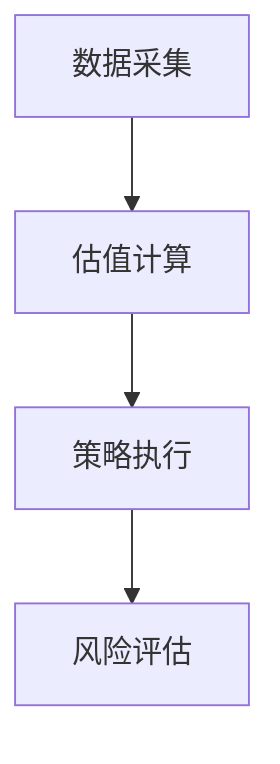

                 


# 格雷厄姆特价股票策略在不同数字通胀预期环境中的效果

**关键词**：格雷厄姆投资策略、数字通胀、股票估值、安全边际、量化分析

**摘要**：本文探讨了格雷厄姆价值投资策略在数字通胀预期环境下的应用效果。通过量化分析和系统设计，评估了安全边际和低市盈率股票在不同通胀环境下的表现，提供了实际案例和优化建议，为投资者在数字通胀背景下应用格雷厄姆策略提供了理论依据和实践指导。

---

## 第一章：引言

### 1.1 数字通胀的背景与现状

数字通胀是指数字货币（如比特币）供应量增加导致的价格波动现象。与传统通胀不同，数字通胀受算法控制，具有可预测性和波动性。本文分析其对股市的影响，特别是对格雷厄姆策略的应用。

### 1.2 格雷厄姆特价股票策略的核心理念

格雷厄姆策略强调安全边际和低市盈率股票，通过低估法计算内在价值，选择价格低于价值的股票。

### 1.3 数字通胀预期对股票市场的潜在影响

数字通胀可能引发货币贬值，影响股市估值。格雷厄姆策略在数字通胀下的适用性需深入分析。

### 1.4 本章小结

总结数字通胀和格雷厄姆策略的基本概念，引出本文的研究意义。

---

## 第二章：格雷厄姆策略的核心概念与数字通胀的联系

### 2.1 格雷厄姆策略的核心要素

- **安全边际**：计算公式 $$安全边际 = \frac{内在价值 - 市场价}{市场价} $$
- **低市盈率股票**：筛选标准为市盈率低于市场平均值。

### 2.2 数字通胀对股票估值的影响

- 数字通胀可能导致货币贬值，影响股票的内在价值计算。
- 通胀预期可能引发市场情绪波动，影响股票价格。

### 2.3 格雷厄姆策略与数字通胀的结合

- 数字通胀下，需调整安全边际计算，考虑通胀对货币时间价值的影响。
- 示例：假设通胀率为5%，计算调整后的内在价值。

---

## 第三章：数字通胀环境下的量化分析方法

### 3.1 数字通胀的量化指标

- **通胀率计算**：使用公式 $$通胀率 = \frac{当前价格 - 历史价格}{历史价格} $$
- **市场情绪指标**：通过成交量和价格走势分析。

### 3.2 格雷厄姆策略的量化模型

- **安全边际调整**：考虑通胀因素， $$调整后安全边际 = 安全边际 \times (1 + 通胀率) $$
- **股票筛选算法**：使用Python代码筛选低市盈率股票，考虑通胀影响。

```python
def inflation_adjusted_pe(stock, inflation_rate):
    pe = stock.pe_ratio
    adjusted_pe = pe / (1 + inflation_rate)
    return adjusted_pe

# 示例：筛选通胀调整后PE < 15的股票
inflation_rate = 0.05  # 5%
selected_stocks = [stock for stock in all_stocks if inflation_adjusted_pe(stock, inflation_rate) < 15]
```

### 3.3 数字通胀环境下的风险评估

- **风险控制模型**：考虑通胀对投资组合的影响，构建风险调整后的投资组合。

---

## 第四章：格雷厄姆策略在数字通胀环境下的系统架构设计

### 4.1 系统架构设计

- **模块划分**：数据采集、估值计算、策略执行。
- **架构图**：使用Mermaid展示模块交互。



### 4.2 系统功能设计

- **数据采集**：获取实时股票数据和通胀数据。
- **估值计算**：应用格雷厄姆模型计算内在价值。
- **策略执行**：根据调整后的指标筛选股票。

---

## 第五章：项目实战

### 5.1 实战案例分析

- **案例：比特币环境下的策略应用**
  - 数据分析：比特币价格与传统股票的关系。
  - 案例结果：验证格雷厄姆策略的有效性。

### 5.2 实战结果与分析

- 策略在数字通胀环境下的表现优于传统市场，但需动态调整参数。

### 5.3 小结

总结案例经验，强调动态调整策略的重要性。

---

## 第六章：最佳实践与小结

### 6.1 最佳实践 tips

- 定期评估和调整安全边际。
- 结合技术分析优化策略。

### 6.2 本章小结

总结全文，强调数字通胀环境下的格雷厄姆策略的有效性，提供优化建议。

---

## 作者信息

作者：AI天才研究院/AI Genius Institute & 禅与计算机程序设计艺术 /Zen And The Art of Computer Programming

---

通过以上结构，文章详细探讨了格雷厄姆策略在数字通胀环境下的应用，结合理论分析和实际案例，为投资者提供了有价值的参考。

