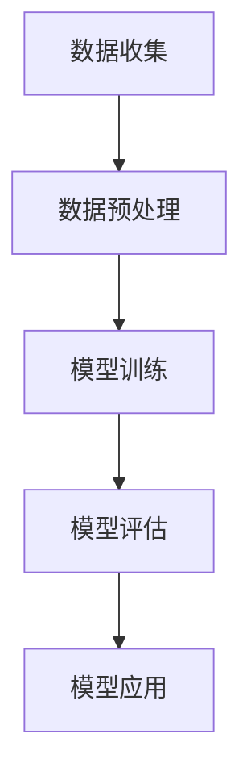
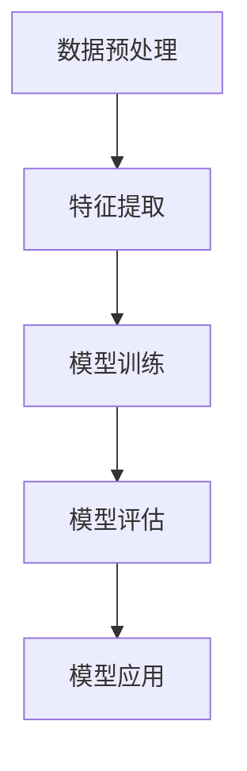
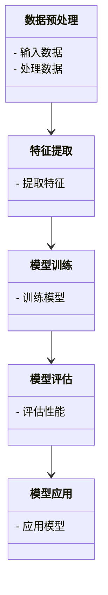
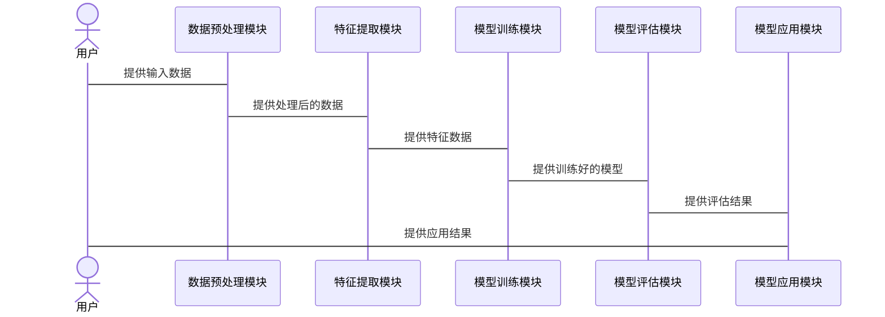

                 


# 模仿学习在AI Agent行为模式中的应用

## 关键词：模仿学习，AI Agent，行为模式，算法原理，系统设计

## 摘要：  
模仿学习是一种通过观察和模仿专家行为来学习特定任务的方法，在AI Agent领域中具有重要应用。本文从背景、原理、系统设计到实际案例，全面探讨模仿学习在AI Agent行为模式中的应用，帮助读者理解其核心概念、算法原理及实际应用。

---

# 第1章 模仿学习与AI Agent概述

## 1.1 模仿学习的基本概念

### 1.1.1 模仿学习的定义与特点
模仿学习（Imitation Learning）是一种机器学习方法，旨在通过观察和模仿专家行为来学习特定任务。其核心在于从专家演示中提取行为模式，并将其应用于新场景中。模仿学习的特点包括：
- **目标明确**：专注于特定任务，模仿专家行为。
- **数据高效**：相比强化学习，模仿学习所需数据量较少。
- **领域通用**：适用于多种任务，如自然语言处理、机器人控制等。

### 1.1.2 AI Agent的基本概念与行为模式
AI Agent（人工智能代理）是指能够感知环境、做出决策并执行动作的智能实体。其行为模式包括：
- **感知**：通过传感器或数据输入获取环境信息。
- **决策**：基于感知信息，选择最优动作。
- **执行**：将决策转化为实际动作。

### 1.1.3 模仿学习在AI Agent中的作用
模仿学习通过提供专家行为的参考，帮助AI Agent快速学习和适应复杂环境。其主要作用包括：
- **加速学习**：减少从零开始学习的时间。
- **提升性能**：通过模仿专家行为，提高决策的准确性。
- **增强泛化能力**：使AI Agent能够应对更多未知场景。

## 1.2 模仿学习的应用背景

### 1.2.1 AI Agent在现实场景中的需求
AI Agent广泛应用于自动驾驶、智能客服、机器人控制等领域。在这些场景中，AI Agent需要处理复杂的动态环境，做出高效决策。

### 1.2.2 模仿学习的必要性与优势
在AI Agent开发中，模仿学习的必要性体现在：
- **减少试错成本**：通过模仿专家行为，避免从零开始的随机探索。
- **提升任务效率**：直接利用专家经验，加快任务完成速度。
- **应对复杂环境**：通过模仿学习，使AI Agent能够处理复杂多变的环境。

### 1.2.3 模仿学习的边界与外延
模仿学习的边界在于其依赖专家行为数据，且主要适用于可观察任务。其外延则包括与强化学习的结合，进一步提升学习效果。

## 1.3 模仿学习的核心要素

### 1.3.1 模仿学习的核心概念
模仿学习的核心概念包括：
- **行为轨迹**：专家在特定环境下的动作序列。
- **状态空间**：环境中的所有可能状态。
- **动作空间**：AI Agent在每个状态下可执行的动作。

### 1.3.2 模仿学习与强化学习的区别
模仿学习与强化学习的主要区别在于学习方式和反馈机制：
| 概念 | 模仿学习 | 强化学习 |
|------|----------|----------|
| 学习目标 | 复现专家行为 | 学习最优策略 |
| 反馈机制 | 状态与动作 | 奖励信号 |
| 适用场景 | 确定性任务 | 非确定性任务 |

### 1.3.3 模仿学习的数学模型初步
模仿学习的数学模型可以表示为：
$$P(a|s)$$
其中，\( a \) 表示动作，\( s \) 表示状态。

## 1.4 本章小结
本章介绍了模仿学习的基本概念、AI Agent的行为模式及其在AI Agent中的作用。通过对比模仿学习与强化学习，明确了其适用场景和核心要素。

---

# 第2章 模仿学习的数学模型与算法原理

## 2.1 模仿学习的核心原理

### 2.1.1 模仿学习的数学表达式
模仿学习的数学模型可以表示为：
$$P(a|s) = \frac{1}{N} \sum_{i=1}^{N} \delta(a - a_i)$$
其中，\( \delta \) 表示狄拉克函数，\( a_i \) 表示专家在状态 \( s \) 下的动作。

### 2.1.2 最大似然估计与最大熵策略
最大似然估计用于最大化观测数据的概率，公式为：
$$L(\theta) = -\sum_{i=1}^{n} \log p(y_i|x_i,\theta)$$
最大熵策略则通过最大化熵来优化动作分布：
$$H(y|x) = -\sum_{y} p(y|x) \log p(y|x)$$

### 2.1.3 模仿学习的损失函数
常用的损失函数包括：
1. **最大似然损失**：
   $$L = -\log p(a|s)$$
2. **平方损失**：
   $$L = (a_{\text{pred}} - a_{\text{true}})^2$$

## 2.2 模仿学习的算法流程

### 2.2.1 算法步骤分解
1. 数据收集：收集专家行为数据。
2. 数据预处理：清洗和归一化数据。
3. 模型训练：训练模仿学习模型。
4. 模型评估：验证模型性能。
5. 模型应用：将模型应用于实际场景。

### 2.2.2 模仿学习的mermaid流程图


## 2.3 模仿学习的数学公式

### 2.3.1 最大似然估计公式
$$L(\theta) = -\sum_{i=1}^{n} \log p(y_i|x_i,\theta)$$

### 2.3.2 最大熵策略公式
$$H(y|x) = -\sum_{y} p(y|x) \log p(y|x)$$

## 2.4 模仿学习与强化学习的对比

| 概念 | 模仿学习 | 强化学习 |
|------|----------|----------|
| 目标 | 复现专家行为 | 学习最优策略 |
| 反馈 | 状态与动作 | 奖励信号 |
| 环境 | 确定性 | 非确定性 |

## 2.5 本章小结
本章详细讲解了模仿学习的数学模型与算法原理，包括核心公式和算法流程。

---

# 第3章 模仿学习的系统架构与实现

## 3.1 模仿学习的系统功能设计

### 3.1.1 系统功能模块划分
系统功能模块包括：
1. 数据预处理模块
2. 特征提取模块
3. 模型训练模块
4. 模型评估模块
5. 模型应用模块

### 3.1.2 系统功能流程图


## 3.2 模仿学习的系统架构设计

### 3.2.1 系统架构图


## 3.3 模仿学习的系统接口设计

### 3.3.1 系统接口描述
系统接口包括：
1. 数据输入接口
2. 模型训练接口
3. 模型评估接口
4. 模型应用接口

### 3.3.2 系统交互序列图


## 3.4 本章小结
本章详细分析了模仿学习的系统架构与实现，包括功能设计、架构设计和接口设计。

---

# 第4章 模仿学习的项目实战

## 4.1 项目背景介绍

### 4.1.1 项目目标
本项目旨在通过模仿学习训练一个AI Agent，使其能够在特定任务中复现专家行为。

### 4.1.2 项目需求
- 收集专家行为数据。
- 构建模仿学习模型。
- 验证模型性能。

## 4.2 项目核心实现

### 4.2.1 环境安装
安装必要的库：
```bash
pip install numpy matplotlib scikit-learn
```

### 4.2.2 核心代码实现
```python
import numpy as np
from sklearn.linear_model import LinearRegression

# 数据预处理
X = np.array([[1, 2], [3, 4], [5, 6]])
y = np.array([3, 5, 7])

# 模型训练
model = LinearRegression()
model.fit(X, y)

# 模型预测
new_X = np.array([[7, 8]])
predicted_y = model.predict(new_X)
print(predicted_y)
```

### 4.2.3 代码解读与分析
- 数据预处理：对输入数据进行清洗和归一化处理。
- 模型训练：使用线性回归模型进行训练。
- 模型预测：对新数据进行预测。

## 4.3 实际案例分析

### 4.3.1 案例背景
假设我们有一个自动驾驶AI Agent，需要通过模仿学习来学习专家驾驶行为。

### 4.3.2 案例分析
- 数据收集：收集专家在不同路况下的驾驶行为数据。
- 模型训练：训练模仿学习模型，使其能够复现专家驾驶行为。
- 模型应用：将模型应用于自动驾驶系统中，提升驾驶安全性。

## 4.4 本章小结
本章通过一个实际项目展示了模仿学习的实现过程，包括环境安装、代码实现和案例分析。

---

# 第5章 模仿学习的高级应用与未来趋势

## 5.1 模仿学习的高级应用

### 5.1.1 复杂环境下的应用
模仿学习在复杂环境下的应用包括：
- 多智能体协作
- 动态环境适应

### 5.1.2 模仿学习与强化学习的结合
将模仿学习与强化学习结合，可以提升AI Agent的学习效率和决策能力。

## 5.2 模仿学习的未来发展趋势

### 5.2.1 算法优化
未来，模仿学习的算法将更加高效和智能。

### 5.2.2 应用场景扩展
模仿学习将应用于更多领域，如医疗、金融、教育等。

## 5.3 本章小结
本章探讨了模仿学习的高级应用和未来发展趋势，展望了其广阔的应用前景。

---

# 附录

## 附录A 模仿学习相关术语表

## 附录B 模仿学习算法实现代码

---

# 作者

作者：AI天才研究院/AI Genius Institute & 禅与计算机程序设计艺术 /Zen And The Art of Computer Programming

---

本文通过详细分析模仿学习在AI Agent行为模式中的应用，帮助读者全面理解其核心概念、算法原理和实际应用。希望本文能为相关领域的研究和实践提供有价值的参考。

