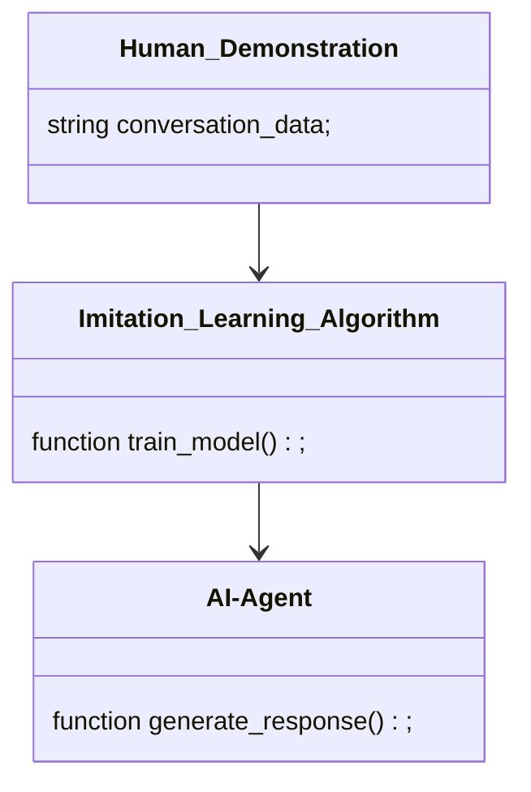
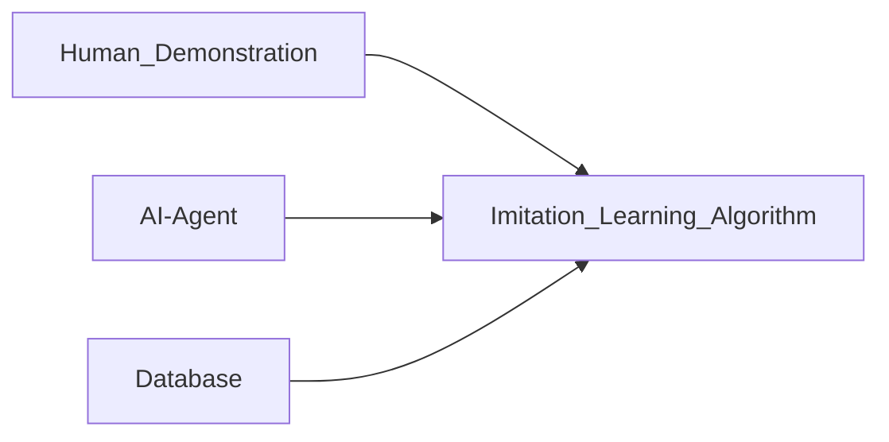
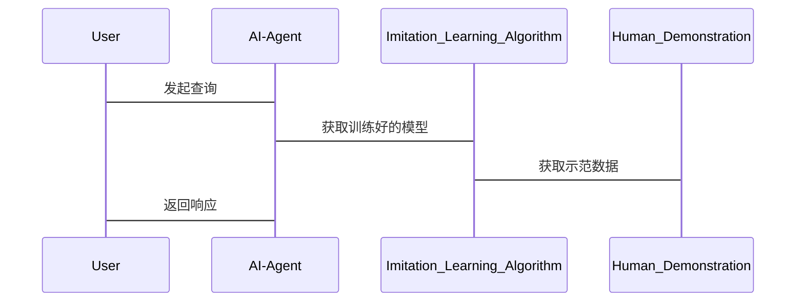

                 


# 模仿学习：从人类示范中学习的AI Agent

## 关键词：
- 模仿学习
- AI Agent
- 人类示范
- 机器学习
- 算法原理

## 摘要：
模仿学习（Imitation Learning, IL）是一种机器学习方法，其中AI代理通过观察和模仿人类的行为或策略来学习特定任务。本文深入探讨模仿学习的核心概念、算法原理、系统架构，并通过项目实战展示其应用。文章还分析了模仿学习的优势与挑战，为读者提供全面的视角。

---

## 第1章：模仿学习的背景与概念

### 1.1 模仿学习的定义与核心概念

#### 1.1.1 什么是模仿学习
模仿学习是一种监督学习的变体，其中AI通过观察人类的行为或策略来学习执行任务。它不需要明确的标签，而是通过观察示例来推断任务的执行方式。

#### 1.1.2 模仿学习的核心要素
- **人类示范（Demonstration）**：AI通过观察人类的行为或策略来学习。
- **任务空间（Task Space）**：任务的定义和目标。
- **行为空间（Action Space）**：可能的动作或决策。

#### 1.1.3 模仿学习的应用场景
模仿学习广泛应用于机器人控制、自然语言处理、游戏AI等领域。例如，机器人可以通过观察人类完成任务来学习操作技巧。

---

### 1.2 模仿学习的问题背景

#### 1.2.1 传统机器学习的局限性
传统监督学习需要大量标注数据，且难以处理复杂任务。模仿学习通过观察人类行为，减少了标注数据的需求。

#### 1.2.2 人类示范在AI学习中的作用
人类示范为AI提供了一种高效的学习方式，特别是在处理复杂任务时，人类的直觉和经验对AI代理具有重要指导作用。

#### 1.2.3 模仿学习的挑战与机遇
- **挑战**：如何处理示范数据的稀疏性和噪声。
- **机遇**：模仿学习可以结合其他学习方法，提高任务执行的效率和准确性。

---

## 第2章：模仿学习的核心原理

### 2.1 模仿学习的基本原理

#### 2.1.1 行为模仿的机制
行为模仿通过观察人类的行为模式，推断出任务的执行方式。例如，机器人观察人类的操作步骤，逐步学习完成任务。

#### 2.1.2 策略模仿的原理
策略模仿通过模仿人类的决策过程，学习制定策略。例如，在游戏中，AI通过观察人类玩家的策略，学习如何做出最优决策。

#### 2.1.3 模仿学习的数学模型
模仿学习通常基于概率模型，例如最大似然估计。AI的目标是通过优化模型参数，使得预测的行为与示范数据尽可能接近。

---

### 2.2 模仿学习的关键特征

#### 2.2.1 示范数据的重要性
示范数据的质量直接影响模仿学习的效果。高质量的示范数据能够提高AI的学习效率。

#### 2.2.2 模仿的灵活性与适应性
模仿学习能够根据任务需求灵活调整策略，适应不同的环境和目标。

#### 2.2.3 模仿学习的可解释性
模仿学习的结果通常具有较高的可解释性，因为AI的行为是基于人类的示范进行的。

---

## 第3章：模仿学习的算法原理

### 3.1 行为克隆（Behavior Cloning）

#### 3.1.1 行为克隆的定义
行为克隆是一种模仿学习方法，通过学习人类的行为模式，逐步逼近目标行为。

#### 3.1.2 行为克隆的数学模型
行为克隆通常使用回归模型，将状态（State）映射到动作（Action）。数学模型可以表示为：
$$ y = f(x) $$
其中，\( x \) 是输入状态，\( y \) 是输出动作。

#### 3.1.3 行为克隆的实现步骤
1. 收集人类示范数据。
2. 建立回归模型，训练模型预测动作。
3. 使用模型预测新的状态下的动作。

---

### 3.2 策略模仿（Policy Imitation）

#### 3.2.1 策略模仿的定义
策略模仿通过模仿人类的决策过程，学习制定策略。与行为克隆不同，策略模仿更关注策略的优化。

#### 3.2.2 策略模仿的数学公式
策略模仿的目标是最大化模仿人类策略的概率，数学公式可以表示为：
$$ \pi_{\theta}(a|s) = \arg\max_{a} \log p(a|s) $$

#### 3.2.3 策略模仿的实现步骤
1. 收集人类示范数据。
2. 建立策略模型，训练模型模仿人类策略。
3. 使用策略模型做出决策。

---

## 第4章：系统架构与设计

### 4.1 系统功能设计

#### 4.1.1 问题场景介绍
假设我们正在开发一个智能客服系统，希望AI代理能够模仿人类客服人员的对话方式，提供高效的客户服务。

#### 4.1.2 系统功能模块
- **数据收集模块**：收集人类客服的对话数据。
- **模型训练模块**：使用模仿学习算法训练AI模型。
- **对话生成模块**：AI根据训练好的模型生成对话回复。

#### 4.1.3 领域模型（领域模型类图）


---

### 4.2 系统架构设计

#### 4.2.1 系统架构图


#### 4.2.2 系统接口设计
- **输入接口**：接收人类示范数据和用户查询。
- **输出接口**：生成AI代理的响应。

#### 4.2.3 系统交互流程


---

## 第5章：项目实战与案例分析

### 5.1 环境安装

#### 5.1.1 安装Python
```bash
python --version
```

#### 5.1.2 安装必要的库
```bash
pip install numpy matplotlib
```

---

### 5.2 系统核心实现源代码

#### 5.2.1 行为克隆的实现
```python
import numpy as np

def behavior_cloning_demo():
    # 示例数据
    X = np.array([[1, 2], [3, 4], [5, 6]])
    y = np.array([0, 1, 2])
    
    # 训练模型
    model = Model()
    model.fit(X, y)
    
    # 预测新数据
    new_X = np.array([[7, 8]])
    prediction = model.predict(new_X)
    print("预测结果:", prediction)

behavior_cloning_demo()
```

#### 5.2.2 策略模仿的实现
```python
import numpy as np

def policy_imitation_demo():
    # 示例数据
    states = np.array([1, 2, 3])
    actions = np.array([0, 1, 2])
    
    # 训练策略模型
    policy = PolicyModel()
    policy.fit(states, actions)
    
    # 制定决策
    new_state = 4
    decision = policy.decide(new_state)
    print("决策结果:", decision)

policy_imitation_demo()
```

---

## 第6章：最佳实践与小结

### 6.1 最佳实践 tips
- 确保示范数据的质量和多样性。
- 结合其他学习方法，如强化学习，提高任务执行的效率。

### 6.2 小结
模仿学习通过观察人类行为，为AI代理提供了一种高效的学习方式。本文详细探讨了模仿学习的核心概念、算法原理和系统架构，并通过项目实战展示了其应用。

### 6.3 注意事项
- 模仿学习的结果依赖于示范数据的质量，需谨慎处理数据中的噪声。
- 在实际应用中，需考虑任务的复杂性和环境的动态变化。

---

## 附录：拓展阅读

- [1] "Imitation Learning" by Sergey Levine
- [2] "Reinforcement Learning: Theory and Algorithms" by Richard S. Sutton

---

## 作者：
作者：AI天才研究院 & 禅与计算机程序设计艺术

