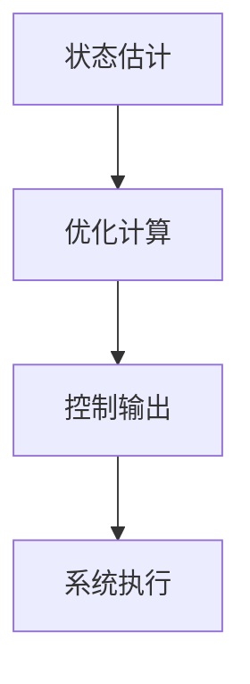

                 


# 模型预测控制：提高AI Agent的决策质量

## 关键词：
- 模型预测控制 (MPC)
- AI Agent
- 决策质量
- 优化算法
- 状态空间模型
- 系统稳定性

## 摘要：
模型预测控制（MPC）是一种基于系统模型预测未来状态的控制策略，广泛应用于提高AI Agent的决策质量。本文深入探讨了MPC的核心概念、算法原理、系统架构以及在实际项目中的应用，帮助读者全面理解如何通过MPC优化AI Agent的决策过程。

---

# 第一部分: 模型预测控制基础

## 第1章: 模型预测控制概述

### 1.1 模型预测控制的基本概念
#### 1.1.1 模型预测控制的定义
模型预测控制（Model Predictive Control，MPC）是一种基于系统模型预测未来状态的控制策略，通过优化目标函数生成控制输入，以实现系统的最佳性能。

#### 1.1.2 模型预测控制的核心思想
MPC的核心思想是利用系统的动态模型，预测未来状态，然后通过优化算法确定最优控制输入，以达到系统的控制目标。

#### 1.1.3 模型预测控制与传统控制方法的区别
| 特性                | 传统控制方法                     | 模型预测控制                  |
|---------------------|----------------------------------|-----------------------------|
| 基础                | 系统传递函数或状态空间模型       | 系统状态空间模型             |
| 控制方式            | 基于反馈的闭环控制               | 基于预测的开环控制             |
| 复杂度              | 较低                            | 较高                          |
| 应用场景            | 线性系统                        | 非线性系统和复杂系统          |

### 1.2 模型预测控制的历史与发展
#### 1.2.1 模型预测控制的起源
模型预测控制的概念起源于20世纪60年代的工业控制领域，当时研究人员开始尝试利用计算机技术进行系统的预测和优化控制。

#### 1.2.2 模型预测控制的发展历程
从最初的理论研究到实际应用，模型预测控制经历了从简单线性系统到复杂非线性系统的演变，逐渐成为现代控制理论的重要分支。

#### 1.2.3 模型预测控制在现代AI中的应用
随着AI技术的发展，模型预测控制被广泛应用于自动驾驶、机器人控制等领域，显著提高了AI Agent的决策质量。

### 1.3 模型预测控制在AI Agent中的作用
#### 1.3.1 AI Agent决策质量的定义
AI Agent的决策质量指的是其在复杂环境中做出最优或近似最优决策的能力，通常通过目标函数的优化程度来衡量。

#### 1.3.2 模型预测控制对AI Agent决策的影响
模型预测控制通过预测系统未来状态，优化当前控制输入，显著提高了AI Agent的决策质量和系统的稳定性。

#### 1.3.3 模型预测控制与强化学习的关系
模型预测控制和强化学习都是优化决策过程的方法，MPC更注重系统的动态模型和预测，而强化学习则通过试错学习优化策略。

## 第2章: 模型预测控制的核心概念

### 2.1 状态空间模型
#### 2.1.1 状态空间模型的定义
状态空间模型是描述系统动态行为的一种数学模型，由状态、输入、输出和转移方程组成。

#### 2.1.2 状态空间模型的表示
状态空间模型通常表示为：
$$
\begin{cases}
\mathbf{x}_{k+1} = \mathbf{A}\mathbf{x}_k + \mathbf{B}\mathbf{u}_k + \mathbf{w}_k \\
\mathbf{y}_{k} = \mathbf{C}\mathbf{x}_k + \mathbf{D}\mathbf{u}_k + \mathbf{v}_k
\end{cases}
$$
其中，$\mathbf{x}$是状态向量，$\mathbf{u}$是控制输入，$\mathbf{y}$是输出，$\mathbf{w}$和$\mathbf{v}$是噪声。

#### 2.1.3 状态空间模型的优缺点
| 特性                | 优点                            | 缺点                            |
|---------------------|---------------------------------|---------------------------------|
| 表达能力            | 能准确描述系统的动态行为        | 对噪声和不确定性敏感           |
| 简单性              | 结构清晰                        | 对复杂系统建模难度较大          |

### 2.2 优化方法
#### 2.2.1 常见优化算法概述
常用优化算法包括梯度下降、牛顿法、序列二次规划（SQP）等，其中SQP在MPC中应用较为广泛。

#### 2.2.2 增量式优化方法
增量式优化方法通过迭代更新优化变量，逐步逼近最优解，适用于在线控制问题。

#### 2.2.3 全局优化方法
全局优化方法寻找全局最优解，但计算复杂度较高，适用于离线优化问题。

### 2.3 稳定性分析
#### 2.3.1 系统稳定性的定义
系统稳定性指系统在受到扰动后，能否恢复到期望状态的能力。

#### 2.3.2 模型预测控制的稳定性保证
通过合理的优化目标函数设计和系统约束，可以保证MPC的稳定性。

#### 2.3.3 不稳定情况下的应对策略
引入鲁棒控制技术，考虑系统噪声和不确定性，增强系统的鲁棒性。

---

## 第3章: 模型预测控制的数学模型

### 3.1 状态空间模型的数学表示
#### 3.1.1 状态方程
状态方程描述系统的动态行为：
$$
\mathbf{x}_{k+1} = \mathbf{A}\mathbf{x}_k + \mathbf{B}\mathbf{u}_k
$$

#### 3.1.2 输出方程
输出方程描述系统的测量输出：
$$
\mathbf{y}_{k} = \mathbf{C}\mathbf{x}_k + \mathbf{D}\mathbf{u}_k
$$

#### 3.1.3 系统参数的确定
通过系统辨识或实验数据，确定矩阵$\mathbf{A}$、$\mathbf{B}$、$\mathbf{C}$和$\mathbf{D}$的参数。

### 3.2 优化目标函数
#### 3.2.1 常见的优化目标函数形式
常用的优化目标函数包括二次型和非二次型，形式如下：
$$
J = \sum_{k=t}^{t+N-1} (\mathbf{x}_k^T \mathbf{Q}\mathbf{x}_k + \mathbf{u}_k^T \mathbf{R}\mathbf{u}_k)
$$

#### 3.2.2 目标函数的权重设计
权重矩阵$\mathbf{Q}$和$\mathbf{R}$用于平衡状态和输入的代价，通常根据系统的具体需求进行调整。

#### 3.2.3 约束条件的处理
处理约束条件的方法包括罚函数法和可行方向法，确保优化解满足系统约束。

### 3.3 数学公式推导
#### 3.3.1 状态空间模型的转换
将状态空间模型转换为优化问题的形式：
$$
\min_{\mathbf{u}_t} \sum_{k=t}^{t+N-1} (\mathbf{x}_k^T \mathbf{Q}\mathbf{x}_k + \mathbf{u}_k^T \mathbf{R}\mathbf{u}_k)
$$
受约束于：
$$
\mathbf{x}_{k+1} = \mathbf{A}\mathbf{x}_k + \mathbf{B}\mathbf{u}_k
$$

#### 3.3.2 优化问题的数学表达
将优化问题转化为二次规划问题，使用序列二次规划（SQP）算法求解。

#### 3.3.3 稳定性分析的数学证明
通过Lyapunov函数证明系统的稳定性，确保优化解满足稳定性要求。

---

## 第4章: 模型预测控制的算法实现

### 4.1 常见模型预测控制算法
#### 4.1.1 线性二次调节器（LQR）
LQR是一种基于二次型目标函数的优化方法，适用于线性系统。

#### 4.1.2 模型预测控制算法的实现步骤
1. 预测系统未来状态。
2. 确定优化目标函数和约束条件。
3. 求解优化问题，得到最优控制输入。
4. 更新系统状态，重复上述步骤。

### 4.2 模型预测控制算法的优化
#### 4.2.1 增量式优化方法
通过迭代优化，逐步逼近最优解，适用于实时控制问题。

#### 4.2.2 并行计算优化
利用多核处理器并行计算，提高优化速度，适用于大规模系统。

### 4.3 模型预测控制算法的实现细节
#### 4.3.1 优化问题的数学表示
将优化问题转化为标准二次规划问题：
$$
\min \mathbf{u}^T \mathbf{Q}\mathbf{u} + \mathbf{x}^T \mathbf{R}\mathbf{x}
$$
受约束于：
$$
\mathbf{A}\mathbf{x} + \mathbf{B}\mathbf{u} = \mathbf{x}_{\text{next}}
$$

#### 4.3.2 优化算法的选择
根据系统的规模和复杂度，选择合适的优化算法，如SQP、内点法等。

---

## 第5章: 模型预测控制在系统中的应用

### 5.1 系统分析与设计
#### 5.1.1 系统问题描述
以一个典型的工业控制问题为例，描述系统的动态行为和控制目标。

#### 5.1.2 系统功能设计
设计系统的功能模块，包括状态估计、优化计算和控制输出。

### 5.2 系统架构设计
#### 5.2.1 系统架构图
使用mermaid绘制系统的架构图，展示各功能模块之间的关系。



#### 5.2.2 接口设计
定义各模块之间的接口，确保系统的可扩展性和可维护性。

### 5.3 系统实现
#### 5.3.1 状态估计实现
使用kalman滤波算法估计系统状态。

#### 5.3.2 优化计算实现
实现优化算法，如SQP，求解最优控制输入。

#### 5.3.3 控制输出实现
将优化结果转化为具体的控制信号，驱动系统执行。

---

## 第6章: 项目实战

### 6.1 环境安装
安装必要的软件和库，如Python、NumPy、SciPy、CVXOPT等。

### 6.2 核心代码实现
实现模型预测控制算法的核心部分，包括状态估计、优化计算和控制输出。

#### 6.2.1 状态空间模型实现
```python
import numpy as np

A = np.array([[1, 1], [0, 1]])
B = np.array([[0, 1], [1, 0]])
```

#### 6.2.2 优化算法实现
```python
from cvxopt import matrix, solvers

# 定义优化问题
Q = matrix(np.eye(2))
R = matrix(np.eye(1))
```

### 6.3 案例分析
分析一个具体的案例，展示模型预测控制在实际中的应用效果。

#### 6.3.1 案例描述
描述一个工业控制问题，如温度控制系统的优化。

#### 6.3.2 实验结果
展示优化前后的系统性能对比，证明模型预测控制的有效性。

### 6.4 项目总结
总结项目的实现过程，分析可能的改进空间，展望未来的研究方向。

---

## 第7章: 最佳实践与总结

### 7.1 最佳实践 tips
- 合理选择优化算法，根据系统的规模和复杂度进行调整。
- 设计合理的目标函数和约束条件，确保系统的稳定性和性能。
- 定期更新系统模型，适应环境的变化和不确定性。

### 7.2 小结
模型预测控制是一种有效的优化控制方法，通过预测系统未来状态和优化控制输入，显著提高了AI Agent的决策质量。

### 7.3 注意事项
- 注意系统的实时性和计算资源限制，确保优化算法的高效性。
- 处理系统的不确定性，增强系统的鲁棒性。

### 7.4 拓展阅读
推荐相关领域的书籍和论文，帮助读者深入理解模型预测控制的技术细节和最新进展。

---

## 作者：AI天才研究院 & 禅与计算机程序设计艺术

---

通过本文的详细讲解，读者可以全面理解模型预测控制的核心概念、算法实现和实际应用，为提高AI Agent的决策质量提供有力的技术支持。

