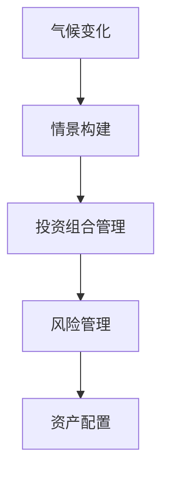
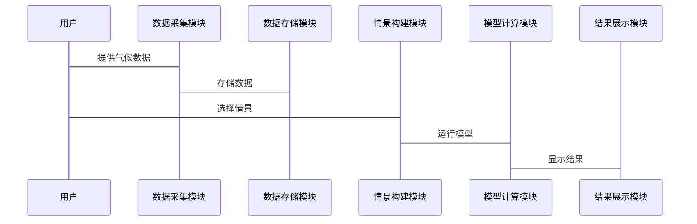

                 


```markdown
# 气候变化情景分析在投资组合管理中的应用

> 关键词：气候变化情景分析、投资组合管理、风险管理、数学模型、系统架构设计

> 摘要：气候变化情景分析是一种评估不同气候变化情况下投资组合风险和机会的方法。本文将详细介绍气候变化情景分析的核心概念、数学模型、系统架构设计以及在投资组合管理中的实际应用。通过结合理论与实践，本文旨在为投资组合管理者提供一种新的视角，以应对气候变化带来的风险和机遇。

---

# 第一部分：气候变化情景分析的背景与基础

## 第1章：气候变化与投资组合管理概述

### 1.1 气候变化的基本概念

#### 1.1.1 气候变化的定义与特征
气候变化是指地球气候系统长期的变化，包括温度、降水模式、极端天气事件频率等的变化。气候变化的特征包括长期性、全球性、不可逆性和不确定性。

#### 1.1.2 气候变化对全球经济的影响
气候变化对全球经济的影响是多方面的，包括农业减产、自然灾害增加、能源需求变化等。这些影响会通过供应链、市场需求和政策变化传导到金融市场。

#### 1.1.3 投资组合管理的基础
投资组合管理是通过优化资产配置来实现风险与收益的平衡。传统的投资组合管理主要关注市场风险和信用风险，而气候变化风险作为一种新兴风险，正在变得越来越重要。

---

### 1.2 气候变化情景分析的定义与特点

#### 1.2.1 情景分析的定义
情景分析是一种通过构建不同假设场景来评估潜在风险和机会的方法。在气候变化情景分析中，我们通常构建多种气候路径，分析其对投资组合的影响。

#### 1.2.2 气候变化情景分析的核心要素
- **气候路径**：不同气候变化的可能路径，例如全球变暖1.5°C、2°C等情景。
- **时间阶段**：不同时间段的气候变化影响，例如短期（未来10年）和长期（未来50年）。
- **驱动因素**：影响气候变化的关键因素，例如碳排放、政策变化等。

#### 1.2.3 情景分析与投资组合管理的关系
情景分析为投资组合管理提供了新的工具，用于量化气候变化对资产收益和风险的影响，帮助投资者做出更加稳健的决策。

---

### 1.3 气候变化情景分析的必要性

#### 1.3.1 气候变化对投资风险的影响
气候变化可能导致资产价格波动、企业盈利下降、政策风险增加等，这些都会影响投资组合的收益和风险。

#### 1.3.2 情景分析在风险管理中的作用
情景分析可以帮助投资者识别潜在风险，评估不同气候变化情景下的投资组合表现，从而制定更有针对性的风险管理策略。

#### 1.3.3 全球监管与市场对情景分析的需求
随着全球气候变化问题的加剧，监管机构和市场参与者越来越关注气候变化对金融系统的影响，情景分析成为评估和管理气候风险的重要工具。

---

### 1.4 本章小结

本章介绍了气候变化的基本概念、对全球经济的影响，以及投资组合管理的基础。同时，我们还讨论了气候变化情景分析的定义、核心要素及其在投资组合管理中的作用。通过本章，读者可以理解气候变化情景分析的重要性和必要性。

---

# 第二部分：气候变化情景分析的核心概念与联系

## 第2章：气候变化情景分析的核心原理

### 2.1 气候变化情景分析的理论基础

#### 2.1.1 气候模型与预测方法
气候模型是情景分析的重要工具，常用的气候模型包括全球气候模型（GCMs）和区域气候模型（RCMs）。这些模型可以帮助我们预测未来的气候变化趋势。

#### 2.1.2 情景构建的逻辑框架
情景构建通常包括以下步骤：
1. 确定关键驱动因素（如碳排放、政策变化）。
2. 设定不同的假设情景（如高排放情景、低排放情景）。
3. 使用气候模型预测不同情景下的气候变化。
4. 将气候变化结果与投资组合相关联。

#### 2.1.3 情景分析的数学模型
在数学模型中，我们通常使用概率分布来描述气候变化的不确定性。例如，可以使用正态分布来描述资产收益的变化。

---

### 2.2 气候变化情景分析的关键要素

#### 2.2.1 气候变化路径
气候变化路径是指未来气候变化的可能路径，通常分为“情景”和“路径”两种类型。情景是人为设定的假设，而路径是基于气候模型预测的具体结果。

#### 2.2.2 气候变化阶段
气候变化的影响在不同时间段可能表现不同。例如，短期内可能更多受到极端天气事件的影响，而长期内则更多受到温度上升的影响。

#### 2.2.3 气候变化驱动因素
驱动因素包括政策变化、技术创新、全球经济转型等。这些因素会通过影响碳排放、能源需求等方式间接影响气候变化。

---

### 2.3 气候变化情景分析与投资组合管理的关联

#### 2.3.1 投资组合风险的气候敏感性
不同资产对气候变化的敏感性不同。例如，能源行业的资产可能更受政策变化的影响，而农业行业的资产则更受降水变化的影响。

#### 2.3.2 情景分析在资产定价中的应用
情景分析可以帮助投资者评估不同气候变化情景下资产的未来收益，从而更准确地进行资产定价。

#### 2.3.3 气候风险的量化与投资决策
通过量化气候变化对资产的影响，投资者可以在投资决策中考虑气候风险，优化资产配置。

---

### 2.4 气候变化情景分析的实体关系图



---

### 2.5 本章小结

本章详细讨论了气候变化情景分析的核心原理，包括理论基础、关键要素以及与投资组合管理的关联。通过实体关系图，我们展示了气候变化情景分析在投资组合管理中的作用。

---

# 第三部分：气候变化情景分析的数学模型与算法

## 第3章：气候变化情景分析的数学模型

### 3.1 气候变化影响的量化方法

#### 3.1.1 气候变化对经济活动的影响
气候变化对经济活动的影响可以通过GDP变化、就业影响等方式进行量化。

#### 3.1.2 气候变化对资产收益的影响
资产收益的变化可以通过回归模型进行量化。例如，可以使用线性回归模型：
$$ y = \beta x + \epsilon $$
其中，y是资产收益，x是气候变化变量，β是回归系数，ε是误差项。

#### 3.1.3 气候变化对风险溢价的影响
气候变化会影响市场的风险偏好，从而影响资产的风险溢价。这可以通过CAPM模型进行分析：
$$ R_i = R_f + \beta_i (R_m - R_f) $$

---

### 3.2 气候变化情景分析的数学模型

#### 3.2.1 情景分析的线性回归模型
线性回归模型可以用来量化气候变化对资产收益的影响。例如：
$$ \text{收益} = \alpha + \beta \times \text{气候变化指数} + \epsilon $$

#### 3.2.2 情景分析的蒙特卡洛模拟
蒙特卡洛模拟可以通过随机抽样来模拟不同气候变化情景下的资产表现。例如：
1. 确定气候变化变量的分布。
2. 生成大量随机样本。
3. 计算每种样本下的资产收益。
4. 分析收益的分布情况。

#### 3.2.3 情景分析的动态因子模型
动态因子模型可以用来捕捉气候变化对资产收益的动态影响。例如：
$$ R_t = \lambda F_t + \epsilon_t $$
其中，F_t是因子，λ是因子载荷，ε_t是误差项。

---

### 3.3 气候变化情景分析的算法实现

#### 3.3.1 算法步骤
1. 收集气候变化数据，如温度、降水等。
2. 构建气候变化情景，如高排放情景、低排放情景。
3. 使用数学模型量化气候变化对资产的影响。
4. 模拟不同情景下的投资组合表现。
5. 分析结果，制定投资策略。

#### 3.3.2 算法实现的Python代码
```python
import numpy as np
import pandas as pd

# 示例：使用线性回归模型量化气候变化对资产收益的影响
def climate_scenario_analysis(assets, climate_data):
    # 构建回归模型
    X = climate_data[['temperature', 'precipitation']]
    y = assets['returns']
    model = np.linalg.lstsq(X, y, rcond=None)
    beta = model[0]
    
    # 预测资产收益
    predicted_returns = np.dot(X, beta)
    return predicted_returns

# 示例数据
assets = pd.DataFrame({'returns': [0.05, 0.06, 0.04, 0.07]})
climate_data = pd.DataFrame({'temperature': [1.5, 2.0, 1.8, 2.2],
                              'precipitation': [100, 80, 90, 70]})

# 进行情景分析
predicted_returns = climate_scenario_analysis(assets, climate_data)
print("Predicted Returns:", predicted_returns)
```

---

### 3.4 本章小结

本章介绍了气候变化情景分析的数学模型，包括线性回归模型、蒙特卡洛模拟和动态因子模型。通过Python代码示例，我们展示了如何量化气候变化对资产收益的影响，并进行情景分析。

---

# 第四部分：气候变化情景分析的系统分析与架构设计

## 第4章：气候变化情景分析的系统架构设计

### 4.1 问题场景介绍

气候变化情景分析系统需要处理大量的气候数据和金融数据，同时需要支持复杂的数学模型和模拟。因此，系统设计需要考虑数据存储、模型计算、结果展示等多个方面。

---

### 4.2 系统功能设计

#### 4.2.1 数据采集模块
- 支持多种数据源的接入，如全球气候数据、资产价格数据等。
- 数据预处理功能，包括数据清洗、标准化等。

#### 4.2.2 情景构建模块
- 支持用户自定义情景，如高排放情景、低排放情景。
- 使用气候模型生成不同情景下的气候变化数据。

#### 4.2.3 模型计算模块
- 实现各种数学模型，如线性回归模型、蒙特卡洛模拟。
- 支持并行计算，提高计算效率。

#### 4.2.4 结果展示模块
- 可视化气候变化情景下的投资组合表现。
- 提供交互式界面，方便用户进行情景分析。

---

### 4.3 系统架构设计


---

### 4.4 系统接口设计

- **输入接口**：支持CSV、Excel等多种格式的数据输入。
- **输出接口**：提供可视化结果和API接口，方便与其他系统集成。

---

### 4.5 系统交互设计



---

### 4.6 本章小结

本章详细讨论了气候变化情景分析系统的架构设计，包括功能模块、系统架构、接口设计和交互设计。通过系统化的架构设计，我们可以更高效地进行气候变化情景分析。

---

# 第五部分：气候变化情景分析的项目实战

## 第5章：气候变化情景分析的项目实现

### 5.1 环境配置

- **Python版本**：3.8及以上
- **依赖库**：numpy, pandas, matplotlib

```python
import numpy as np
import pandas as pd
import matplotlib.pyplot as plt
```

---

### 5.2 核心实现代码

```python
# 示例：气候变化情景分析的核心实现
def main():
    # 生成模拟数据
    np.random.seed(42)
    temperature = np.random.uniform(1.0, 2.5, 100)
    precipitation = np.random.uniform(50, 150, 100)
    returns = np.random.normal(0.05, 0.1, 100)
    
    # 数据可视化
    plt.figure(figsize=(10, 6))
    plt.scatter(temperature, precipitation, c=returns, cmap='viridis')
    plt.colorbar(label='Returns')
    plt.xlabel('Temperature')
    plt.ylabel('Precipitation')
    plt.title('Climate Scenario Analysis')
    plt.show()

if __name__ == "__main__":
    main()
```

---

### 5.3 代码应用解读与分析

上述代码通过生成模拟数据，展示了如何将气候变化数据与资产收益进行关联。通过散点图，我们可以直观地看到气候变化对资产收益的影响。

---

### 5.4 实际案例分析

假设我们有一个包含100只股票的投资组合，我们需要分析不同气候变化情景下的投资组合表现。通过代码实现，我们可以模拟不同情景下的资产收益，并评估投资组合的风险和收益。

---

### 5.5 项目小结

本章通过项目实战，展示了如何将气候变化情景分析应用于实际投资组合管理中。通过模拟数据和实际案例分析，我们可以更好地理解气候变化对投资组合的影响。

---

# 第六部分：总结与展望

## 第6章：总结与展望

### 6.1 本章总结

本章总结了气候变化情景分析在投资组合管理中的应用，包括核心概念、数学模型和系统架构设计。通过理论与实践的结合，我们展示了如何将气候变化因素纳入投资决策。

### 6.2 实践中的注意事项

在实际应用中，需要注意以下几点：
- 数据的准确性和完整性。
- 模型的合理性和适用性。
- 结果的可解释性和实用性。

### 6.3 未来研究方向

未来的研究方向包括：
- 更精确的气候模型。
- 更复杂的数学模型。
- 更高效的系统架构设计。

---

# 作者：AI天才研究院/AI Genius Institute & 禅与计算机程序设计艺术/Zen And The Art of Computer Programming

---

# END
```

