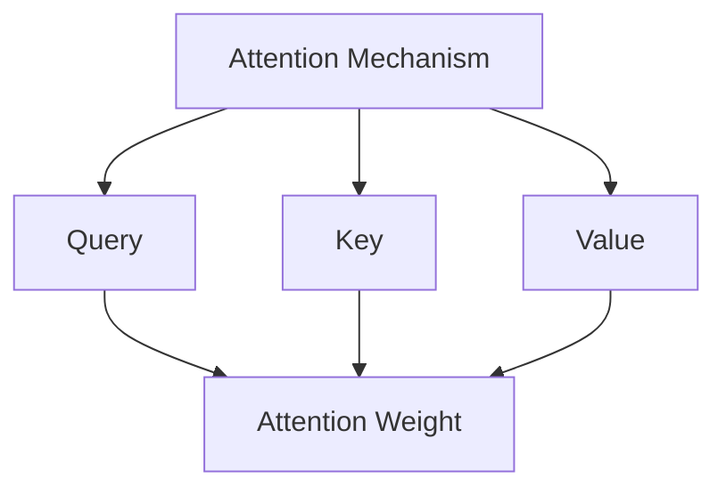
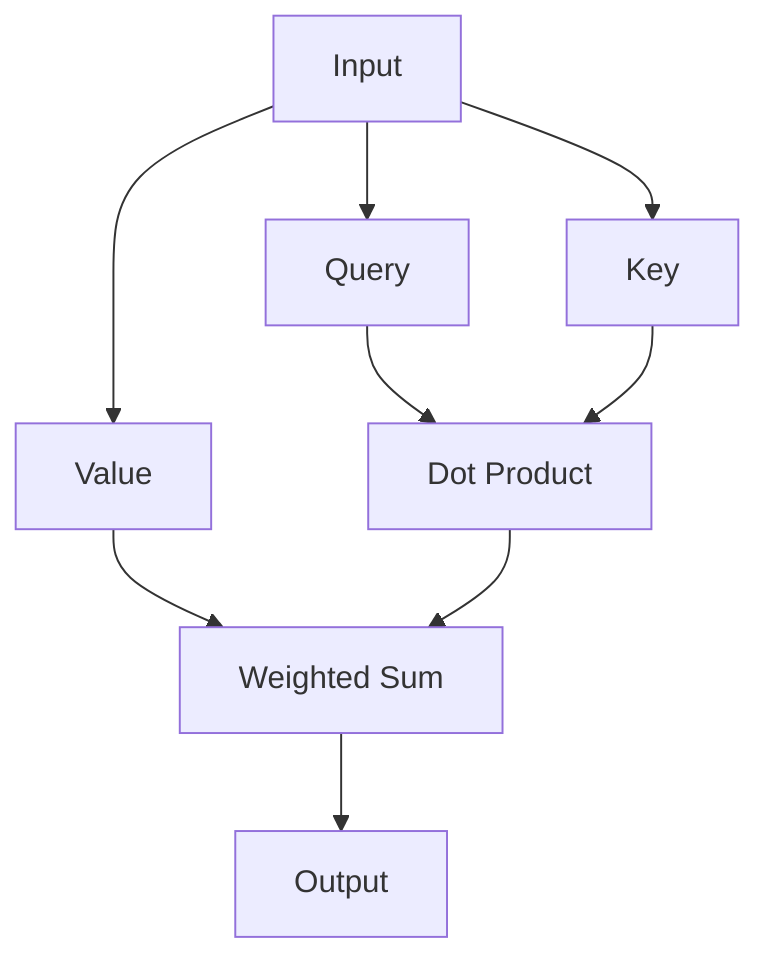
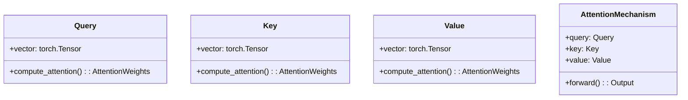
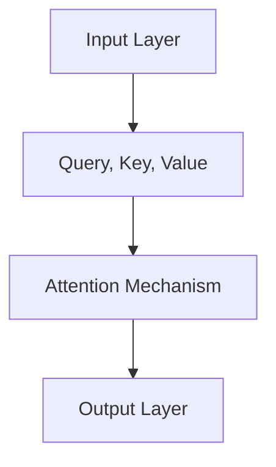

                 


# 注意力机制：提升AI Agent的关注点

## 关键词：注意力机制、AI Agent、自然语言处理、深度学习、Transformer、自注意力机制

## 摘要：注意力机制是现代人工智能技术中的核心概念之一，尤其在自然语言处理领域，通过自注意力机制和位置编码，提升了AI Agent对关键信息的关注能力。本文从注意力机制的起源、核心概念、算法原理、系统设计、项目实战等多个维度进行详细探讨，帮助读者深入理解其工作原理和实际应用。

---

## 第一部分: 注意力机制的背景与核心概念

### 第1章: 注意力机制的起源与发展

#### 1.1 从神经科学到计算机科学的注意力概念
- 人类注意力的生物学基础：大脑如何选择性关注特定信息。
- 计算机科学中的注意力模拟：从早期的特征选择到现代的深度学习模型。

#### 1.2 早期的注意力模型
- 基于位置的注意力模型。
- 基于内容的注意力模型。

#### 1.3 从经典NLP到Transformer的演变
- Transformer的提出及其在NLP中的应用。
- 自注意力机制的出现及其优势。

### 第2章: 注意力机制的核心概念与联系

#### 2.1 注意力机制的基本定义
- 注意力机制的作用：通过权重分配关注重要信息。
- 关键组成部分：查询（Query）、键（Key）、值（Value）。

#### 2.2 注意力机制的数学表达式
- 点积注意力公式：
$$\text{Attention}(Q,K,V) = \text{softmax}\left(\frac{QK^T}{\sqrt{d_k}}\right)V$$
- 多头注意力机制的提出。

#### 2.3 注意力机制的属性特征对比
- 表格对比不同注意力机制的特征（例如：自注意力 vs 外部注意力）。

#### 2.4 ER实体关系图


---

## 第二部分: 注意力机制的算法原理

### 第3章: 注意力机制的数学模型

#### 3.1 查询、键、值的计算公式
- 查询、键、值的计算：
$$Q = W_q X$$
$$K = W_k X$$
$$V = W_v X$$
- 其中，$X$ 是输入向量，$W_q, W_k, W_v$ 是参数矩阵。

#### 3.2 注意力权重的计算
- 点积计算：
$$\text{score}(q_i, k_j) = q_i \cdot k_j$$
- 归一化计算：
$$\text{weight}_j = \frac{\exp(\text{score}(q_i, k_j))}{\sum_{l} \exp(\text{score}(q_i, k_l))}$$

### 第4章: 注意力机制的实现流程

#### 4.1 算法流程图


#### 4.2 Python实现示例
```python
import torch

def attention(query, key, value):
    # 计算点积注意力
    scores = torch.bmm(query, key.transpose(-2, -1))
    scores = scores / torch.sqrt(torch.tensor(query.size(-1), dtype=torch.float))
    # 计算Softmax
    weights = torch.softmax(scores, dim=-1)
    # 加权求和
    output = torch.bmm(weights, value)
    return output

# 示例输入
batch_size = 1
d_model = 512
n_heads = 8
Q = torch.randn(batch_size, n_heads, d_model//n_heads, d_model//n_heads)
K = torch.randn(batch_size, n_heads, d_model//n_heads, d_model//n_heads)
V = torch.randn(batch_size, n_heads, d_model//n_heads, d_model//n_heads)

# 调用函数
output = attention(Q, K, V)
```

---

## 第三部分: 系统分析与架构设计

### 第5章: AI Agent中的注意力机制应用

#### 5.1 问题场景分析
- AI Agent需要关注哪些信息？
- 注意力机制在对话系统中的应用。

#### 5.2 系统功能设计
- 领域模型设计：


#### 5.3 系统架构设计


#### 5.4 系统接口设计
- 输入接口：接受Query、Key、Value向量。
- 输出接口：输出加权后的结果。

---

## 第四部分: 项目实战

### 第6章: 注意力机制的项目实现

#### 6.1 环境安装
- 安装PyTorch和transformers库：
```bash
pip install torch transformers
```

#### 6.2 核心代码实现
- 实现一个简单的注意力机制：
```python
import torch

class Attention(nn.Module):
    def __init__(self, embed_dim):
        super(Attention, self).__init__()
        self.embed_dim = embed_dim
        self.key = nn.Linear(embed_dim, embed_dim)
        self.query = nn.Linear(embed_dim, embed_dim)
        self.value = nn.Linear(embed_dim, embed_dim)
    
    def forward(self, x):
        # 前向传播
        keys = self.key(x)
        queries = self.query(x)
        values = self.value(x)
        # 点积
        attention_scores = torch.bmm(queries, keys.permute(0, 2, 1))
        # 归一化
        attention_weights = torch.softmax(attention_scores / torch.sqrt(torch.tensor(attention_scores.size(-1), dtype=torch.float)), dim=-1)
        # 加权求和
        output = torch.bmm(attention_weights, values.permute(0, 2, 1)).permute(0, 2, 1)
        return output
```

#### 6.3 案例分析与解读
- 使用上述模型进行对话系统的实现，展示注意力机制在实际应用中的效果。

---

## 第五部分: 最佳实践与总结

### 第7章: 注意力机制的优化与扩展

#### 7.1 总结
- 注意力机制的核心思想。
- 在AI Agent中的应用价值。

#### 7.2 注意事项
- 如何选择合适的位置编码。
- 如何处理长序列的注意力计算。

#### 7.3 拓展阅读
- 推荐阅读《Attention Is All You Need》论文。
- 推荐书籍：《Deep Learning》（Ian Goodfellow）。

---

## 作者：AI天才研究院  
联系邮箱：contact@aigenius.com  
官方网站：https://www.aigenius.com

---

通过以上结构和内容，我们可以系统地理解注意力机制的核心思想、算法原理和实际应用，为提升AI Agent的关注点提供有力的技术支持。

