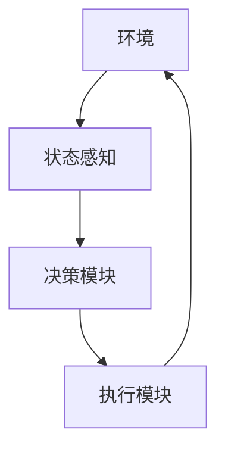
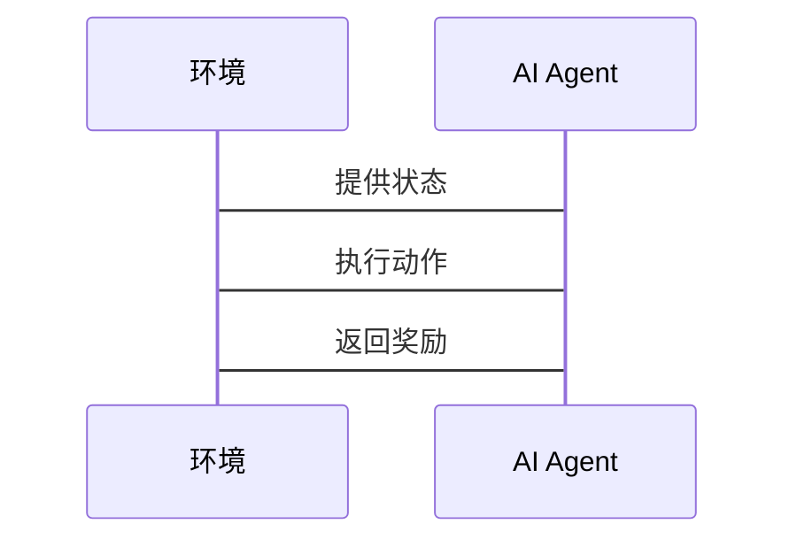

                 

<think>
好的，我将按照您的要求逐步分析并撰写《深度强化学习在AI Agent控制中的应用》的技术博客文章。首先，我需要理解文章的结构和内容要求。

### 关键词
深度强化学习, AI Agent, 强化学习, 智能体控制, 神经网络, 人工智能, 机器学习

### 摘要
深度强化学习（Deep Reinforcement Learning）是人工智能领域的重要技术，结合了深度学习和强化学习的优势，广泛应用于AI Agent的控制中。本文将从深度强化学习的基本原理出发，探讨其在AI Agent中的应用，涵盖核心算法、系统设计、项目实战等多方面内容，帮助读者全面理解并掌握这一技术。

接下来，我将按照您提供的目录大纲结构，逐步撰写每一部分的内容。

# 《深度强化学习在AI Agent控制中的应用》

> 关键词：深度强化学习, AI Agent, 强化学习, 智能体控制, 神经网络, 人工智能, 机器学习  
> 摘要：本文将从深度强化学习的基本原理出发，探讨其在AI Agent中的应用，涵盖核心算法、系统设计、项目实战等多方面内容，帮助读者全面理解并掌握这一技术。

---

# 第1章: 深度强化学习与AI Agent概述

## 1.1 深度强化学习的背景与意义
深度强化学习是人工智能领域的重要分支，结合了深度学习强大的特征提取能力与强化学习的决策优化能力。它通过与环境交互，利用奖励机制逐步优化策略，实现智能体的自主决策。

### 1.1.1 强化学习的基本概念
强化学习是一种通过试错方法让智能体在环境中学习策略的算法。智能体通过与环境交互，获得奖励或惩罚，最终找到最优策略。

### 1.1.2 深度学习与强化学习的结合
深度学习通过神经网络提取高维特征，强化学习通过奖励机制优化决策，两者的结合使得智能体能够处理复杂任务，如游戏AI、自动驾驶等。

### 1.1.3 深度强化学习的核心优势
- 高维状态空间处理能力
- 自动特征提取能力
- 离线数据处理能力

## 1.2 AI Agent的基本概念与分类
AI Agent是一种在环境中感知并自主决策的实体，能够根据反馈信息优化行为。

### 1.2.1 AI Agent的定义与特点
- **定义**：AI Agent是一个能够感知环境、采取行动以实现目标的智能实体。
- **特点**：自主性、反应性、目标导向、社会能力。

### 1.2.2 AI Agent的分类与应用场景
- **按智能级别**：反应式、基于模型、规划式AI Agent。
- **应用场景**：游戏AI、机器人控制、自动驾驶、推荐系统等。

## 1.3 深度强化学习在AI Agent中的作用
深度强化学习为AI Agent提供了强大的决策能力和自适应能力，使其能够在复杂环境中完成任务。

## 1.4 本章小结
本章介绍了深度强化学习和AI Agent的基本概念及其关系，为后续内容奠定了基础。

---

# 第2章: 深度强化学习的核心概念与算法原理

## 2.1 强化学习的基本原理
### 2.1.1 状态、动作、奖励的定义
- **状态（State）**：环境当前的信息。
- **动作（Action）**：智能体采取的行为。
- **奖励（Reward）**：智能体行为的反馈。

### 2.1.2 策略与价值函数的概念
- **策略（Policy）**：决定智能体在给定状态下采取动作的函数。
- **价值函数（Value Function）**：评估一个状态或动作的价值。

### 2.1.3 探索与利用的平衡
智能体需要在探索新策略和利用已知策略之间找到平衡。

## 2.2 深度强化学习的算法框架
### 2.2.1 Q-learning算法
Q-learning是一种经典的强化学习算法，通过更新Q值表来学习最优策略。

### 2.2.2 DQN算法
DQN（Deep Q-Network）将神经网络应用于Q-learning，实现端到端学习。

### 2.2.3 Actor-Critic算法
Actor-Critic算法通过同时学习策略（Actor）和价值函数（Critic）来优化决策。

## 2.3 深度强化学习的核心要素
### 2.3.1 神经网络在强化学习中的应用
神经网络用于近似Q值函数或策略，实现复杂状态空间的处理。

### 2.3.2 状态空间与动作空间的处理
通过神经网络将高维状态压缩为低维特征，简化计算。

### 2.3.3 奖励机制的设计与优化
设计合理的奖励函数是深度强化学习成功的关键。

## 2.4 本章小结
本章详细介绍了深度强化学习的核心概念和算法框架，为后续实现奠定了基础。

---

# 第3章: 深度强化学习的数学模型与算法实现

## 3.1 Q-learning的数学模型
Q-learning的目标是学习最优Q值表，公式如下：
$$ Q(s,a) = Q(s,a) + \alpha [r + \max Q(s',a') - Q(s,a)] $$

## 3.2 DQN算法的数学模型
DQN通过神经网络近似Q值函数，目标是最小化预测值与真实值的误差：
$$ \text{损失函数} = \mathbb{E}[(r + \gamma \max Q(s',a') - Q(s,a))^2] $$

## 3.3 Actor-Critic算法的数学模型
Actor-Critic通过策略梯度优化策略，同时学习价值函数：
$$ \nabla \theta = \nabla \log \pi_\theta(s,a) \cdot Q(s,a) $$

## 3.4 算法实现
### 3.4.1 DQN算法实现
```python
class DQN:
    def __init__(self, state_dim, action_dim, learning_rate):
        self.state_dim = state_dim
        self.action_dim = action_dim
        self.learning_rate = learning_rate
        self.q_network = self.build_network()
        self.target_network = self.build_network()

    def build_network(self):
        model = Sequential()
        model.add(Dense(64, activation='relu', input_dim=self.state_dim))
        model.add(Dense(32, activation='relu'))
        model.add(Dense(self.action_dim))
        model.compile(loss='mean_squared_error', optimizer=Adam(lr=self.learning_rate))
        return model
```

## 3.5 本章小结
本章通过数学模型和代码实现，详细讲解了深度强化学习算法的原理和实现方法。

---

# 第4章: 基于深度强化学习的AI Agent系统分析与架构设计

## 4.1 系统功能设计
- **状态感知**：通过传感器获取环境信息。
- **决策模块**：基于深度强化学习算法做出决策。
- **执行模块**：将决策转化为具体动作。

## 4.2 系统架构设计
### 4.2.1 系统架构图


## 4.3 系统接口设计
- **输入接口**：接收环境状态。
- **输出接口**：输出决策动作。

## 4.4 系统交互流程
### 4.4.1 交互流程图


## 4.5 本章小结
本章从系统层面分析了基于深度强化学习的AI Agent的设计与实现。

---

# 第5章: 深度强化学习在AI Agent中的项目实战

## 5.1 项目背景与目标
通过实现一个简单的游戏AI，展示深度强化学习在AI Agent中的应用。

## 5.2 项目实现
### 5.2.1 环境搭建
- 安装Python、TensorFlow、OpenAI Gym等库。

### 5.2.2 系统实现
```python
import gym
import numpy as np
import tensorflow as tf

class DQN_agent:
    def __init__(self, state_space, action_space, lr=0.01):
        self.state_space = state_space
        self.action_space = action_space
        self.lr = lr
        self.model = self.build_model()

    def build_model(self):
        model = tf.keras.Sequential([
            tf.keras.layers.Dense(24, activation='relu', input_dim=self.state_space),
            tf.keras.layers.Dense(self.action_space, activation='linear')
        ])
        model.compile(optimizer=tf.keras.optimizers.Adam(learning_rate=self.lr), loss='mse')
        return model

    def act(self, state):
        state = np.array([state])
        prediction = self.model.predict(state)
        return np.argmax(prediction[0])
```

### 5.2.3 代码实现解读
- **模型构建**：使用神经网络近似Q值函数。
- **决策策略**：基于模型预测选择动作。

## 5.3 实际案例分析
通过训练AI Agent在OpenAI Gym环境中的表现，展示深度强化学习的应用效果。

## 5.4 项目小结
本章通过项目实战，详细讲解了深度强化学习在AI Agent中的具体应用。

---

# 第6章: 深度强化学习的优化与展望

## 6.1 算法优化
### 6.1.1 网络结构优化
通过调整神经网络层数和节点数提升性能。

### 6.1.2 奖励机制优化
设计更合理的奖励函数，引导智能体做出正确决策。

## 6.2 系统优化
### 6.2.1 并行计算
利用多线程或分布式计算加速训练过程。

### 6.2.2 离线学习
结合实时数据和历史数据提升模型泛化能力。

## 6.3 未来展望
- **多智能体协作**：研究多个AI Agent协同工作的机制。
- **实时应用**：探索深度强化学习在实时系统中的应用。

## 6.4 本章小结
本章总结了深度强化学习的优化方法，并展望了未来的发展方向。

---

# 第7章: 总结与最佳实践

## 7.1 本章总结
本文全面介绍了深度强化学习在AI Agent中的应用，涵盖了理论、算法、系统设计和项目实战等内容。

## 7.2 最佳实践
- **明确目标**：根据任务需求选择合适算法。
- **合理设计奖励函数**：确保智能体正确导向。
- **优化模型**：通过网络结构调整和参数调优提升性能。
- **结合实际场景**：根据不同环境特点调整策略。

## 7.3 注意事项
- **数据质量**：确保训练数据的多样性和代表性。
- **算法收敛性**：关注模型的收敛速度和稳定性。
- **计算资源**：根据任务需求选择合适的计算资源。

## 7.4 拓展阅读
推荐相关书籍和论文，帮助读者深入学习。

---

# 作者：AI天才研究院/AI Genius Institute & 禅与计算机程序设计艺术 /Zen And The Art of Computer Programming

---

以上是《深度强化学习在AI Agent控制中的应用》的完整目录和内容概述。每一章都详细讲解了相关知识点，并结合实际案例和代码实现，帮助读者全面理解深度强化学习在AI Agent中的应用。

