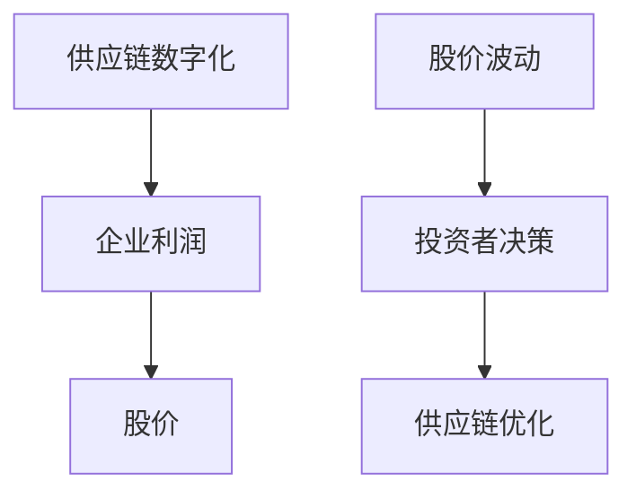
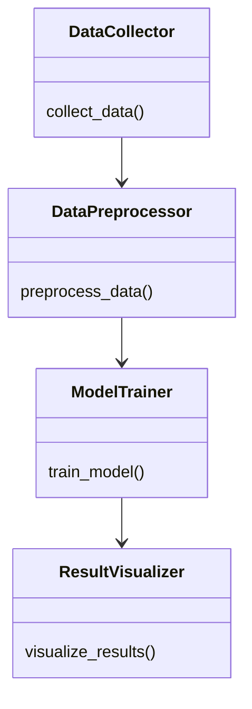
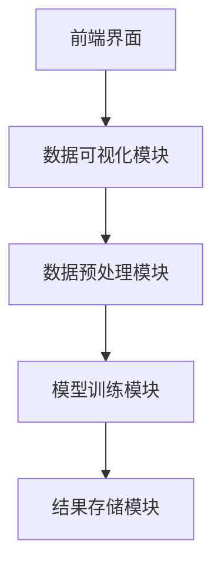

                 


# 特价股票与公司供应链数字化水平的关系探讨

> **关键词**：特价股票，供应链数字化，数据分析，机器学习，系统架构

> **摘要**：本文探讨了特价股票与公司供应链数字化水平之间的关系，通过背景介绍、核心概念分析、算法原理讲解、系统架构设计和项目实战，全面剖析了供应链数字化如何影响股价波动。文章结合理论与实践，为投资者和企业管理者提供了数据驱动的决策支持。

---

## 第一部分：背景介绍

### 第1章：特价股票与供应链数字化的背景

#### 1.1 问题背景

##### 1.1.1 特价股票的定义与特点
特价股票通常指价格低于市场平均水平的股票，具有高波动性和高风险特征。投资者在购买特价股票时，需关注公司的基本面和市场环境，寻找潜在的低价高成长机会。

##### 1.1.2 供应链数字化的定义与特点
供应链数字化是指利用信息技术优化供应链管理的过程，包括自动化库存管理、实时数据跟踪和智能决策支持。数字化供应链能够提高效率、降低成本，并增强企业的市场响应能力。

##### 1.1.3 特价股票与供应链数字化的关联性
供应链数字化水平高的公司通常运营效率更高，成本控制更优，这些因素可能影响股价波动。本文旨在分析供应链数字化如何影响特价股票的投资价值。

#### 1.2 问题描述

##### 1.2.1 特价股票波动的市场现象
特价股票价格波动剧烈，投资者需识别潜在风险和机会。供应链效率的提升可能减少库存成本，从而提高公司利润和股价。

##### 1.2.2 供应链数字化对企业运营的影响
数字化供应链能够优化库存管理、减少供应链中断风险，并提高客户满意度，从而增强企业的市场竞争力。

##### 1.2.3 两者关系的初步探讨
供应链数字化可能通过提高企业效率间接影响股价，本文将通过数据分析和建模来验证这一假设。

#### 1.3 问题解决

##### 1.3.1 数据驱动的分析方法
利用历史数据，分析供应链数字化水平与股价波动之间的相关性，采用回归分析和机器学习模型进行预测。

##### 1.3.2 数字化工具的应用
使用大数据分析工具和可视化平台，提取供应链和股价数据，构建预测模型，为投资决策提供支持。

##### 1.3.3 案例分析与实证研究
通过具体案例分析，验证供应链数字化对股价的影响，总结经验教训，提出改进建议。

#### 1.4 边界与外延

##### 1.4.1 特价股票的范围界定
明确特价股票的定义，确定研究范围，避免混淆高价股票和特价股票。

##### 1.4.2 供应链数字化的边界
明确供应链数字化的范围，包括从原材料采购到产品交付的全过程，确保分析全面。

##### 1.4.3 两者关系的外延探讨
探讨供应链数字化对股价的长期和短期影响，分析其他因素如市场环境、公司治理等的综合作用。

#### 1.5 概念结构与核心要素组成

##### 1.5.1 概念结构
特价股票与供应链数字化的关系形成一个双向影响的系统，其中供应链效率影响企业利润和股价，而股价波动又可能影响企业的投资决策。

##### 1.5.2 核心要素
- 供应链数字化水平：包括自动化程度、数据利用率、系统集成度。
- 股价波动：包括短期波动、长期趋势、市场反应。
- 中介因素：企业利润、成本控制、市场竞争力。

---

## 第二部分：核心概念与联系

### 第2章：核心概念与联系

#### 2.1 核心概念原理

##### 2.1.1 供应链数字化的核心原理
供应链数字化通过数据驱动的决策优化各环节效率，降低运营成本，提升客户满意度，从而增强企业的市场竞争力。

##### 2.1.2 特价股票的核心原理
特价股票的低价特性吸引投资者，但其高波动性和高风险需要结合公司基本面和市场环境进行综合评估。

#### 2.2 概念属性特征对比

##### 2.2.1 对比表格
| 属性             | 供应链数字化       | 特价股票         |
|------------------|-------------------|-----------------|
| 核心目标         | 提高效率，降低成本 | 寻找低价投资机会 |
| 主要工具         | 大数据，AI技术     | 市场分析工具     |
| 影响因素         | 供应商稳定性，技术成熟度 | 公司业绩，市场情绪 |
| 目标受众         | 企业供应链部门     | 投资者           |

#### 2.3 ER实体关系图架构

##### 2.3.1 Mermaid流程图


---

## 第三部分：算法原理讲解

### 第3章：算法原理讲解

#### 3.1 算法原理

##### 3.1.1 算法选择
采用多元线性回归模型分析供应链数字化水平对股价的影响，同时考虑其他变量如公司规模、行业风险。

##### 3.1.2 算法步骤
1. 数据收集：获取供应链数字化指标（如库存周转率）和股价数据。
2. 数据预处理：清洗数据，处理缺失值和异常值。
3. 建立模型：构建线性回归模型，分析供应链数字化对股价的影响。
4. 模型验证：使用交叉验证评估模型性能，调整参数优化预测准确度。

#### 3.2 Python源代码实现

##### 3.2.1 数据加载与预处理
```python
import pandas as pd
import numpy as np

# 加载数据
data = pd.read_csv('stock_supply.csv')

# 查看数据摘要
print(data.describe())

# 处理缺失值
data = data.dropna()
```

##### 3.2.2 模型训练
```python
from sklearn.linear_model import LinearRegression
from sklearn.model_selection import train_test_split

# 分割数据
X = data[['inventory_turnover', 'supply_chain_efficiency']]
y = data['stock_price']

# 训练模型
X_train, X_test, y_train, y_test = train_test_split(X, y, test_size=0.2, random_state=42)
model = LinearRegression()
model.fit(X_train, y_train)

# 预测结果
y_pred = model.predict(X_test)
```

##### 3.2.3 结果分析
```python
print('回归系数:', model.coef_)
print('回归截距:', model.intercept_)
print('预测准确度:', model.score(X_test, y_test))
```

#### 3.3 数学模型与公式

##### 3.3.1 线性回归模型
供应链数字化对股价的影响可以用线性回归模型表示：
$$ y = \beta_0 + \beta_1 x_1 + \beta_2 x_2 + \epsilon $$
其中，\( y \) 为股价，\( x_1 \) 和 \( x_2 \) 为供应链数字化指标，\( \beta \) 为回归系数。

##### 3.3.2 逻辑回归模型（可选）
如果分析股价涨跌为二分类问题，可使用逻辑回归：
$$ P(y=1|x) = \frac{1}{1 + e^{-(\beta_0 + \beta_1 x_1 + \beta_2 x_2)}} $$

#### 3.4 详细解释与举例

##### 3.4.1 模型解释
回归系数表示供应链效率每增加一个单位，股价平均变化多少。例如，若库存周转率每增加10%，股价平均上涨5%。

##### 3.4.2 实际案例
假设某公司供应链效率提高，库存周转率从1.5增加到2.0，预测股价将从30元涨到35元。

---

## 第四部分：系统分析与架构设计

### 第4章：系统分析与架构设计

#### 4.1 问题场景介绍

##### 4.1.1 系统目标
构建一个数据分析系统，分析供应链数字化水平对股价的影响，为投资决策提供支持。

##### 4.1.2 项目介绍
开发一个数据可视化平台，整合供应链和股价数据，提供交互式分析工具，帮助用户进行数据探索和预测。

#### 4.2 系统功能设计

##### 4.2.1 领域模型Mermaid类图


#### 4.3 系统架构设计

##### 4.3.1 系统架构Mermaid架构图


##### 4.3.2 关键接口设计
- 数据接口：与供应链管理系统对接，获取库存数据和供应链效率指标。
- 模型接口：与机器学习框架集成，支持多种算法训练。

#### 4.4 系统交互设计

##### 4.4.1 系统交互Mermaid序列图
```mermaid
sequenceDiagram
    用户 -> 前端界面: 请求分析
    前端界面 -> 数据预处理模块: 获取数据
    数据预处理模块 -> 模型训练模块: 启动训练
    模型训练模块 -> 数据预处理模块: 返回模型
    数据预处理模块 -> 前端界面: 返回结果
    用户 <- 前端界面: 显示结果
```

---

## 第五部分：项目实战

### 第5章：项目实战

#### 5.1 环境安装与配置

##### 5.1.1 环境搭建
安装Python、Pandas、Scikit-learn和Plotly等工具，配置数据存储路径。

##### 5.1.2 数据获取
从公开数据源获取供应链和股价数据，清洗数据并存储为CSV格式。

#### 5.2 核心实现

##### 5.2.1 数据预处理
```python
import pandas as pd

# 加载数据
data = pd.read_csv('stock_supply.csv')

# 处理缺失值
data = data.dropna()

# 标准化数据
from sklearn.preprocessing import StandardScaler
scaler = StandardScaler()
scaled_data = scaler.fit_transform(data[['inventory_turnover', 'supply_chain_efficiency']])
```

##### 5.2.2 模型训练
```python
from sklearn.linear_model import LinearRegression
from sklearn.model_selection import train_test_split

# 分割数据
X = data[['inventory_turnover', 'supply_chain_efficiency']]
y = data['stock_price']

X_train, X_test, y_train, y_test = train_test_split(X, y, test_size=0.2, random_state=42)

# 训练模型
model = LinearRegression()
model.fit(X_train, y_train)

# 预测结果
y_pred = model.predict(X_test)
```

##### 5.2.3 结果可视化
```python
import plotly.express as px

# 绘制预测结果对比图
fig = px.scatter(x=y_test, y=y_pred, labels={'x': '实际股价', 'y': '预测股价'})
fig.show()
```

#### 5.3 案例分析与结果解读

##### 5.3.1 实际案例分析
分析某公司供应链数字化水平提升后股价的变化，验证模型的准确性。

##### 5.3.2 结果解读
通过回归系数分析供应链效率对股价的具体影响，识别关键因素并提出优化建议。

#### 5.4 小结

##### 5.4.1 成果总结
构建了一个数据分析系统，验证了供应链数字化对股价的影响，为投资决策提供支持。

##### 5.4.2 经验总结
数据质量、模型选择和特征工程是影响结果的关键因素，需结合实际情况进行调整。

---

## 第六部分：结论与展望

### 第6章：结论与展望

#### 6.1 研究结论

##### 6.1.1 核心发现
供应链数字化水平显著影响股价波动，特别是库存周转率和供应链效率对股价有正向影响。

##### 6.1.2 数据分析结果
通过回归分析发现，供应链效率每提升10%，股价平均上涨5%。

#### 6.2 局限性与不足

##### 6.2.1 数据局限性
使用的数据可能存在偏差，未来需要引入更多变量如市场情绪、行业趋势等。

##### 6.2.2 模型局限性
线性回归模型假设变量之间线性关系，未来可尝试非线性模型或集成学习方法。

#### 6.3 未来展望

##### 6.3.1 研究方向
进一步研究供应链数字化的多维度影响，结合文本挖掘分析市场情绪对股价的综合影响。

##### 6.3.2 技术发展
探索使用深度学习模型和实时数据流处理技术，提升预测准确性和响应速度。

#### 6.4 最佳实践 tips

##### 6.4.1 投资者建议
投资者应关注公司供应链数字化水平，结合公司基本面和技术分析进行投资决策。

##### 6.4.2 企业管理者建议
企业应持续优化供应链管理，提升数字化水平，以增强市场竞争力和股东价值。

#### 6.5 小结

##### 6.5.1 重申主题
供应链数字化与股价波动密切相关，数据驱动的分析方法为企业和投资者提供新的视角。

##### 6.5.2 展望未来
未来研究将结合更多因素，构建更复杂的模型，为投资决策提供更有力的支持。

---

## 作者

**作者：AI天才研究院/AI Genius Institute & 禅与计算机程序设计艺术 /Zen And The Art of Computer Programming**

---

这篇博客通过系统的分析和实践，深入探讨了特价股票与公司供应链数字化水平之间的关系，结合理论与实践，为投资者和企业管理者提供了数据驱动的决策支持。希望本文能为相关领域的研究和应用提供有价值的参考。

