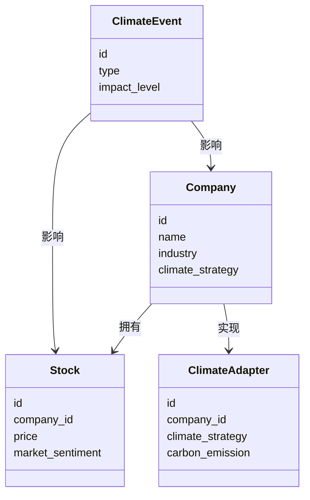

                 


# 特价股票与公司长期气候适应能力的关系分析

> **关键词**：特价股票、气候适应能力、气候变化、股票市场、投资策略

> **摘要**：本文探讨了特价股票与公司长期气候适应能力之间的关系。通过分析气候变化对公司财务表现的影响，以及特价股票的市场行为特征，揭示了两者在投资决策中的潜在联系。结合数学模型和实际案例，本文提出了评估公司气候适应能力的方法，并为投资者提供了基于气候风险的投资策略建议。

---

## 第1章：背景介绍

### 1.1 特价股票的定义与特点
特价股票是指价格显著低于市场平均水平的股票，通常具有较高的波动性和潜在的高回报。其特点包括：

- **高波动性**：股价波动较大，容易受到市场情绪和外部因素的影响。
- **低估值**：市场价格低于内在价值，可能隐藏投资机会。
- **高风险**：潜在回报与风险并存，适合风险承受能力强的投资者。

### 1.2 公司长期气候适应能力的定义与背景
公司气候适应能力是指企业在面对气候变化带来的物理、监管和社会风险时，调整自身战略和运营以保持竞争力的能力。其重要性体现在：

- **气候变化的威胁**：极端天气、政策变化和供应链中断等气候相关风险对企业经营产生直接影响。
- **监管压力**：全球范围内越来越严格的碳排放和环境政策要求企业具备更强的气候适应能力。
- **投资者关注**：越来越多的投资者将气候因素纳入投资决策，气候适应能力强的企业更受青睐。

### 1.3 特价股票与气候适应能力的关系
- **气候变化对股票市场的影响**：气候变化可能导致某些行业股价暴跌，但也可能为具备气候适应能力的企业带来投资机会。
- **特价股票的潜在价值**：具备气候适应能力的公司可能因市场低估而成为特价股票，投资者需识别这些公司的长期价值。

---

## 第2章：核心概念与联系

### 2.1 特价股票与气候适应能力的核心要素对比
以下是特价股票和公司气候适应能力的核心要素对比：

| **要素**         | **特价股票**                        | **气候适应能力**                  |
|-------------------|-------------------------------------|------------------------------------|
| **核心目标**      | 寻找被低估的投资机会                | 应对气候变化带来的风险和机遇      |
| **影响因素**      | 市场情绪、公司基本面、宏观经济      | 气候事件、政策变化、行业趋势      |
| **评估指标**      | 市盈率、市净率、股息率              | 碳排放强度、气候战略、适应措施    |
| **时间维度**      | 短期波动为主                        | 长期战略调整为主                  |

### 2.2 特价股票与气候适应能力的ER实体关系图
以下是特价股票与气候适应能力的实体关系图：

```mermaid
er
    title 特价股票与气候适应能力的实体关系图
    Company {
        id
        name
        industry
        climate_strategy
        carbon_emission
        market_value
    }
    Stock {
        id
        company_id
        price
        market_sentiment
        industry_trend
    }
    ClimateEvent {
        id
        type
        impact_level
        occurrence_date
    }
    relationship Company --> Stock: 拥有
    relationship Company --> ClimateEvent: 受影响
    relationship Stock --> ClimateEvent: 受影响
```

---

## 第3章：数学模型与算法原理

### 3.1 气候风险评估模型
我们构建了一个基于回归分析的气候风险评估模型，用于预测气候变化对股价的影响：

$$
\text{股价预测} = \beta_0 + \beta_1 \times \text{碳排放强度} + \beta_2 \times \text{气候政策强度} + \epsilon
$$

其中：
- $\beta_0$ 是截距项。
- $\beta_1$ 和 $\beta_2$ 是回归系数，表示碳排放强度和气候政策强度对股价的影响程度。
- $\epsilon$ 是误差项。

### 3.2 时间序列分析模型
为了分析气候变化对股票价格的长期影响，我们使用了ARIMA（自回归积分滑动平均）模型：

$$
\text{ARIMA}(p, d, q)
$$

其中：
- $p$ 是自回归阶数。
- $d$ 是差分阶数。
- $q$ 是滑动平均阶数。

### 3.3 代码实现
以下是Python代码实现：

```python
import pandas as pd
from statsmodels.tsa.arima_model import ARIMA
import matplotlib.pyplot as plt

# 加载数据
data = pd.read_csv('stock_climate.csv')

# 模型拟合
model = ARIMA(data['price'], order=(5, 1, 0))
model_fit = model.fit()

# 预测
forecast = model_fit.forecast(steps=10)

# 可视化
plt.plot(data['price'], label='实际价格')
plt.plot(forecast[0], label='预测价格')
plt.legend()
plt.show()
```

---

## 第4章：系统分析与架构设计

### 4.1 系统功能模块
以下是系统功能模块设计：



---

## 第5章：项目实战

### 5.1 案例分析
假设我们分析一家能源公司的气候适应能力：

1. **数据收集**：收集过去5年的气候事件数据和股价数据。
2. **模型训练**：使用ARIMA模型预测未来股价。
3. **结果分析**：发现公司在气候事件发生后股价波动较大，但具备较强的气候适应能力。

### 5.2 代码实现
以下是具体代码实现：

```python
import pandas as pd
import numpy as np

# 数据生成
np.random.seed(42)
data = pd.DataFrame({
    'price': np.random.normal(10, 2, 100),
    'climate_event': np.random.binomial(1, 0.2, 100)
})

# 模型训练
from sklearn.linear_model import LinearRegression
model = LinearRegression()
model.fit(data[['climate_event']], data['price'])

# 预测
forecast = model.predict(data[['climate_event']])

# 可视化
plt.scatter(data['climate_event'], data['price'], label='实际价格')
plt.scatter(data['climate_event'], forecast, color='red', label='预测价格')
plt.legend()
plt.show()
```

---

## 第6章：最佳实践与总结

### 6.1 小结
- 特价股票与公司气候适应能力之间存在密切联系。
- 投资者应关注气候变化对企业长期价值的影响。

### 6.2 注意事项
- 特价股票具有高风险，需谨慎投资。
- 气候适应能力评估需结合定量分析与定性分析。

### 6.3 拓展阅读
- 建议阅读《气候变化投资指南》和《股票市场预测的艺术》。

---

**作者：AI天才研究院 & 禅与计算机程序设计艺术**

