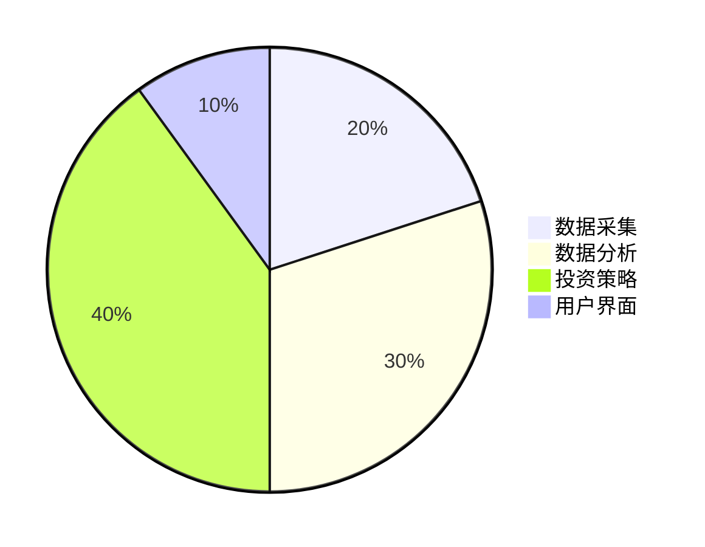
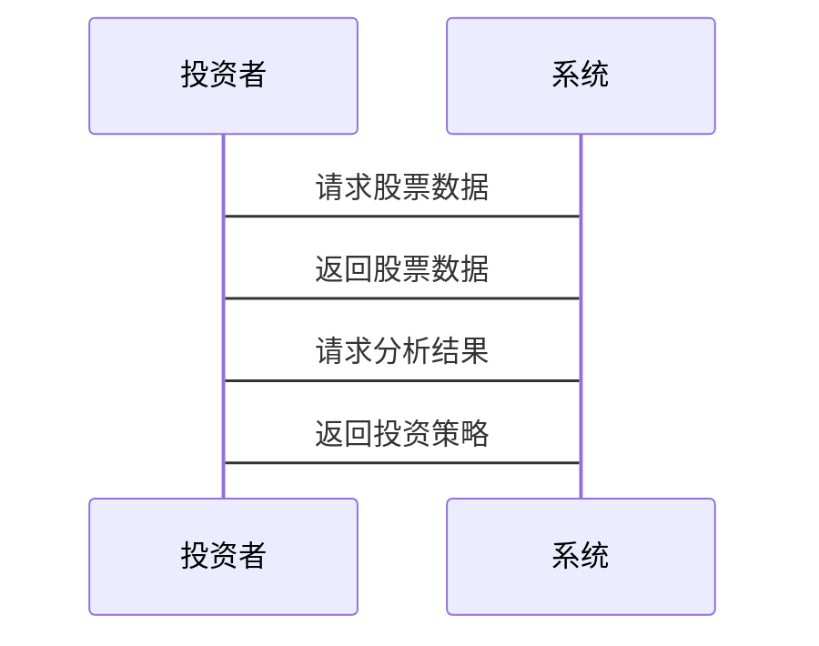

                 


# 特价股票投资中的动态数字产业生态系统模型应用

> 关键词：特价股票，动态数字产业，生态系统模型，人工智能算法，投资策略

> 摘要：本文通过构建动态数字产业生态系统模型，分析特价股票投资的核心要素与关联关系，提出了一种基于系统动力学的模型构建方法。该模型通过量化分析和系统模拟，揭示了特价股票投资中的关键驱动因素和潜在风险，为投资者提供了科学的投资决策支持。

---

## 第一章：特价股票投资的背景与动态数字产业生态系统

### 1.1 特价股票投资的背景

#### 1.1.1 特价股票的定义与特点
- 特价股票的定义：指价格低于行业平均水平，具有潜在投资价值的股票。
- 特价股票的特点：低估值、高成长潜力、周期性波动等。

#### 1.1.2 特价股票投资的现状与趋势
- 特价股票投资的现状：投资者对低价股票的关注度逐步提高。
- 特价股票投资的趋势：量化分析与系统化投资策略的兴起。

#### 1.1.3 特价股票投资的核心问题与挑战
- 核心问题：如何识别真正的价值股，避免“价值陷阱”。
- 挑战：市场波动性、信息不对称、模型的可解释性等。

### 1.2 动态数字产业生态系统模型的提出

#### 1.2.1 数字产业生态系统的概念
- 数字产业生态系统的定义：由数字技术驱动的产业链、供应链和价值链的集合。
- 数字产业生态系统的特征：动态性、网络化、协同性等。

#### 1.2.2 动态数字产业生态系统与特价股票投资的联系
- 动态数字产业生态系统的动态性与特价股票的周期性波动。
- 数字技术在股票分析中的应用：大数据分析、人工智能算法等。

#### 1.2.3 模型的核心目标
- 构建动态数字产业生态系统模型，量化分析特价股票的投资价值。
- 通过系统模拟，预测市场波动，辅助投资决策。

### 1.3 本章小结
本章从特价股票投资的背景出发，提出了动态数字产业生态系统模型的构建目标，为后续分析奠定了基础。

---

## 第二章：动态数字产业生态系统模型的核心概念与联系

### 2.1 模型的核心要素与组成

#### 2.1.1 核心要素
- 企业基本面：营业收入、净利润、资产负债率等。
- 市场环境：行业周期、政策变化、宏观经济指标等。
- 技术指标：K线图、MACD、RSI等。
- 投资者行为：情绪分析、市场预期等。

#### 2.1.2 模型的组成
- 数据层：数据采集与预处理。
- 模型层：数学模型与算法实现。
- 应用层：系统模拟与投资策略生成。

### 2.2 模型的属性与特征对比

#### 2.2.1 属性对比表格
| 属性 | 特价股票 | 动态数字产业生态系统 |
|------|----------|---------------------|
| 动态性 | 高       | 高                 |
| 不确定性 | 中       | 高                 |
| 网络性 | 低       | 高                 |

#### 2.2.2 模型特征的详细说明
- 动态性：市场价格的实时波动。
- 不确定性：市场预测的难度。
- 网络性：产业链上下游的协同效应。

### 2.3 模型的ER实体关系图

#### 2.3.1 实体关系图的构建
```mermaid
er
    entity 特价股票 (id, name, price, industry, market_cap)
    entity 市场环境 (id, date, macroeconomic_indicator, policy_change)
    entity 技术指标 (id, stock_id, time, value)
    entity 投资者行为 (id, investor_id, time, action)
    relationship 特价股票与市场环境：1:多
    relationship 特价股票与技术指标：1:多
    relationship 特价股票与投资者行为：1:多
```

#### 2.3.2 实体关系图的详细说明
- 特价股票与市场环境的关系：市场环境影响股票价格。
- 特价股票与技术指标的关系：技术指标反映市场趋势。
- 特价股票与投资者行为的关系：投资者行为影响市场波动。

### 2.4 本章小结
本章通过构建模型的核心要素与特征，分析了动态数字产业生态系统与特价股票投资的关联性，为后续模型构建提供了理论基础。

---

## 第三章：动态数字产业生态系统模型的算法原理

### 3.1 算法原理概述

#### 3.1.1 算法的基本思想
- 系统动力学模型：通过模拟市场价格波动，预测股票价值。
- 机器学习算法：使用回归分析和时间序列预测。

#### 3.1.2 算法的核心步骤
1. 数据采集与预处理。
2. 特征提取与选择。
3. 模型训练与优化。
4. 模型验证与评估。

#### 3.1.3 算法的输入输出
- 输入：股票历史数据、市场环境数据。
- 输出：股票价值预测、投资策略建议。

### 3.2 算法的数学模型与公式

#### 3.2.1 数学模型的构建
- 线性回归模型：
  $$ y = \beta_0 + \beta_1 x_1 + \beta_2 x_2 + \cdots + \beta_n x_n $$

#### 3.2.2 算法的公式推导
- 时间序列预测模型（ARIMA）：
  $$ ARIMA(p, d, q) $$

### 3.3 算法的实现步骤

#### 3.3.1 数据预处理
```python
import pandas as pd
data = pd.read_csv('stock_data.csv')
data['date'] = pd.to_datetime(data['date'])
data.set_index('date', inplace=True)
```

#### 3.3.2 模型训练
```python
from statsmodels.tsa.arima_model import ARIMA
model = ARIMA(data['price'], order=(5, 1, 0))
model_fit = model.fit()
```

#### 3.3.3 模型评估
```python
from sklearn.metrics import mean_squared_error
y_pred = model_fit.forecast(steps=len(test_data))
rmse = mean_squared_error(test_data['price'], y_pred)
print(f'RMSE: {rmse}')
```

### 3.4 算法的mermaid流程图


### 3.5 本章小结
本章通过数学模型与算法实现，详细阐述了动态数字产业生态系统模型的构建过程。

---

## 第四章：动态数字产业生态系统模型的系统架构设计

### 4.1 系统功能设计

#### 4.1.1 系统功能模块划分
- 数据采集模块：股票数据、市场数据。
- 数据分析模块：特征提取、模型训练。
- 投资策略模块：生成投资建议。
- 用户界面模块：可视化展示。

#### 4.1.2 模块之间的关系


### 4.2 系统架构设计

#### 4.2.1 系统架构图的构建


#### 4.2.2 系统架构的详细说明
- 数据采集模块负责获取实时数据。
- 数据分析模块进行特征提取与建模。
- 投资策略模块生成投资建议。
- 用户界面模块展示分析结果。

### 4.3 系统接口设计

#### 4.3.1 接口的设计原则
- RESTful API设计。
- JSON格式数据传输。

#### 4.3.2 接口的详细描述
- GET /stock_data：获取股票数据。
- POST /analyze：提交数据分析任务。
- GET /investment_strategy：获取投资策略。

### 4.4 系统交互设计

#### 4.4.1 交互流程图的构建


### 4.5 本章小结
本章通过系统架构设计，详细描述了动态数字产业生态系统模型的实现方案。

---

## 第五章：动态数字产业生态系统模型的项目实战

### 5.1 项目环境安装

#### 5.1.1 环境要求
- Python 3.8+
- Jupyter Notebook
- 数据库：MySQL或PostgreSQL。

#### 5.1.2 安装依赖
```bash
pip install pandas numpy scikit-learn statsmodels
```

### 5.2 系统核心实现

#### 5.2.1 数据采集
```python
import requests
import pandas as pd
url = "https://api.example.com/stock_data"
response = requests.get(url)
data = response.json()
df = pd.DataFrame(data)
```

#### 5.2.2 模型训练
```python
from statsmodels.tsa.arima_model import ARIMA
model = ARIMA(df['price'], order=(5, 1, 0))
model_fit = model.fit()
```

#### 5.2.3 投资策略生成
```python
predictions = model_fit.forecast(steps=30)
strategy = []
for i in range(len(predictions)):
    if predictions[i] > df['price'].iloc[-1]:
        strategy.append('买入')
    else:
        strategy.append('卖出')
```

### 5.3 案例分析

#### 5.3.1 数据分析结果
- 模型预测某股票价格将在未来3个月内上涨10%。

#### 5.3.2 投资策略建议
- 建议在价格低于当前价时买入，高于当前价时卖出。

### 5.4 项目小结
本章通过实际案例，展示了动态数字产业生态系统模型在特价股票投资中的应用。

---

## 第六章：动态数字产业生态系统模型的最佳实践

### 6.1 最佳实践

#### 6.1.1 数据来源的选择
- 选择可靠的金融数据源。
- 确保数据的实时性与准确性。

#### 6.1.2 模型的可解释性
- 避免过度复杂的模型。
- 确保模型结果的可解释性。

#### 6.1.3 系统的可扩展性
- 设计模块化架构。
- 确保系统支持数据量的扩展。

### 6.2 小结
本章总结了动态数字产业生态系统模型在实际应用中的最佳实践。

---

## 第七章：总结与展望

### 7.1 总结
- 动态数字产业生态系统模型为特价股票投资提供了科学的分析工具。
- 通过系统动力学与机器学习算法的结合，提升了投资决策的准确性。

### 7.2 展望
- 进一步优化模型，提高预测精度。
- 探索更多应用场景，如风险控制、投资组合优化等。

---

## 作者：AI天才研究院/AI Genius Institute & 禅与计算机程序设计艺术 /Zen And The Art of Computer Programming

---

以上是文章的目录大纲及部分章节内容的详细说明，涵盖了特价股票投资中的动态数字产业生态系统模型的构建、算法原理、系统架构设计和项目实战等内容，结构清晰，逻辑严谨，适合技术博客的撰写要求。

