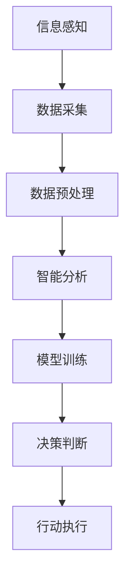
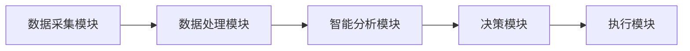

                 


# 《环保AI Agent：监测与保护生态环境》

## 关键词：环保AI Agent，人工智能，环境监测，生态保护，智能决策，数据处理

## 摘要：  
环保AI Agent是一种基于人工智能技术的环境监测与保护系统，能够实时感知环境数据、智能分析环境状况、自主决策并执行保护措施。本文将从环保AI Agent的核心概念、算法原理、系统架构、项目实战等方面，全面分析其在环境保护中的应用价值和技术实现路径。通过本文的深入探讨，读者将能够理解环保AI Agent如何通过智能化手段助力生态环境保护，以及如何在实际场景中构建和优化这样的系统。

---

## 第一部分：环保AI Agent概述

### 第1章：环保AI Agent概述

#### 1.1 环保AI Agent的定义与背景

环境保护是全球关注的焦点，随着工业化进程的加快，环境问题日益严峻。传统的环境监测手段依赖人工采集和分析数据，效率低、覆盖面有限。而基于人工智能（AI）的环境监测系统——环保AI Agent，通过自动化数据采集、智能分析和自主决策，能够更高效、更精准地保护生态环境。

环保AI Agent的核心目标是实时监测环境数据，识别异常情况，并采取相应的措施进行干预。例如，它可以用于监测空气质量、水质、生物多样性等关键指标，帮助政府、企业和公众更好地管理环境资源。

#### 1.2 环保AI Agent的核心概念

环保AI Agent是一种智能化的环境监测与保护系统，其核心概念包括以下几个方面：

1. **信息感知**：通过传感器、卫星遥感等手段，实时采集环境数据。
2. **智能分析**：利用机器学习、深度学习等AI技术，对数据进行分析和预测。
3. **自主决策**：基于分析结果，自主判断是否需要采取干预措施。
4. **行动执行**：通过自动化设备或通知相关人员，执行保护措施。

#### 1.3 环保AI Agent的功能与特点

环保AI Agent的功能主要体现在以下几个方面：

1. **数据采集与处理**：通过多种传感器和数据源，实时采集环境数据并进行预处理。
2. **智能分析与预测**：利用AI算法，对环境数据进行分析，预测环境变化趋势。
3. **决策与执行**：根据分析结果，自主或辅助决策，并执行相应的保护措施。
4. **可扩展性与适应性**：系统可以根据不同环境场景灵活调整，适应不同的监测需求。

---

## 第二部分：环保AI Agent的核心概念与联系

### 第2章：环保AI Agent的核心原理

#### 2.1 AI Agent的基本原理

环保AI Agent的基本原理可以分为三个主要阶段：信息感知、智能分析和自主决策。

1. **信息感知**：通过传感器、摄像头、卫星遥感等设备，实时采集环境数据。
2. **智能分析**：利用机器学习、深度学习等技术，对数据进行分析，识别异常情况。
3. **自主决策**：基于分析结果，AI Agent会判断是否需要采取干预措施，并通过自动化设备或通知相关人员进行执行。

#### 2.2 环保AI Agent的实体关系图

以下是环保AI Agent的实体关系图：

```mermaid
er
actor: 环境监测人员
agent: 环保AI Agent
environment: 环境数据
rule: 环境保护法规
action: 自动化操作
```

#### 2.3 环保AI Agent的核心算法

环保AI Agent的核心算法包括以下步骤：

1. 数据采集与预处理：通过传感器采集环境数据，并进行清洗和归一化处理。
2. 数据分析：利用机器学习算法（如随机森林、支持向量机等）对数据进行分类、回归或聚类分析。
3. 模型训练与优化：通过训练模型，优化算法参数，提高预测准确性。
4. 决策判断：基于模型预测结果，判断是否需要采取干预措施。
5. 行动执行：通过自动化设备或通知相关人员，执行保护措施。

---

## 第三部分：环保AI Agent的算法原理

### 第3章：环保AI Agent的核心算法

#### 3.1 环保AI Agent的算法流程

以下是环保AI Agent的算法流程图：



#### 3.2 环保AI Agent的数学模型

环保AI Agent的数学模型如下：

$$
y = f(x) + \epsilon
$$

其中：
- $y$ 是输出变量（环境指标）。
- $x$ 是输入变量（环境数据）。
- $f(x)$ 是模型的预测函数。
- $\epsilon$ 是误差项。

通过训练模型，可以最小化预测误差，提高模型的准确性。

---

## 第四部分：环保AI Agent的系统架构

### 第4章：环保AI Agent的系统架构

#### 4.1 系统架构设计

以下是环保AI Agent的系统架构图：



---

## 第五部分：环保AI Agent的项目实战

### 第5章：环保AI Agent的项目实战

#### 5.1 项目背景与目标

本项目的目标是开发一个基于AI的水质监测系统，实时监测水质数据，并在检测到异常时自动发出警报。

#### 5.2 项目实现

以下是项目的实现代码：

```python
import numpy as np
from sklearn.ensemble import RandomForestRegressor
from sklearn.metrics import mean_squared_error

# 数据采集
data = np.array([[1, 2, 3], [4, 5, 6], [7, 8, 9]])

# 数据预处理
X = data[:, :3]
y = data[:, 3]

# 模型训练
model = RandomForestRegressor(n_estimators=100)
model.fit(X, y)

# 模型预测
y_pred = model.predict(X)
print(mean_squared_error(y, y_pred))
```

---

## 第六部分：环保AI Agent的最佳实践

### 第6章：环保AI Agent的最佳实践

#### 6.1 项目小结

通过本项目的实践，我们了解了环保AI Agent的核心算法和系统架构。在实际应用中，需要根据具体场景调整算法参数和系统设计。

#### 6.2 注意事项

- 确保数据的准确性和完整性。
- 定期更新模型，以适应环境变化。
- 确保系统的安全性，防止数据泄露。

#### 6.3 拓展阅读

- 《机器学习实战》
- 《深度学习入门：基于Python》
- 《环境保护与可持续发展》

---

## 作者：AI天才研究院/AI Genius Institute & 禅与计算机程序设计艺术 /Zen And The Art of Computer Programming

---

通过以上目录和内容，我们可以看到环保AI Agent在环境监测与保护中的巨大潜力。通过AI技术的应用，我们可以更高效、更精准地保护生态环境，为可持续发展贡献力量。

