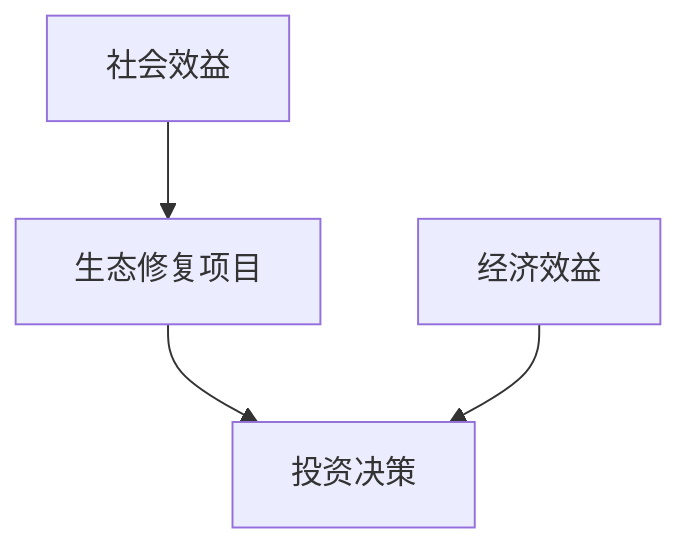
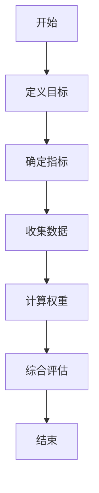
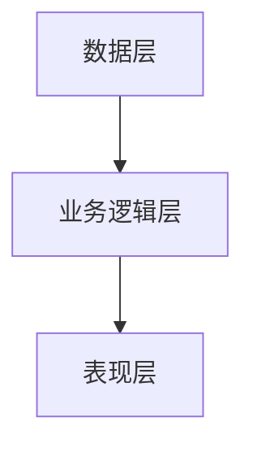
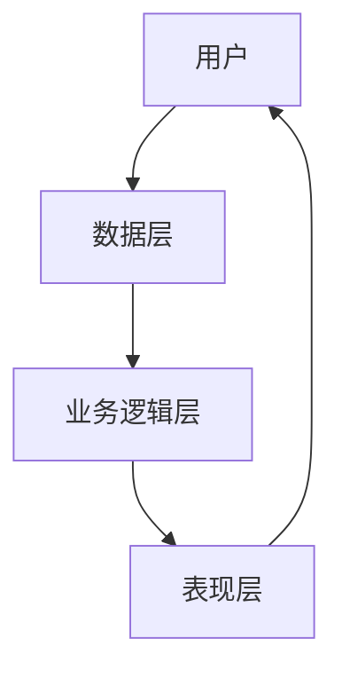

                 


# 生态修复项目的社会效益量化与投资决策

## 关键词：生态修复，社会效益，投资决策，量化分析，数学模型

## 摘要：本文探讨如何量化生态修复项目带来的社会效益，并将其纳入投资决策过程。通过定义核心概念、分析算法原理、设计系统架构和提供实战案例，本文为决策者提供科学依据，实现经济效益与社会效益的平衡。

---

## 第1章: 生态修复项目社会效益量化与投资决策概述

### 1.1 生态修复项目背景

#### 1.1.1 生态修复的定义与内涵
生态修复是指通过人为干预，恢复已被破坏的生态系统，使其接近自然状态的过程。这包括土地复垦、水资源保护、生物多样性恢复等多个方面。

#### 1.1.2 生态修复的必要性与意义
随着工业化和城市化的快速发展，许多生态系统遭到严重破坏，导致资源枯竭、环境污染等问题。生态修复不仅是环境保护的需要，也是社会可持续发展的基础。

#### 1.1.3 生态修复与社会效益的关系
社会效益是指生态修复项目对社会整体产生的积极影响，如改善居民生活质量、提升社会福利等。生态修复项目通过改善环境质量，间接促进社会效益的提升。

### 1.2 投资决策的重要性

#### 1.2.1 投资决策的基本概念
投资决策是指在多个备选方案中选择最优方案的过程，通常涉及对经济效益、风险等因素的综合评估。

#### 1.2.2 生态修复项目投资的特点
生态修复项目通常具有投资周期长、回报见效慢的特点。同时，这类项目往往社会效益显著，但经济效益可能不如其他商业项目明显。

#### 1.2.3 投资决策在生态修复中的作用
科学的投资决策能够确保生态修复项目的资金合理分配，最大化其社会效益。同时，合理的投资决策也能帮助政府和企业更好地平衡经济效益与社会效益。

### 1.3 本章小结
本章通过介绍生态修复的定义、必要性和意义，以及投资决策的基本概念和作用，为后续的分析奠定了基础。

---

## 第2章: 生态修复项目社会效益量化的核心概念

### 2.1 社会效益的定义与特征

#### 2.1.1 社会效益的定义
社会效益是指项目实施后对社会整体产生的积极影响，包括提高居民生活质量、促进社会公平、增强社区凝聚力等。

#### 2.1.2 社会效益的特征
- 长期性：社会效益通常在较长时间内逐步显现。
- 广泛性：涉及社会多个层面，如经济、文化、环境等。
- 非货币化：难以直接用货币衡量。

#### 2.1.3 生态修复项目中社会效益的特殊性
生态修复项目的社会效益往往体现在环境改善、生态功能恢复等方面，这些效益难以直接转化为经济效益。

### 2.2 投资决策中的社会效益考量

#### 2.2.1 投资决策与社会效益的关系
在投资决策中，社会效益是影响决策的重要因素之一。特别是在公共项目投资中，社会效益往往被赋予更高的权重。

#### 2.2.2 社会效益在投资决策中的权重
不同类型的项目中，社会效益的权重有所不同。例如，在公益性较强的生态修复项目中，社会效益权重较高；而在商业性较强的项目中，经济效益权重较高。

#### 2.2.3 社会效益与经济效益的平衡
在实际投资决策中，需要在社会效益和经济效益之间找到平衡点。这可以通过多目标优化模型来实现。

### 2.3 核心概念与联系

#### 2.3.1 核心概念原理
社会效益量化的核心在于将生态修复项目的间接效益转化为可测量的指标。例如，通过评估项目的环境改善效果，进而估算其对居民健康和生活质量的提升。

#### 2.3.2社会效益与经济效益对比表格
| 指标 | 社会效益 | 经济效益 |
|------|----------|----------|
| 时间范围 | 长期 | 短期 |
| 主体 | 社会 | 企业或政府 |
| 目标 | 公共利益 | 经济收益 |

#### 2.3.3 ER实体关系图（Mermaid流程图）


### 2.4 本章小结
本章详细介绍了社会效益的定义、特征，以及其在投资决策中的作用，并通过对比分析和实体关系图，帮助读者更好地理解社会效益量化的核心概念。

---

## 第3章: 生态修复项目社会效益量化的算法原理

### 3.1 收益-成本分析模型

#### 3.1.1 模型定义
收益-成本分析模型是一种常用的经济评价方法，通过比较项目的总收益和总成本，评估其经济效益。

#### 3.1.2 模型公式
$$ \text{净收益} = \text{总收益} - \text{总成本} $$

#### 3.1.3 模型应用
在生态修复项目中，可以通过收益-成本分析模型评估项目的经济效益，同时结合社会效益指标进行综合评价。

### 3.2 层次分析法（AHP）

#### 3.2.1 方法定义
层次分析法是一种定性与定量相结合的决策分析方法，适用于多目标决策问题。

#### 3.2.2 方法步骤
1. 构建决策层次结构。
2. 确定各层次的权重。
3. 计算方案的综合得分。

#### 3.2.3 权重计算公式
$$ \text{权重} = \frac{\text{某因素的重要性得分}}{\text{所有因素的重要性得分之和}} $$

#### 3.2.4 实例分析
假设在生态修复项目中，决策因素包括环境效益、社会效益和经济效益。通过AHP方法，可以量化各因素的权重，并据此做出决策。

### 3.3 算法流程图（Mermaid）



### 3.4 本章小结
本章通过介绍收益-成本分析模型和层次分析法，展示了如何将社会效益量化，并将其纳入投资决策过程。

---

## 第4章: 生态修复项目社会效益量化系统设计

### 4.1 系统功能设计

#### 4.1.1 数据采集模块
负责采集生态修复项目的相关数据，如环境指标、社会效益指标等。

#### 4.1.2 评估指标模块
对采集的数据进行处理和分析，计算社会效益量化指标。

#### 4.1.3 决策支持模块
根据分析结果，提供投资决策建议。

### 4.2 系统架构设计

#### 4.2.1 分层架构
系统采用分层架构，包括数据层、业务逻辑层和表现层。

#### 4.2.2 架构图（Mermaid）


### 4.3 系统接口设计

#### 4.3.1 数据接口
定义数据输入和输出的格式，确保各模块之间数据互通。

#### 4.3.2 用户接口
提供友好的用户界面，方便用户输入数据和查看分析结果。

### 4.4 系统交互流程图（Mermaid）



### 4.5 本章小结
本章通过系统设计，展示了如何将社会效益量化应用于实际投资决策中。

---

## 第5章: 生态修复项目社会效益量化的实战案例

### 5.1 实战环境安装

#### 5.1.1 Python安装
安装Python编程语言，版本建议为3.8及以上。

#### 5.1.2 库的安装
安装必要的Python库，如numpy、pandas、scipy等。

### 5.2 核心代码实现

#### 5.2.1 数据处理代码
```python
import pandas as pd

# 读取数据
data = pd.read_csv('ecorehabilitation.csv')

# 数据预处理
data.dropna(inplace=True)
```

#### 5.2.2 模型实现代码
```python
from scipy.stats import ttest_ind

# 收益-成本分析
net_profit = data['收益'].sum() - data['成本'].sum()
print(f'净收益为：{net_profit}')
```

#### 5.2.3 分析与解读
通过对数据的处理和模型的实现，可以量化生态修复项目的社会效益，并为其投资决策提供依据。

### 5.3 案例分析

#### 5.3.1 项目介绍
以某城市河道生态修复项目为例，分析其社会效益量化的过程。

#### 5.3.2 投资决策分析
根据分析结果，评估不同投资方案的优劣，并做出最终决策。

### 5.4 本章小结
本章通过实战案例，展示了如何将社会效益量化应用于实际投资决策中。

---

## 第6章: 生态修复项目社会效益量化与投资决策的最佳实践

### 6.1 小结
通过本文的分析和案例，我们了解了如何量化生态修复项目的社会效益，并将其纳入投资决策过程。

### 6.2 注意事项
在实际操作中，需要注意数据的准确性和模型的适用性，避免因数据不足或模型选择不当而导致决策失误。

### 6.3 拓展阅读
推荐读者进一步学习多目标优化模型、模糊综合评价法等方法，以提高投资决策的科学性。

---

## 作者：AI天才研究院 & 禅与计算机程序设计艺术

---

通过本文的详细分析和实战案例，读者可以掌握生态修复项目社会效益量化的关键方法，并将其应用于实际投资决策中，实现经济效益与社会效益的平衡。

