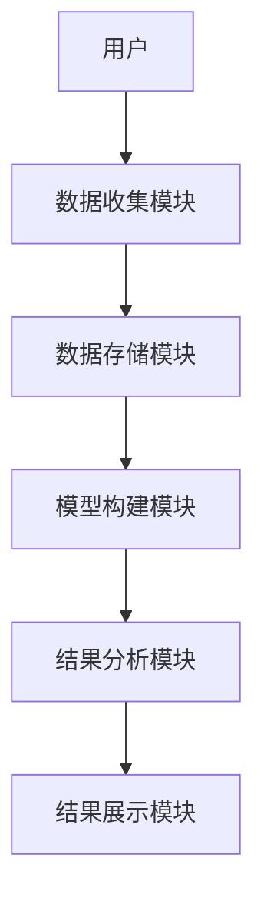

                 


# 相对估值法：市场比较视角下的资产定价

---

## 关键词：相对估值法、资产定价、市场比较、可比公司分析、PE、PB、EV/EBITDA

---

## 摘要：  
相对估值法是一种基于市场比较的资产定价方法，通过分析可比资产的市场价格和关键财务指标，来估计目标资产的合理价值。本文从理论基础、核心指标、实际应用等角度，全面解析相对估值法的原理与实践，帮助读者理解其在资产定价中的重要作用，并掌握如何在实际投资中运用这一方法。

---

## # 第1章 相对估值法的基本概念

### ## 1.1 相对估值法的定义与特点

#### ### 1.1.1 相对估值法的定义  
相对估值法（Relative Valuation）是一种基于市场比较的资产定价方法，通过将目标资产与市场上类似的可比资产进行对比，利用可比资产的市场价格和关键财务指标，估算目标资产的合理价值。  

#### ### 1.1.2 相对估值法的核心特点  
- **相对性**：基于市场中可比资产的价格和指标进行估值，而非绝对的内在价值计算。  
- **简单易用**：相比绝对估值法（如 discounted cash flow，DCF），相对估值法操作简单，数据依赖性较低。  
- **市场驱动**：依赖市场的价格信息，反映市场的整体定价逻辑。  

#### ### 1.1.3 相对估值法与绝对估值法的区别  
- **目标**：绝对估值法旨在计算资产的内在价值，而相对估值法旨在通过市场比较确定资产的合理价格。  
- **数据依赖**：绝对估值法依赖于未来现金流的预测，而相对估值法依赖于市场中可比资产的数据。  
- **适用场景**：绝对估值法适用于信息充分、市场无效的情况，而相对估值法适用于市场有效、可比资产较多的情况。  

---

### ## 1.2 相对估值法的应用场景

#### ### 1.2.1 企业估值中的应用  
相对估值法常用于对企业进行估值，尤其是上市公司。通过比较可比公司的估值指标（如PE、PB、EV/EBITDA等），确定目标公司的合理估值区间。  

#### ### 1.2.2 股票定价中的应用  
在股票定价中，投资者可以通过比较可比公司的估值指标，判断目标股票是否被高估或低估。  

#### ### 1.2.3 并购与投资分析中的应用  
在企业并购或投资决策中，相对估值法可以帮助评估目标企业的价值，避免支付过高的并购价格。  

---

### ## 1.3 相对估值法的优缺点

#### ### 1.3.1 相对估值法的优势  
- **操作简单**：不需要复杂的模型和假设，适合快速估值。  
- **市场敏感**：能够反映市场对资产的定价逻辑。  

#### ### 1.3.2 相对估值法的局限性  
- **依赖市场有效性**：如果市场定价存在偏差，相对估值法可能会给出错误的估值结果。  
- **可比性问题**：找到合适的可比资产可能较难，尤其是在市场不活跃或资产特性差异较大的情况下。  

---

## # 第2章 相对估值法的理论基础

### ## 2.1 资产定价的基本原理

#### ### 2.1.1 资产定价模型概述  
资产定价模型是相对估值法的理论基础，主要包括以下几种：  
- **CAPM**（资本资产定价模型）：用于计算资产的预期收益。  
- **APT**（套利定价理论）：基于多个因素对资产进行定价。  

#### ### 2.1.2 市场均衡与资产定价  
在市场均衡状态下，资产的市场价格反映了所有相关信息，因此可以通过市场比较来确定资产的合理价值。  

---

### ## 2.2 市场比较法的理论基础

#### ### 2.2.1 市场比较法的基本假设  
市场比较法假设市场上存在足够多的可比资产，并且这些可比资产的定价逻辑与目标资产相似。  

#### ### 2.2.2 市场比较法的适用条件  
- **市场有效性**：市场能够反映所有相关信息。  
- **可比性**：目标资产与可比资产在业务模式、财务结构等方面具有相似性。  

---

### ## 2.3 相对估值法与市场效率

#### ### 2.3.1 市场效率对相对估值法的影响  
在有效市场中，相对估值法能够提供合理的估值结果；而在无效市场中，相对估值法可能失效。  

#### ### 2.3.2 市场异效与相对估值法的应用  
在市场异效情况下，可以通过调整可比资产的估值指标，来修正目标资产的估值结果。  

---

## # 第3章 相对估值法的核心指标与模型

### ## 3.1 常见相对估值指标

#### ### 3.1.1 市盈率（PE）  
市盈率（Price-to-Earnings Ratio，PE）= 股价 / 每股净利润（EPS）。  

#### ### 3.1.2 市净率（PB）  
市净率（Price-to-Book Ratio，PB）= 股价 / 每股净资产（BPS）。  

#### ### 3.1.3 市盈率（EV）/息税前利润（EBITDA）  
EV/EBITDA = 企业价值（EV） / 息税前利润（EBITDA）。  

---

### ## 3.2 相对估值模型

#### ### 3.2.1 可比公司分析模型  
通过分析可比公司的估值指标，确定目标公司的合理估值范围。  

#### ### 3.2.2 可比交易法  
通过分析类似交易的成交价格和估值指标，确定目标资产的合理价格。  

---

## # 第4章 相对估值法的数学模型与公式

### ## 4.1 PE、PB、EV/EBITDA的计算公式

#### ### 4.1.1 PE的计算公式  
$$ PE = \frac{Stock Price}{Earnings Per Share} $$  

#### ### 4.1.2 PB的计算公式  
$$ PB = \frac{Stock Price}{Book Value Per Share} $$  

#### ### 4.1.3 EV/EBITDA的计算公式  
$$ EV/EBITDA = \frac{Enterprise Value}{EBITDA} $$  

---

### ## 4.2 相对估值法的数学模型

#### ### 4.2.1 相对估值法的通用公式  
$$ Target Value = \frac{Target Metric}{Comparison Metric} \times Comparison Value $$  

其中，Target Metric 是目标资产的某个指标，Comparison Metric 是可比资产的某个指标，Comparison Value 是可比资产的市场价格。  

---

## # 第5章 相对估值法的系统架构与实现

### ## 5.1 系统功能设计

#### ### 5.1.1 数据收集模块  
- 数据来源：股票价格、财务数据、行业数据等。  
- 数据类型：结构化数据（如PE、PB、EV/EBITDA）和非结构化数据（如新闻、报告）。  

#### ### 5.1.2 模型构建模块  
- 模型选择：选择适合的相对估值模型（如可比公司分析模型）。  
- 参数设置：确定关键指标和可比资产的筛选条件。  

#### ### 5.1.3 结果分析模块  
- 结果展示：生成估值结果、可视化图表（如PE散点图）。  
- 模型优化：根据实际结果调整模型参数。  

---

### ## 5.2 系统架构设计

#### ### 5.2.1 系统架构图  


#### ### 5.2.2 系统交互流程  
1. 用户输入目标资产和可比资产的筛选条件。  
2. 数据收集模块获取相关数据。  
3. 数据存储模块存储数据并进行预处理。  
4. 模型构建模块选择合适的相对估值模型并进行计算。  
5. 结果分析模块对结果进行分析并生成可视化图表。  
6. 结果展示模块将结果呈现给用户。  

---

## # 第6章 相对估值法的项目实战

### ## 6.1 项目背景

#### ### 6.1.1 项目目标  
通过相对估值法，估算某上市公司的合理股价。  

#### ### 6.1.2 数据来源  
- 股票价格：目标公司和可比公司的股价数据。  
- 财务数据：目标公司和可比公司的财务报表数据。  

---

### ## 6.2 项目实现

#### ### 6.2.1 数据收集与处理  
```python
import pandas as pd

# 示例数据：目标公司和可比公司的PE和股价
data = {
    'Company': ['Target', 'Comparable1', 'Comparable2', 'Comparable3'],
    'PE': [15, 20, 18, 16],
    'Price': [100, 120, 110, 130]
}
df = pd.DataFrame(data)
```

#### ### 6.2.2 模型实现  
```python
# 计算目标公司的平均PE
average_pe = df[df['Company'] != 'Target']['PE'].mean()
target_price = average_pe * df[df['Company'] == 'Target']['Earnings Per Share'].values[0]
```

---

### ## 6.3 实际案例分析

#### ### 6.3.1 案例分析  
假设目标公司是一家科技公司，可比公司包括苹果、谷歌、微软等。通过分析可比公司的PE和股价，估算目标公司的合理股价。  

#### ### 6.3.2 结果解读  
如果目标公司的PE低于可比公司的平均PE，可能意味着其股价被低估，值得买入。  

---

## # 第7章 相对估值法的最佳实践

### ## 7.1 小结

#### ### 7.1.1 本章总结  
相对估值法是一种简单有效的资产定价方法，适用于市场有效且可比资产较多的情况。  

---

### ## 7.2 注意事项

#### ### 7.2.1 可比性问题  
确保目标资产与可比资产在业务模式、财务结构等方面具有相似性。  

#### ### 7.2.2 市场异效风险  
市场异效可能导致相对估值法失效，需结合其他估值方法进行验证。  

---

### ## 7.3 拓展阅读

#### ### 7.3.1 相关书籍  
- 《投资学》（作者：某人）  
- 《估值：远离群体疯狂》（作者：某人）  

#### ### 7.3.2 在线资源  
- 国内外主流金融网站的估值分析工具。  

---

## # 结语

相对估值法是一种重要的资产定价方法，通过市场比较能够快速确定资产的合理价值。然而，其有效性依赖于市场的有效性和可比资产的可比性。投资者在实际应用中，需结合其他估值方法，全面评估资产的价值。

---

## 作者：AI天才研究院/AI Genius Institute & 禅与计算机程序设计艺术 /Zen And The Art of Computer Programming

